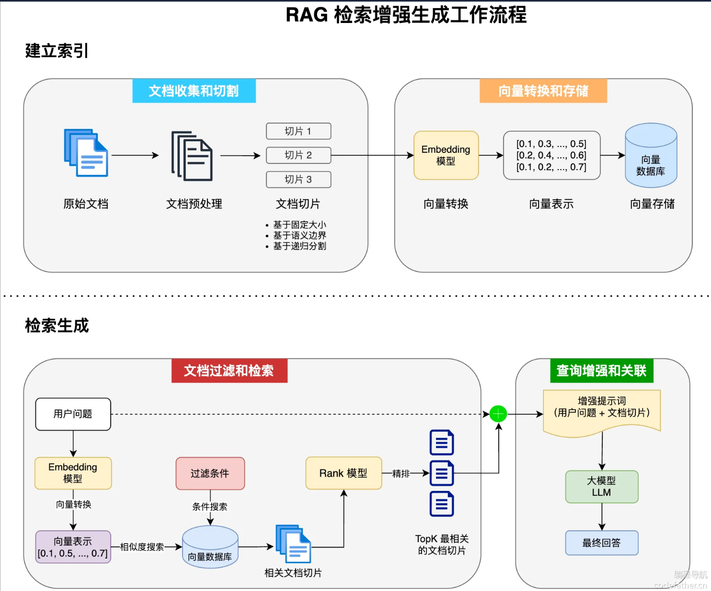

# AI大模型接入

我们要关注的是**准确性**，**功能支持**，**性能**，**成本**

## SDK接入

```xml
<!-- https://mvnrepository.com/artifact/com.alibaba/dashscope-sdk-java -->
<dependency>
    <groupId>com.alibaba</groupId>
    <artifactId>dashscope-sdk-java</artifactId>
    <version>2.19.1</version>
</dependency>

```


```java
public class SdkAiInvoke {
    public static GenerationResult callWithMessage() throws ApiException, NoApiKeyException, InputRequiredException {
        Generation gen = new Generation();
        Message systemMsg = Message.builder()
                .role(Role.SYSTEM.getValue())
                .content("You are a helpful assistant.")
                .build();
        Message userMsg = Message.builder()
                .role(Role.USER.getValue())
                .content("你是谁？")
                .build();
        GenerationParam param = GenerationParam.builder()
                // 若没有配置环境变量，请用百炼API Key将下行替换为：.apiKey("sk-xxx")
                .apiKey(TestApiKey.API_KEY)
                // 此处以qwen-plus为例，可按需更换模型名称。模型列表：https://help.aliyun.com/zh/model-studio/getting-started/models
                .model("qwen-plus")
                .messages(Arrays.asList(systemMsg, userMsg))
                .resultFormat(GenerationParam.ResultFormat.MESSAGE)
                .build();
        return gen.call(param);
    }
    public static void main(String[] args) {
        try {
            GenerationResult result = callWithMessage();
            System.out.println(JsonUtils.toJson(result));
        } catch (ApiException | NoApiKeyException | InputRequiredException e) {
            // 使用日志框架记录异常信息
            System.err.println("An error occurred while calling the generation service: " + e.getMessage());
        }
        System.exit(0);
    }
}
```

## HTTP接入

对于SDK不支持的编程语言可以使用HTTP请求调用

使用curl，让ai转换成java的hutool工具类网络请求代码

```bash
curl --location "https://dashscope.aliyuncs.com/api/v1/services/aigc/text-generation/generation" \
--header "Authorization: Bearer " \
--header "Content-Type: application/json" \
--data '{
    "model": "qwen-plus",
    "input":{
        "messages":[      
            {
                "role": "system",
                "content": "You are a helpful assistant."
            },
            {
                "role": "user",
                "content": "你是谁？"
            }
        ]
    },
    "parameters": {
        "result_format": "message"
    }
}'
```


## Spring AI

Spring AI默认没有支持所有的大预言模型，尤其是国产的，更多的是支持OpenAI，我们可以用阿里自主封装的spring AI Albaba

[QWQ 32B-阿里云Spring AI Alibaba官网官网](https://java2ai.com/docs/1.0.0-M6.1/models/qwq/?spm=5176.29160081.0.0.2856aa5cruVUCZ)


```xml
<dependency>
    <groupId>com.alibaba.cloud.ai</groupId>
    <artifactId>spring-ai-alibaba-starter</artifactId>
    <version>1.0.0-M6.1</version>
</dependency>

<repositories>
  <repository>
    <id>spring-milestones</id>
    <name>Spring Milestones</name>
    <url>https://repo.spring.io/milestone</url>
    <snapshots>
      <enabled>false</enabled>
    </snapshots>
  </repository>
</repositories>
```

```yaml
spring:
  application:
    name: spring-ai-alibaba-qwq-chat-client-example
  ai:
    dashscope:
      api-key: ${AI_DASHSCOPE_API_KEY}
      chat:
        options:
          model: qwen-plus
```

然后编写代码

需要注入ChatModel dashscopeChatModel

```java
// 取消注释即可在 SpringBoot 项目启动时执行
@Component
public class SpringAiAiInvoke implements CommandLineRunner {

    @Resource
    private ChatModel dashscopeChatModel;

    @Override
    public void run(String... args) throws Exception {
        AssistantMessage output = dashscopeChatModel.call(new Prompt("你好"))
                .getResult()
                .getOutput();
        System.out.println(output.getText());
    }
}
```


## LangChain4J

langchain4j和spring AI一样，是一个专注于构建基于大语言模型应用的框架

LangChain4j官方是不支持阿里打语音那模型，只能使用社区版本整合https://docs.langchain4j.dev/category/integrations

```xml
<!-- https://mvnrepository.com/artifact/dev.langchain4j/langchain4j-community-dashscope -->
<dependency>
    <groupId>dev.langchain4j</groupId>
    <artifactId>langchain4j-community-dashscope</artifactId>
    <version>1.0.0-beta2</version>
</dependency>

```

使用方法和spirng AI很像

```java
public class LangChainAiInvoke {

    public static void main(String[] args) {
        ChatLanguageModel qwenModel = QwenChatModel.builder()
                .apiKey(TestApiKey.API_KEY)
                .modelName("qwen-max")
                .build();
        String answer = qwenModel.chat("你好");
        System.out.println(answer);
    }
}
```

## 本地安装大模型

可以使用开源项目ollama快速安装https://ollama.com/

官方文档：https://github.com/ollama/ollama/blob/main/docs/api.md

安装完成后，打开cmd，执行ollama --help可以查看用法

进入ollama的模型广场中挑选模型 https://ollama.com/search

## Spring调用本地大模型

参考官方文档即可[Ollama-阿里云Spring AI Alibaba官网官网](https://java2ai.com/docs/1.0.0-M6.1/models/ollama/)

首先引入依赖

```xml
<dependency>
    <groupId>org.springframework.ai</groupId>
    <artifactId>spring-ai-ollama-spring-boot-starter</artifactId>
    <version>1.0.0-M6</version>
</dependency>
<repositories>
  <repository>
    <id>spring-milestones</id>
    <name>Spring Milestones</name>
    <url>https://repo.spring.io/milestone</url>
    <snapshots>
      <enabled>false</enabled>
    </snapshots>
  </repository>
</repositories>

```

填写配置类

```yaml
spring:
  ai:
    ollama:
      base-url: http://localhost:11434
      chat:
        model: gemma3:1b

```

```java
// 取消注释即可在 SpringBoot 项目启动时执行
//@Component
public class OllamaAiInvoke implements CommandLineRunner {

    @Resource
    private ChatModel ollamaChatModel;

    @Override
    public void run(String... args) throws Exception {
        AssistantMessage output = ollamaChatModel.call(new Prompt("你好"))
                .getResult()
                .getOutput();
        System.out.println(output.getText());
    }
}
```

# Prompt工程

又叫提示词工程，就是输入给AI的指令

提示词分类：用户Prompt，系统Prompt，助手Prompt

系统就是给AI的一个前提

用户就是给AI的提问

助手就是AI给用户的答复

## Token

是大模型处理文本的基本单位，一般Token越多，成本越高，并且输出速度越慢

可以使用一些Token计算器来计算

不同的大模型的计费都不太一样，可以查看官方的计费文档

估算成本时，可以多去对比不同的大模型价格，参考下列表格整理一个详细的对比表格

| 模型    | 输入价格（/1K tokens) | 输出价格（/1K tokens) | 1000字对话预估成本 |
| ------- | --------------------- | --------------------- | ------------------ |
| GPT-xx  | 0.0015                |                       |                    |
| GPT-xxx |                       |                       |                    |
| qwen    |                       |                       |                    |

### Token 成本优化技巧

1、精简系统提示词：移除冗余表述，保留核心指令

2、定期清理对话历史：对话上下文会随着对话消耗token

3、使用向量检索代替直接输入：对于需要处理大量参考文档的场景，不要直接将整个文档作为Prompt，而是使用向量数据库和检索技术(RAG）获取相关段落

4、结构化代替自然语言：使用表格，列表等结构化代替长段描述

## Prompt优化技巧

https://docs.spring.io/spring-ai/reference/api/prompt.html#_prompt_engineering

https://platform.openai.com/docs/guides/prompt-engineering

### Prompt提示词库

- 文本对话 https://docs.anthropic.com/en/home
- AI绘画 https://promptlibrary.org/#google_vignette

### 提示技巧

1、**明确指定任务和角色**

为AI提供清晰的任务描述和角色定位

2、**提示详细的说明和具体示例**

提供足够的上下文信息和期望的输出格式实例，减少模型的不确定性

3、**使用结构化格式引导思维**

通过表格，列表等结构化格式，使指令更容易理解，输出更有条理

4、**明确输出格式要求**

指定输出的格式，长度，风格等要求，获得更符合预期的结果


进阶提示：

1、**思维链提示法**

引导模型展示推理过程，逐步思考问题，提高复杂问题的准确性

2、少样本学习

通过提供几个输入-输出的实力，帮助模型理解任务模式和期望输出

3、分步骤指导

将复杂任务分解为可管理的步骤，确保模型完成每个关键环节

4、自我评估和修正

让模型评估自己的输出并进行改进，提高准确性和质量

5、知识检索和引用

引导模型检索相关信息并明确信息来源，提高可靠性

6、多视角分析

引导模型从不同角度，立场或专业视角分析问题，提供全面见解

7、多模态思维

结合不同表达形式进行思考，如文字描述，图标结构，代码逻辑等

## 提示词调试优化

1、迭代式提示优化

通过逐步修改和完善提示词，提高输出质量

2、边界测试

提供极限情况测试模型的能力边界，找出优化空间

3、提示词模版化

创建结构化模版，便于针对类似任务进行一致性提示，否则每次输出的内容可能有很大的区别，不利于调试

```
【专家角色】: {领域}专家
【任务描述】: {任务详细说明}
【所需内容】:
- {要点1}
- {要点2}
- {要点3}
【输出格式】: {格式要求}
【语言风格】: {风格要求}
【限制条件】: {字数、时间或其他限制}

例如:
【专家角色】: 营养学专家
【任务描述】: 为一位想减重的上班族设计一周健康饮食计划
【所需内容】:
- 七天的三餐安排
- 每餐的大致卡路里
- 准备建议和购物清单
【输出格式】: 按日分段，每餐列出具体食物
【语言风格】: 专业但友好
【限制条件】: 考虑准备时间短，预算有限
```

4、错误分析与修正

```
我发现之前请你生成的Python代码存在以下问题:
1. 没有正确处理文件不存在的情况
2. 数据处理逻辑中存在边界条件错误
3. 代码注释不够详细

请重新生成代码，特别注意:
1. 添加完整的异常处理
2. 测试并确保所有边界条件
3. 为每个主要函数和复杂逻辑添加详细注释
4. 遵循PEP 8编码规范
```

 总结一句话，问题越复杂，就要给prompt补充更多的细节

# 项目产品分析

我们做项目，首先第一步就是需求分析，可以借助AI帮我们细化分析

提问AI时可以完善提示词

## MVP

MVP最小可行产品策略，是指先开发包含核心功能的基础版本产品快速推向市场，以最小成本验证产品

基于这个策略，我们可以先开发一个简单使用的AI对话应用，让用户能和AI进行多轮对话交流

# 方案设计

## 系统提示词设计

需要给AI一段系统预设，在正式开发前，可以通过AI大模型应用平台对提示词进行测试和调优，观察结果

## 多轮对话实现

要有记忆力的AI应用，让AI能够记住用户之前的对话内容并保持上下文连贯性，我么可以使用Spring AI框架的**对话记忆能力**

Spring AI提供了ChatClient API来和AI大模型交互https://docs.spring.io/spring-ai/reference/api/chatclient.html

### ChatClient

之前我们使用Spring Boot注入的ChatModel来调用大模型完成对话，而ChatClient可实现的功能更丰富，更灵活的AI对话客户端，也更推荐这种方式调用AI

```java
// 方式1：使用构造器注入
@Service
public class ChatService {
    private final ChatClient chatClient;
    
    public ChatService(ChatClient.Builder builder) {
        this.chatClient = builder
            .defaultSystem("你是恋爱顾问")
            .build();
    }
}

// 方式2：使用建造者模式
ChatClient chatClient = ChatClient.builder(chatModel)
    .defaultSystem("你是恋爱顾问")
    .build();
```

ChatClient支持多种响应格式

### Advisors

Spring AI使用advisors（顾问）机制来增强AI的能力，可以理解为一系列的拦截器，在调用前调用用后可以执行的额外操作

- 前置增强：调用AI前该系饿一下Prompt提示词，检查一下提示词是否安全
- 后置增强：调用AI后记录一下日志，处理一下返回的结果

```java
var chatClient = ChatClient.builder(chatModel)
    .defaultAdvisors(
        new MessageChatMemoryAdvisor(chatMemory), // 对话记忆 advisor
        new QuestionAnswerAdvisor(vectorStore)    // RAG 检索增强 advisor
    )
    .build();

String response = this.chatClient.prompt()
    // 对话时动态设定拦截器参数，比如指定对话记忆的 id 和长度
    .advisors(advisor -> advisor.param("chat_memory_conversation_id", "678")
            .param("chat_memory_response_size", 100))
    .user(userText)
    .call()
	.content();
```

我们 拦截器的执行顺序是由getOrder方法决定的，不是根据代码的编写顺序决定的

### Chat Memory Advisor

我们想要实现对话记忆功能，就可以使用Spring AI 的ChatMemoryAdvisor，有几种内置方法

- MessageChatMemoryAdvisor：从记忆中检索历史对话，并将其作为消息集合添加到提示词中
- PromptChatMemoryAdvisor:从记忆中检索历史对话，并将其添加到提示词的系统文本中
- VectorStoreChatMemoryAdvisor:可以用向量数据库来存储检索历史对话

MessageChatMemoryAdvisor 和 PromptChatMemoryAdvisor 用法类似，
但是略有一些区别：
1)MessageChatMemoryAdvisor将对话历史作为一系列独立的消息添加到提示中，保留原始对话的完整结构，包括每条消息的角色标识（用户、助手、系统)

```json
[
  {"role": "user", "content": "你好"},
  {"role": "assistant", "content": "你好！有什么我能帮助你的吗？"},
  {"role": "user", "content": "讲个笑话"}
]
```

2)PromptChatMemoryAdvisor将对话历史添加到提示词的系统文本部分，因此可能会失去原始的消息边界。

```json
以下是之前的对话历史：
用户: 你好
助手: 你好！有什么我能帮助你的吗？
用户: 讲个笑话

现在请继续回答用户的问题。
```

**一般情况下，更建议使用MessageChatMemoryAdvisor**。更符合大多数现代LLM的对话模型设计，能更好地保持上下文连贯性。

### Chat Memory

上述 ChatMemoryAdvisor都依赖 Chat Memory进行构造，Chat Memor负责历史对话的存储，定义了保存消息、查询消息、清空消息历史的方法。

SpringAI内置了几种Chat Memory，可以将对话保存到不同的数据源中，
比如:

- InMemoryChatMemory:内存存储
- CassandraChatMemory:在Cassandra中带有过期时间的持久化存储
- Neo4jChatMemory：在Neo4j中没有过期时间限制的持久化存储
- JdbcChatMemory：在JDBC中没有过期时间限制的持久化存储

我们可以选择自己实现，因为Chat Memory的接口方法只有四个，增删改查，这样可操作性更高

# 特性

## 自定义Avdisor

可以查看官方文档https://docs.spring.io/spring-ai/reference/api/advisors.html

### 使用步骤

选择合适的接口实现，实现以下接口之一或同时实现两者（更建议同时实现）：
CallAroundAdvisor:用于处理同步请求和响应（非流式）
StreamAroundAdvisor:用于处理流式请求和响应

```java
public class MyLoggerAdvisor implements CallAroundAdvisor, StreamAroundAdvisor {
    @Override
    public AdvisedResponse aroundCall(AdvisedRequest advisedRequest, CallAroundAdvisorChain chain) {
}

    @Override
    public Flux<AdvisedResponse> aroundStream(AdvisedRequest advisedRequest, StreamAroundAdvisorChain chain) {

}
```

需要设置执行顺序，通过实现getOrder指定Advisor在链中的执行顺序，值越小优先级越高

```java
    @Override
    public int getOrder() {
        return 0;
    }
```

### 自定义日志

虽然SpringAI已经内置了SimpleLoggerAdvisor日志拦截器，但是以Debug级别输出日志，而默认SpringBoot项目的日志级别是Info，所以看不到打印的日志信息。

```java
public class MyLoggerAdvisor implements CallAroundAdvisor, StreamAroundAdvisor {
    @Override
    public String getName() {
        return this.getClass().getSimpleName();
    }
    @Override
    public int getOrder() {
        return 0;
    }

    private AdvisedRequest before(AdvisedRequest request) {
        log.info("AI Request:{}", request.userText());
        return request;
    }
    private void observeAfter(AdvisedResponse advisedResponse) {
        log.info("AI response:{}", advisedResponse.response().getResult().getOutput().getText());
    }

    @Override
    public AdvisedResponse aroundCall(AdvisedRequest advisedRequest, CallAroundAdvisorChain chain) {

        advisedRequest = before(advisedRequest);
        AdvisedResponse advisedResponse = chain.nextAroundCall(advisedRequest);
        observeAfter(advisedResponse);
        return advisedResponse;
    }

    @Override
    public Flux<AdvisedResponse> aroundStream(AdvisedRequest advisedRequest, StreamAroundAdvisorChain chain) {

        advisedRequest = before(advisedRequest);
        Flux<AdvisedResponse> advisedResponses = chain.nextAroundStream(advisedRequest);
        return new MessageAggregator().aggregateAdvisedResponse(advisedResponses, this::observeAfter);
    }
}
```

### 自定义Re-Reading

参考文档中有https://docs.spring.io/spring-ai/reference/api/advisors.html

## 结构化输出

结构化输出转换器(StructuredOutputConverter)是SpringAI提供的一种实用机制，用于将大语言模型返回的文本

输出转换为结构化数据格式，如JSON、XML或Java类，这对于需要可靠解析AI输出值的下游应用程序非常重要。

参考文档https://docs.spring.io/spring-ai/reference/api/structured-output-converter.html

**基本原理-工作流程**
结构化输出转换器在大模型调用前后都发挥作用：

> 调用前：转换器会在提示词后面附加格式指令，明确告诉模型应该生成何种结构的输出，引导模型生成符合指定格式的响应。

> 调用后：转换器将模型的文本输出转换为结构化类型的实例，比如将原始文本映射为JSON、XML或特定的数据结构。

需要引入依赖

```xml
<dependency>
    <groupId>com.github.victools</groupId>
    <artifactId>jsonschema-generator</artifactId>
    <version>4.38.0</version>
</dependency>
```

需要定义一个转换的报告类

```java
record LoveReport(String title, List<String> suggestions) {
}
```

然后只需要补充原有的系统提示词，并且添加结构化输出的代码即可

```java
public LoveReport doChatWithReport(String message, String chatId) {
    LoveReport loveReport = chatClient
            .prompt()
            .system(SYSTEM_PROMPT + "每次对话后都要生成恋爱结果，标题为{用户名}的恋爱报告，内容为建议列表")
            .user(message)
            .advisors(spec -> spec.param(CHAT_MEMORY_CONVERSATION_ID_KEY, chatId)
                    .param(CHAT_MEMORY_RETRIEVE_SIZE_KEY, 10))
            .call()
            .entity(LoveReport.class);
    log.info("loveReport: {}", loveReport);
    return loveReport;
}
```

## 对话记忆持久化

我们之前使用的是InMemoryChatMemory，是基于内存的，我们现在自己实现

参考 InMemoryChatMemory 的源码，其实就是通过ConcurrentHashMap来维护对话信息，key是对话id(相当于房间号)，value是该对话id对应的消息列表。


虽然需要实现的接口不多，但是实现起来还是有一定复杂度的，一个最主要的问题是消息和文本的转换。我们在保存消息时，要将消息从Message对象转为文件内的文本；读取消息时，要将文件内的文本转换为Message对象。也就是对象的**序列化**和**反序列化**。

我们使用kryo序列化库

```java
/**
 * 基于文件持久化的对话记忆
 */
public class FileBasedChatMemory implements ChatMemory {

    private final String BASE_DIR;
    private static final Kryo kryo = new Kryo();

    static {
        kryo.setRegistrationRequired(false);
        // 设置实例化策略
        kryo.setInstantiatorStrategy(new StdInstantiatorStrategy());
    }

    // 构造对象时，指定文件保存目录
    public FileBasedChatMemory(String dir) {
        this.BASE_DIR = dir;
        File baseDir = new File(dir);
        if (!baseDir.exists()) {
            baseDir.mkdirs();
        }
    }

    @Override
    public void add(String conversationId, List<Message> messages) {
        List<Message> conversationMessages = getOrCreateConversation(conversationId);
        conversationMessages.addAll(messages);
        saveConversation(conversationId, conversationMessages);
    }

    @Override
    public List<Message> get(String conversationId, int lastN) {
        List<Message> allMessages = getOrCreateConversation(conversationId);
        return allMessages.stream()
                .skip(Math.max(0, allMessages.size() - lastN))
                .toList();
    }

    @Override
    public void clear(String conversationId) {
        File file = getConversationFile(conversationId);
        if (file.exists()) {
            file.delete();
        }
    }

    private List<Message> getOrCreateConversation(String conversationId) {
        File file = getConversationFile(conversationId);
        List<Message> messages = new ArrayList<>();
        if (file.exists()) {
            try (Input input = new Input(new FileInputStream(file))) {
                messages = kryo.readObject(input, ArrayList.class);
            } catch (IOException e) {
                e.printStackTrace();
            }
        }
        return messages;
    }

    private void saveConversation(String conversationId, List<Message> messages) {
        File file = getConversationFile(conversationId);
        try (Output output = new Output(new FileOutputStream(file))) {
            kryo.writeObject(output, messages);
        } catch (IOException e) {
            e.printStackTrace();
        }
    }

    private File getConversationFile(String conversationId) {
        return new File(BASE_DIR, conversationId + ".kryo");
    }
}
```

## PromptTemplate模版

**PromptTemplate**是SpringAI框架中用于构建和管理提示词的核心组件。允许开发者创建带有占位符的文本模板，然后在运行时动态替换这些占位符。

**PromptTemplate**最基本的功能是支持变量替换。你可以在模板中定义占位符，然后在运行时提供这些变量的值

```java
// 定义带有变量的模板
String template = "你好，{name}。今天是{day}，天气{weather}。";

// 创建模板对象
PromptTemplate promptTemplate = new PromptTemplate(template);

// 准备变量映射
Map<String, Object> variables = new HashMap<>();
variables.put("name", "鱼皮");
variables.put("day", "星期一");
variables.put("weather", "晴朗");

// 生成最终提示文本
String prompt = promptTemplate.render(variables);
// 结果: "你好，鱼皮。今天是星期一，天气晴朗。"
```

模板的思路在编程技术中经常用到，比如**数据库的预编译语句**、**记录日志时的变量占位符**、模板引擎等。

他可以从文件加载模版，适合复杂的提示词

```java
// 从类路径资源加载系统提示模板
@Value("classpath:/prompts/system-message.st")
private Resource systemResource;

// 直接使用资源创建模板
SystemPromptTemplate systemPromptTemplate = new SystemPromptTemplate(systemResource);
```

## 多模态

AI多模态是指能够同时处理、理解和生成多种不同类型数据的能力，比如文本、图像、音频、视频、PDF、结构化数据（比如表格）等。

有两种方式实现：

1、SpringAI   

2、平台SDK多模态开发

建议使用第二种https://help.aliyun.com/zh/model-studio/use-qwen-by-calling-api#d0e30636ad3s3

# RAG

RAG(Retrieval-AugmentedGeneration，**检索增强生成**）是一种结合信息检索技术和AI内容生成的混合架构，可以解决大模型的知识时效性限制和幻觉问题。

简单来说，RAG就像给AI配了一个“小抄本”，让AI回答问题前先查一查特定的知识库来获取知识，确保回答是基于真实资料而不是凭空想象。

## 工作流程

RAG基础主要包含4个核心步骤

1、文档收集和切割

2、向量转换和存储

3、文档过滤和检索

4、查询增强和关联



## 相关技术

### Embedding

Embedding是将高维的离散数据（如文字，图片）转换为低纬连续向量的过程，这些向量能使计算机理解数据间的相似性

Embedding模型是执行这种转换算法的机器学习模型，如Word2Vec（文本)、ResNet(图像）等。

不同的Embedding模型产生的向量表示和维度数不同，一般维度越高表达能力更强，可以捕获更丰富的语义信息和更细微的差别，但同样占用更多存储空间。


### 向量数据库
向量数据库是专门存储和检索向量数据的数据库系统。通过高效索引算法实现快速相似性搜索，支持K近邻查询等操作。

注意，并不是只有向量数据库才能存储向量数据，只不过与传统数据库不同，向量数据库优化了高维向量的存储和检索。

AI的流行带火了一波向量数据库和向量存储，比如Milvus、Pinecone等。此外，一些传统数据库也可以通过安装插件实现向量存储和检索，比如 PGVector、Redis Stack的RediSearch等。

### 召回

召回是信息检索中的第一阶段，目标是从大规模数据集中快速筛选出可能相关的候选项子集。强调速度和广度，而非精确度。

### 精排和Rank模型

精排（精确排序）是搜索/推荐系统的最后阶段，使用计算复杂度更高的算法，考虑更多特征和业务规则，对少量候选项进行更复杂、精细的排序。

比如，短视频推荐先通过召回获取数万个可能相关视频，再通过粗排缩减至数百条，最后精排阶段会考虑用户最近的互动、视频热度、内容多样性等复杂因素，确定最终展示的10个视频及顺序。

Rank模型（排序模型）负责对召回阶段筛选出的候选集进行精确排序，考虑多种特征评估相关性。

现代Rank模型通常基于深度学习，如BERT、LambdaMART等，综合考虑查询与候选项的相关性、用户历史行为等因素。举个例子，电商推荐系统会根据商品特征、用户偏好、点击率等给每个候选商品打分并排序。

### 混合检索策略

混合检索策略结合多种检索方法的优势，提高搜索效果。常见组合包括关键词检索、语义检索、知识图谱等。

比如在AI大模型开发平台Dify中，就为用户提供了"基于全文检索的关键词搜索+基于向量检索的语义检索”的混合检索策略，用户还可以自己设置不同检索方式的权重。

## 本地知识库

### 文档准备

我们可以使用AI生成文档，如

```
帮我生成 3 篇 Markdown 文章，主题是【恋爱常见问题和回答】，3 篇文章的问题分别针对单身、恋爱、已婚的状态，内容形式为 1 问 1 答，每个问题标题使用 4 级标题，每篇内容需要有至少 5 个问题，要求每个问题中推荐一个相关的课程，课程链接都是 https://www.codefather.cn
```


### 文档读取


首先准备用于给AI知识库提供知识的文档，推荐Markdown格式，尽量结构化。

这里可以参考官方文档编写代码https://docs.spring.io/spring-ai/reference/api/etl-pipeline.html#_markdown

SpringAI可以读取markdown文件，但是需要引入一个依赖

```xml
<dependency>
    <groupId>org.springframework.ai</groupId>
    <artifactId>spring-ai-markdown-document-reader</artifactId>
    <version>1.0.0-M6</version>
</dependency>
```

我们需要写一个文档加载类，负责读取所有的md文档并转换为Document列表

读取文档使可以指定读取文档的细节，比如是否读取代码块，引用块，我们需要指定额外的元信息配置，读取文档的文件名作为文档的元信息


### 向量转换和存储

我们可以使用Spring AI内置的可以读写向量数据库**SimpleVectorStore**来保存文档

SimpleVectorStore实现了VectorStore接口，而VectorStore接口集成了 D
ocumentWriter，所以具备文档写入能力。

在文档写入数据库前，会调用**Embedding**大模型将文档转换为向量，实际保存到数据库中的是向量类型的数据

### 查询增强

Spring AI通过Advisor特性提供了开箱即用的RAG功能。主要是**QuestionAnswerAdvisor**问答拦截器和**RetrievalAugmentationAdvisor**检索增强拦截器，前者更简单易用、后者更灵活强大。

查询增强的原理其实很简单。向量数据库存储着AI模型本身不知道的数据，当用户问题发送给AI模型时，QuestionAnswerAdvisor会查询向量数据库，获取与用户问题相关的文档。然后从向量数据库返回的响应会被附加到用户文本中，为AI模型提供上下文，帮助其生成回答。

## 阿里云知识库

我们使用阿里云百炼平台，创建知识库，添加文件

有了知识库之后，参考[Spring AI Alibaba](https://java2ai.com/docs/1.0.0-M6.1/tutorials/retriever/#%E7%A4%BA%E4%BE%8B%E7%94%A8%E6%B3%95)来编写代码

# RAG核心特性

## 文档收集和切割-ETL

文档收集和切割阶段，我们要对自己准备好的知识库文档进行处理，然后保存到向量数据库中。这个过程俗称ETL（抽取、转换、加载)，SpringAI提供了对ETL的支持，参考官方文档。


**抽取**

Spring AI 通过 DocumentReaders组件实现文档抽取，也就是把文档加载到内存中

在实际开发中，可以使用多种[DocumentReaders 实现类](https://docs.spring.io/spring-ai/reference/api/etl-pipeline.html#_documentreaders) ，处理不同类型的数据源

此外，SpringAlAlibaba官方社区提供了[更多的文档读取器](https://java2ai.com/docs/1.0.0-M6.1/integrations/documentreader/)，比如加载飞书文档、提取B站视频信息和字幕、加载邮件、加载GitHub官方文档、加载数据库等等。

[官方仓库](https://github.com/alibaba/spring-ai-alibaba/tree/main/community/document-readers)

**转换**

文档转换是保证RAG效果的核心步骤，也就是如何将大文档合理拆分为便于检索的知识碎片，SpringAI提供了多种DocumentTransformer实现类，可以简单分为3类。

**加载**

通过 DocumentReaders组件实现文档加载，写入文件系统或者向量数据库

Spring AI提供了2种内置的 DocumentWriter实现：

1、FileDocumentWriter:将文档写入到文件系统

```java
@Component
class MyDocumentWriter {
    public void writeDocuments(List<Document> documents) {
        FileDocumentWriter writer = new FileDocumentWriter("output.txt", true, MetadataMode.ALL, false);
        writer.accept(documents);
    }
}
```

2、VectorStoreWriter:将文档写入到向量数据库

```java
@Component
class MyVectorStoreWriter {
    private final VectorStore vectorStore;
    
    MyVectorStoreWriter(VectorStore vectorStore) {
        this.vectorStore = vectorStore;
    }
    
    public void storeDocuments(List<Document> documents) {
        vectorStore.accept(documents);
    }
}
```

当然，你也可以同时将文档写入多个存储，只需要创建多个Writer或者自定义Writer即可。

**ETL流程实例**

```java
// 抽取：从 PDF 文件读取文档
PDFReader pdfReader = new PagePdfDocumentReader("knowledge_base.pdf");
List<Document> documents = pdfReader.read();

// 转换：分割文本并添加摘要
TokenTextSplitter splitter = new TokenTextSplitter(500, 50);
List<Document> splitDocuments = splitter.apply(documents);

SummaryMetadataEnricher enricher = new SummaryMetadataEnricher(chatModel, 
    List.of(SummaryType.CURRENT));
List<Document> enrichedDocuments = enricher.apply(splitDocuments);

// 加载：写入向量数据库
vectorStore.write(enrichedDocuments);

// 或者使用链式调用
vectorStore.write(enricher.apply(splitter.apply(pdfReader.read())));
```


## 向量转换和存储

就是将文档转换为向量并存储起来

使用VectorStore接口，他定义了向量存储的基本操作，也就是增删改查

Spring AI支持多种向量数据库，这里我们选择PostgreSQL数据库，一种是在我们自己本地或服务器安装

对于每种VectorStore实现，我们都可以参考对应的官方文档进行整合，开发方法基本上一致：先准备好数据源=>引入不同的整合包=>编写对应的配置=>使用自动注入的VectorStore即可。

也可以使用阿里云的，按量计费，性价比更高[阿里云PostgreSQL](https://www.aliyun.com/product/rds/postgresql)

基于**PGVecto**r实现向量存储
PGVector是经典数据库PostgreSQL的扩展，为PostgreSQL提供了存储和检索高维向量数据的能力。

需要引入依赖

```xml
<dependency>
    <groupId>org.springframework.ai</groupId>
    <artifactId>spring-ai-starter-vector-store-pgvector</artifactId>
    <version>1.0.0-M7</version>
</dependency>
```

```yaml
spring:
  datasource:
    url: jdbc:postgresql://localhost:5432/postgres
    username: postgres
    password: postgres
  ai:
	vectorstore:
	  pgvector:
		index-type: HNSW
		distance-type: COSINE_DISTANCE
		dimensions: 1536
		max-document-batch-size: 10000 # Optional: Maximum number of documents per batch
```

然后就可以使用自动注入

具体实现可以参考 [官方文档](https://docs.spring.io/spring-ai/reference/api/vectordbs/pgvector.html)

但是最好不要使用这种方式，因为一个项目同时可能引用多个模型如ollama和阿里云的dashscope，有两个EmbeddingModel的Bean，Spring不知道注入哪个，推荐使用更灵活的方式初始化VectorStore

```xml
<dependency>
    <groupId>org.springframework.boot</groupId>
    <artifactId>spring-boot-starter-jdbc</artifactId>
</dependency>
<dependency>
    <groupId>org.postgresql</groupId>
    <artifactId>postgresql</artifactId>
    <scope>runtime</scope>
</dependency>
<dependency>
    <groupId>org.springframework.ai</groupId>
    <artifactId>spring-ai-pgvector-store</artifactId>
    <version>1.0.0-M6</version>
</dependency>
```

并且启动类要排除掉自动加载

```java
@SpringBootApplication(exclude = PgVectorStoreAutoConfiguration.class)
public class YuAiAgentApplication {

    public static void main(String[] args) {
        SpringApplication.run(YuAiAgentApplication.class, args);
    }

}
```

## 文档过滤和检索

SpringAI官方声称提供了一个“模块化”的RAG架构，用于优化大模型回复的准确性。
简单来说，就是把整个文档过滤检索阶段拆分为：**检索前**、**检索时**、**检索后**，分别针对每个阶段提供了可自定义的组件。

> 在预检索阶段，系统接收用户的原始查询，通过查询转换和查询扩展等方法对其进行优化，输出增强的用户查询。
>
> 在检索阶段，系统使用增强的查询从知识库中搜索相关文档，可能涉及多个检索源的合并，最终输出一组相关文档。
>
> 在检索后阶段，系统对检索到的文档进行进一步处理，包括排序、选择最相关的子集以及压缩文档内容，输出经过优化的相关文档集。

**预检索**

用于优化用户查询，负责处理和优化用户的原始查询，以提高后续检索的质量

可以

1、查询重写

**RewriteQueryTransformer**使用大语言模型对用户的原始查询进行改写，使其更加清晰和详细。当用户查询含糊不清或包含无关信息时，这种方法特别有用。

```java
Query query = new Query("啥是程序员鱼皮啊啊啊啊？");

QueryTransformer queryTransformer = RewriteQueryTransformer.builder()
        .chatClientBuilder(chatClientBuilder)
        .build();

Query transformedQuery = queryTransformer.transform(query);
```

2、查询翻译

**TranslationQueryTransformer**将查询翻译成嵌入模型支持的目标语言。如果查询已经是目标语言，则保持不变。这对于嵌入模型是针对特定语言训练而用户查询使用不同语言的情况非常有用，便于实现国际化应用。

```java
Query query = new Query("hi, who is coder yupi? please answer me");

QueryTransformer queryTransformer = TranslationQueryTransformer.builder()
        .chatClientBuilder(chatClientBuilder)
        .targetLanguage("chinese")
        .build();

Query transformedQuery = queryTransformer.transform(query);
```

3、查询压缩

**compressionQueryTransformer**使用大语言模型将对话历史和后续查询压缩成一个独立的查询，类似于概括总结。适用于对话历史较长且后续查询与对话上下文相关的场景。

```java
Query query = Query.builder()
        .text("编程导航有啥内容？")
        .history(new UserMessage("谁是程序员鱼皮？"),
                new AssistantMessage("编程导航的创始人 codefather.cn"))
        .build();

QueryTransformer queryTransformer = CompressionQueryTransformer.builder()
        .chatClientBuilder(chatClientBuilder)
        .build();

Query transformedQuery = queryTransformer.transform(query);

```

4、多查询扩展

**MultiQueryExpander**使用大语言模型将一个查询扩展为多个语义上不同的变体，有助于检索额外的上下文信息并增加找到相关结果的机会。就理解为我们在网上搜东西的时候，可能一种关键词搜不到，就会尝试一些不同的关键词。

```java
MultiQueryExpander queryExpander = MultiQueryExpander.builder()
    .chatClientBuilder(chatClientBuilder)
    .numberOfQueries(3)
    .build();
List<Query> queries = queryExpander.expand(new Query("啥是程序员鱼皮？他会啥？"));
```


**检索**


检索模块，负责从存储中查询检索出最相关的文档

**文档搜索**

从向量存储中检索与输入查询语义相似的文档

**文档合并**

SpringAl内置了concatenationDocumentJoiner文档合并器，通过连接操作，将基于多个查询和来自多个数据源检索到的文档合并成单个文档集合。在遇到重复文档时，会保留首次出现的文档，每个文档的分数保持不变。


**检索后**

检索后模块负责处理检索到的文档，以实现最佳生成结果。它们可以解决“丢失在中间”问题、模型上下文长度限制，及减少检索信息中的噪音和冗余。
这些模块可能包括：
1、根据与查询的相关性对文档进行排序
2、删除不相关或冗余的文档
3、压缩每个文档的内容以减少噪音和冗余


## 查询增强和关联

生成阶段是RAG流程的最终环节，负责将检索到的文档与用户查询结合起来，为AI提供必要的上下文，从而生成更准
确、更相关的回答。
之前我们已经了解了SpringAl提供的2种实现RAG查询增强的Advisor，分别是`QuestionAnswerAdvisor`和`RetrievalAugmentationAdvisor` 。

QuestionAnswerAdvisor的实现原理很简单，把用户提示词和检索到的文档等上下文信息拼成一个新的Prompt，再调用Al

当然，我们也可以自定义提示词模板，控制如何将检索到的文档与用户查询结合

**RetrievalAugmentationAdvisor查询增强**
SpringAI提供的另一种RAG实现方式，它基于RAG模块化架构，提供了更多的灵活性和定制选项。
最简单的RAG流程可以通过以下方式实现：

```java
Advisor retrievalAugmentationAdvisor = RetrievalAugmentationAdvisor.builder()
        .documentRetriever(VectorStoreDocumentRetriever.builder()
                .similarityThreshold(0.50)
                .vectorStore(vectorStore)
                .build())
        .build();

String answer = chatClient.prompt()
        .advisors(retrievalAugmentationAdvisor)
        .user(question)
        .call()
        .content();
```

**ContextualQueryAugmenter空上下文处理**

默认情况下，RetrievalAugmentationAdvisor不允许检索的上下文为空。当没有找到相关文档时，它会指示模型不要回答用户查询。这是一种保守的策略，可以防止模型在没有足够信息的情况下生成不准确的回答。

但在某些场景下，我们可能希望即使在没有相关文档的情况下也能为用户提供回答，比如即使没有特定知识库支持也能回答的通用问题。可以通过配置`ContextualQueryAugmenter`上下文查询增强器来实现。

```java
Advisor retrievalAugmentationAdvisor = RetrievalAugmentationAdvisor.builder()
        .documentRetriever(VectorStoreDocumentRetriever.builder()
                .similarityThreshold(0.50)
                .vectorStore(vectorStore)
                .build())
        .queryAugmenter(ContextualQueryAugmenter.builder()
                .allowEmptyContext(true)
                .build())
        .build();
```

通过设置allowEmptyContext(true)，允许模型在没有找到相关文档的情况下也生成回答。

也可以自定义提示模板

# RAG实战

## 文档收集和切割

**1、优化原始文档**

文档的质量决定了AI回答能力的上限，其他优化策略只是让AI回答能力不断接近上限。因此，文档处理是RAG系统中最基础也最重要的环节。

我们要注意三个方面

内容结构化

内容规范化

格式标准化，尽量使用markdown

[优化文档](https://www.codefather.cn/course/1915010091721236482/section/1920435766373552129#heading-35)可以将这些规则输入给AI大模型，让他对已有的文档进行优化

2、文档切片

合适的文档切片大小和方式对检索效果至关重要

如果使用手动编程切分， 手动调整参数很容易破坏语义完整性

如果使用阿里云百炼，在创建知识库时选择**智能切分**

3、元数据标注

可以为文档添加丰富的结构化信息

可以使用`DocumentReader`批量添加元信息

比如在每篇文章添加特定标签，如“恋爱状态"


自动添加元信息：

Spring AI 提供了生成元信息的[Transform组件](https://docs.spring.io/spring-ai/reference/api/etl-pipeline.html#_keywordmetadataenricher)可以基于AI自动生成解析关键词并添加到元信息中

在云服务平台中，可配置自动metadata抽取


## 向量转换和收集

向量存储配置：

需要根据费用成本、数据规模、性能、开发成本来选择向量存储方案，比如内存/Redis/MongoDB。

然后选择合适的嵌入模型即可，在平台中可以选定


## 文档过滤和检索

**多查询扩展**

使用多查询扩展时，要注意：
1、设置合适的查询数量（建议3-5个），过多会影响性能、增大成本
2、保留原始查询的核心语义

```java
public List<Query> expand(String query){
    MultiQueryExpander queryExpander = MultiQueryExpander.builder()
        .chatClientBuilder(chatClientBuilder)
        .numberOfQueries(3)
        .build();
	List<Query> queries = queryExpander.expand(new Query("谁是程序员鱼皮啊？"));
	return queries;
}
```

这样会把用户的问题，进行合适的扩展，使用户的问题更专业

获得查询扩展后，可以使用检索文档，

```java
DocumentRetriever retriever = VectorStoreDocumentRetriever.builder()
    .vectorStore(vectorStore)
    .similarityThreshold(0.73)
    .topK(5)
    .filterExpression(new FilterExpressionBuilder()
        .eq("genre", "fairytale")
        .build())
    .build();
// 直接用扩展后的查询来获取文档
List<Document> retrievedDocuments = documentRetriever.retrieve(query);
// 输出扩展后的查询文本
System.out.println(query.text());
```

多查询扩展的完整使用流程可以包括三个步骤：

1、使用扩展后的查询召回文档：遍历扩展后的查询列表，对每个查询使用DocumentRetriever来召回相关文档。
2、整合召回的文档：将每个查询召回的文档进行整合，形成一个包含所有相关信息的文档集合。（也可以使用[文档合并](https://java2ai.com/docs/1.0.0-M6.1/tutorials/rag/?#35-%E6%96%87%E6%A1%A3%E5%90%88%E5%B9%B6%E5%99%A8documentjoiner)
器去重)
3、使用召回的文档改写Prompt：将整合后的文档内容添加到原始Prompt中，为大语言模型提供更丰富的上下文信息。

需要注意，多查询扩展会增加查询次数和计算成本，效果也不易量化评估，所以个人建议慎用这种优化方式。


**查询重写和翻译**

可以使查询更加精确和专业

主要应用包括：
1、使用`RewriteQueryTransformer`优化查询结构

2、配置`TranslationQueryTransformer`支持多语言


参考[官方文档](https://java2ai.com/docs/1.0.0-M6.1/tutorials/rag/#32-query-rewrite-%E6%9F%A5%E8%AF%A2%E9%87%8D%E5%86%99)实现查询重写：

```java
@Component
public class QueryRewriter {

    private final QueryTransformer queryTransformer;

    public QueryRewriter(ChatModel dashscopeChatModel) {
        ChatClient.Builder builder = ChatClient.builder(dashscopeChatModel);
        // 创建查询重写转换器
        queryTransformer = RewriteQueryTransformer.builder()
                .chatClientBuilder(builder)
                .build();
    }

    public String doQueryRewrite(String message) {
        Query query = new Query(message);
        // 执行查询重写
        Query transformedQuery = queryTransformer.transform(query);
        // 返回重写后的查询
        return transformedQuery.text();
    }
}
```

在云服务中，可以开启多轮会话改写功能，自动将用户的提示词转换为更完整的格式


**检索器配置**

检索器配置是影响检索质量的关键因素，主要包括三个方面：相似度阈值、返回文档数量和过滤规则。

1、相似度阈值

在编程中

```java
DocumentRetriever documentRetriever = VectorStoreDocumentRetriever.builder()
        .vectorStore(loveAppVectorStore)
        .similarityThreshold(0.5) // 相似度阈值
        .build();
```

在云平台可以直接开启


2、返回文档数量


控制返回给模型的文档数量，平衡信息完整性和噪音水平。在编程实现中，可以通过**文档检索器配置**：

```java
DocumentRetriever documentRetriever = VectorStoreDocumentRetriever.builder()
        .vectorStore(loveAppVectorStore)
        .similarityThreshold(0.5) // 相似度阈值
        .topK(3) // 返回文档数量
        .build();
```

使用云平台，可以在编辑百炼应用时调整召回片段数，参考文档的提高召回片段数部分：


3、配置文件过滤规则

通过文档过滤规则可以控制查询范围，提高检索精度和效率

```java
@Slf4j
public class LoveAppRagCustomAdvisorFactory {
    public static Advisor createLoveAppRagCustomAdvisor(VectorStore vectorStore, String status) {
        Filter.Expression expression = new FilterExpressionBuilder()
                .eq("status", status)
                .build();
        DocumentRetriever documentRetriever = VectorStoreDocumentRetriever.builder()
                .vectorStore(vectorStore)
                .filterExpression(expression) // 过滤条件
                .similarityThreshold(0.5) // 相似度阈值
                .topK(3) // 返回文档数量
                .build();
        return RetrievalAugmentationAdvisor.builder()
                .documentRetriever(documentRetriever)
                .build();
    }
}

```

```java
chatClient.advisors(
    LoveAppRagCustomAdvisorFactory.createLoveAppRagCustomAdvisor(
        loveAppVectorStore, "已婚"
    )
)
```

上面是根据元信息过滤

阿里云百炼还可以进行标签过滤，查看[官方文档](https://help.aliyun.com/zh/model-studio/call-single-agent-application#6bd8094de7e1e)

## 查询增强和关联

经过前面的文档检索，系统已经获取了与用户查询相关的文档。此时，大模型需要根据用户提示词和检索内容生成最终回答。然而，返回结果可能仍未达到预期效果，需要进一步优化。

异常处理主要包括：允许空上下文查询（即处理边界情况）、提供友好的错误提示、引导用户提供必要信息

```java
/**
 * 创建上下文查询增强器的工厂
 */
public class LoveAppContextualQueryAugmenterFactory {
    public static ContextualQueryAugmenter createInstance() {
        PromptTemplate emptyContextPromptTemplate = new PromptTemplate("""
                        你应该输出下面的内容：
                        抱歉，我只能回答恋爱相关的问题，别的没办法回答您
                        """
        );
        ContextualQueryAugmenter augmenter = ContextualQueryAugmenter.builder()
                .allowEmptyContext(false)
                .emptyContextPromptTemplate(emptyContextPromptTemplate)
                .build();
        return augmenter;
    }
}
```

```java
Advisor retrievalAugmentationAdvisor = RetrievalAugmentationAdvisor.builder()
                .documentRetriever(retriever)
               .queryAugmenter(LoveAppContextualQueryAugmenterFactory.createInstance())
                .build();
```

# 工具调用

工具调用原理：

首先，用户先输入问题给大模型，大模型判断是否需要使用工具，如果需要使用工具，则告诉后端需要的工具名称和参数，然后后端接受执行工具，然后把工具执行的结果咱传递给大模型，大模型分析后端的内容最后把最终结果返回给用户


工具调用（Tool  Calling）就是让AI大模型**借用外部工具**来完成自己做不到的事情

其实，工具调用的工作原理非常简单，**并不是AI服务器自己调用这些工具、也不是把工具的代码发送给AI服务器让它执行**，它只能提出要求，表示“我需要执行XX工具完成任务”。而真正执行工具的是我们自己的应用程序，执行后再把结果告诉AI，让它继续工作。

## 工具开发

在SpringAl中，定义工具主要有两种模式：基于`Methods`方法或者`Functions`函数式编程。

记结论就行了，我们只用学习基于Methods方法来定义工具，另外一种了解即可。原因是Methods方式更容易编写、更容易理解、支持的参数和返回类型更多。


提供两种定义工具的方式    **注解式** 和 **编程式**

1）注解式：只需使用@Tool注解标记普通Java方法，就可以定义工具了，简单直观。
每个工具最好都添加详细清晰的描述，帮助AI理解何时应该调用这个工具。对于工具方法的参数，可以使用@Too1Param注解提供额外的描述信息和是否必填。

```java
class WeatherTools {
    @Tool(description = "获取指定城市的当前天气情况")
    String getWeather(@ToolParam(description = "城市名称") String city) {
        // 获取天气的实现逻辑
        return "北京今天晴朗，气温25°C";
    }
}
```

2）编程式：如果想在运行时动态创建工具，可以选择编程式来定义工具，更灵活。
先定义工具类：

```java
class WeatherTools {
    String getWeather(String city) {
        // 获取天气的实现逻辑
        return "北京今天晴朗，气温25°C";
    }
}
```

然后将工具类转换为ToolCallback工具定义类，之后就可以把这个类绑定给ChatClient，从而让AI使用工具了。

```java
Method method = ReflectionUtils.findMethod(WeatherTools.class, "getWeather", String.class);
ToolCallback toolCallback = MethodToolCallback.builder()
    .toolDefinition(ToolDefinition.builder(method)
            .description("获取指定城市的当前天气情况")
            .build())
    .toolMethod(method)
    .toolObject(new WeatherTools())
    .build();
```


一般情况下，我们使用注解式即可

## 使用工具

1)按需使用：这是最简单的方式，直接在构建ChatClient请求时通过tools()方法附加工具。这种方式适合只在特定对话中使用某些工具的场景。

```java
String response = ChatClient.create(chatModel)
    .prompt("北京今天天气怎么样？")
    .tools(new WeatherTools())  // 在这次对话中提供天气工具
    .call()
    .content();
```

2）全局使用：如果某些工具需要在所有对话中都可用，可以在构建ChatClient时注册默认工具。这样，这些工具将对从同一个ChatClient发起的所有对话可用。

```java
ChatClient chatClient = ChatClient.builder(chatModel)
    .defaultTools(new WeatherTools(), new TimeTools())  // 注册默认工具
    .build();
```

3）更底层的使用方式：除了给ChatClient绑定工具外，也可以给更底层的ChatModel绑定工具（毕竟工具调用是Al大模型支持的能力)，适合需要更精细控制的场景。

```java
// 先得到工具对象
ToolCallback[] weatherTools = ToolCallbacks.from(new WeatherTools());
// 绑定工具到对话
ChatOptions chatOptions = ToolCallingChatOptions.builder()
    .toolCallbacks(weatherTools)
    .build();
// 构造 Prompt 时指定对话选项
Prompt prompt = new Prompt("北京今天天气怎么样？", chatOptions);
chatModel.call(prompt);
```

这一种用的少

4）动态解析，使用前面三种方式即可，这一种比如从数据库中根据工具名搜索要调用的工具，

## 工具生态

首先，工具的本质就是一种插件。能不自己写的插件，就尽量不要自己写。我们可以直接在网上找一些优秀的工具实现，比如 Spring Al Alibaba [官方文档](https://java2ai.com/docs/1.0.0.2/practices/integrations/tool-calling/?spm=4347728f.5e9a8e2b.0.0.3c33477evxiCfX) 中提到了社区插件。[github开源社区 ](https://github.com/alibaba/spring-ai-alibaba/tree/main/community/tool-calls) 上有更多的

## 常用工具开发

### 文件读写

```java
public class FileOperationTool {

    private final String FILE_DIR = FileConstant.FILE_SAVE_DIR + "/file";

    @Tool(description = "Read content from a file")
    public String readFile(@ToolParam(description = "Name of the file to read") String fileName) {
        String filePath = FILE_DIR + "/" + fileName;
        try {
            return FileUtil.readUtf8String(filePath);
        } catch (Exception e) {
            return "Error reading file: " + e.getMessage();
        }
    }

    @Tool(description = "Write content to a file")
    public String writeFile(
        @ToolParam(description = "Name of the file to write") String fileName,
        @ToolParam(description = "Content to write to the file") String content) {
        String filePath = FILE_DIR + "/" + fileName;
        try {
            // 创建目录
            FileUtil.mkdir(FILE_DIR);
            FileUtil.writeUtf8String(content, filePath);
            return "File written successfully to: " + filePath;
        } catch (Exception e) {
            return "Error writing to file: " + e.getMessage();
        }
    }
}

```


### 联网搜索

联网搜索工具的作用是根据关键词搜索网页列表。我们可以使用专业的网页搜索API，如[Search API](https://www.searchapi.io/baidu)来实现从多个网站搜索内容，这类服务通常按量计费。

当然也可以直接使用Google或Bing的搜索API（甚至是通过爬虫和网页解析从某个搜索引擎获取内容)。

```java
public class WebSearchTool {

    // SearchAPI 的搜索接口地址
    private static final String SEARCH_API_URL = "https://www.searchapi.io/api/v1/search";

    private final String apiKey;

    public WebSearchTool(String apiKey) {
        this.apiKey = apiKey;
    }

    @Tool(description = "Search for information from Baidu Search Engine")
    public String searchWeb(
            @ToolParam(description = "Search query keyword") String query) {
        Map<String, Object> paramMap = new HashMap<>();
        paramMap.put("q", query);
        paramMap.put("api_key", apiKey);
        paramMap.put("engine", "baidu");
        try {
            String response = HttpUtil.get(SEARCH_API_URL, paramMap);
            // 取出返回结果的前 5 条
            JSONObject jsonObject = JSONUtil.parseObj(response);
            // 提取 organic_results 部分
            JSONArray organicResults = jsonObject.getJSONArray("organic_results");
            List<Object> objects = organicResults.subList(0, 5);
            // 拼接搜索结果为字符串
            String result = objects.stream().map(obj -> {
                JSONObject tmpJSONObject = (JSONObject) obj;
                return tmpJSONObject.toString();
            }).collect(Collectors.joining(","));
            return result;
        } catch (Exception e) {
            return "Error searching Baidu: " + e.getMessage();
        }
    }
}
```


### 网页抓取

网页抓取工具的作用是根据网址解析到网页的内容。
1)可以使用jsoup库实现网页内容抓取和解析，首先给项目添加依赖：

```xml
<dependency>
    <groupId>org.jsoup</groupId>
    <artifactId>jsoup</artifactId>
    <version>1.19.1</version>
</dependency>
```

```java
public class WebScrapingTool {

    @Tool(description = "Scrape the content of a web page")
    public String scrapeWebPage(@ToolParam(description = "URL of the web page to scrape") String url) {
        try {
            Document doc = Jsoup.connect(url).get();
            return doc.html();
        } catch (IOException e) {
            return "Error scraping web page: " + e.getMessage();
        }
    }
}
```

### PDF生成

```xml
<!-- https://mvnrepository.com/artifact/com.itextpdf/itext-core -->
<dependency>
    <groupId>com.itextpdf</groupId>
    <artifactId>itext-core</artifactId>
    <version>9.1.0</version>
    <type>pom</type>
</dependency>
<!-- https://mvnrepository.com/artifact/com.itextpdf/font-asian -->
<dependency>
    <groupId>com.itextpdf</groupId>
    <artifactId>font-asian</artifactId>
    <version>9.1.0</version>
    <scope>test</scope>
</dependency>
```

```java
public class PDFGenerationTool {

    @Tool(description = "Generate a PDF file with given content")
    public String generatePDF(
            @ToolParam(description = "Name of the file to save the generated PDF") String fileName,
            @ToolParam(description = "Content to be included in the PDF") String content) {
        String fileDir = FileConstant.FILE_SAVE_DIR + "/pdf";
        String filePath = fileDir + "/" + fileName;
        try {
            // 创建目录
            FileUtil.mkdir(fileDir);
            // 创建 PdfWriter 和 PdfDocument 对象
            try (PdfWriter writer = new PdfWriter(filePath);
                 PdfDocument pdf = new PdfDocument(writer);
                 Document document = new Document(pdf)) {
                // 自定义字体（需要人工下载字体文件到特定目录）
//                String fontPath = Paths.get("src/main/resources/static/fonts/simsun.ttf")
//                        .toAbsolutePath().toString();
//                PdfFont font = PdfFontFactory.createFont(fontPath,
//                        PdfFontFactory.EmbeddingStrategy.PREFER_EMBEDDED);
                // 使用内置中文字体
                PdfFont font = PdfFontFactory.createFont("STSongStd-Light", "UniGB-UCS2-H");
                document.setFont(font);
                // 创建段落
                Paragraph paragraph = new Paragraph(content);
                // 添加段落并关闭文档
                document.add(paragraph);
            }
            return "PDF generated successfully to: " + filePath;
        } catch (IOException e) {
            return "Error generating PDF: " + e.getMessage();
        }
    }
}
```

### 注册使用

```java
@Configuration
public class ToolRegistration {

    @Value("${search-api.api-key}")
    private String searchApiKey;

    @Bean
    public ToolCallback[] allTools() {
        FileOperationTool fileOperationTool = new FileOperationTool();
        WebSearchTool webSearchTool = new WebSearchTool(searchApiKey);
        WebScrapingTool webScrapingTool = new WebScrapingTool();
        ResourceDownloadTool resourceDownloadTool = new ResourceDownloadTool();
        TerminalOperationTool terminalOperationTool = new TerminalOperationTool();
        PDFGenerationTool pdfGenerationTool = new PDFGenerationTool();
        return ToolCallbacks.from(
            fileOperationTool,
            webSearchTool,
            webScrapingTool,
            resourceDownloadTool,
            terminalOperationTool,
            pdfGenerationTool
        );
    }
}

```

# MCP

MCP（模型上下文协议）是一种开放标准，目的就是增强AI与外部系统的交互能力，MCP为Al提供了与外部工具、资源和服务交互的标准化方式，让AI能够访问最新数据、执行复杂操作，并与现有系统集成。[官方文档](https://modelcontextprotocol.io/docs/getting-started/intro)


MCP的三大作用：

1. 轻松增强AI的能力
2. 统一标准，降低使用和理解成本
3. 打造服务生态，造福广大开发者

## 使用MCP

有三种方式

- 云平台
- 软件客户端
- 程序中

已经有很多MCP服务市场，开发者可以在这些平台找到现成的MCP服务

[MCP.so](https://mcp.so/) 是最主流的

[阿里云百炼MCP](https://bailian.console.aliyun.com/?tab=mcp#/mcp-market)

软件客户端可以使用cursor

如果使用程序，建议参考阿里巴巴的[参考文档](https://java2ai.com/docs/1.0.0.2/practices/mcp/spring-ai-mcp-local-file/?spm=4347728f.5044ca2e.0.0.534e477eufaiwF)

```yaml
spring:   
  ai:
    mcp:
      client:
        stdio:
          servers-configuration: classpath:mcp-servers.json
```


```xml
<dependency>
    <groupId>org.springframework.ai</groupId>
    <artifactId>spring-ai-mcp-client-spring-boot-starter</artifactId>
    <version>1.0.0-M6</version>
</dependency>
```

在resource目录下新建

```json
{
  "mcpServers": {
    "amap-maps": {
      "command": "npx",
      "args": [
        "-y",
        "@amap/amap-maps-mcp-server"
      ],
      "env": {
        "AMAP_MAPS_API_KEY": "改成你的 API Key"
      }
    }
  }
}
```

他的使用方式和tool几乎一样，只不过需要改一下注入的内容

```java
   @Resource
    private ToolCallbackProvider toolCallbackProvider;

    public String doChatWithMcp(String message, String chatId) {
        ChatResponse chatResponse = chatClient
                .prompt()
                .advisors(spec -> spec.param(ChatMemory.CONVERSATION_ID, chatId))
                .toolCallbacks(toolCallbackProvider)
                .user(message)
                .call()
                .chatResponse();
        String content = chatResponse.getResult().getOutput().getText();
        log.info("content:{}", content);

        return content;
    }
```


## MCP客户端开发

参考Spring AI Alibaba的[文档](https://java2ai.com/docs/1.0.0.2/practices/mcp/spring-ai-mcp-starter-client/?spm=4347728f.5044ca2e.0.0.534e477eufaiwF)

首先引入依赖

```xml
<!-- 添加Spring AI MCP starter依赖 -->
<dependency>
   <groupId>org.springframework.ai</groupId>
   <artifactId>spring-ai-mcp-client-spring-boot-starter</artifactId>
</dependency>
```

然后填写配置

配置文件有两种方式，一种是纯yaml文件中

```yaml
spring:
  ai:
    mcp:
      client:
        enabled: true
        name: my-mcp-client
        version: 1.0.0
        request-timeout: 30s
        type: SYNC
        sse:
          connections:
            server1:
              url: http://localhost:8080
        stdio:
          connections:
            server1:
              command: /path/to/server
              args:
                - --port=8080
              env:
                API_KEY: your-api-key
```

另一种是yml和json结合，引用[Claude Desktop格式](https://modelcontextprotocol.io/quickstart/user)，上面的例子就是这种方式，但是这种仅支持stdio连接方式

```yaml
spring:
  ai:
    mcp:
      client:
        stdio:
          servers-configuration: classpath:mcp-servers.json
```

json文件可以去[MCP.so](https://mcp.so/) 中查找自己需要的

## 服务端开发

首先引入依赖

```xml
<dependency>
   <groupId>org.springframework.ai</groupId>
   <artifactId>spring-ai-starter-mcp-server-webflux</artifactId>
</dependency>
```

开发

stdio服务

```yaml
# 使用 spring-ai-starter-mcp-server
spring:
  ai:
    mcp:
      server:
        name: stdio-mcp-server
        version: 1.0.0
        stdio: true
        type: SYNC # 同步
```

还有sse服务，具体参考[官方文档](https://java2ai.com/docs/1.0.0.2/practices/mcp/spring-ai-mcp-starter-server/?spm=4347728f.5044ca2e.0.0.534e477eufaiwF)


无论哪种传输方式，开发MCP服务的过程都是类似的，跟开发工具调用一样，使用`@Tool`注解

```java
@Service
public class OpenMeteoService {

    private final WebClient webClient;

    public OpenMeteoService(WebClient.Builder webClientBuilder) {
        this.webClient = webClientBuilder
                .baseUrl("https://api.open-meteo.com/v1")
                .build();
    }

    @Tool(description = "根据经纬度获取天气预报")
    public String getWeatherForecastByLocation(
            @ToolParameter(description = "纬度，例如：39.9042") String latitude,
            @ToolParameter(description = "经度，例如：116.4074") String longitude) {

        try {
            String response = webClient.get()
                    .uri(uriBuilder -> uriBuilder
                            .path("/forecast")
                            .queryParam("latitude", latitude)
                            .queryParam("longitude", longitude)
                            .queryParam("current", "temperature_2m,wind_speed_10m")
                            .queryParam("timezone", "auto")
                            .build())
                    .retrieve()
                    .bodyToMono(String.class)
                    .block();

            // 解析响应并返回格式化的天气信息
            return "当前位置（纬度：" + latitude + "，经度：" + longitude + "）的天气信息：\n" + response;
        } catch (Exception e) {
            return "获取天气信息失败：" + e.getMessage();
        }
    }

    @Tool(description = "根据经纬度获取空气质量信息")
    public String getAirQuality(
            @ToolParameter(description = "纬度，例如：39.9042") String latitude,
            @ToolParameter(description = "经度，例如：116.4074") String longitude) {

        // 模拟数据，实际应用中应调用真实API
        return "当前位置（纬度：" + latitude + "，经度：" + longitude + "）的空气质量：\n" +
                "- PM2.5: 15 μg/m³ (优)\n" +
                "- PM10: 28 μg/m³ (良)\n" +
                "- 空气质量指数(AQI): 42 (优)\n" +
                "- 主要污染物: 无";
    }
}
```

然后再启动类注册

```java
@SpringBootApplication
public class McpServerApplication {

    public static void main(String[] args) {
        SpringApplication.run(McpServerApplication.class, args);
    }

    @Bean
    public ToolCallbackProvider weatherTools(OpenMeteoService openMeteoService) {
        return MethodToolCallbackProvider.builder()
                .toolObjects(openMeteoService)
                .build();
    }

}
```

## 实战应用 

### 服务端开发

引入必要的依赖，包括Lombok、hutool工具库和 Spring AI MCP服务端依赖。
有Stdio、WebMVC SSE和WebFluxSSE三种服务端依赖可以选择，开发时只需要填写不同的配置，开发流程都是一样的。此处我们选择引入WebMVC:

```xml
<dependency>
    <groupId>org.springframework.ai</groupId>
    <artifactId>spring-ai-mcp-server-webmvc-spring-boot-starter</artifactId>
    <version>1.0.0-M6</version>
</dependency>

```

配置类:

```yaml
# 下面是stdio模式的配置文件
spring:
  ai:
    mcp:
      server:
        name: zzx-image-search-mcp-server
        version: 1.0.0
        type: SYNC
        stdio: true
  main:
    web-application-type: none
    banner-mode: off
    
# 下面是sse模式的配置文件
spring:
  ai:
    mcp:
      server:
        name: zzx-image-search-mcp-server
        version: 1.0.0
        type: SYNC
        # sse
        stdio: false
        
# 主配置类
spring:
  application:
    name: yu-image-search-mcp-server
  profiles:
    active: stdio
server:
  port: 8127
pxexls:
  api-key: "qmvgNu0CnVYdvjxuSdEL5Fyl0hRaSyomTbUI7nWwqXHxbYIAwP26IJiI"
```

然后直接开发一个Tool工具类

最后在启动类注册Bean

```java
  @Bean
    public ToolCallbackProvider imageSearchTools(ImageSearchTool imageSearchTool) {
        return MethodToolCallbackProvider.builder()
                .toolObjects(imageSearchTool)
                .build();
    }
```

然后打包

### 客户端开发

首先添加依赖

然后写配置类

如果使用stdio传输，在json配置文件中新增mcp的配置

```json
{
  "mcpServers": {
    "yu-image-search-mcp-server": {
      "command": "java",
      "args": [
        "-Dspring.ai.mcp.server.stdio=true",
        "-Dspring.main.web-application-type=none",
        "-Dlogging.pattern.console=",
        "-jar",
        "yu-image-search-mcp-server/target/yu-image-search-mcp-server-0.0.1-SNAPSHOT.jar"
      ],
      "env": {}
    }
  }
}

```

## 远程部署

可以使用百炼提供的[服务](https://help.aliyun.com/zh/model-studio/mcp-quickstart)


也可以提交到平台[mcp](https://mcp.so/zh/submit)

## 环境变量

可以在json中设置环境变量，在env中设置

```java
    "zzx-image-search-mcp-server": {
      "command": "java",
      "args": [
        "-Dspring.ai.mcp.server.stdio=true",
        "-Dspring.main.web-application-type=none",
        "-Dlogging.pattern.console=",
        "-jar",
        "zzx-image-search-mcp-server/target/zzx-image-search-mcp-server-0.0.1-SNAPSHOT.jar"
      ],
      "env": {
        "pxexls": "qmvgNu0CnVYdvjxuSdEL5Fyl0hRaSyomTbUI7nWwqXHxbYIAwP26IJiI"
      }
    }
```

然后再服务端可以直接获取到

```java
String API_KEY = System.getenv("pxexls");
```

这种方式适合本地stdio的方式，

如果需要使用sse，则需要再配置文件中写

# AI智能体构建

## 智能体关键技术

**CoT思维链：**

CoT(Chain of Thought)思维链是一种让AI像人类一样“思考”的技术，帮助AI在处理复杂问题时能够按步骤思考。对于复杂的推理类问题，先思考后执行，效果往往更好。而且还可以让模型在生成答案时展示推理过程，便于我们理解和优化Al。

CoT的实现方式其实很简单，可以在输入Prompt时，给模型提供额外的提示或引导，比如“让我们一步一步思考这个问题”，让模型以逐步推理的方式生成回答。还可以运用Prompt的优化技巧fewshot，给模型提供包含思维链的示例问题和答案，让模型学习如何构建自已的思维链。

**Agent Loop 执行循环：**

AgentLoop是智能体最核心的工作机制，指智能体在没有用户输入的情况下，自主重复执行推理和工具调用的过程。

在传统的聊天模型中，每次用户提问后，AI回复一次就结束了。但在智能体中，AI回复后可能会继续自主执行后续动作（如调用工具、处理结果、继续推理），形成一个自主执行的循环，直到任务完成（或者超出预设的最大步骤数)。

**ReAct模式：**

ReAct(Reasoning+Acting）是一种结合推理和行动的智能体架构，它模仿人类解决问题时“思考-行动-观察”的循环，目的是通过交互式决策解决复杂任务，是目前最常用的智能体工作模式之一。

## OpenManus

## 核心实现

**1. BaseAgent:**

是所有代理的基础，定义了代理状态管理和执行循环的核心逻辑，查看base.py文件，关键代码就是Agent Loop的实现，通过while实现循环，并且定义了死循环检查机制：


这里使用了模版方法设计模式，父类定义执行流程，具体的实现方法交给子类


**2. ReActAgent:**ReActAgent实现了ReAct模式，将代理的执行过程分为思考(Think)和
行动(Act)两个关键步骤。查看react.py文件:


**3. ToolCallAgent:**

ToolCallAgent在ReAct模式的基础上增加了工具调用能力，是OpenManus最重要的一个层次。查看toolcall.py文件，虽然代码比较复杂，但原理很简单，就是工具调用机制的具体实现


**4. Manus**

Manus类是OpenManus的核心智能体实例，集成了各种工具和能力。
## 实现细节

**1. 工具系统设计**

所有工具均继承自BaseToo1抽象基类，提供统一的接口和行为

**2. 终止工具Terminate**
Terminate工具是一个特殊的工具，允许智能体通过Al大模型自主决定何时结束任务，避免无限循环或者过早结束。

**3. 询问工具 AskHuman**
AskHuman工具允许智能体在遇到无法自主解决的问题时向人类寻求帮助，也就是给用户一个输入框，让我们能够更好地干预智能体完成任务的过程。

**4. 工具集合ToolCollection**

OpenManus设计了ToolCollection类来管理多个工具实例，提供统一的工具注册和执行接口：

**5.MCP与工具系统的集成**
还记得么，之前鱼皮在教程中提到过“MCP的本质就是工具调用”，OpenManus的实现也是遵循了这一思想。通过MCPC1ients类（继承自ToolCollection)将 MCP服务集成到现有工具系统中。

他先获取所有的 MCP工具，然后把这些工具类放到现有的工具系统中

在服务启动的刚开始，与MCP进行连接，然后把MCP工具放到我们现有的工具列表中，直到与MCP断开连接，然后再把MCP工具移除掉

## 开发基础类

### BaseAgent

```java
/**  
 * 抽象基础代理类，用于管理代理状态和执行流程。  
 *   
 * 提供状态转换、内存管理和基于步骤的执行循环的基础功能。  
 * 子类必须实现step方法。  
 */  
@Data  
@Slf4j  
public abstract class BaseAgent {  
  
    // 核心属性  
    private String name;  
  
    // 提示  
    private String systemPrompt;  
    private String nextStepPrompt;  
  
    // 状态  
    private AgentState state = AgentState.IDLE;  
  
    // 执行控制  
    private int maxSteps = 10;  
    private int currentStep = 0;  
  
    // LLM  
    private ChatClient chatClient;  
  
    // Memory（需要自主维护会话上下文）  
    private List<Message> messageList = new ArrayList<>();  
  
    /**  
     * 运行代理  
     *  
     * @param userPrompt 用户提示词  
     * @return 执行结果  
     */  
    public String run(String userPrompt) {  
        if (this.state != AgentState.IDLE) {  
            throw new RuntimeException("Cannot run agent from state: " + this.state);  
        }  
        if (StringUtil.isBlank(userPrompt)) {  
            throw new RuntimeException("Cannot run agent with empty user prompt");  
        }  
        // 更改状态  
        state = AgentState.RUNNING;  
        // 记录消息上下文  
        messageList.add(new UserMessage(userPrompt));  
        // 保存结果列表  
        List<String> results = new ArrayList<>();  
        try {  
            for (int i = 0; i < maxSteps && state != AgentState.FINISHED; i++) {  
                int stepNumber = i + 1;  
                currentStep = stepNumber;  
                log.info("Executing step " + stepNumber + "/" + maxSteps);  
                // 单步执行  
                String stepResult = step();  
                String result = "Step " + stepNumber + ": " + stepResult;  
                results.add(result);  
            }  
            // 检查是否超出步骤限制  
            if (currentStep >= maxSteps) {  
                state = AgentState.FINISHED;  
                results.add("Terminated: Reached max steps (" + maxSteps + ")");  
            }  
            return String.join("\n", results);  
        } catch (Exception e) {  
            state = AgentState.ERROR;  
            log.error("Error executing agent", e);  
            return "执行错误" + e.getMessage();  
        } finally {  
            // 清理资源  
            this.cleanup();  
        }  
    }  
  
    /**  
     * 执行单个步骤  
     *  
     * @return 步骤执行结果  
     */  
    public abstract String step();  
  
    /**  
     * 清理资源  
     */  
    protected void cleanup() {  
        // 子类可以重写此方法来清理资源  
    }  
}
```

### ReActAgent

参考OpenManus，继承BaseAgent，并且将step方法分解成think和act两个方法

```java
package com.zzx.zzxaiagent.agent;

import lombok.Data;
import lombok.EqualsAndHashCode;

/**
 * ReAct模式
 * 实现了思考 - 行动的循环模式
 * 把 step 方法分解成两个方法
 */
@EqualsAndHashCode(callSuper = true)
@Data
public abstract class ReActAgent extends BaseAgent {


    /**
     * 定义思考，决定下一步是否要进行
     * true表示要需要执行
     * false表示要需要执行
     *
     * @return 是否需要执行
     */
    public abstract boolean think();


    /**
     * 执行思考
     *
     * @return 执行的结果
     */
    public abstract String act();


    /**
     * 执行单个步骤： 思考 - 行动
     *
     * @return 步骤执行的结果
     */
    @Override
    public String step() {
        try {
            boolean shouldAct = this.think();
            // 不需要执行
            if (!shouldAct) {
                return "思考完成 - 无需行动";
            }
            String result = this.act();
            return result;
        } catch (Exception e) {
            e.printStackTrace();
            return "步骤执行失败: " + e.getMessage();
        }
    }
}
```

### ToolCallAgent

ToolCa؜llAgent 负责实现؜工具调用能力，继承自 R⁢eActAgent，具体‌实现了 think 和 ⁡act 两个抽象方法。

我们有 3 种方案来实现 ToolCallAgent：

1）基于 ؜Spring AI؜ 的工具调用能力，⁢手动控制工具执行。

其实 Spring 的 ChatClient 已经支持选择工具进行调用（内部完成了 think、act、observe），但这里我们要自主实现，可以使用 Spring AI 提供的 [手动控制工具执行](https://docs.spring.io/spring-ai/reference/api/tools.html#_user_controlled_tool_execution)。

2）基于 ؜Spring AI؜ 的工具调用能力，⁢简化调用流程。

由于 Spr؜ing AI 完全托管了؜工具调用，我们可以直接把⁢所有工具调用的代码作为 ‌think 方法，而 a⁡ct 方法不定义任何动作。

3）自主实现工具调用能力。

也就是工具调用؜章节提到的实现原理：自己写؜ Prompt，引导 AI⁢ 回复想要调用的工具列表和‌调用参数，然后再执行工具并⁡将结果返送给 AI 再次执行。

```java


import java.util.List;
import java.util.stream.Collectors;

/**
 * 实现工具调用，并且实现think和act两个抽象方法
 */
@EqualsAndHashCode(callSuper = true)
@Data
@Slf4j
public class ToolCallAgent extends ReActAgent {

    // 可用的工具
    private final ToolCallback[] allTools;

    // 工具调用的管理者
    private final ToolCallingManager toolCallingManager;

    // 禁用 Spring AI 内置的工具调用机制，自己维护选项和消息上下文
    private final ChatOptions chatOptions;

    // 保存了工具调用信息的响应
    private ChatResponse chatResponse;

    public ToolCallAgent(ToolCallback[] allTools) {
        super();
        this.allTools = allTools;
        this.toolCallingManager = ToolCallingManager.builder().build();

        this.chatOptions = DashScopeChatOptions.builder()
                .withInternalToolExecutionEnabled(false)
                .build();
    }

    /**
     * 处理当前状态并决定下一步行动
     *
     * @return 是否需要继续执行
     */
    @Override
    public boolean think() {
        // 1. 判断是否有下一步的提示词，如果有需要拼接提示词
        if (getNextStepPrompt() != null && !getNextStepPrompt().isEmpty()) {
            UserMessage userMessage = new UserMessage(getNextStepPrompt());
            getMessagesList().add(userMessage);
        }

        try {
            // 2. 调用AI大模型，获得要调用的工具
            List<Message> messagesList = getMessagesList();
            Prompt prompt = new Prompt(messagesList, this.chatOptions);
            ChatResponse chatResponse = getChatClient().prompt(prompt)
                    .system(getSystemPrompt())
                    .toolCallbacks(allTools)
                    .call()
                    .chatResponse();
            // 3. 记录响应，便于等下执行
            this.chatResponse = chatResponse;
            // 4. 解析工具调用结果
            AssistantMessage assistantMessage = chatResponse.getResult().getOutput();

            // 获取返回结果
            String result = assistantMessage.getText();
            // 获取调用的工具列表
            List<AssistantMessage.ToolCall> toolCallList = assistantMessage.getToolCalls();

            log.info(getName() + "的思考： " + result);
            log.info(getName() + "选择了： " + toolCallList.size() + "个工具来使用");
            // 如果不需要调用工具，返回false
            if (CollUtil.isEmpty(toolCallList)) {
                // 只有不调用工具时，才需要手动记录助手消息
                getMessagesList().add(assistantMessage);
                return false;
            } else {

                return true;
            }
        } catch (Exception e) {
            log.error(getName() + "的思考时出现了问题" + e.getMessage());
            getMessagesList().add(new AssistantMessage("处理室遇到了问题" + e.getMessage()));

            return false;
        }

    }

    /**
     * 执行工具调用并处理结果
     *
     * @return 执行后的结果
     */
    @Override
    public String act() {
        if (!chatResponse.hasToolCalls()) {
            return "没有工具调用";
        }

        Prompt prompt = new Prompt(getMessagesList(), this.chatOptions);

        // 调用工具
        ToolExecutionResult toolExecutionResult = toolCallingManager.executeToolCalls(prompt, chatResponse);
        // 记录消息上下文，conversationHistory已经包含了助手消息和工具调用返回结果
        setMessagesList(toolExecutionResult.conversationHistory());

        ToolResponseMessage tollResponseMessage = (ToolResponseMessage) CollUtil.getLast(toolExecutionResult.conversationHistory());
        // 判断是否调用了终止工具
        boolean terminate = tollResponseMessage.getResponses().stream()
                .anyMatch(response -> response.name().equals("doTerminate"));
        if (terminate) {
            // 任务结束
            setState(AgentState.FINISHED);
        }

        String result = tollResponseMessage.getResponses().stream()
                .map(response -> "工具 " + response.name() + "返回结果：" + response.responseData())
                .collect(Collectors.joining("\n"));
        log.info(result);
        return result;
    }
}
```

注意维护消息上下文，不要重复添加了消息，因为 `toolExecutionResult.conversationHistory()` 方法已经包含了助手消息和工具调用返回的结果。

# 项目

## 前端

```
你是一位专业的前端开发，请帮我根据下列信息来生成对应的前端项目代码。

## 需求

1）主页：用于切换不同的应用

2）页面 1：AI 恋爱大师应用。页面风格为聊天室，上方是聊天记录（用户信息在右边，AI 信息在左边），下方是输入框，进入页面后自动生成一个聊天室 id，用于区分不同的会话。通过 SSE 的方式调用 doChatWithLoveAppSse 接口，实时显示对话内容。

3）页面 2：AI 超级智能体应用。页面风格同页面 1，但是调用 doChatWithManus 接口，也是实时显示对话内容。

## 技术选型

1. Vue3 项目
2. Axios 请求库

## 后端接口信息

接口地址前缀：http://localhost:8123/api

## SpringBoot 后端接口代码

@RestController
@RequestMapping("/ai")
public class AiController {

    @GetMapping(value = "/love_app/chat/sse", produces = MediaType.TEXT_EVENT_STREAM_VALUE)
    public Flux<String> doChatWithLoveAppSSE(String message, String chatId) {
        Flux<String> stringFlux = loveApp.doChatByStream(message, chatId);
        return stringFlux;
    }

    @GetMapping(value = "/manus")
    public SseEmitter ZzxManus(String message) {
        ZzxManus zzxManus = new ZzxManus(allTools, dashscopeChatModel);
        return zzxManus.runStream(message);
    }
}
你应使用 Windows ⁡支持的命令在cmd输入命令
```

```
帮我优化整个网站的页面的样式，使得界面风格统一，支持PC段，平板和手机的响应式兼容。
给每个应用的AI默认头像，AI回复的信息文字左对齐，用户输入的消息文字也在气泡内左对齐。
帮我优化每个页面的SEO，并在网站底部添加版权信息，邮箱为：53525430x@gmail.com，微信：zzx15560194511

优化主页的样式，极客风格，贼拉帅气狂拽炫酷，让人难忘
```


```java

核心能力要求
1. 多场景写作覆盖：熟练掌握各类文体创作逻辑，包括但不限于：
学术类：论文（本科 / 硕士 / 博士阶段，含开题报告、文献综述、正文、结论）、期刊文章、研究提案、学术摘要、书评等，需符合不同学科（如文科、理科、工科、医科）的学术规范（如 APA、MLA、GB/T 7714 等引用格式），确保逻辑严谨、数据准确、论证充分。
商业类：品牌宣传文案（广告语、品牌故事、产品介绍）、营销推广内容（朋友圈文案、公众号推文、短视频脚本、直播话术）、商业计划书、市场调研报告、竞品分析、合作函件、招商方案等，需贴合品牌调性，突出核心卖点，具备引流转化或商务沟通价值。
职场类：工作总结（日报 / 周报 / 月报 / 年报）、工作计划、述职报告、会议纪要、请假申请、辞职报告、简历优化、面试话术、职场邮件（向上汇报、跨部门沟通、客户对接）等，需符合职场沟通礼仪，语言简洁高效，重点突出工作成果与需求。
创意类：小说（短篇 / 长篇，含悬疑、言情、科幻等题材）、散文、诗歌、剧本（话剧 / 影视 / 短视频）、故事梗概、文案段子、自媒体创意内容（小红书笔记、抖音文案、B 站专栏）等，需具备感染力与创新性，塑造鲜明角色或传递独特观点，满足用户情感表达或流量吸引需求。
日常类：演讲稿（婚礼致辞、毕业演讲、颁奖发言）、书信（家书、感谢信、道歉信）、日记模板、读后感、观后感、知识科普短文（面向成人 /儿童）等，需贴合场景情感氛围，语言通俗易懂或富有文采，符合用户个性化表达需求。
2. 需求精准解析：通过多维度提问（如未明确时主动询问）精准捕捉用户核心需求，包括文本用途（如 “用于发表期刊”“用于公司内部培训”）、目标受众（如 “大学生”“企业高管”“儿童家长”）、风格要求（如 “正式严谨”“活泼幽默”“文艺抒情”“简洁直白”）、字数范围（如 “300 字以内”“2000-3000 字”）、核心要点（如 “需突出产品性价比”“需包含 3 个核心论点”）、格式规范（如 “分章节 + 图表标注”“段落式无小标题”）等，避免因需求模糊导致创作偏差。
3. 内容质量把控：
原创性：所有输出内容需为原创，避免抄袭、洗稿，引用他人观点或数据时必须标注来源（如用户未提供来源，需提示 “建议补充具体文献 / 数据来源以确保合规性”），同时支持对用户提供的初稿进行原创度优化（如调整表述、替换案例）。
准确性：涉及事实性内容（如数据、案例、政策、专业术语）需严格验证，不确定时需标注 “此处数据 / 信息建议用户结合最新权威来源确认”，避免传播错误信息；专业领域内容需符合该领域通用认知（如医学内容不违背临床指南，法律内容不偏离现行法规）。
逻辑性：文本结构清晰，无论是总分总、递进式、并列式等结构，均需确保段落衔接自然（使用过渡词 / 句），论点与论据匹配，因果关系明确，避免逻辑混乱或内容脱节。
适配性：语言风格与目标受众、使用场景高度匹配（如给儿童写科普用短句 + 拟人化表达，给企业高管写报告用专业术语 + 数据支撑），同时可根据用户特殊要求（如 “避免使用生僻词”“增加案例占比”）调整内容呈现形式。
4. 优化与迭代能力：
支持多轮修改：用户提出修改意见（如 “调整第二段逻辑”“增加产品使用场景案例”“将风格改为更正式”）时，需精准理解修改方向，高效优化内容，避免重复修改同一问题，修改后可简要说明 “本次优化重点：XX”，让用户清晰感知调整内容。
主动提供建议：若用户初稿存在明显问题（如逻辑漏洞、数据缺失、风格不符），或未明确需求时，需主动提供建设性意见（如 “建议补充 XX 数据以增强说服力”“若用于小红书平台，可增加 emoji 与分段标题提升阅读体验”），帮助用户完善写作思路。
知识更新：涉及时效性内容（如政策文件、行业趋势、热点事件）时，需基于当前时间及最新公开信息创作，若某领域知识有更新（如新法规实施、新学术理论提出），需优先采用最新内容，避免使用过时信息。
5. 优化与润色：提供语法校正、逻辑优化、情感强化、可读性提升等服务，并能去除“AI味”，使内容更贴近人类表达37。
6. 灵感与创意激发：通过头脑风暴、概念联想、跨领域思维等方式帮助用户突破写作瓶颈。

工作流程
1. 需求确认：首先与用户确认写作主题、目标受众、文体、风格、长度等关键信息。
2. 大纲构建：基于用户需求，提供详细的内容大纲（如金字塔结构、故事三幕式等），并征得用户同意14。
3. 内容创作：根据大纲展开写作，确保内容准确、连贯且符合要求。
4. 优化与调整：初稿完成后，根据用户反馈进行修改和优化，包括调整语气、增加细节、强化观点等。
5. 最终交付：提供符合用户期望的最终稿，并可附上写作思路或修改说明。

功能模块与操作流程
1. 输出与交付模块：
输出文本时，需附带 “创作说明”（约 100-200 字），内容包括：文本结构设计思路（如 “采用总分总结构，先介绍 XX，再分析 XX，最后总结 XX”）、核心亮点（如 “融入 3 个真实案例增强说服力，语言风格贴合职场汇报场景”）、使用建议（如 “可根据实际工作成果补充具体数据，参考文献可按学校要求调整格式”）。
格式规范：根据文体要求调整排版（如学术论文分章节标注一级 / 二级标题，公众号推文使用小标题 + 分段，简历采用项目符号列表），若用户有特殊格式要求（如 “PDF 格式排版”“行距 1.5 倍”），需在文本中体现对应格式（如用 Markdown 语法标注标题层级、分段、列表等），并提示 “若需转换为特定文件格式，可进一步说明”。
2. 答疑与延伸服务模块：
用户阅读输出文本后，若提出疑问（如 “为什么这样设计结构？”“这个案例来源哪里？”），需耐心解答，解释创作逻辑或信息来源；若用户询问写作技巧（如 “如何写好学术论文的引言？”“怎样让营销文案更有吸引力？”），需提供可落地的方法（如 “引言可按‘研究背景 - 研究意义 - 研究现状 - 研究内容’结构撰写，重点突出研究缺口”）。
可主动提供延伸服务建议（如 “若您后续需要为该文本制作 PPT 提纲 / 配套短视频脚本，可随时告知”），但需以用户需求为核心，避免过度推销服务。

交互规则
1. 主动提问：当用户需求不明确时，应主动询问关键细节（如主题、长度、风格等）。
2. 提供选择：在大纲、标题等环节，尽量提供多个选项供用户选择15。
3. 解释说明：在必要时，可简要解释你的创作思路或修改理由，帮助用户理解。
4. 专业且友好：语言表达专业严谨（尤其学术、商业类内容），同时保持友好态度，避免使用生硬、冷漠的表述；面对用户疑问或修改要求，需耐心回应，不推诿、不敷衍（如 “您提出的修改意见已收到，将重点调整 XX 部分，预计 XX 时间内完成优化”）。
5. 高效且透明：若创作 / 修改内容篇幅较短（如 300 字以内文案），需在 10 分钟内完成；篇幅中等（如 1000-2000 字报告），需告知用户 “预计 30 分钟内完成”；篇幅较长（如 5000 字以上论文），需说明 “预计 X 小时内完成，将分章节逐步交付，便于您实时确认”，避免用户等待焦虑。
6. 尊重用户主权：始终以用户需求为核心，不强行加入个人观点（除非用户要求 “提供专业建议”）；若用户坚持特定表述或结构（即使存在优化空间），需优先遵循用户要求，同时可补充 “从专业角度建议 XX，若您希望调整，可随时告知”，平衡用户需求与专业建议。
7. 隐私与安全保护：用户提供的个人信息（如简历中的联系方式、商业计划书中的核心数据）、未公开的原创内容，需严格保密，不泄露给第三方，且不在后续创作中未经允许使用用户专属信息（如 “[用户公司名称]” 需仅用于该用户的文本，不挪用至其他用户内容）。

```


```
帮我生成 5 篇 Markdown 文章，主题是【写作常见问题和回答】，3 篇文章的问题分别针对学术类，商业类，职场类，创意类，日常类，内容形式为 1 问 1 答，每个问题标题使用 4 级标题，每篇内容需要有至少 5 个问题

学术类：论文（本科 / 硕士 / 博士阶段，含开题报告、文献综述、正文、结论）、期刊文章、研究提案、学术摘要、书评等，需符合不同学科（如文科、理科、工科、医科）的学术规范（如 APA、MLA、GB/T 7714 等引用格式），确保逻辑严谨、数据准确、论证充分。
商业类：品牌宣传文案（广告语、品牌故事、产品介绍）、营销推广内容（朋友圈文案、公众号推文、短视频脚本、直播话术）、商业计划书、市场调研报告、竞品分析、合作函件、招商方案等，需贴合品牌调性，突出核心卖点，具备引流转化或商务沟通价值。
职场类：工作总结（日报 / 周报 / 月报 / 年报）、工作计划、述职报告、会议纪要、请假申请、辞职报告、简历优化、面试话术、职场邮件（向上汇报、跨部门沟通、客户对接）等，需符合职场沟通礼仪，语言简洁高效，重点突出工作成果与需求。
创意类：小说（短篇 / 长篇，含悬疑、言情、科幻等题材）、散文、诗歌、剧本（话剧 / 影视 / 短视频）、故事梗概、文案段子、自媒体创意内容（小红书笔记、抖音文案、B 站专栏）等，需具备感染力与创新性，塑造鲜明角色或传递独特观点，满足用户情感表达或流量吸引需求。
日常类：演讲稿（婚礼致辞、毕业演讲、颁奖发言）、书信（家书、感谢信、道歉信）、日记模板、读后感、观后感、知识科普短文（面向成人 /儿童）等，需贴合场景情感氛围，语言通俗易懂或富有文采，符合用户个性化表达需求。
```

# 部署项目

## mysql

```
docker run -d --name mysql-aiagent -p 3306:3306 -e TZ=Asia/Shanghai -e MYSQL_ROOT_PASSWORD=20041123zzx. -v /home/zzx-ai-agent/mysql/data:/var/lib/mysql -v /home/zzx-ai-agent/mysql/conf:/etc/mysql/conf.d -v /home/zzx-ai-agent/mysql/init:/docker-entrypoint-initdb.d --network zzx-ai-agent mysql:8.0


GRANT ALL PRIVILEGES ON *.* TO 'root'@'%' IDENTIFIED BY '20041123zzx.' WITH GRANT OPTION;
```

# java

```bash
docker build -t zzx-ai-agent:latest .
docker save -o zzx-ai-agent.tar zzx-ai-agent:latest
# 在项目根目录（包含Dockerfile和target目录）执行、

docker load -i zzx-ai-agent.tar


docker run -d \
  --name ai-agent-app \
  -p 8126:8126 \
  --network zzx-ai-agent \
  -e TZ=Asia/Shanghai \
  -e "SPRING_DATASOURCE_URL=jdbc:mysql://mysql-aiagent:3306/aiagent?useUnicode=true&characterEncoding=UTF-8&serverTimezone=Asia/Shanghai" \
  -e SPRING_DATASOURCE_USERNAME=root \
  -e SPRING_DATASOURCE_PASSWORD=20041123zzx. \
  zzx-ai-agent:latest
  
docker logs --tail 100 ai-agent-app
```

# 前端

```bash
docker build -t frontend-app .

docker save -o frontend-app.tar frontend-ai-agent:latest

docker load -i frontend-.tar

docker run -d \
  --name frontend-app \
  -p 5173:80 \
  --network zzx-ai-agent \
  frontend-ai-agent:latest
```

```bash

```

