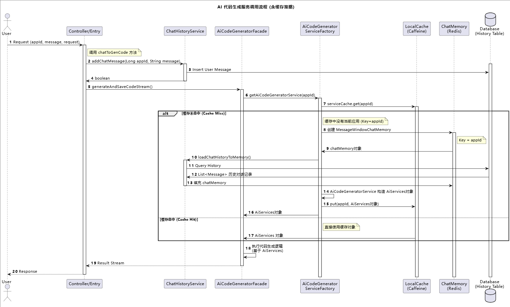
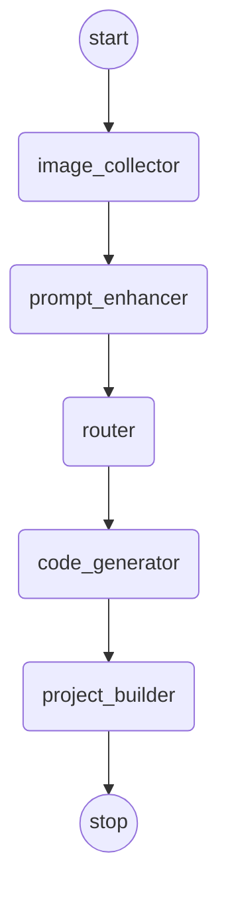

# 设计模式
## 策略模式
策略模式定义了一系列算法，把每一个算法封装起来，并让他们可以相互替换，使得算法的变化不会影响使用算法代码，让项目更好维护
```
客户端-----策略性接口------HTML解析策略HtmlCodeParser-----返回
              |
              |
              |----------多文件解析策略MultiFileCodeParser----返回
```
策略模式相当于你去选择一套行为逻辑，比如支付时有微信，支付宝，银行卡三种


## 模版方法模式
模版方法模式在抽象父类中定义了操作的标准流程，将一些具体实现步骤交给子类，使得子类可以在不改变流程的情况下重新定义某些特定步骤


## 执行器模式
执行器模式不是一种设计模式，

正常情况下，可以通过工厂模式来创建不同的策略或者模版方法，但由于每种生成模式的参数和返回值不同，很难对通过工厂模式创建出来的对象进行统一的调用

## 混合模式
在这个项目中，使用多种设计模式
执行器模式： 提供统一的执行入口，根据生成类型执行不同的操作
策略模式：每种模式对应的解析方法单独作为一个类来维护
模版方法模式：抽象模版类定义了通用的文件保存流程，子类可以有自己的视线（比如多文件生成模式需要保存3个文件，而原生HTML模式只需要保存1个文件）

占位图片：
https://picsum.photos/


# nginx
下载nginx：https://nginx.org/en/download.html
通过修改配置文件可以直接进行重定向
```nginx
# 静态资源服务器 - 80 端口
server {
    listen       80;
    server_name  localhost;
    charset      utf-8;
    charset_types text/css application/javascript text/plain text/xml application/json;
    # 项目部署根目录
    root         /Users/yupi/Code/yu-ai-code-mother/tmp/code_deploy;
    
    # 处理所有请求
    location ~ ^/([^/]+)/(.*)$ {
        try_files /$1/$2 /$1/index.html =404;
    }
}
```
# 对话历史模块


# 协同编辑
创建一张chat_group对话房间表，用于存这个属于哪个应用，


# 工程项目
## 方案设计
1. 直接输出MarkDown，这种方案延续之前的思路，直接让AI在输出的MarkDown中包含代码块，通过解析的方式保存文件
这种方式如果代码量较大，一次对话可能无法完整的输出
2. 工具调用
给AI提供保存文件等工具，让AI来决定什么时候保存文件，保存那些文件，要保存什么代码到文件中
但是要想实时展示工具调用信息（比如要保存问文件的代码内容），就要解析AI先攻的工具调用信息
3. Agent模式
智能体集成 记忆，知识库和工具 等能力为一体，构造了完整的决策能力，先规划在执行


最后选择使用工具调用的方式，然后把提示词完善


## 工程项目开发
### 配置推理流式模型
这里需要注意引入的大模型名称不要冲突，需要把之前引入的流逝对话模型名字改一下
### 开发文件工具

```java
@Slf4j
public class FileWriteTool {

    @Tool("写入文件到指定路径")
    public String writeFile(
            @P("文件的相对路径")
            String relativeFilePath,
            @P("要写入文件的内容")
            String content
    ) {
        // 具体实现    
    }
}
```


### 支持 Vue 项目生成
保存提示词，给AI Service补充新的流式生成方法，使用@MemoryId，可进行参数传递，在工具调用时获取到appId

在构造工厂代码中补充Vue项目生成
修改AI Service 缓存逻辑

### 工具调用流式输出
使用TokenStream，在通过源码覆盖的方式

这里需要统一返回给前端的相应信息，需要有AI响应信息，工具调用信息，工具调用完成信息

然后再做一些适配，如果是原生的则不变，如果是Vue则需要进行TokenStream到flux的转换

# 生成应用封面图
先获取到可访问的URL，然后使用一些自动化工具打开一个无头浏览器，访问应用页面并进行截图
这里选择使用Selenium
## Selenium
Selenium是一个非常成熟的Web自动化框架，他的核心概念是 WebDirver（浏览器驱动）
WebDirver可以控制浏览器行为的接口，能够让程序像人一样操作浏览器，WebDirver是Selenium与浏览器之间的桥梁


# contentEitable
给元素添加contentEeitable = true 就可以直接在页面进行编辑

# LangGraph 4j




