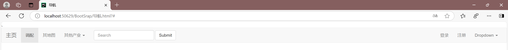
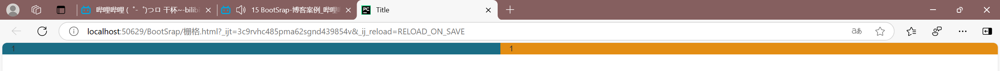
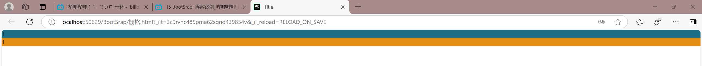
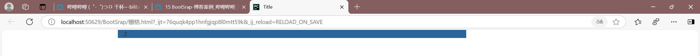
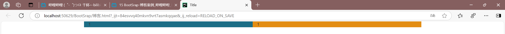
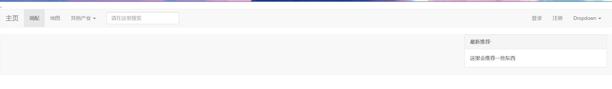
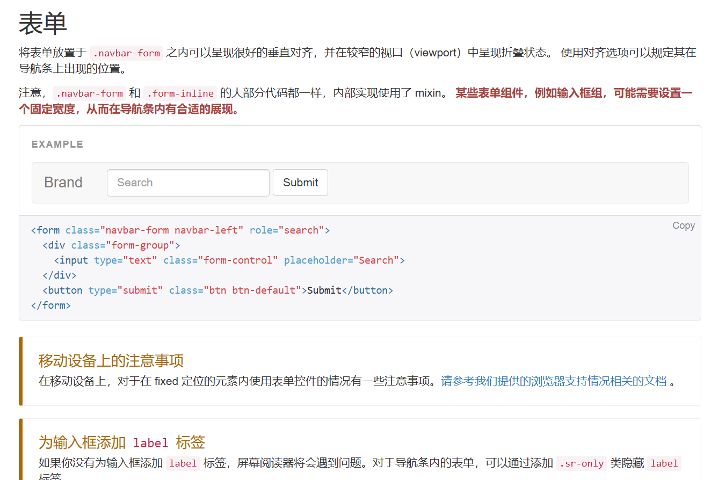
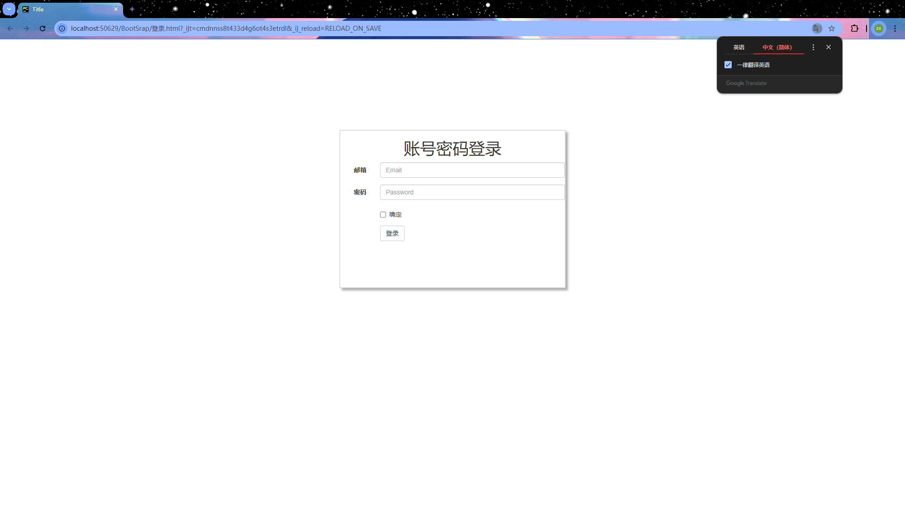

### BootStrap
是别人写好的css样式，拿来直接用即可
网址：
https://v5.bootcss.com/docs/customize/components/
#### 导航界面
通过自己修改代码


#### 博客
##### 栅格系统
把整体划分为12个格子
**分类**

- 响应式，根据屏幕大小不同
```
.col-lg-    1170px
.col-md-    970px
.col-sm-    750px
```
**一般用md和sm**


- 非响应式
```html
    <div class="col-mx-6" style="background-color: #1b6d85">1</div>
    <div class="col-mx-6" style="background-color: #e38d13">1</div>
```

- 列偏移
```html
    <div class="col-sm-offset-2 col-sm-6 " style="background-color: #2b669a">2</div>

```

- container
```html
<div class="container">
    <div class="col-sm-6" style="background-color: #1b6d85">1</div>
    <div class="col-sm-6" style="background-color: #e38d13">1</div>
</div>

```


#### 面板 


#### 表单
- 宽度+居中(区域居中)
- 内边距
- 表单


#### 登录


#### 图标
bootstrap提供的有，但是不多
建议用 Fontawesome 网站
