# DDL-数据库操作：

1. 查看所有的数据库：
```mysql
show databases;
```
2. 创建数据库：
```mysql
create database 数据库名;
```
3. 使用数据库：
```mysql
use 数据库名;
```
4. 查看使用的哪一个数据库
```mysql
select database();
```
5. 删库
```mysql
drop database 数据库名;
```
# DDL-表操作：
1. 查看当前数据库所有的表:
```mysql
show tables;
```
2. 创建表：
```mysql
create table 表名;
```

3. 查看当前表有什么字段：
```mysql
desc 表名;
```

4. 查看表结构
```mysql
show create table 表名;
```

5. 修改表信息
```mysql
alter table 表名;

alter table 表名 add/modify/change/drop/rename to...;
```
6. 删表
```mysql
drop table 表名;
```
# DML语句操作：
1. 添加数据
```mysql
insert into表名(字段)values(值1，值2,…), (值1，值2,…);
```
2. 修改数据
```mysql
update 表名 set 字段1=值1，字段2=值2（where）;
```

3. 删除数据
```mysql
delete from 表名 where [条件表达式];
```


# DQL语句：

1.简单查询
```mysql
select * from表名;
```
2.指定查询
```mysql
Select 字段 from 表名;
Where 
Group by #分组字段列表
```

## 分页查询

使用limit

参数1：起始索引 = （页码 - 1 ） * 每页展示记录数

参数2：查询返回记录数

```mysql
select * from emp limit 0,5;
```


# 函数：

## 排序

```mysql
order by  字段 asc升序/desc降序
```

## 字符串函数

1.concat(a1,a2…)字符串拼接

2.lower(str) 将字符串全部小写

3.upper(str) 将字符串全部大写

4.lpad(str,n,pad) 用字符串pad对str的左边进行填充

5.rpad(str,n,pad) 右填充  字符串一共长度为n

6.trim(str)去掉字符串头部和尾部的空格

7.substring(str,start,len) 返回从start起len个长度字符串

## 数值函数

1.ceil( n ) 向上取整

2.floor(n) 向下取整

3.mod( n,m) n%m

4.rand()  生成随机数在(0,1)

5.round(n,m) 对n保留m位小数四舍五入

6.distinct 对查询到的结果去重

​        


## 日期函数：

1. curdate() 当前日期
2. curtime() 当前时间
3. now() 当前日期时间
4. year(data)  指定年份
5. month(data) 指定月份
6. day(data) 指定日期
7. date_add(data,interval type) 返回一个日期加上一个日期
data_add(now(),interval 70 day);
8. datediff(data1,data2) 两个日期相差的时间
datediff(“2020-1-1”,”2023-2-2”);

## 流程函数：
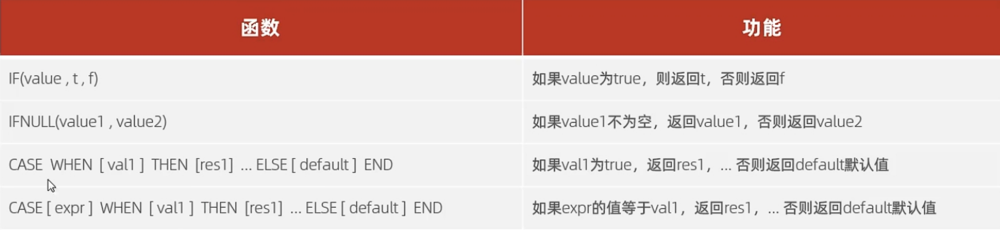
1. if(value,t,f) 如果value正确，则返回t,反之
2. ifnull(n,m) 如果n不为空，返回n,则返回m

<font color = brown>空字符串不为null:</font>       ""!=null


3. 查询emp表的员工姓名和工作地址，如果北上广深返回一线否则返回二线
```mysql
select 
   name,
   case workaddress when “北京” then “一线城市” 
when “上海” then “一线城市” 
else “二线城市”
end
from emp;
```

# MYSQL--约束

**约束是作用于表中字段上的，可以在创建表、修改表时添加约束**

保证数据库中数据的正确，有效性，完整性


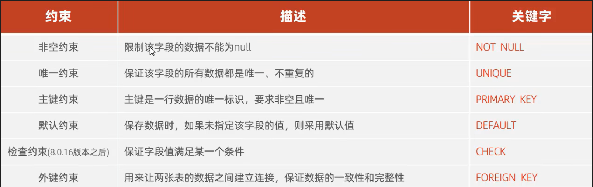

## NOT NULL

**非空约束**：限制该字段不为null

```mysql
id int not null;
```

## UNIQUE

唯一约束：该字段的所有数据都是唯一的

```mysql
name varchar(10) unique;
```

## PRIMARY KEY
主键约束:主键是一行数据的唯一标识，要求非空且唯一
```mysql
id int primary key;
```

## DEFAULT

默认约束：保存数据时，未指定该字段的值则用默认值

```mysql
id int default '1';
//默认为1
```

## CHECK

检查约束(8.0.16版本后)：保证该字段满足某一个条件

```mysql
age int check( age>0 && age <=100);
//保证年龄在0和100岁之间
```

## auto_increment
设置该字段自增
```mysql
id int auto_increment;
//将ID设置为自增
//如 1 2 3
```

## FOREIGN KEY 

外键约束：用来让两张表的数据之间建立连接，从而保证数据的一致性和完整性


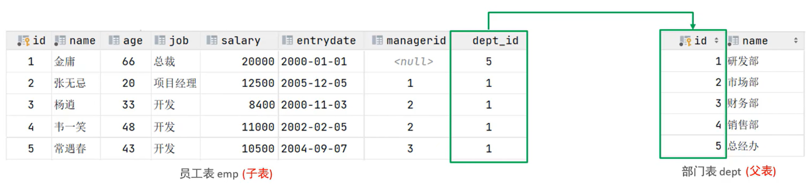


### 添加外键语法：


**方式一：**

```mysql
alter table 表名 add constraint 外键名字 foreign key(外键字段名字) references 主表(主表列名);

alter table emp add constraint fk_emp_dept_id foreign key(dept_id) references dept(id);

```

**方式二**:

再创建表时候进行外键关联

```mysql
constraint 外键名字 foreign key(外键字段名字) references 主表(主表列名);
```


### 删除外键语法：

```mysql
alter table 表名字 drop foreign key 外键名字;
```

```mysql
alter table emp drop foreign key fk_emp_dept_id;
```

### 外键更新约束行为：

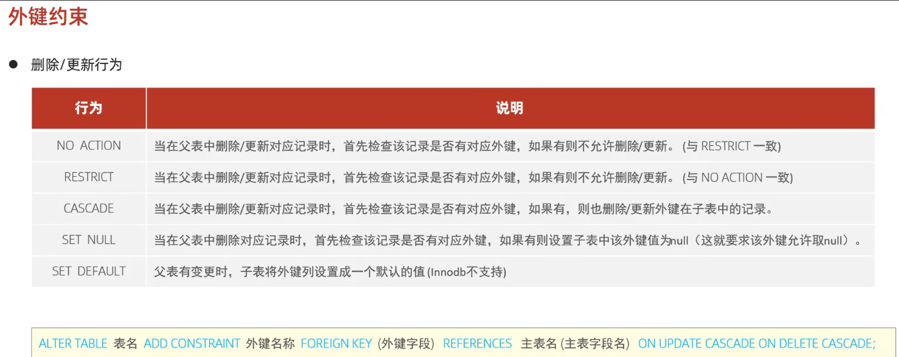

#### CASCADE 级联语法：

删除父表时，子表数据关联删除

```mysql
alter table emp add constraint fk_emp_dept_id foreign key (dept_id) references dept(id) on update cascade on delete cascade;
```
#### SET NULL

删除父表 ，子表如果有对应的外键，则设置为null

```mysql
alter table emp add constraint fk_emp_dept_id foreign key (dept_id) references dept(id) on update set null on delete cascade;
```

# 多表查询
从多张表中查询数据
在多表查询时，需要消除无效的笛卡尔积

## 多表关系
分为三种：
1. 一对多
案例：部门与员工的关系
一个部门对应多个员工
实现：在多的一方建立外键，指向一的一方主键

2. 多对多

案例：学生与课程的关系
一个学生可以选修多门课程
实现：建立第三张中间表，中间表至少包含两个外键，分别关联两方主键
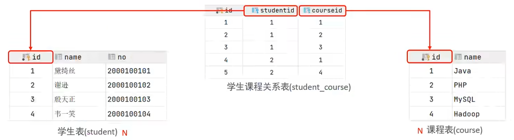


3. 一对一

用于单表拆分，把一张表的基础字段放在一张表中，其他字段放在另一张表中， 以提升操作效率

实现：在任意一方加入外键，关联另外一方的主键，并设置外键为唯一的(UNIQUE)

连接查询：
- 内连接：相当于查询A,B交集部分
- 外连接：
  1. 左外连接：查询左表所有数据，以及两张表交集部分数据
  2. 右外连接：查询右表所有数据，以及两张表交集部分数据
- 自连接：当前表与自己的连接查询，自连接必须使用表别名

## 内连接
语法：
隐式内连接
```mysql
select 字段列表 from 表1,表2 where 条件
select * from emp,dept where emp.dept_id = dept.id
```


**如果给表起了别名，就无法使用原名字了**

显式内连接：

```mysql
select 字段列表 from 表1 inner join 表2 on 连接条件;
select * from emp inner join dept on emp.dept_id = dept.id
```
## 外连接
### 左外连接
<font color = red>相当于查询表1的所有数据 包含 表1和表2交集部分的数据</font>

```mysql
select 字段列表 from 表1 left outer join 表2 on 条件;
select * from emp left outer join dept on emp.dept_id = dept.id;
```
### 右外连接
<font color = red>相当于查询表2的所有数据 包含 表1和表2交集部分的数据</font>

```mysql
select 字段列表 from 表 right outer join 表2 on 条件;
select * from emp right outer join dept on emp.dept_id = dept.id;
```
## 自连接
自连接查询，可以是内连接查询，也可以是外连接
可以把一张表看成两张表，给一张表起两个别名
```mysql
select 字段列表 from 表A 别名A join 表A 别名B on 条件;
select a.name ,b.name from emp a , emp b where a.managerid = b.id;
select a.name ,b.name from emp a left join emp b on a.managerid = b.id;
```
## 联合查询
对于union查询，就是把多次查询的结果合并起来，形成一个新的查询结果集
```mysql
select 字段列表 from 表A...
union[all]
select 字段列表 from 表B...;
```
对于联合查询的多张表的列数必须保持一致，字段类型也要保持一致

**union all会把所有的数据直接合并在一起**
**union会对合并的数据进行去重**

## 子查询
SQL语句中嵌套select语句，称为嵌套查询，又称子查询
```mysql
select * from t1 where column1 = (select column1 from t2)
```
子查询外部的语句可以是**insert/update/delete/select**中的任何一个
子查询分为：
1. 标量子查询，子查询结果为单个值
2. 列子查询，结果为一列
3. 行子查询，结果为一行
4. 表子查询，结果为多行多列


### 标量子查询
结果可以是单个值(数字，字符串，日期)，最简单的形式
常用操作符：= <> > >= < <=
```mysql
select * from emp where dept_id = (select id from dept where name = '销售部');
```
## 列子查询
常用操作符：in ,not in,any,some,all
|操作符|描述|
| ---| ---- |
|in|在指定的集合范围之内，多选一|
|not in|不在指定的集合范围内|
|any | 子查询返回列表中，有任意一个满足即可|
|some | 与any等同|
|all| 子查询返回列表的所有值都必须满足|
```mysql
select * from  emp where dept_id in (select id from dept where name = '销售部' or name = '市场部');
```

## 行子查询
返回结果是一行

```mysql
select * from emp where (salary,managerid) = (select emp.salary,managerid from emp where name = '张无忌');
```
## 表子查询
返回结果是多行多列
标识符：in

# 事务
事务是一组操作的集合，他是一个不可分割的工作单位，事务会把所有的操作作为一个整体一起向系统提交或者撤销操作的请求，即这些操作要么同时成功，要么同时失败

默认MySQL的事务是自动提交的，也就是说当执行一条 MySQL语句，MySQL会立即隐式的提交事务

## 事务操作
- 查看/设置事务提交方式
```mysql
select @@autocommit;
set @@autocommit = 0;  -- 设置为手动提交
```

- 提交事务
```commit```;

如果程序报错需要回滚事务

- 回滚事务
```rollback```;


开启事务时，数据就不会自动提交
开启事务：
```start transaction ;```

- 提交事务
```commit```;

- 回滚事务
```rollback```;

## 事务四大特性(ACID)
- 原子性:事务是不可分割的最小操作单元，要么全部成功，要么全部失败
- 一致性：事务完成时，必须使所有的数据都保持一致性
- 隔离性：数据库提供的隔离机制，保证事务在不收外部并发操作影响的独立环境下运行
- 持久性：事务一旦提交或回滚，他对数据库中的数据的改变就是永久的

## 并发事务问题
脏堵：一个事务读到另外一个事务还没有提交的数据
不可重复读：一个事务先后读取同一条记录，但两次读取的数据不同
幻读：一个事务按照条件查询数据时，没有对应的数据行，但是在插入数据时，又发现这行数据已经存在，好像出现了“幻影”

事务隔离级别


查看事务隔离级别：
``select @@transaction_isolation;``

设置事务登记
session/global:当前/全局
```mysql
set session/global transaction isolation level 隔离级别
```
# 存储引擎
## MySQL体系结构
- 连接层
- 服务层
- 引擎层
- 存储层
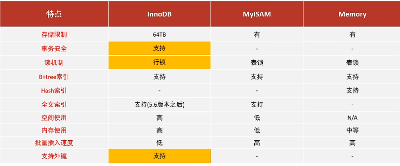

## 特点
INNODB与MyISAM:事务，外键，行级锁
INNODB:存储业务系统中对于事务、数据完整性要求较高的核心数据。
MyISAM:存储业务系统的非核心事务。


# 索引
索引是帮助数据库<font color = #C10102>高效获取数据</font>的<font color = #C10102>数据结构</font>

索引会占用存储空间，提高了查询效率，但是降低了增删改的效率

存储结构是B+树(多路平衡搜索树)

创建索引：
```mysql
create [unique] index 索引名 on 表名(字段名、...);
```

查看索引：
```mysql
show index from 表名
```

删除索引：
```mysql
drop index 索引名 on 表名;
```

- 主键字段，在建表时，会自动创建主键索引
- 添加唯一约束时，数据库实际上会添加唯一索引

## 性能分析
执行频次，慢查询日志，profile，explain

慢查询日志记录了所有执行时间超过指定参数(long_query_time，单位:秒，默认10秒)的所有SQL语句的日志。MySOL的慢查询日志默认没有开启，需要在MySQL的配置文件(/etc/my.cnf)中配置如下信息:
```mysql
开启MySOL慢日志查询开关
slow query log=1
设置慢日志的时间为2秒，SQL语句执行时间超过2秒，就会视为慢查询，记录慢查询日志long query time=2
```

explain 执行计划
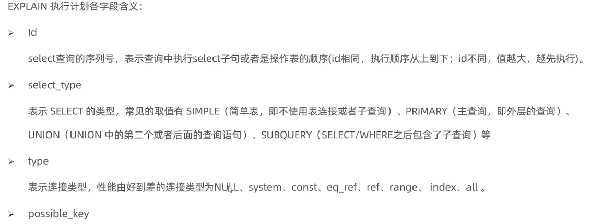

## 最左前缀法则
如果索引了多列(联合索引)，要遵守最左前缀法则。最左前缀法则指的是查询从索引的最左列开始，并且不跳过索引中的列。
如果跳跃某一列，索引将部分失效(后面的字段索引失效)。

与索引放的位置无关，只需要存在即可

联合索引中，出现范围查询(>,<),查询范围右侧的列索引失效
尽量使用>=或者<=，这样不会失效
不要在索引列上进行运算操作，索引将失效

字符串索引不加''，会失效，比如 1 '1'

尾部模糊不会让索引失效，前部模糊会失效
`
like '%工程'失效
like '软件%'不失效
`

用or分割开的条件，如果or前的条件中的列有索引，而后面的列中没有索引，那么涉及的索引都不会被用到。

解决方法：都建立索引


根据数据评估如果索引比全表更慢，则不使用索引

## 索引使用 - SQL提示
如果一个字段有多个索引，则使用联合索引而不使用单个索引

SQL提示，是优化数据库的一个重要手段，简单来说，就是在SQL语句中加入一些人为的提示来达到优化操作的目的。

使用该索引
use
```mysql
select * from tb_user use index(idx_user_pro) where profession='软件工程';
```

不要使用该索引
ignore
```mysql
select * from tb_user ignore index(idx_user_pro) where profession='软件工程';
```

必须使用这个索引
force
```mysql
select * from tb_user force index(idx_user_pro) where profession='软件工程';
```
### 覆盖索引

尽量使用覆盖索引（查询使用了索引，并且需要返回的列，在该索引中已经全部能够找到），减少select*。


### 前缀索引
当字段类型为字符串（varchar，text等）时，有时候需要索引很长的字符串，这会让索引变得很大，查询时，浪费大量的磁盘lO，影响查询效率。此时可以只将字符串的一部分前缀，建立索引，这样可以大大节约索引空间，从而提高索引效率

n为截取这个字符串前n个字符

语法：
```
create index idx _xxxx on table_name(column(n));
```
前缀长度：
可以根据索引的选择性来决定，而选择性是指不重复的索引值（基数）和数据表的记录总数的比值，索引选择性越高则查询效率越高，唯一索引的选择性是1，这是最好的索引选择性，性能也是最好的。

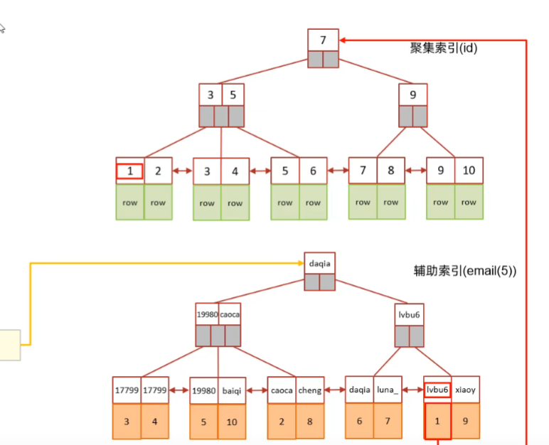

需要回表查询

### 联合/单列索引
单列索引：即一个索引只包含单个列。
联合索引：即一个索引包含了多个列。
在业务场景中，如果存在多个查询条件，考虑针对于查询字段建立索引时，建议建立联合索引，而非单列索引。


## 索引设计原则
1．针对于数据量较大，且查询比较频繁的表建立索引。
2.针对于常作为查询条件(where)、排序（order by)、分组（group by）操作的字段建立索引。
3.尽量选择区分度高的列作为索引，尽量建立唯一索引，区分度越高，使用索引的效率越高。
4.如果是字符串类型的字段，字段的长度较长，可以针对于字段的特点，建立前缀索引。
5.尽量使用联合索引，减少单列索引，查询时，联合索引很多时候可以覆盖索引，节省存储空间，避免回表，提高查询效率。
6.要控制索引的数量，索引并不是多多益善，索引越多，维护索引结构的代价也就越大，会影响增删改的效率。
7.如果索引列不能存储NULL值，请在创建表时使用NOTNULL约束它。当优化器知道每列是否包含NULL值时，它可以更好地确定哪个
索引最有效地用于查询。

# SQL优化
## 插入数据
1. 批量插入

2. 手动提交事务
```
start transactions;
insert
insert

commit;

```
3. 主键顺序插入


4. 大批量插入数据：
如果一次性需要插入大批量数据，使用insert语句插入性能较低，此时可以使用MySQL数据库提供的load指令进行插入。


## 主键优化

数据组织方式
在InnoDB存储引擎中，表数据都是根据主键顺序组织存放的，这种存储方式的表称为索引组织表(indexorganizedtableIOT)。
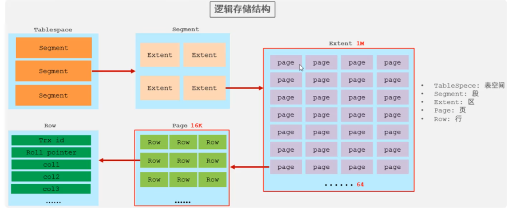

满足业务需求的情况下，尽量降低主键的长度。
插入数据时，尽量选择顺序插入，选择使用AUTO_INCREMENT自增主键。
尽量不要使用UUID做主键或者是其他自然主键，如身份证号。
业务操作时，避免对主键的修改。
## order by
Usingfilesort：通过表的索引或全表扫描，读取满足条件的数据行，然后在排序缓冲区sortbuffer中完成排序操作，所有不是通过索引直
接返回排序结果的排序都叫FileSort排序。
Usingindex：通过有序索引顺序扫描直接返回有序数据，这种情况即为usingindex，不需要额外排序，操作效率高。

通过创建索引进行优化，索引可指定升序索引和降序索引

根据排序字段建立合适的索引，多字段排序时，也遵循最左前缀法则。
尽量使用覆盖索引。
多字段排序，一个升序一个降序，此时需要注意联合索引在创建时的规则（ASC/DESC）。
如果不可避免的出现filesort，大数据量排序时，可以适当增大排序缓冲区大小sort_buffer_size(默认256k)。
  

## group by
在分组操作时，可以通过索引来提高效率。
分组操作时，索引的使用也是满足最左前缀法则的。
## limit优化
一个常见又非常头疼的问题就是limit200000&10，此时需要MySQL排序前2000010记录，仅仅返回2000000-2000010
的记录，其他记录丢弃，查询排序的代价非常大。

优化思路：一般分页查询时，通过创建覆盖索引能够比较好地提高性能，可以通过覆盖索引加子查询形式进行优化。
```
select * from tb_sku t,(select id from tb_sku order by id limit 2oooooo,10) a where t.id = a.id;
```

## count 优化

MyISAM引擎把一个表的总行数存在了磁盘上，因此执行cOunt(*)的时候会直接返回这个数，效率很高；
InnoDB引擎就麻烦了，它执行cOunt(*)的时候，需要把数据一行一行地从引擎里面读出来，然后累积计数。

优化：自己计数，利用例如Redis
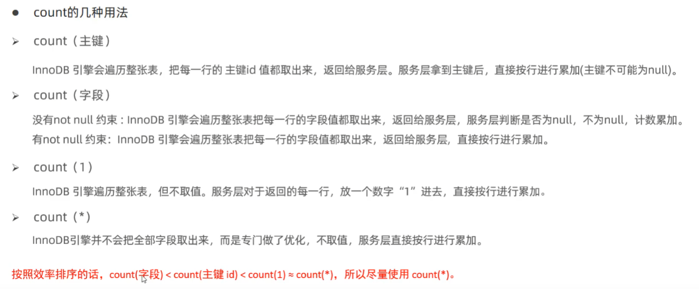

## update
InnoDB的行锁是针对索引加的锁莫不是针对记录加的锁，并且该索引不能失效，否则会从行锁升级表锁


执行修改语句，条件要根据有索引的字段，否则会升级为表锁，并发性能会降低

# 视图
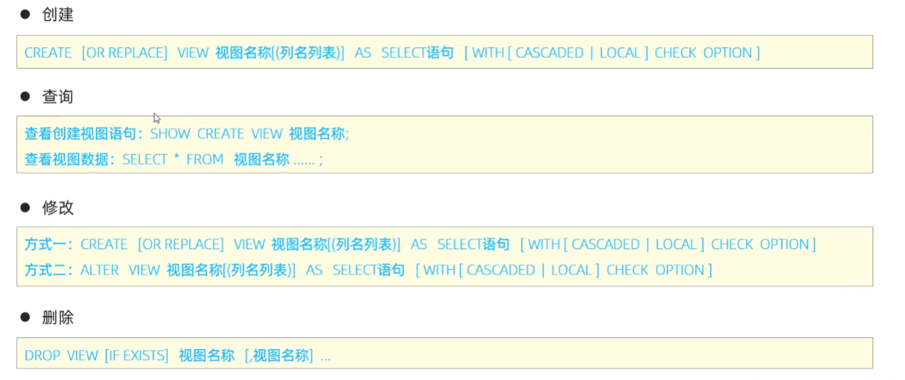


# 存储过程

存储过程是事先经过编译并存储在数据库中的一段SQL语句的集合，调用存储过程可以简化应用开发人员的很多工作，减少数据在数据
库和应用服务器之间的传输，对于提高数据处理的效率是有好处的。
存储过程思想上很简单，就是数据库SQL语言层面的代码封装与重用。

特点：
封装，复用
可以接收参数，也可以返回数据
减少网络交互，效率提升
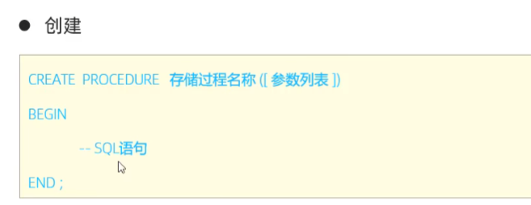


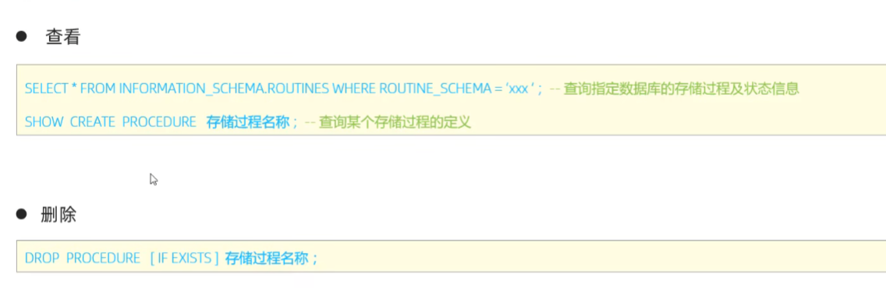


# 触发器

触发器是与表有关的数据库对象，指在insert/update/delete之前或之后，触发并执行触发器中定义的SQL语句集合。触发器的这种特
性可以协助应用在数据库端确保数据的完整性，日志记录，数据校验等操作。
使用别名OLD和NEW来引用触发器中发生变化的记录内容，这与其他的数据库是相似的。现在触发器还只支持行级触发，不支持语句
级触发。
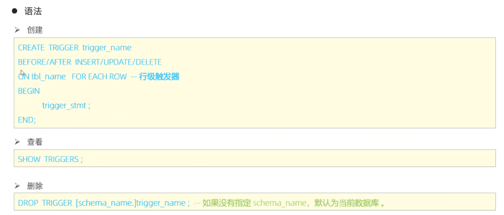

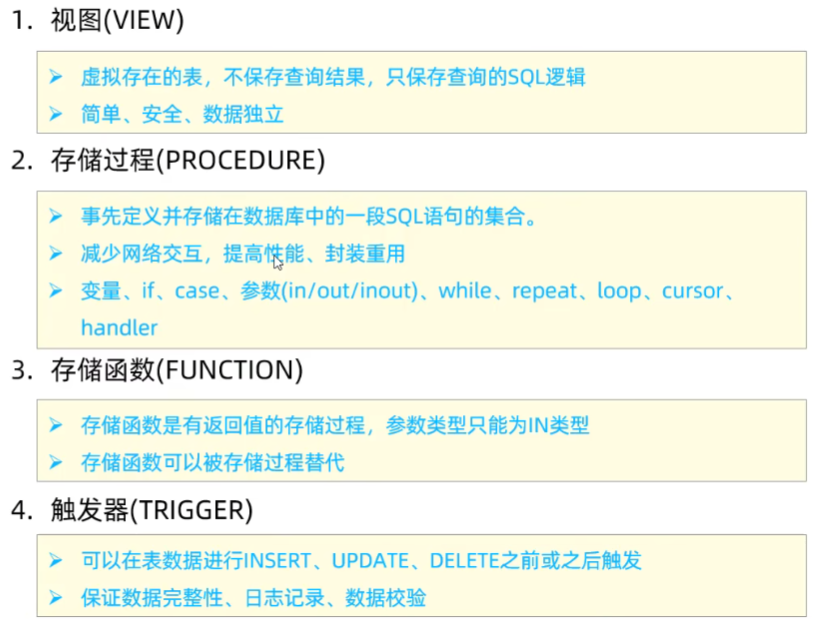


# 锁
锁是计算机协调多个进程或线程并发访问某一资源的机制。在数据库中，除传统的计算资源（CPU、RAM、I/O）的争用以外，数据也是
一种供许多用户共享的资源。如何保证数据并发访问的一致性、有效性是所有数据库必须解决的一个问题，锁冲突也是影响数据库并发访
问性能的一个重要因素。从这个角度来说，锁对数据库而言显得尤其重要，也更加复杂。

## 全局锁
全局锁就是对整个数据库实例加锁，加锁后整个实例就处于只读状态，后续的DML的写语句，DDL语句，已经更新操作的事务提交语句都
将被阻塞。
其典型的使用场景是做全库的逻辑备份，对所有的表进行锁定，从而获取一致性视图，保证数据的完整性。

加锁：
```
flush tables wiht read lock
```

解锁
```
unlock tables;
```

数据库备份
```
mysqldump -h 192.***.***.***  -uroot -p1234 数据库名 > D:/db01.sql
```

**数据库中加全局锁，是一个比较重的操作，存在以下问题：**
1. 如果在主库上备份，那么在备份期间都不能执行更新，业务基本上就得停摆。
2. 如果在从库上备份，那么在备份期间从库不能执行主库同步过来的二进制日志（binlog），会导致主从延迟。

在InnoDB引擎中，我们可以在备份时加上参数--single-transaction参数来完成不加锁的一致性数据备份。

在InnoDB中，可以在备份时加上参数来完成不加锁的一致性数据备份
```
mysqldump -single-transaction -uroot -p123456 itcast>itvast.sql
```
## 表锁
表级锁，每次操作锁住整张表。锁定粒度大，发生锁冲突的概率最高，并发度最低。应用在MyISAM，InnoDB、BDB等存储引擎中。

对于表级锁分为三类：
1. 表锁
2. 元数据锁
3. 意向锁

### 表锁

对于表锁，分为两类：
1. 表共享读锁(read lock)
2. 表独占写锁(write lock)

语法：
1. 加锁:lock tables表名...read/write。
2. 释放锁：unlocktables/客户端断连接。

读锁：
所有人只能读不能写
写锁：
自己能读能写
其他客户端不能读不能写

读锁不会阻塞其他客户端的读，但是会阻塞写。写锁既会阻塞其他客户端的读，又会阻塞其他客户端的写。

### 元数据锁
MDL加锁过程是系统自动控制，无需显式使用，在访问一张表的时候会自动加上。MDL锁主要作用是维护表元数据的数据一致性，在表
上有活动事务的时候，不可以对元数据进行写入操作。**为了避免DML与DDL冲突，保证读写的正确性。**
在MySQL5.5中引I入了MDL，当对一张表进行增删改查的时候，加MDL读锁(共享)；当对表结构进行变更操作的时候，加MDL写锁(排他)。
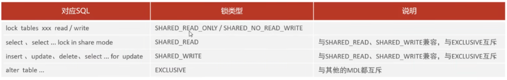
在增删改查时不能修改表结构

### 意向锁
意向共享锁(IS)：由语句 select...lock in share mode添加。

意向排他锁(IX)：由insert、update、delete、select ... for update 添加。

意向共享锁（IS）：与表锁共享锁（read）兼容，与表锁排它锁（write）互斥。
意向排他锁（IX）：与表锁共享锁（read）及排它锁（write）都互斥。意向锁之间不会互斥。

意向锁解决的是行锁和表锁之间的冲突

## 行级锁
行级锁，每次操作锁住对应的行数据。锁定粒度最小，发生锁冲突的概率最低，并发度最高。应用在InnoDB存储引擎中。
InnoDB的数据是基于索引组织的，行锁是通过对索引上的索引项加锁来实现的，而不是对记录加的锁。对于行级锁，主要分为以下三类：

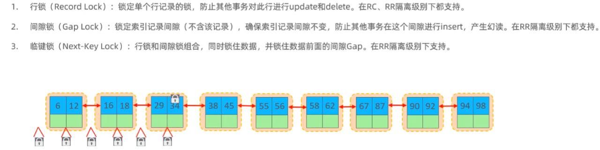


### 行锁
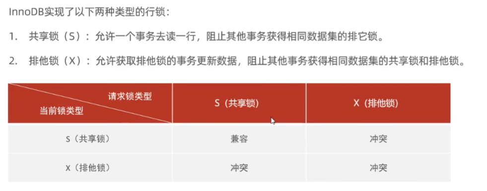
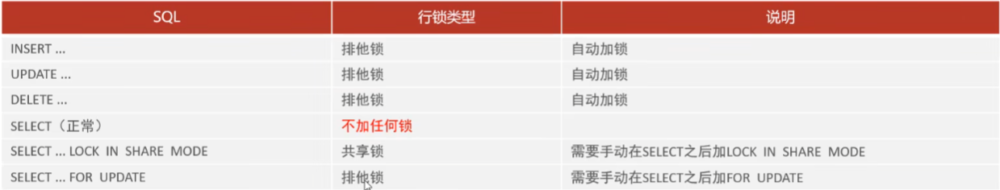

### 间隙锁
默认情况下，InnoDB在REPEATABLEREAD事务隔离级别运行，InnoDB使用next-key锁进行搜索和索引扫描，以防止幻读。
1. 索引上的等值查询(唯一索引)，给不存在的记录加锁时，优化为间隙锁。

2. 索引上的等值查询(普通索引)，向右遍历时最后一个值不满足查询需求时，next-keylock退化为间隙锁。
3. 索引上的范围查询(唯一索引)--会访问到不满足条件的第一个值为止。 

间隙锁唯一目的是防止其他事务插入间隙。间隙锁可以共存，一个事务采用的间隙锁不会阻止另一个事务在同一间隙上采用间隙锁。

# 系统数据库
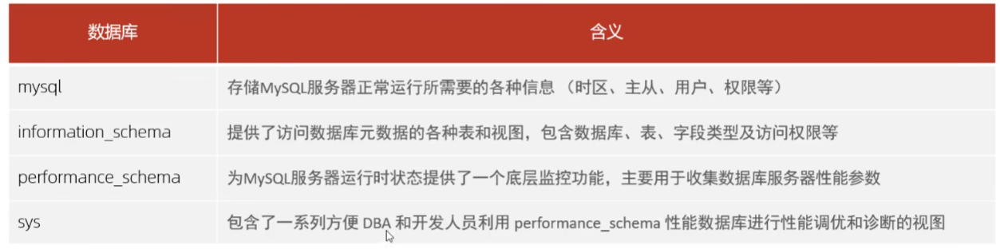

## mysql工具
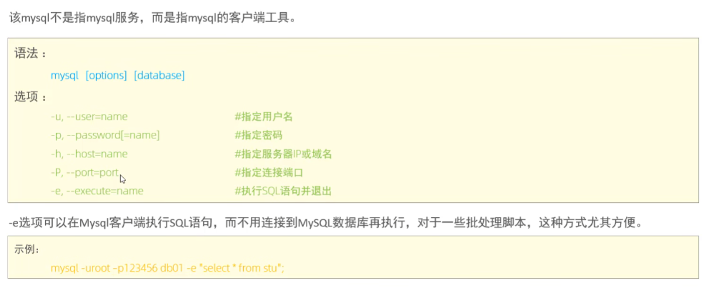

## mysqladmin
是一个执行管理操作的客户端程序
可以用来检查服务器的配置和当前状态，创建并删除数据库

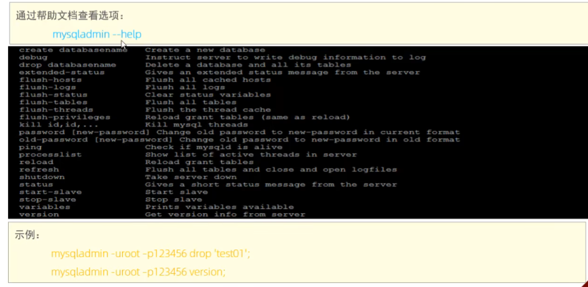


## mysqlbinlog
由于服务器生成的二进制日志文件以二进制格式保存，所以如果想要检查这些文本的文本格式，就会使用到mysqlbinlog日志管理工具。


## mysqlshow
mysqlshow客户端对象查找工具用来很快地查找存在哪些数据库、数据库中的表、表中的列或者索引。
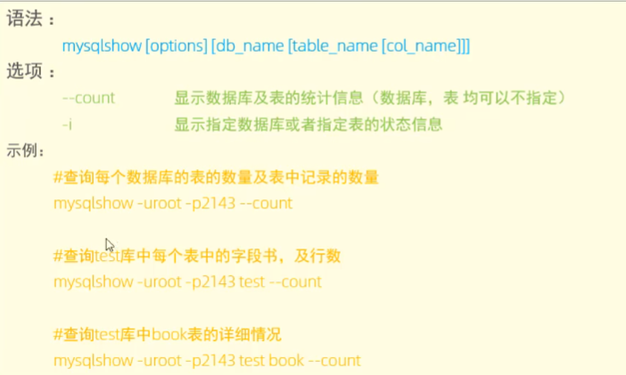


## mysqldump
用来备份数据库和不同数据库之间进行数据秦阿姨，备份内容包含创建表，插入表的SQL语句
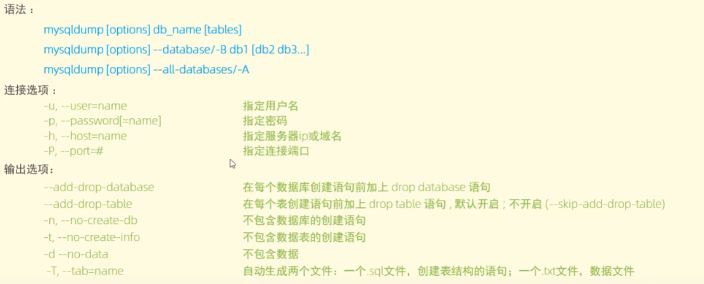


## mysqlimport/source
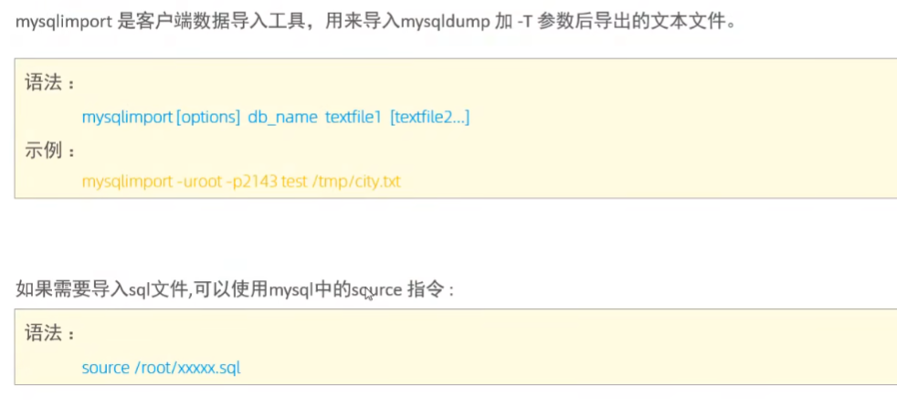
