# NoSQL 
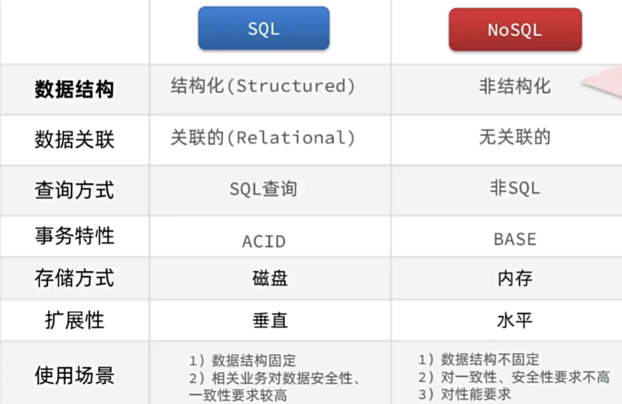

# REDIS
配置：
密码：20041123zzx.

## Jedis
### 引入依赖
```xml
<dependency>
    <groupId>redis.clients</groupId>
    <artifactId>jedis</artifactId>
    <version>3.7.0</version>
</dependency>
```
### 建立连接
```java
private Jedis jedis;
@BeforeEach
void setup(){
    jedis = new Jedis("localhost",6379);
    //jedis.auth("20041123zzx.");
    jedis.select(0);
}
@Test
void test(){
    String set = jedis.set("name111", "asgdasg");
    System.out.println(set);
    String s = jedis.get("name111");
    System.out.println(s);
    jedis.close();
}
```
## jedis连接池
```java
private static final JedisPool jedisPool;
static {
    JedisPoolConfig poolConfig = new JedisPoolConfig();
    poolConfig.setMaxTotal(8);
    poolConfig.setMaxIdle(8);
    poolConfig.setMinIdle(0);
    poolConfig.setMaxWaitMillis(1000);
    jedisPool = new JedisPool(poolConfig,"localhost",6379);
}
public static Jedis getJedis(){
    return jedisPool.getResource();
}
```
## SpringDataRedis
SpringData是Spring中数据操作的模块，包含对各种数据库的集成，其中对Redis的集成模块就叫做SpringDataRedis，官网地址:https://spring.io/projects/spring-data-redis

- 提供了对不同Redis客户端的整合(Lettuce和Jedis)
- 提供了RedisTemplate统一API来操作Redis
- 支持Redis的发布订阅模型
- 支持Redis哨兵和Redis集群
- 支持基于Lettuce的响应式编程
- 支持基于JDK、JSON、字符串、Spring对象的数据序列化及反序列化
- 支持基于Redis的JDKCollection实现
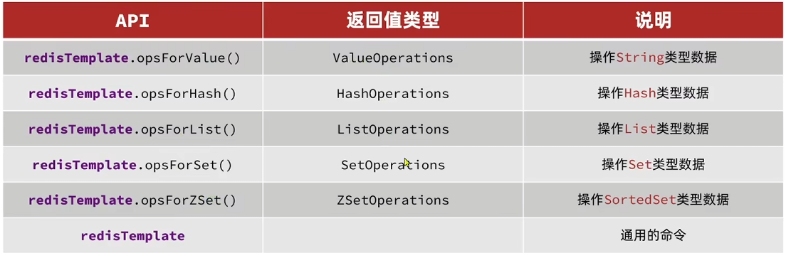
### 引入依赖
```xml
<!--Redis依赖-->
<dependency>
    <groupId>org.springframework.boot</groupId>
    <artifactId>spring-boot-starter-data-redis</artifactId>
</dependency>
<!--common-poll-->
<dependency>
    <groupId>org.apache.commons</groupId>
    <artifactId>commons-pool2</artifactId>
</dependency>
```
### 配置文件
```yaml
spring:
  redis:
    host: localhost
    port: 6379
    database: 0
    lettuce:
      pool:
        max-active: 8
        max-idle: 8
        min-idle: 0
        max-wait: 100ms
```
### 1. 设置序列化RedisTemplate
```java
@Bean
public RedisTemplate<String,Object> redisTemplat(RedisConnectionFactory connectionFactory){
    //创建RedisTemplate对象
    RedisTemplate<String, Object> template = new RedisTemplate<>();
    //设置连接工厂
    template.setConnectionFactory(connectionFactory);
    //创建JSON序列化工具
    GenericJackson2JsonRedisSerializer jsonRedisSerializer = new GenericJackson2JsonRedisSerializer();
    //设置Key的序列化
    template.setKeySerializer(RedisSerializer.string());
    template.setHashKeySerializer(RedisSerializer.string());
    //设置Value的序列化
    template.setValueSerializer(jsonRedisSerializer);
    template.setHashValueSerializer(jsonRedisSerializer);
    //返回
    return template;
}
```
### 2. StringRedisTemplate
为了节省内存空间，我们并不会使用JsON序列化器来处理value，而是统一使用String序列化器，要求只能存储String类型的key和value。当需要存储Java对象时，手动完成对象的序列化和反序列化。

Spring默认提供了一个StringRedisTemplate类，它的key和value的序列化方式默认就是String方式。省去了我们自定义RedisTemplate的过程

需要把对象用JSON转化成字符串，手动序列化

**RedisTemplate两种序列化方案**
1. 自定义RedisTemplate，修改序列化器
2. 使用StringRedisTemplate,写入时手动序列化为JSON，读取是，把JSON反序列化为对象

# 数据结构

## set

求两个set集合的交集

```bash
sadd s1 m1 m2
sadd s2 m2 m3

sinter s1 s2    -> m2
```
## zset
查找，根据角标查找
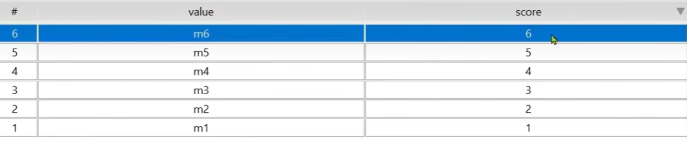
```bash
add z1 m1 1 m2 2 m3 3 m4 4 m5 5 m6 6

ZREVRANGE z1 0 2 withscores 
->m6 5 
m5 5
m4 4 
```
根据分数查询
滚动分页查询

```bash
ZREVRANGEBYSCORE key max min withscores limit offset count
```
max: 分数的最大值
min: 分数的最小值
offset: 从最大分数开始第几个查
count: 查几条

# 点评项目
启动项目后，在浏览器访问：http://localhost:8081/shop-type/list，如果可以看到数据则证明运行没有问题
## Session实现短信登录
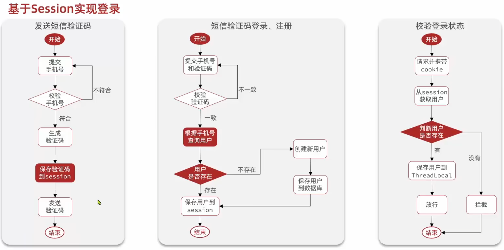

session共享问题：多台Tomcat并不共享session存储空间，当请求切换到不同tomcat服务时导致数据丢失的问题。
使用redis解决
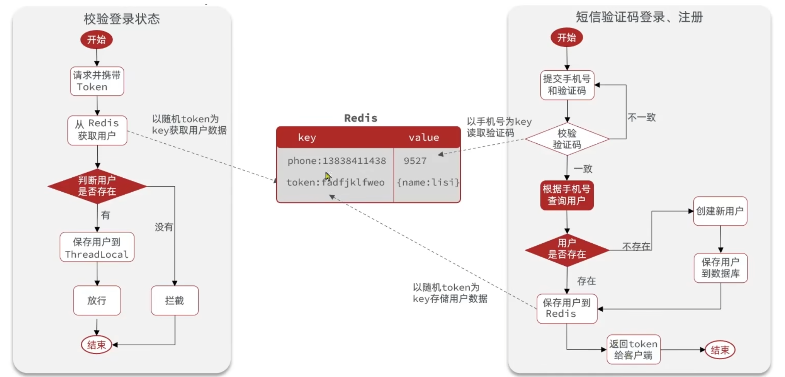

## 登录拦截器优化
每一次访问需要登录的路径，如果ThreadLocal中没有信息，则拦截
注册两个拦截器，一个负责刷新token，一个负责拦截

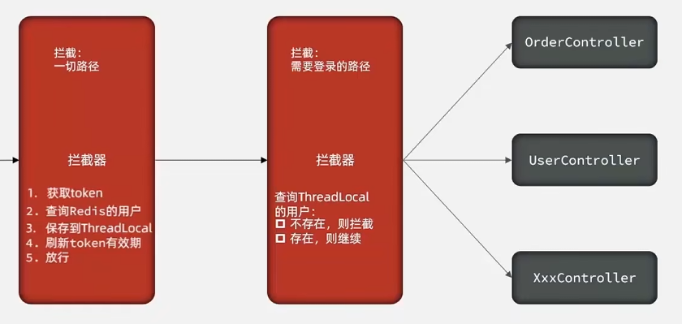

## 缓存
缓存是数据交换的缓冲区，是存贮数据的临时地方，一般读写性能高

### 主动更新策略
操作缓存和数据库时有三个问题需要考虑：
1.删除缓存还是更新缓存？
**更新缓存**：每次更新数据库都更新缓存，无效写操作较多
丹
**删除缓存**：更新数据库时让缓存失效，查询时再更新缓存 (选这个)
2．如何保证缓存与数据库的操作的同时成功或失败？
**单体系统**：将缓存与数据库操作放在一个事务
**分布式系统**：利用TCC等分布式事务方案
3.先操作缓存还是先操作数据库？
先删除缓存，再操作数据库
先操作数据库，再删除缓存

低一致性需求：使用Redis自带的内存淘汰机制
高一致性需求：主动更新，并以超时剔除作为兜底方案

**读操作：**
缓存命中则直接返回
缓存未命中则查询数据库，并写入缓存，设定超时时间
**写操作：**
**先写数据库，然后再删除缓存**
要确保数据库与缓存操作的原子性


### 缓存穿透
缓存穿透是指客户端请求的数据在缓存中和数据库中都不存在，这样缓存永远不会生效，这些请求都会打到数据库。
常见的解决方案有两种：
1. **缓存空对象**

优点：
- 实现简单，维护方便

缺点:
- 额外的内存消耗
- 可能造成短期的不一致

2. **布隆过滤**

优点：内存占用较少，没有多余key
缺点：
- 实现复杂
- 存在误判可能
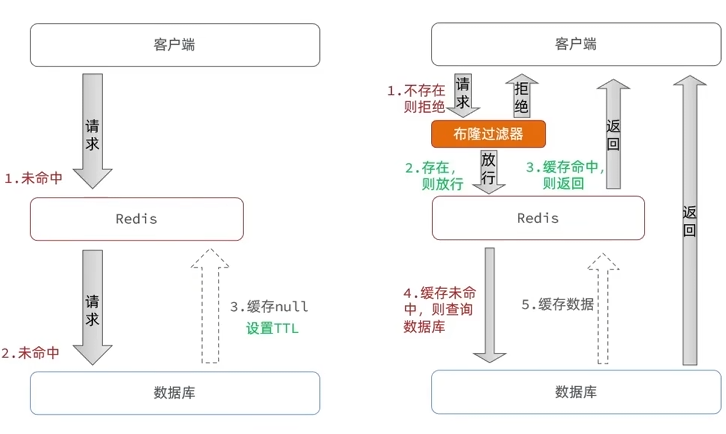
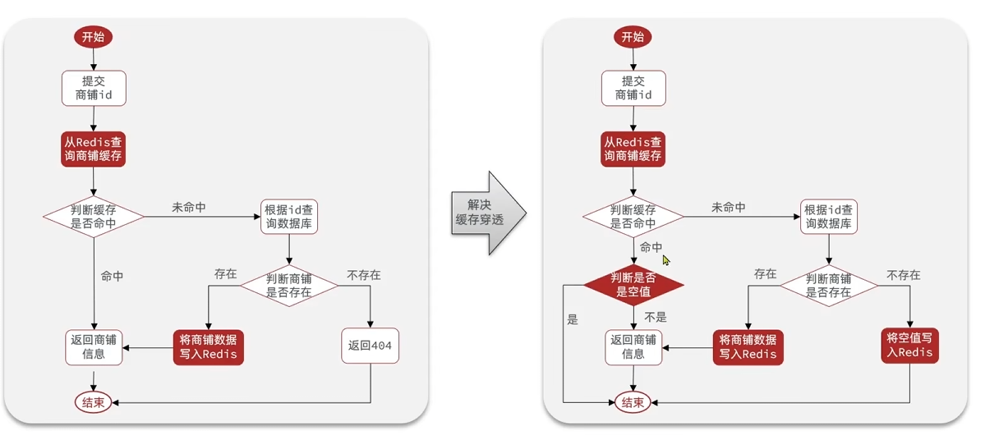

### 缓存雪崩
缓存雪崩是指在同一时段大量的缓存key同时失效或者Redis服务宕机，导致大量请求到达数据库，带来巨大压力。
解决方案：
- 给不同的Key的TTL添加随机值
- 利用Redis集群提高服务的可用性
- 给缓存业务添加降级限流策略
- 给业务添加多级缓存
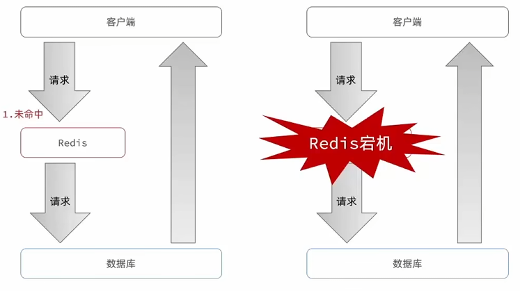

### 缓存击穿
缓存击穿问题也叫热点Key问题，就是一个被高并发访问并且缓存重建业务较复杂的key突然失效了，无数的请求访问会在瞬间给数据库带来巨大的冲击。
解决方案：
- 互斥锁
- 逻辑过期
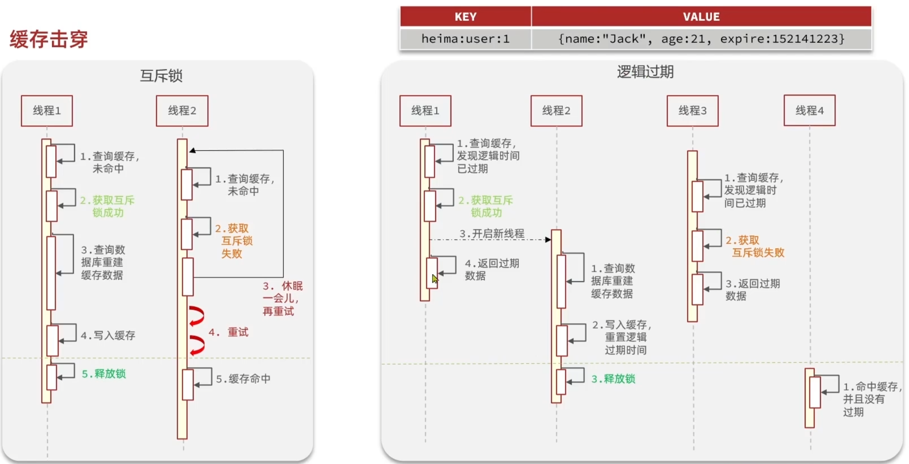
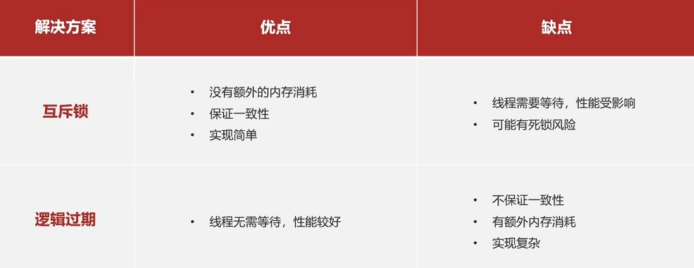

# 优惠卷秒杀
## 全局ID生成器
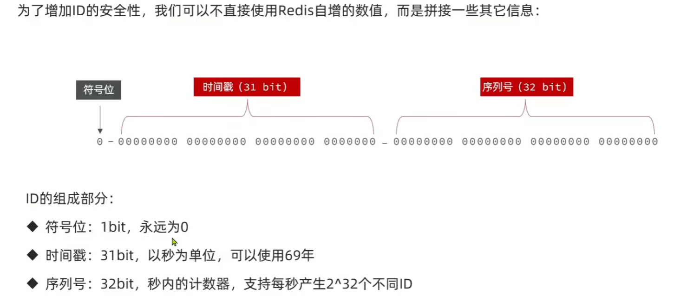

全局唯一ID生成策略：
- UUID
- redis自增
- snowflake算法
- 数据库自增

redis自增ID策略
- 每天一个key，方便统计订单量
- ID构造是 时间戳+计数器

##  乐观锁，悲观锁
悲观锁：
认为线程安全问题一定会发生，因此在操作数据之前先获取锁，确保线程串行执行。
例如Synchronized、Lock都属于悲观锁

乐观锁：
认为线程安全问题不一定会发生，因此不加锁，只是在更新数据时去判断有没有其它线程对数据做了修改。

如果没有修改则认为是安全的，自己才更新数据。
如果已经被其它线程修改说明发生了安全问题，此时可以重试或异常。

### 乐观锁
关键是判断之前查询得到的数据是否有被修改过
方法一：
版本号法：
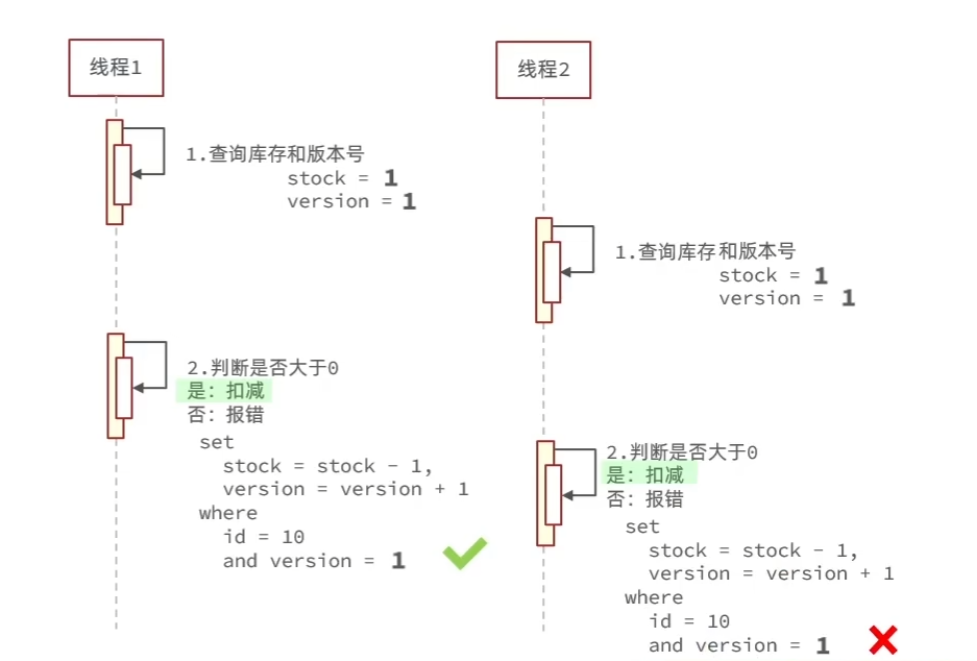
方法二：
CAS法（Compare And Set  比较和设置）
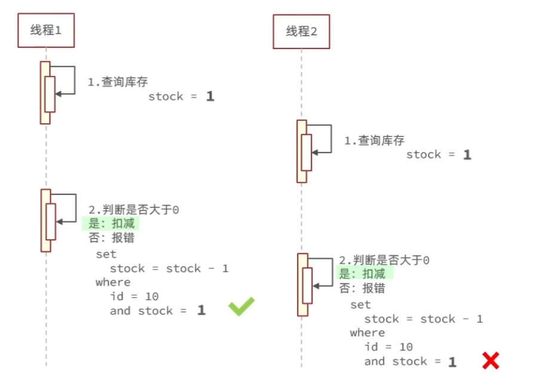
使用数据本身的数量当做版本，判断修改时和之前查询时的数量是否一致
## 一人一单
使用synchronized锁锁住用户下单创建订单的代码
```java
 synchronized (userId.toString().intern()) {
    // 获取代理对象（事务）
    IVoucherOrderService proxy =(IVoucherOrderService) AopContext.currentProxy();
    return proxy.createVoucherOrder(voucherId);
}
```
**注意事务失效**

这种情况不能在集群系统，只适用于单体项目

## 分布式锁

满足在分布式系统或集群模式下多进程可见且互斥的锁
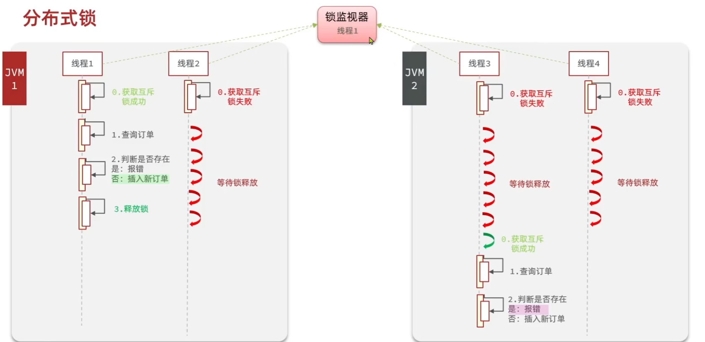
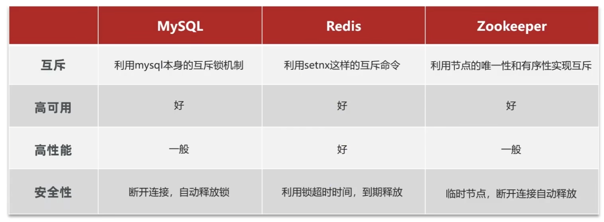
基于redis实现分布式锁
获取锁：
互斥：确保只能有一个线程获取锁
使用setnx
释放时，添加一个超时时间，自动释放

**流程：**
开始->如果是ok则获取成功，否则失败
如果业务超时或服务宕机，自动释放锁
以用户id为唯一标识

**当同一用户进行访问时，第一个jvm可能堵塞，导致第二个jvm线程把第一个锁给释放了，所以在value中要添加唯一标识，释放锁时需要判断该锁是否为自己的**

改进分布式锁
1. 在获取锁时存入线程标识，用UUID表示
2. 在释放锁时先获取锁中线程标识，判断是否与当前线程一直

在判断锁的时候可能会发生堵塞，需要保证判断锁和释放锁原子性
### Redis的Lua脚本
Redis提供lua脚本功能，在一个脚本中编写多条Redis命令，确保多条命令执行时的原子性
Lua脚本是一种编程语言
https://www.runoob.com/lua/lua-tutorial.html

写好脚本需要用Redis调用
```lua
-- 比较线程标识与锁的标识是否一致
if(ARGV[1] == redis.call('get',KEYS[1]))then
    -- 释放锁
    return redis.call('del', KEYS[1])
end
return 0
```

redisTemplate调用Lua脚本API为：
```java
// 初始化加载Lua脚本
private static finalDefaultRedisScript<Long> UNLOCK_SCRIPT;
static {
    UNLOCK_SCRIPT = new DefaultRedisScript<>();
    UNLOCK_SCRIPT.setLocation(new ClassPathResource("unlock.lua"));
    UNLOCK_SCRIPT.setResultType(Long.class);
}
// 基于Lua脚本
stringRedisTemplate.execute(
        UNLOCK_SCRIPT,
        Collections.singletonList(KEY_PREFIX + name),
        ID_PREFIX + Thread.currentThread().getId()
);
```
# Redisson
Redisson是在Redis的基础上实现的Java驻内存数据网络，提供了许多分布式服务，其中包含了分布式锁
官网地址：https://redisson.org
GitHub地址:https://github.com/redisson/redisson

**以后使用分布式锁，直接使用开源的框架即可**

1. 引入依赖
``` xml
<dependency>
    <groupId>org.redisson</groupId>
    <artifactId>redisson</artifactId>
    <version>3.13.6</version>
</dependency>xml
```
2. 配置Redisson客户端
```java
@Bean
public RedissonClient redissonClient(){
    // 配置
    Config config = new Config();
    String address = "redis://" + host + ":" + post;
    config.useSingleServer().setAddress(address).setPassword(password);
    // 创建RedissonClient对象
    return Redisson.create(config);
}
```

3. 使用Redisson的分布式锁
```java
RLock lock = redissonClient.getLock("lock:order:" + userId);
boolean isLock = lock.tryLock();v
lock.unlock();
```
## Redisson可重入锁原理
获取锁lua脚本
```lua
local key = KEYS[1];--锁的key
local threadId = ARGV[1]; -- 线程唯一标识
local releaseTime = ARGV[2]; -- 锁的自动释放时间
-- 判断是否存在
if (redis.call('exists', key) == 0) then
    -- 不存在，获取锁
    redis.call('hset', key, threadId, '1');
    --设置有效期
    redis.call('expire', key, releaseTime);
    return 1;--返回结果
end

-- 锁已存在，判断threadId是不是自己的
if (redis.call('hexists', key, threadId) == 1) then
    -- 重入次数+1
    redis.call('hincrby', key, threadId, '1');
    --设置有效期
    redis.call('expire', key, releaseTime);
    return 1;--返回结果
end
return 0;--走到这里，说明获取锁不是自己的，获取锁失败
```
释放锁脚本
```lua
local key = KEYS[1];-- 锁的key
local threadId = ARGV[1];--线程唯一标识
local releaseTime = ARGV[2];--锁的自动释放时间
-- 判断当前锁是否还是被自己持有
if (redis.call('HEXISTS', key, threadId) == 0) then
    return nil;-- 如果已经不是自己，则直接返回
end ;
-- 是自己的锁，则重入次数 - 1
local count = redis.call('HINcRBY', key, threadId, -1);
-- 判断是否重入次数是否已经为0
if (count > 0) then
    --大于说明不能释放锁，重置有效期然后返回
    redis.call('expire', key, releaseTime);
    return nil;
else
    -- 等于0说明可以释放锁，直接删除
    redis.call('DEL', key);
    return nil;
end ;
```

## 重试机制
`lock.tryLock(1L,TimeUnit.SECONDS)`
在一秒内一直重试，如果失败则返回false

获取锁：
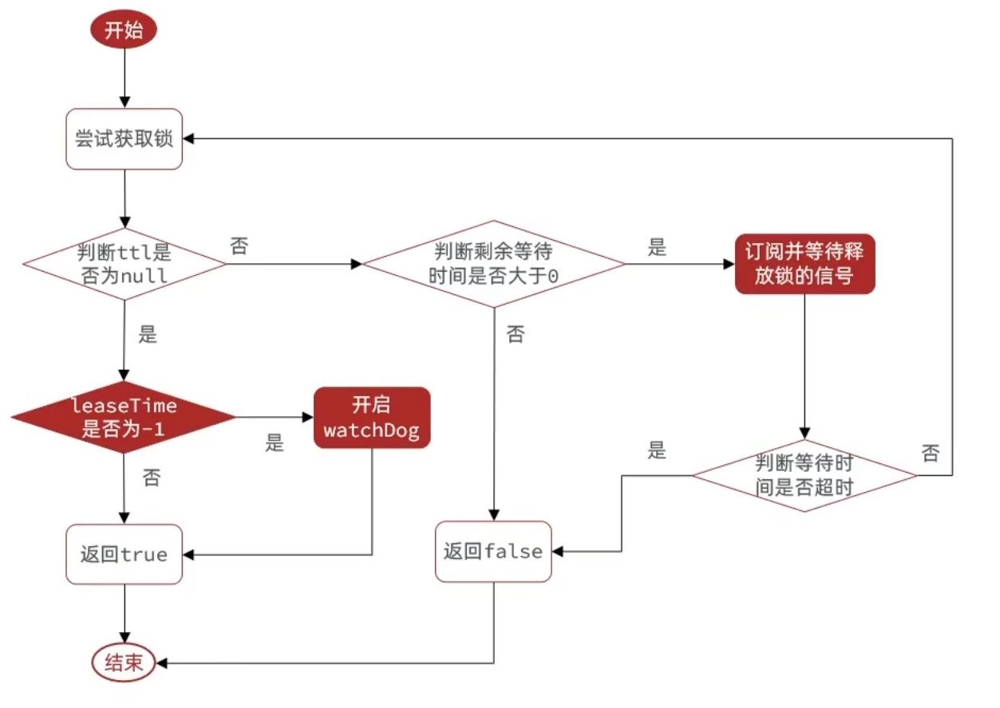
释放锁:
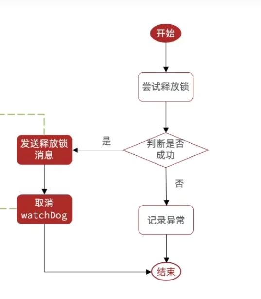


## 总结

**可重入**：利用Hash结构记录现成id和重入次数
**可重试**：利用信号量和PubSub机制实现等待，唤醒，获取锁失败的 重试机制
超时续约：利用watchDog，每隔一段时间(releaseTime / 3)，重置超时时间

## Redisson分布式锁主从一致性问题
主从：有一个主redis，多个从redis，进行读写分离
主从之间不能同步
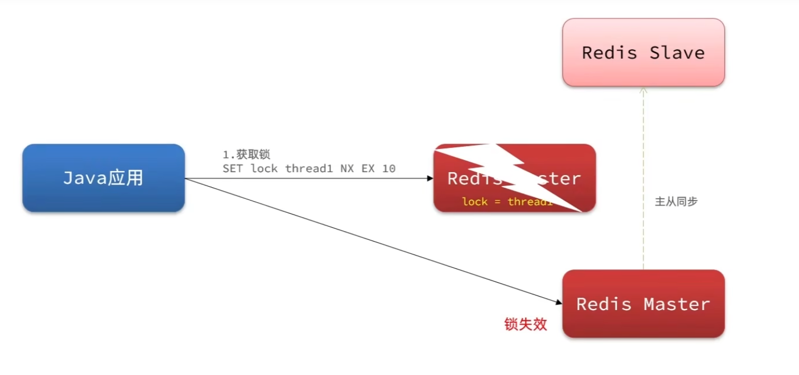
**解决方案：**
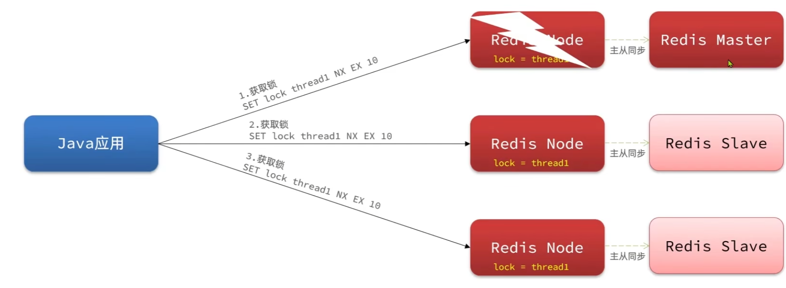


Redisson的multiLock：
多个独立Redis节点，必须在所有接地那都获取重入锁，才算获取锁陈工
缺点：运维成本高，实现复杂

## Redis优化秒杀

利用两个队列进行判断
一个队列进行判断该用户是否可以进行下单：
在Redis中进行判断，运用Lua脚本
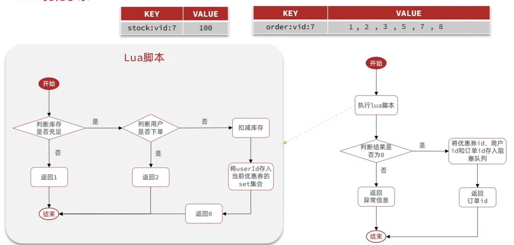
另一个队列：
读取第一个队列的信息，完成下单

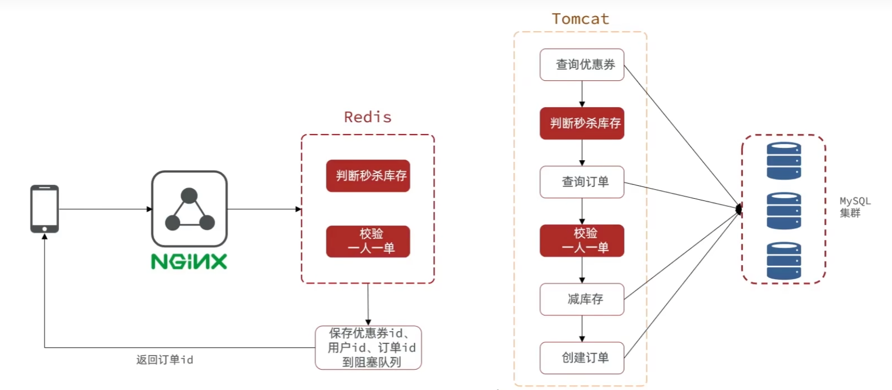
把同步写数据库的操作变成异步操作，缩短了秒杀业务流程，减轻数据库负担
需求：
1. 新增秒杀优惠券的同时，将优惠券信息保存到Redis中
2. 基于Lua脚本，判断秒杀库存、一人一单，决定用户是否抢购成功
3. 如果抢购成功，将优惠券id和用户id封装后存入阻塞队列
4. 开启线程任务，不断从阻塞队列中获取信息，实现异步下单功能

<font color = #b8860b>@PostConstruct</font>：在当前类初始化完毕以后执行

## 使用消息队列实现异步秒杀

消息队列（MessageQueue），字面意思就是存放消息的队列。最简单的消息队列模型包括3个角色：
- 消息队列：存储和管理消息，也被称为消息代理(MessageBroker)
- 生产者：发送消息到消息队列
- 消费者：从消息队列获取消息并处理消息

**Redis**提供了三种不同的方式来实现消息队列：
- list结构：基于List结构模拟消息队列
- PubSub：基本的点对点消息模型
- Stream：比较完善的消息队列模型
### list
优点：
利用Redis存储，不受限于JVM内存上限
基于Redis的持久化机制，数据安全性有保证
可以满足消息有序性
缺点：
无法避免消息丢失
只支持单消费者

### 基于PubSub

PubSub（发布订阅）是Redis2.0版本引l入的消息传递模型。顾名思义，消费者可以订阅一个或多个channel，生产者向对应channel发送消息后，所有订阅者都能收到相关消息。
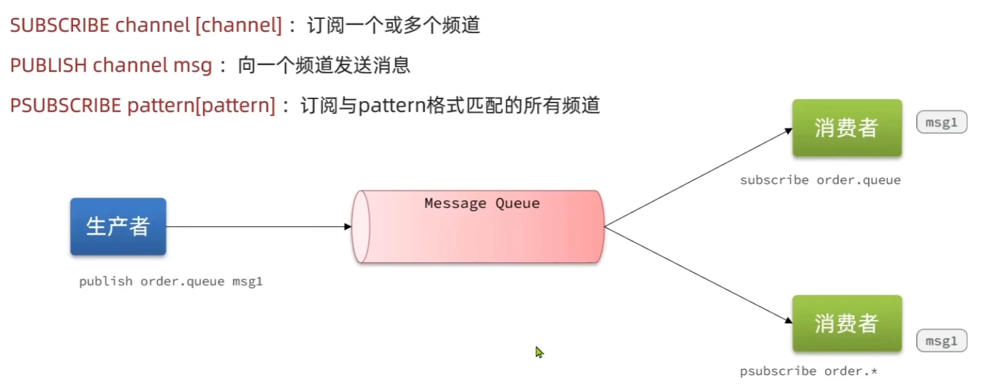

**优点：**
采用发布订阅模型，支持多生产、多消费
**缺点:**
不支持数据持久化
无法避免消息丢失
消息堆积有上限，超出时数据丢失

### Stream
Stream是redis5.0引入的一种新的数据类型，可以实现一个功能非常完美的消息队列
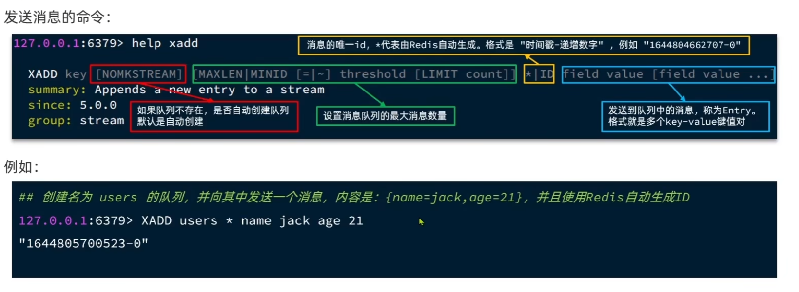

XREAD阻塞方式读取最新消息：
```bash
xread count 1 block 1000 streams user $
```
在业务开发中，我们可以循环的调用XREAD阻塞方式来查询最新消息，从而实现持续监听队列的效果，伪代码如下：

```java
while(true){
    // 尝试读取队列中的消息，最多阻塞两秒
    Object msg = redis.execute("Xread count 1 block 2000 streams users $");
  	if(msg == null){
        continue;
    }
    // 处理
    handleMessage(msg);
}
```
当我们指定起始工D为$时，代表读取最新的消息，如果我们处理一条消息的过程中，又有超过1条以上的消息到达队列，则下次获取时也只能获取到最新的一条，会出现漏读消息的问题。


STREAM类型消息队列的XREAD命令特点：
- 消息可回溯
- 一个消息可以被多个消费者读取
- 可以阻塞读取
- 有消息漏读的风险

### 基于Stream的消息队列-消费者组
**消费者组：**将多个消费者划分到一个组中，监听同一个队列。
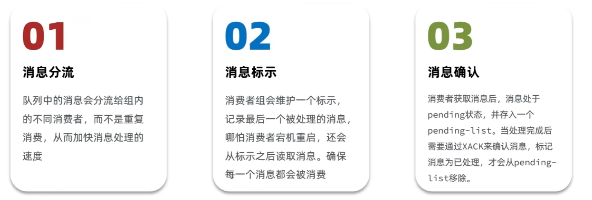
创建消费者组：
```bash
xgroup create key groupName ID [mkstream]
```
- key: 队列名称
- groupName: 消费者组名称
- ID: 起始ID标识，$代表队列中最后一个消息，0标识队列中第一个消息
- MKSTREAM: 队列不存在时自动创建队列

其他常见命令:
```bash
# 删除指定的消费者组
XGROUP destory key groupName
# 给指定的消费者组添加消费者
XGROUP CREATECONSUMER key groupname consumername
# 删除消费者组中的指定消费者
XGROUP DELCONSUMER key groupname consumername
```

从消费者组读取消息：


- group：消费组名称
- consumer：消费者名称，如果消费者不存在，会自动创建一个消费者
- ount：本次查询的最大数量
- BLOCKmilliseconds：当没有消息时最长等待时间
- NOACK：无需手动ACK，获取到消息后自动确认
- STREAMS key：指定队列名称
- ID：获取消息的起始ID：
  - ">"：从下一个未消费的消息开始
  - 其它：根据指定id从pending-list中获取已消费但未确认的消息，例如0，是从pending-list中的第一个消息开始


手动ACK确认命令
```bash
XACK key groupName ID 
```
- key: 队列名称
- groupName: 消费者组名称
- ID: 要确认的ID

 **Java实现代码：**

```java
while(true){
    // 尝试监听队列，使用阻塞模式，最长等待 2000 毫秒
    Object msg = redis.call("XREADGROUP GROUP g1 c1 COUNT 1 BLOCK 2000 STREAMS  s1 >");
    if(msg = null){ // null说明没有消息，继续下一次
        continue;
    }
    try{
        // 处理消息，完成后一定要ACK
        handleMessage(msg);
    }catch(Exception e){
        while(true){
            Object msg = redis.call("XREADGROUP GROUP g1 c1 COUNT 1 STREAMS  s1 0");
            if(msg == null){  // null 说明没有异常消息，所有的消息都已经确认，结束循环
                break;
            }
            try{
                //说明有异常消息，再次处理
                handleMessage(msg);
            }catch(Exception e){
                // 再次出现异常，记录日志，继续循环
                continue
            }
        }       
    }
}
```
STREAM类型消息队列的XREADGROUP命令特点：
- 消息可回溯
- 可以多消费者争抢消息，加快消费速度
- 可以阻塞读取
- 没有消息漏读的风险
- 有消息确认机制，保证消息至少被消费一次

|              | List                               | PubSub           | Stream                           |
| ------------ | ---------------------------------- | ---------------- | -------------------------------- |
| 消息持久化   | 支持                               | 不支持           | 支持                             |
| 阻塞读取     | 支持                               | 支持             | 支持                             |
| 消息堆积处理 | 受限内存空间，利用多消费者加快处理 | 受限消费者缓冲区 | 受限队列长度，用消费者组提高速度 |
| 消息确认机制 | 不支持                             | 不支持           | 支持                             |
| 消息回溯     | 不支持                             | 不支持           | 支持                             |


基于Stream作为消息队列，实现异步秒杀

# 好友关注
## 关注推送
关注推送也叫做Feed流，直译为投喂。为用户持续的提供“沉浸式”的体验，通过无限下拉刷新获取新的信息。
Feed流的实现有两种模式:
1. **Timeline：** 不做内容筛选，简单的按照内容发布时间排序，常用于好友或关注(B站关注的up，朋友圈等)
 - 优点：信息全面，不会有缺失，并且实现也相对简单
 - 缺点：信息噪音较多，用户不一定感兴趣，内容获取效率低
2. **智能排序：** 利用智能算法屏蔽掉违规的、用户不感兴趣的内容，推送用户感兴趣的信息来吸引用户
 - 优点：投喂用户感兴趣的信息，用户粘度很高，容易沉迷
 - 缺点：如果算法不精准，可能会起到反作用


本例中的个人页面是基于关注的好友来做Feed流，因此采用Timeline模式，实现方案有三种：
1. 拉模式
2. 推模式
3. 推拉结合

`拉模式：`也叫读扩散
该模式的核心含义是：当张三和李四、王五发了消息之后，都会保存到自己的发件箱中，如果赵六要读取消息，那么他会读取他自己的收件箱，此时系统会从他关注的人群中，将他关注人的信息全都进行拉取，然后进行排序
- 优点：比较节约空间，因为赵六在读取信息时，并没有重复读取，并且读取完之后，可以将他的收件箱清除


- 缺点：有延迟，当用户读取数据时，才会去关注的人的时发件箱中拉取信息，假设该用户关注了海量用户，那么此时就会拉取很多信息，对服务器压力巨大
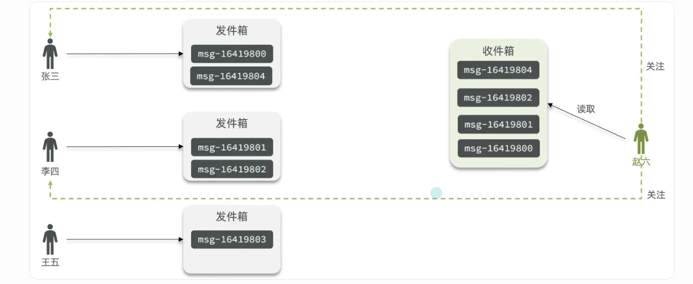

`推模式：`也叫写扩散
推模式是没有写邮箱的，当张三写了一个内容，此时会主动把张三写的内容发送到它粉丝的收件箱中，假设此时李四再来读取，就不用再去临时拉取了
- 优点：时效快，不用临时拉取
- 缺点：内存压力大，假设一个大V发了一个动态，很多人关注他，那么就会写很多份数据到粉丝那边去
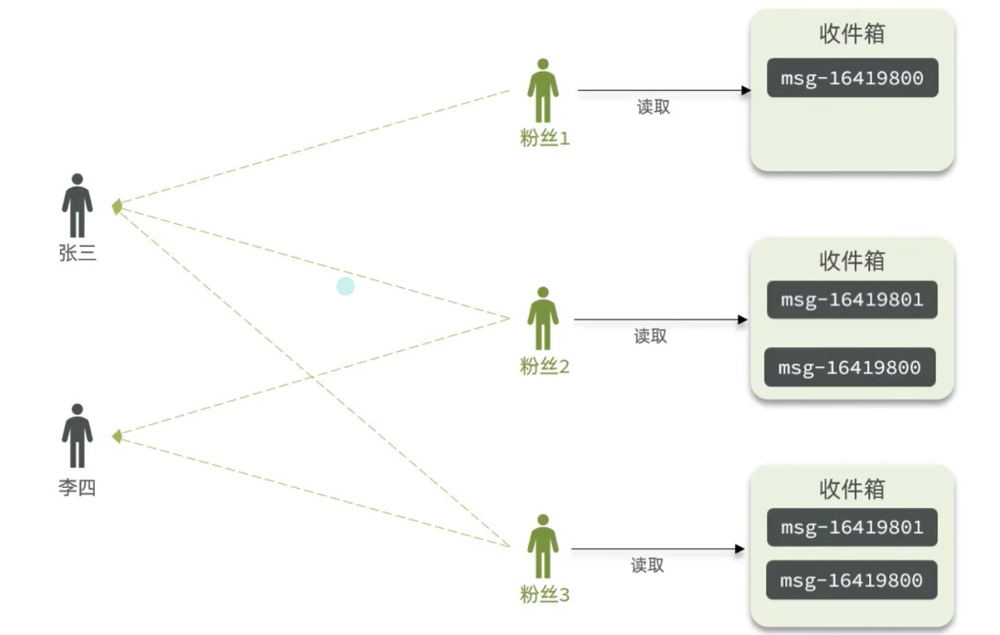

`推拉结合：` 也叫读写混合，兼具推和拉两种模式的优点

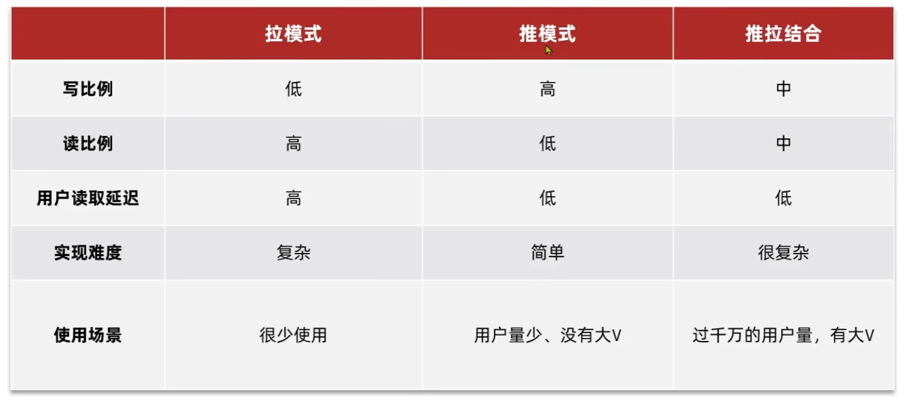

### 基于推模式实现关注推送功能

Feed流中的数据会不断更新，所以数据的交表也在变化，因此不能采用传统的分页模式
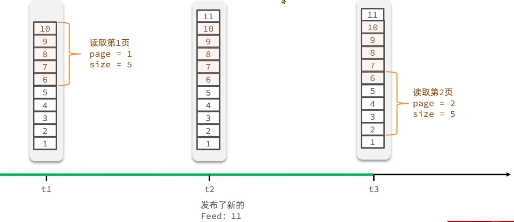
使用滚动分页
我们在这个地方可以使用SortedSet来做，使用时间戳来充当表中的1~10
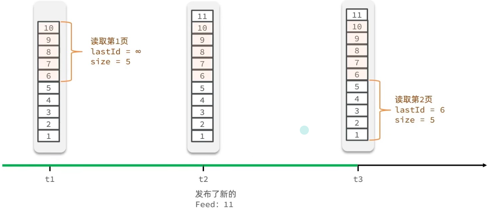


# GEO数据结构
GEO就是Geolocation的简写形式，代表地理坐标。Redis在3.2版本中加入了对GEO的支持，允许存储地理坐标信息，帮助我们根据经纬度来检索数据，常见的命令有

1. **GEOADD：** 添加一个地理空间信息，包含：经度（longitude）、纬度（latitude）、值（member）
```bash
GEOADD key longitude latitude member   [ longitude latitude member ]
```
返回值：添加到sorted set元素的数目，但不包括已更新score的元素
例子
```bash
GEOADD china 13.361389 38.115556 "shanghai" 15.087269 37.502669 "beijing"
```

2. **GEODIST：** 计算指定的两个点之间的距离并返回
```bash
GEODIST key member1 member2 [m|km|ft|mi]
```
如果两个位置之间的其中⼀个不存在， 那么命令返回空值。
指定单位的参数 unit 必须是以下单位的其中⼀个：
- m 表示单位为米。
- km 表示单位为千米。
- mi 表示单位为英⾥。
- ft 表示单位为英尺。

如果用户没有显式地指定单位参数， 那么 GEODIST 默认使用米作为单位。
```bash
GEODIST china beijing shanghai km
```

3. **GEOHASH：** 将指定member的坐标转化为hash字符串形式并返回
```bash
GEOHASH key member [member …]
```
```bash
云服务器:0>GEOHASH china beijing shanghai
1) "sqdtr74hyu0"
2) "sqc8b49rny0"
```

4. **GEOPOS：** 返回指定member的坐标
格式：
```bash
GEOPOS key member [member …]
```
```bash
云服务器:0>geopos china beijing shanghai
1)  1) "15.08726745843887329"
    2) "37.50266842333162032"

2)  1) "13.36138933897018433"
    2) "38.11555639549629859"
```

5. **GEOGADIUS：** 指定圆心、半径，找到该园内包含的所有member，并按照与圆心之间的距离排序后返回，6.2之后已废弃
6. **GEOSEARCH：** 在指定范围内搜索member，并按照与制定点之间的距离排序后返回，范围可以使圆形或矩形，6.2的新功能
```bash
geosearch china FROMLONLAT 15 37 BYRADIUS 200 km ASC WITHCOORD WITHDIST
```


5. **GEOSEARCHSTORE：** 与GEOSEARCH功能一致，不过可以把结果存储到一个指定的key，也是6.2的新功能

# 签到
## BitMap用法
- 我们可以使用二进制位来记录每个月的签到情况，签到记录为1，未签到记录为0

- 把每一个bit位对应当月的每一天，形成映射关系，用0和1标识业务状态，这种思路就成为**位图**（BitMap）。这样我们就能用极小的空间，来实现大量数据的表示

- Redis中是利用String类型数据结构实现BitMap，因此最大上限是512M，转换为bit则是2^32个bit位


BitMap的操作命令有:

- **SETBIT：** 向指定位置（offset）存入一个0或1
- **GETBIT：** 获取指定位置（offset）的bit值
- BITCOUNT：统计BitMap中值为1的bit位的数- 量
- **BITFIELD**：操作（查询、修改、自增）BitMap- 中bit数组中的指定位置（offset）的值
```java
 stringRedisTemplate.opsForValue()
        .bitField(key, BitFieldSubCommands.create()
        .get(BitFieldSubCommands.BitFieldType.unsigned(daysInMonth))
        .valueAt(0));
```
获取的是一个集合，因为有可能有很多操作get, set

- **BITFIELD_RO：** 获取BitMap中bit数组，并以- 十进制形式返回
- **BITOP：** 将多个BitMap的结果做位运算（与、- 或、异或）
- **BITPOS：** 查找bit数组中指定范围内第一个0或1出现的位置

# UV统计

**HyperLogLog**
**UV：** 全称Unique Visitor，也叫独立访客量，是指通过互联网访问、浏览这个网页的自然人。1天内同一个用户多次访问该网站，只记录1次。
**PV：** 全称Page View，也叫页面访问量或点击量，用户每访问网站的一个页面，记录1次PV，用户多次打开页面，则记录多次PV。往往用来衡量网站的流量。

- UV统计在服务端做会比较麻烦，因为要判断该用户是否已经统计过了，需要将统计过的用户信息保存。但是如果每个访问的用户都保存到Redis中，数据量会非常恐怖。


- HyperLogLog(HLL)是从Loglog算法派生的概率算法，用户确定非常大的集合基数，而不需要存储其所有值，算法相关原理可以参考下面这篇文章：https://juejin.cn/post/6844903785744056333#heading-0
- Redis中的HLL是基于string结构实现的，单个HLL的内存`永远小于16kb`，`内存占用低`的令人发指！作为代价，其测量结果是概率性的，`有小于0.81％的误差`。不过对于UV统计来说，这完全可以忽略

方法一共就有三个

```bash
PFADD key element [element...]
summary: Adds the specified elements to the specified HyperLogLog

PFCOUNT key [key ...]
Return the approximated cardinality of the set(s) observed by the HyperLogLog at key(s).

PFMERGE destkey sourcekey [sourcekey ...]
lnternal commands for debugging HyperLogLog values
```

