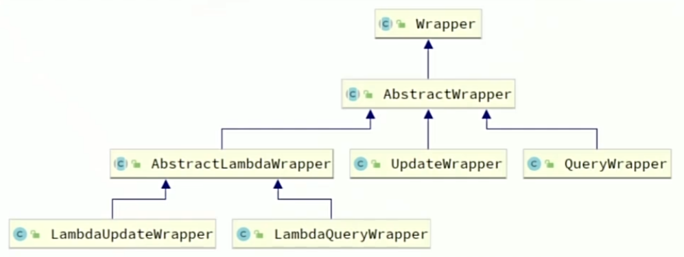
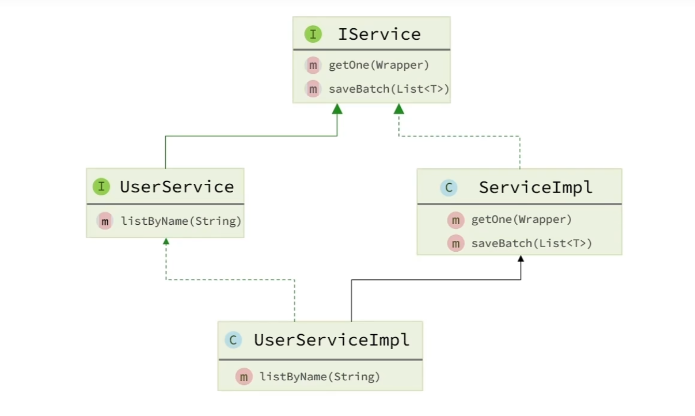
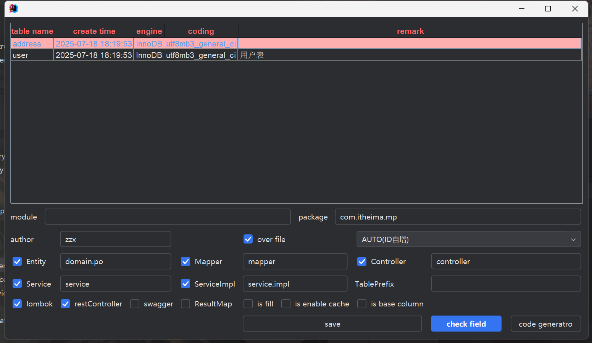

# MybatisPlus使用
## 如何使用
1. 引入依赖
```xml
<!--<dependency>
    <groupId>org.mybatis.spring.boot</groupId>
    <artifactId>mybatis-spring-boot-starter</artifactId>
    <version>2.3.1</version>
</dependency>-->
<dependency>
    <groupId>com.baomidou</groupId>
    <artifactId>mybatis-plus</artifactId>
    <version>3.5.3.1</version>
</dependency>
```
使用mybatisplus依赖时，就不用引入mybatis依赖了

2. 将**Mapper**类继承**BaseMapper<表结构实体类>**
```java
public interface UserMapper extends BaseMapper<User> {

}

```

然后就可以直接使用了


## 常见注解
MybatisPlus通过扫描实体类，并基于反射获取实体类信息作为数据表信息
- 类名驼峰转下划线作为表名
- 名为id的字段作为主键
- 变量名驼峰转下划线作为表的字段名


### @TableName
用来指定表名
说明：
>- 描述：表名注解，标识实体类对应的表
>- 使用位置：实体类


示例
```java
@TableName("user")
public class User {
    private Long id;
    private String name;
}
```

### @TableId
用来指定表中的主键字段信息
说明：
>- 描述：主键注解，标识实体类中的主键字段
>- 使用位置：实体类的主键字段

```java
@TableName("user")
public class User {
    @TableId(value = "id" ,type = idType.Auto)
    private Long id;
    private String name;
}
```

`TableId`注解支持两个属性：

| **属性** | **类型** | **必须指定** | **默认值**  | **描述**     |
| :------- | :------- | :----------- | :---------- | :----------- |
| value    | String   | 否           | ""          | 表名         |
| type     | Enum     | 否           | IdType.NONE | 指定主键类型 |

`IdType`支持的类型有：

| **值**        | **描述**                                                     |
| :------------ | :----------------------------------------------------------- |
| AUTO          | 数据库 ID 自增                                               |
| NONE          | 无状态，该类型为未设置主键类型（注解里等于跟随全局，全局里约等于 INPUT） |
| INPUT         | insert 前自行 set 主键值                                     |
| ASSIGN_ID     | 分配 ID(主键类型为 Number(Long 和 Integer)或 String)(since 3.3.0),使用接口IdentifierGenerator的方法nextId(默认实现类为DefaultIdentifierGenerator雪花算法) |
| ASSIGN_UUID   | 分配 UUID,主键类型为 String(since 3.3.0),使用接口IdentifierGenerator的方法nextUUID(默认 default 方法) |
| ID_WORKER     | 分布式全局唯一 ID 长整型类型(please use ASSIGN_ID)           |
| UUID          | 32 位 UUID 字符串(please use ASSIGN_UUID)                    |
| ID_WORKER_STR | 分布式全局唯一 ID 字符串类型(please use ASSIGN_ID)           |

这里比较常见的有三种：

- `AUTO`：利用数据库的id自增长
- `INPUT`：手动生成id
- `ASSIGN_ID`：雪花算法生成`Long`类型的全局唯一id，这是默认的ID策略

### @TableFiled

用来指定表中普通字段信息

说明：

> 描述：普通字段注解

示例：

```Java
@TableName("user")
public class User {
    @TableId
    private Long id;
    
    @TableField("username")
    private String name;
    
    @TableField("is_married")
    private Boolean isMarried; // is开头
    
    @TableField("`order`")
    private Integer order; // 数据库关键字，需要转移
    
                
    @TableField(exist = false)
    private String address; // 不是数据库字段
}
```

一般情况下我们并不需要给字段添加`@TableField`注解，一些特殊情况除外：

- 成员变量名与数据库字段名不一致
- 成员变量是以**isXXX**命名，按照`JavaBean`的规范，`MybatisPlus`识别字段时会把`is`去除，这就导致与数据库不符。
- 成员变量名与数据库一致，但是与数据库的关键字冲突。使用`@TableField`注解给字段名添加转义字符：````
- 不是数据库字段

## 常用配置

mp几乎不用自己配置，他都有默认值 ，只需要配置别名扫描包即可
他的配置项继承了Mybatis原生配置和自己特有的配置

```yaml
mybatis-plus:
    type-aliases-package:com.itheima.mp.domain.po    # 别名扫描包
    mapper-locations: "classpath*:/mapper/**/*.xml"   # Mapper.xml文件地址,默认值
    configuration:
    	map-underscore-to-camel-case:true#是否开启下划线和驼峰的映射
    	cache-enabled:false    # 是否开启二级缓存
    global-config:
        db-config:
            id-type:assign_id    # id为雪花算法生成
            update-strategy:not_null   #  更新策略：只更新非空字段

```


MybatisPlus使用基本流程：

1. 引入起步依赖
2. 自定义Mapper基础BaseMapper
3. 在实体类上添加注解申明 表信息
4. 在application.yaml中根据需要添加配置

# 核心功能

## 条件构造器（wrapper）

MP自持各种复杂的where条件，可以满足日常开发的所有需求

- gt():大于(>)
- ge():大于等于(>=)
- lt():小于(<)
- lte():小于等于(<=)
- between():between ? and ?

wrapper即为条件



### QueryWrapper

```java
    @Test
    void testQueryWrapper() {
        QueryWrapper<User> queryWrapper = new QueryWrapper<User>()
                .select("id", "username", "info", "balance")
                .like("username", "o")
                .ge("balance", 1000);
        List<User> users = userMapper.selectList(queryWrapper);
        users.forEach(System.out::println);
    }
```

**UpdateByQueryWrapper**

```java
    @Test
    void testUpdateByQueryWrapper() {
        // 1.要更新的数据
        User user = new User();
        user.setBalance(2000);
        // 2.更新的条件
        QueryWrapper<User> wrapper = new QueryWrapper<User>().eq("username", "jack");
        // 3.执行更新
        userMapper.update(user, wrapper);
    }
```

### UpdateWrapper

```java
    @Test
    void testUpdateWrapper() {
        List<Long> ids = List.of(1L, 2L, 3L);
        UpdateWrapper<User> wrapper = new UpdateWrapper<User>()
                .setSql("balance = balance - 200")
                .in("id", ids);
        userMapper.update(null, wrapper);
    }
```

### LambdaQueryWrapper

简化了QueryWrapper的开发，避免硬编码

```java
    @Test
    void testLambdaQueryWrapper() {
        LambdaQueryWrapper<User> queryWrapper = new LambdaQueryWrapper<User>()
                .select(User::getId, User::getUsername, User::getInfo, User::getBalance)
                .like(User::getUsername, "o")
                .ge(User::getBalance, 1000);
        List<User> users = userMapper.selectList(queryWrapper);
        users.forEach(System.out::println);
    }
```

## 自定义SQL

可以利用MybatisPlus的wrapper来构建复杂的where条件，然后自己定义SQL语句中剩下的部分

1. 基于wrapper构建where条件

```java
    @Test
    void updateBalanceByIds() {
        List<Long> ids = List.of(1L, 2L, 3L);
        int amount = 200;
        // 构造条件
        LambdaQueryWrapper<User> wrapper = new LambdaQueryWrapper<User>().in(User::getId, ids);
        // 自定义SQL方法调用
        userMapper.updateBalanceByIds(wrapper,amount);
    }
```

2. 在mapper方法中用**@param**注解声明wrapper变量名称，必须是**ew**


3. 自定义SQL，并使用wrapper条件

```java
    @Update("update user set balance = balance - #{amount} ${ew.customSqlSegment}")
    void updateBalanceByIds(@Param("ew") LambdaQueryWrapper<User> wrapper, int amount);
```

## IService接口

接口名为：**IService**


让自己的接口继承IService，自己的实现类继承ServiceImpl

如：

IUserService：

```java
public interface IUserService extends IService<User> {
    
}
```

UserServiceImpl

```java
@Service
public class UserServiceImpl extends ServiceImpl<UserMapper, User>  implements IUserService {

}
```
用法：

```java
    @Test
    void testSelectById() {
        User user = userService.getById(5L);
        System.out.println("user = " + user);
    }
```


## 动态SQL

### IService的Lambda查询

```java
@Override
public List<User> queryUser(UserQuery query) {
    List<User> userList = lambdaQuery()
            .like(query.getName() != null, User::getUsername, query.getName())
            .eq(query.getStatus() != null, User::getStatus, query.getStatus())
            .ge(query.getMinBalance() != null, User::getBalance, query.getMinBalance())
            .le(query.getMaxBalance() != null, User::getBalance, query.getMaxBalance())
            .list();
    return userList;
}
```

### IService的Lambda修改

```java
lambdaUpdate()
    .set(User::getBalance, user.getBalance() - balance)
    .set(user.getBalance() == 0, User::getStatus, 2)
    .eq(User::getId, id)
    .eq(User::getBalance, user.getBalance())
    .update();
```

### IService的批处理

在yaml中添加rewriteBatchedStatements=ture参数

```yaml
spring:
  datasource:
    url: jdbc:mysql://127.0.0.1:3306/mp?useUnicode=true&characterEncoding=UTF-8&autoReconnect=true&serverTimezone=Asia/Shanghai&rewriteBatchedStatements=ture
```

# 扩展功能

## 代码生成器

在idea插件下载MybatisPlus，图标为初音未来

在工具栏中，先点config Database，然后点code Generator,选择要生成的表


## DB静态工具

如果在开发业务中，出现Server之间相互调用，则会有循环依赖，这时可以用DB静态工具

该工具在mp较新的版本中才有，旧版本没有

例如：

```java
@Override
public UserVO queryUserAndAddressById(Long id) {
    // 先查询用户
    User user = getById(id);
    if (user == null || user.getStatus() == 2) {
        throw new RuntimeException("用户状态异常");
    }
    // 使用DB查询住址
    List<Address> addreddes = Db.lambdaQuery(Address.class)
            .eq(Address::getUserId, id)
            .list();
    // 封装返回
    UserVO userVO = BeanUtil.copyProperties(user, UserVO.class);
    if (CollUtil.isNotEmpty(addreddes)) {
        List<AddressVO> addressVOS = BeanUtil.copyToList(addreddes, AddressVO.class);
        userVO.setAddresses(addressVOS);
    }
    return userVO;
}
```

## 逻辑删除

逻辑删除就是基于代码逻辑模拟删除效果，但并不会真正删除数据。思路如下：

- 在表中添加一个字段标记数据是否被删除
- 当删除数据时把标记置为1
- 查询时只查询标记为0的数据

MybatisPlus提供了逻辑删除功能，无需改变方法调用的方式，而是在底层帮我们自动修改CRUD的语句。我们要做的就是在application.yaml文件中配置逻辑删除的字段名称和值即可：

```yaml
mybatis-plus:
    global-config:
        db-config:
            logic-delete-field：flag     #全局逻辑删除的实体字段名，字段类型可以是boolean、integer
            logic-delete-value：1        #逻辑已删除值(默认为1)
            logic-not-delete-value：0    #逻辑未删除值(默认为0)
```


逻辑删除本身也有自己的问题，比如：

- 会导致数据库表垃圾数据越来越多，影响查询效率
- SQL中全都需要对逻辑删除字段做判断，影响查询效率

因此，我不太推荐采用逻辑删除功能，如果数据不能删除，可以采用把数据迁移到其它表的办法。

## 枚举处理器

如果一个字段，用数字表示多种状态，则可以使用枚举处理

1. 给枚举中与数据库对应的Value值添加@EnumValue注解

```java
@Getter
public enum UserStatus {
    NORMAL(1, "正常"),
    FORZEN(2, "冻结"),
    ;

    @EnumValue
    private final int value;
    @JsonValue
    private final String desc;

    UserStatus(int value, String desc) {
        this.value = value;
        this.desc = desc;
    }
}
```

2. 在配置文件中配置统一的枚举处理器，实现类型转换

```yaml
mybatis-plus:
  configuration:
    default-enum-type-handler: com.baomidou.mybatisplus.core.handlers.MybatisEnumTypeHandler
```


3. 然后修改实体类的属性类型

默认是返回枚举项名字，可以把@jsonValue加在属性上面，告诉MVC返回谁

## JSON处理器

如果在数据库表中的一个json类型的字段，需要用JSON转换器

Jackson,FastJson

使用mp的JSON转换方法：

1. 给字段上定义这样的处理器
2. 开启自动返回值

```java
@Data
@TableName(value = "user",autoResultMap = true)
public class User {
	/**
     * 详细信息
     */
    @TableField(typeHandler = JacksonTypeHandler.class)
    private UserInfo info;
    
}
```

# 插件功能

## 分页插件

### 配置分页插件

首先，要在配置类注册MP的核心插件，同时添加分页插件

创建一个配置类

```java
@Configuration
public class MybatisConfig {

    @Bean
    public MybatisPlusInterceptor mybatisPlusInterceptor() {
        // 初始化核心插件
        MybatisPlusInterceptor mybatisPlusInterceptor = new MybatisPlusInterceptor();
        // 创建分页插件
        PaginationInnerInterceptor paginationInnerInterceptor = new PaginationInnerInterceptor(DbType.MYSQL);
        paginationInnerInterceptor.setMaxLimit(1000L);

        // 添加分页插件
        mybatisPlusInterceptor.addInnerInterceptor(paginationInnerInterceptor);
        return mybatisPlusInterceptor;
    }
}
```

### 分页API

```Java
    @Test
    void testPageQuery() {
        int pageNo = 1;
        int pageSize = 2;
        // 1.1分页条件
        Page<User> page = new Page<>(pageNo, pageSize);
        // 1.2 排序规则
        page.addOrder(new OrderItem("balance",true));
        page.addOrder(new OrderItem("id",true));

        // 2.分页查询
        Page<User> p = userService.page(page);

        // 3.解析
        // 总条数
        long total = p.getTotal();
        // 总页数
        long pages = p.getPages();
        // 数据
        List<User> users = p.getRecords();

        System.out.println(total+" " + pages);
        users.forEach(System.out::println);
    }
```

## 通用分页实体

定义分页实体类，直接继承通用分页实体,然后直接查询

```java
// 分页条件
Page<User> page = new Page<>(query.getPageNo(), query.getPageSize());
// 查询
Page<User> p = lambdaQuery()
        .like(query.getName() != null, User::getUsername, query.getName())
        .eq(query.getStatus() != null, User::getStatus, query.getStatus())
        .page(page);
```

