# Spring
## 需要导入的XML
```xml
<dependency>
    <groupId>com.alibaba</groupId>
    <artifactId>druid</artifactId>
    <version>1.1.16</version>
</dependency>

<dependency>
    <groupId>org.mybatis</groupId>
    <artifactId>mybatis</artifactId>
    <version>3.5.6</version>
</dependency>

<dependency>
    <groupId>mysql</groupId>
    <artifactId>mysql-connector-java</artifactId>
    <version>5.1.46</version>
</dependency>

<dependency>
    <groupId>org.springframework</groupId>
    <artifactId>spring-jdbc</artifactId>
    <version>5.2.10.RELEASE</version>
</dependency>

<dependency>
    <groupId>org.mybatis</groupId>
    <artifactId>mybatis-spring</artifactId>
    <version>1.3.0</version>
</dependency>

```

## IOC
控制反转：使用对象时，由主动new产生对象转换为有外部提供对象，此过程中对象的创建控制权由程序转移到外部，这种思想叫做控制反转

## bean
实例化bean三种方法
- 构造方法（常用 ）
- 静态工厂（了解）
- 实例工厂（了解）
  - FactoryBean


## 依赖注入方式
依赖注入方式:
- setter注入
  - 简单类型
  - 引用类型
- 构造器注入
  - 简单类型
  - 引用类型

自己开发的模块推荐使用setter

## 依赖自动装配
IOC容器根据bean所依赖的资源在容器中自动查找并注入到bean中的过程称为自动装配
按名称装配

## 加载properties文件
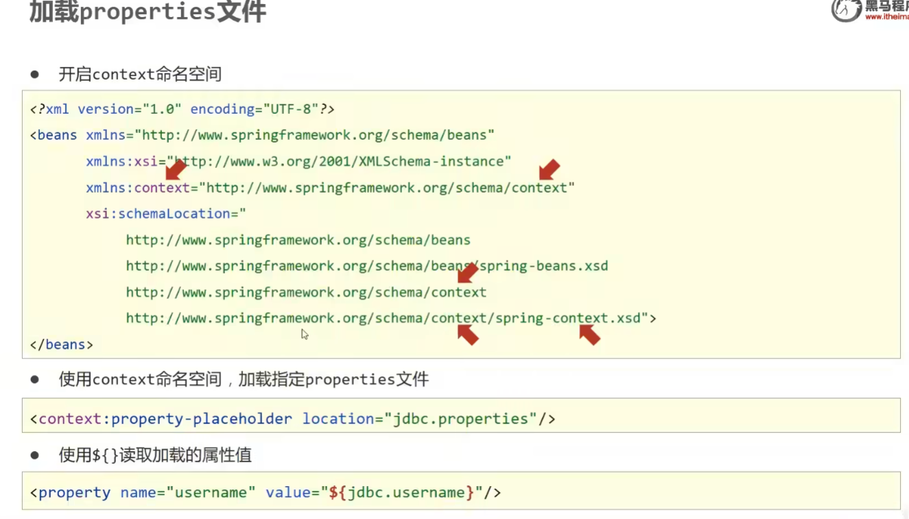
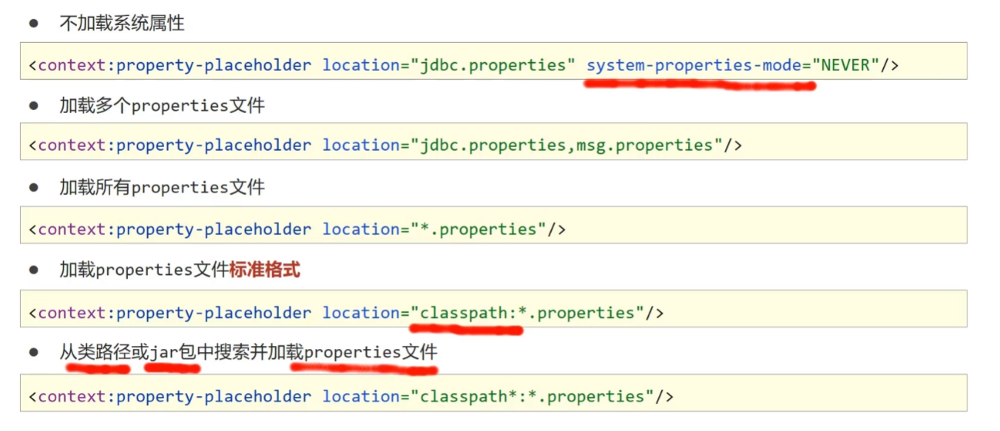

## 容器
创建容器：
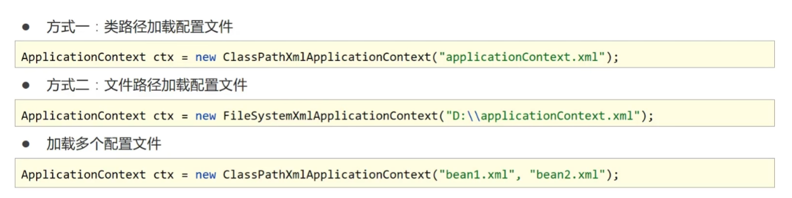
获取bean
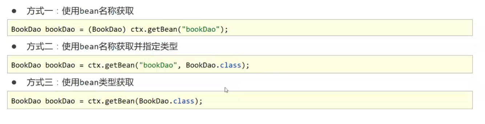

- BeanFactory是IoC容器的顶层接口，初始化BeanFactory对象时，加载的bean延迟加载
- ApplicationContext接口是Spring容器的核心接口，初始化时bean立即加载
- ApplicationContext接口提供基础的bean操作相关方法，通过其他接口扩展其功能
- ApplicationContext接口常用初始化类
  - ClassPathXmlApplicationContext
  - FileSystemXmlApplicationContext


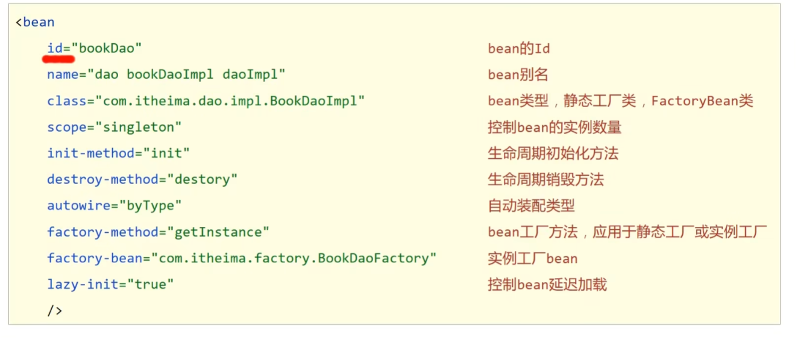

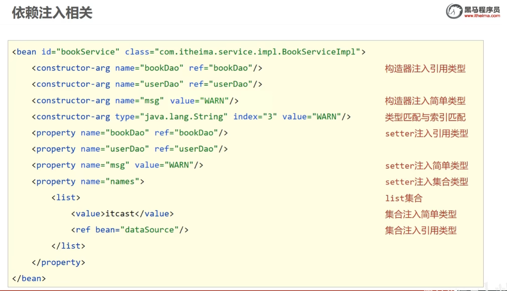

## bean的作用范围
使用<font color = #b8860b> @Scope</font>定义bean的作用范围
<font color = #b8860b> @Scope</font>("")
singleton:单例
prototype:非单例
<font color = #b8860b> @PostConstruct</font>:初始化
<font color = #b8860b> @PreDestroy</font>:销毁，需要关闭钩子
## 依赖注入

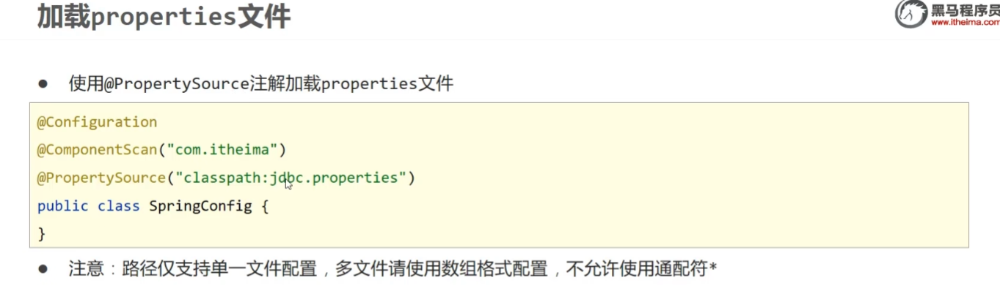

自动装配
<font color = #b8860b> @Value：</font>
注入简单类型，用${配置文件中的key}

## 第三方bean
使用@Import({JdbcConfig.class})导入需要的配置
或者使用@ComponentScan("com.itheima")生命要扫描的包

- 简单类型依赖注入
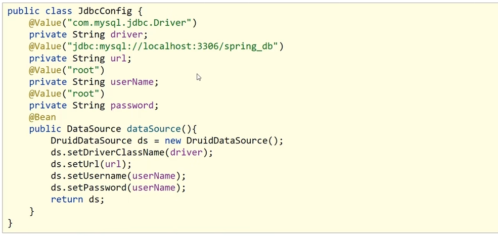

- 引用类型依赖注入
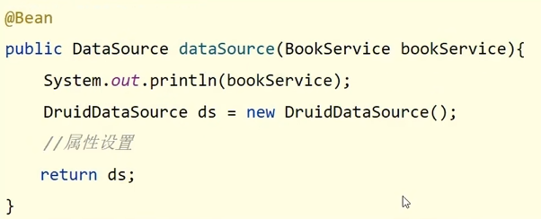
引用类型只需要为bean定义方法设置形参即可，容器会根据类型自动装配对象

## 注解总结
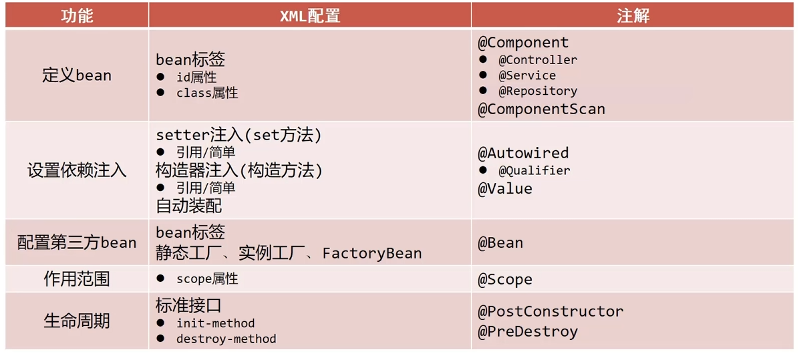

## Spring整合Mybatis

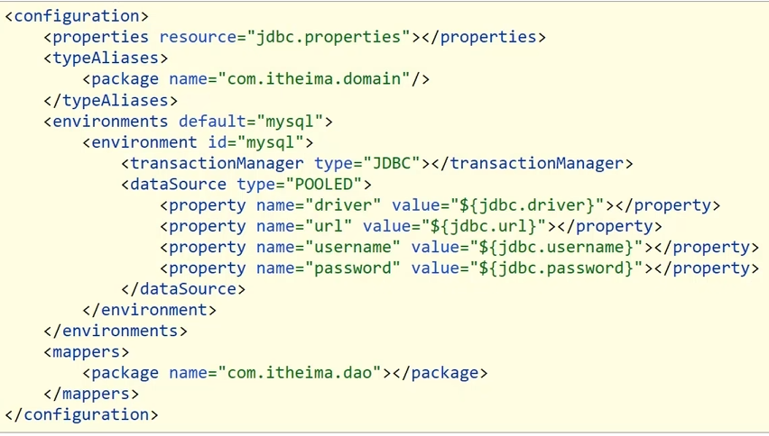
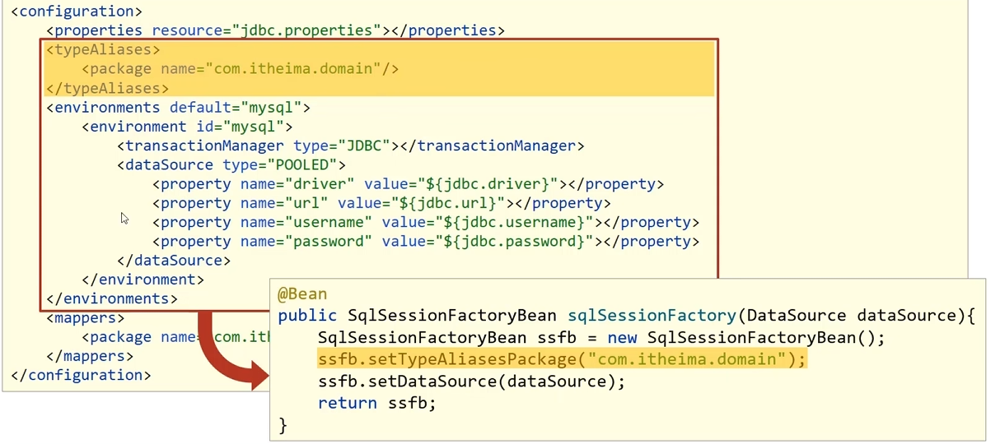
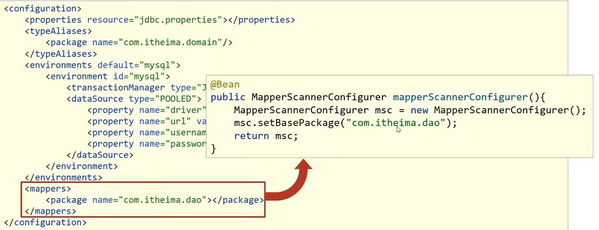
## 整合JUnit
只需要在测试类
```java
@RunWith(SpringJUnit4ClassRunner.class)
@ContextConfiguration(classes = SpringConfig.class)
public class AccountServiceTest {

    @Autowired
    private  AccountService accountService;

    @Test
    public void testFindById(){
        System.out.println(accountService.findById(1));
    }

}
```
## AOP
AOP:面向切面编程，一种编程范式
oop:面向对象编程


作用：在不惊动原始设计的基础上为其进行功能增强

**无侵入式编程**

- **连接点(JoinPoint)**：程序执行过程中的任意位置，粒度为执行方法、抛出异常、设置变量等
   - 在SpringAOP中，理解为方法的执行
- **切入点(Pointcut)**：匹配连接点的式子
  - 在SpringAOP中，一个切入点可以只描述一个具体方法，也可以匹配多个方法
  - **一个具体方法**：com.zzx.dao包下的BookDao接口中的无形参无返回值的保存方法
  匹配多个方法:所有的保存方法，所有的获取开头的方法，所有以DAO结尾的接口中的任意方法，所有带有一个参数的方法
- **通知(Advice)**：在切入点处执行的操作，也就是共性功能
  - 在SpringAOP中，功能最终以方法的形式呈现
- **通知类**:定义通知的类
- **切面(aspect)**：描述通知与切入点的对应关系

**1. 步骤一**：添加依赖
因为spring-context中已经导入了spring-aop,所以不需要再单独导入spring-aop
导入AspectJ的jar包,AspectJ是AOP思想的一个具体实现，Spring有自己的AOP实现，但是相比于AspectJ来说比较麻烦，所以我们直接采用Spring整合ApsectJ的方式进行AOP开发。

**2. 步骤二**：定义接口和实现类

**3. 步骤三**：定义通知类和通知
通知就是将共性功能抽取出来后形成的方法，共性功能指的就是当前系统时间的打印。
类名和方法名没有要求，可以任意。

**4. 步骤四**：定义切入点
切入点定义依托一个不具有实际意义的方法进行，即无参数、无返回值、方法体无实际逻辑。
execution及后面编写的内容，之后我们会专门去学习。

**5. 步骤五**：制作切面
切面是用来描述通知和切入点之间的关系，如何进行关系的绑定?
绑定切入点与通知关系，并指定通知添加到原始连接点的具体执行位置

说明:@Before翻译过来是之前，也就是说通知会在切入点方法执行之前执行，除此之前还有其他四种类型，后面会讲。
那这里就会在执行update()之前，来执行我们的method()，输出当前毫秒值

**6. 步骤六**：将通知类配给容器并标识其为切面类

**7. 步骤七**：开启注解格式AOP功能
使用@EnableAspectJAutoProxy注解


名称	@EnableAspectJAutoProxy
类型	配置类注解
位置	配置类定义上方
作用	开启注解格式AOP功能

名称	@Aspect
类型	类注解
位置	切面类定义上方
作用	设置当前类为AOP切面类


名称	@Pointcut
类型	方法注解
位置	切入点方法定义上方
作用	设置切入点方法
属性	value（默认）：切入点表达式


名称	@Before
类型	方法注解
位置	通知方法定义上方
作用	设置当前通知方法与切入点之间的绑定关系，当前通知方法在原始切入点方法前运行

### AOP工作流程
1. 流程一：Spring容器启动
容器启动就需要去加载bean,哪些类需要被加载呢?
需要被增强的类，如:BookServiceImpl
通知类，如:MyAdvice
注意此时bean对象还没有创建成功
2. 流程二：读取所有切面配置中的切入点

有两个切入点的配置，但是第一个ptx()并没有被使用，所以不会被读取。

3. 流程三：初始化bean，判定bean对应的类中的方法是否匹配到任意切入点

注意第一步在容器启动的时候，bean对象还没有被创建成功。
要被实例化bean对象的类中的方法和切入点进行匹配

4. 流程四：获取bean执行方法
### AOP切入点表达式

要进行增强的方法的描述方式
```@Pointcut("execution(void com.blog.dao.impl.BookDaoImpl.update())")```

*描述方式一*：执行com.blog.dao包下的BookDao接口中的无参数update方法
``execution(void com.blog.dao.BookDao.update())``

*描述方式二*：执行com.blog.dao.impl包下的BookDaoImpl类中的无参数update方法
`execution(void com.blog.dao.impl.BookDaoImpl.update())`

因为调用接口方法的时候最终运行的还是其实现类的方法，所以上面两种描述方式都是可以的。

**对于切入点表达式的语法为:**

- 切入点表达式标准格式：动作关键字(访问修饰符 返回值 包名.类/接口名.方法名(参数) 异常名)


对于这个格式，我们不需要硬记，通过一个例子，理解它:
`execution(public User com.blog.service.UserService.findById(int))`
- **execution**：动作关键字，描述切入点的行为动作，例如execution表示执行到指定切入点
- **public**:访问修饰符,还可以是public，private等，可以省略
- **User**：返回值，写返回值类型
- **com.blog.service**：包名，多级包使用点连接
- **UserService**:类/接口名称
- **findById**：方法名
- **int**:参数，直接写参数的类型，多个类型用逗号隔开
异常名：方法定义中抛出指定异常，可以省略

*:单个独立的任意符号，可以独立出现，也可以作为前缀或者后缀的匹配符出现


对于切入点表达式的编写其实是很灵活的，那么在编写的时候，有没有什么好的技巧让我们用用:

- 所有代码按照标准规范开发，否则以下技巧全部失效
- 描述切入点通常描述接口，而不描述实现类,如果描述到实现类，就出现紧耦合了
- 访问控制修饰符针对接口开发均采用public描述（可省略访问控制修饰符描述）
- 返回值类型对于增删改类使用精准类型加速匹配，对于查询类使用*通配快速描述
- 包名书写尽量不使用..匹配，效率过低，常用*做单个包描述匹配，或精准匹配
- 接口名/类名书写名称与模块相关的采用*匹配，例如UserService书写成*Service，绑定业务层接口名
- 方法名书写以动词进行精准匹配，名词采用*匹配，例如getById书写成getBy*，selectAll书写成selectAll
- 参数规则较为复杂，根据业务方法灵活调整
- 通常不使用异常作为匹配规则

### AOP通知类型
1. 前置通知
2. 后置通知
3. 环绕通知(重点)
4. 返回后通知(了解)
5. 抛出异常后通知(了解)

```java
@Pointcut("execution(void com.zzx.dao.BookDao.*())")
private void pt() {

}

@Around("pt()")
public void around(ProceedingJoinPoint pjp) throwsThrowable {
    System.out.println("before..");
    pjp.proceed();
    System.out.println("after..");
}
```
在方法参数中添加ProceedingJoinPoint，同时在需要的位置使用proceed()调用原始操作

当原始方法中有返回值时,需要把返回值设置为Object，然后返回出去

---


知识点1：@After
名称	@After
类型	方法注解
位置	通知方法定义上方
作用	设置当前通知方法与切入点之间的绑定关系，当前通知方法在原始切入点方法后运行

---

知识点2：@AfterReturning

名称	@AfterReturning
类型	方法注解
位置	通知方法定义上方
作用	设置当前通知方法与切入点之间绑定关系，当前通知方法在原始切入点方法正常执行完毕后执行

---


知识点3：@AfterThrowing

名称	@AfterThrowing
类型	方法注解
位置	通知方法定义上方
作用	设置当前通知方法与切入点之间绑定关系，当前通知方法在原始切入点方法运行抛出异常后执行

---


知识点4：@Around

名称	@Around
类型	方法注解
位置	通知方法定义上方
作用	设置当前通知方法与切入点之间的绑定关系，当前通知方法在原始切入点方法前后运行

---


知识点5：@Before

名称	@Before
类型	方法注解
位置	通知方法定义上方
作用	设置当前通知方法与切入点之间的绑定关系，当前通知方法在原始切入点方法前运行

---
### aop获取数据

我们就可以在环绕通知中对原始方法的参数进行拦截过滤，避免由于参数的问题导致程序无法正确运行，还可以根据参数来给予不同的权限，提高代码的健壮性。
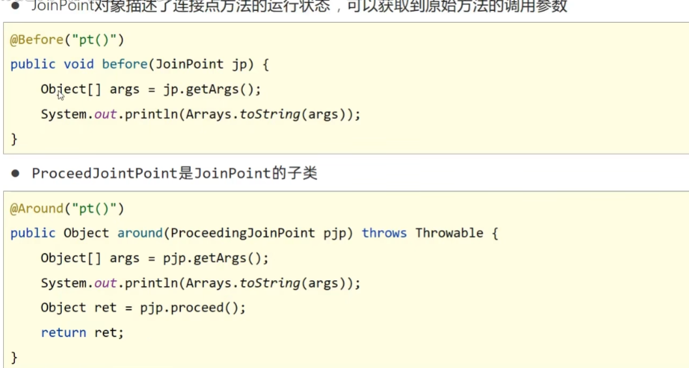


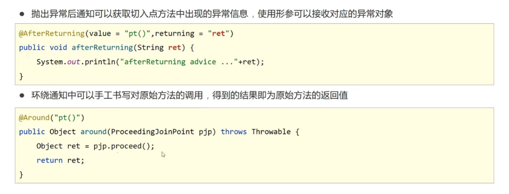

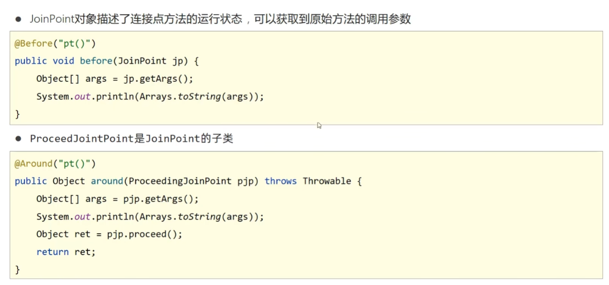
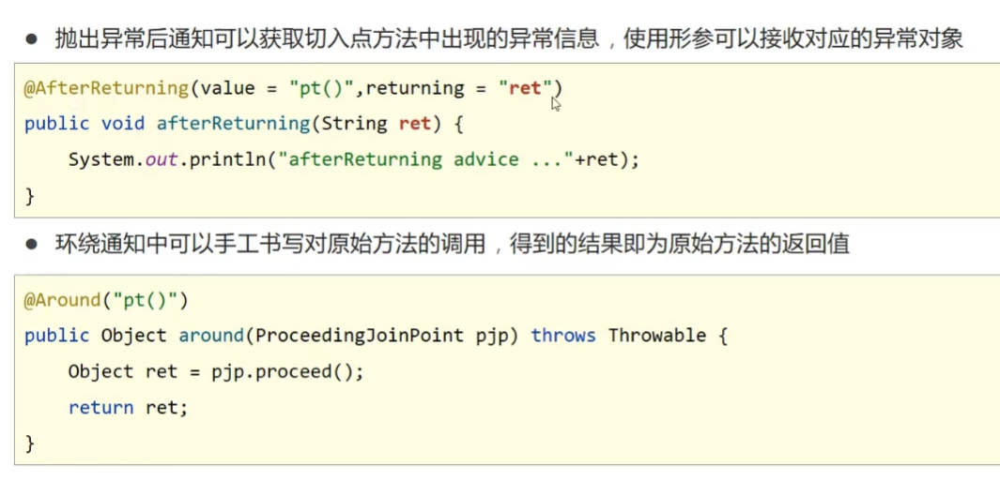

## 事务
作用：在数据层保障一系列的数据库操作同成功同失败
Spring事务作用，在数据层或者业务层保障一系列的数据库操作同成功同失败


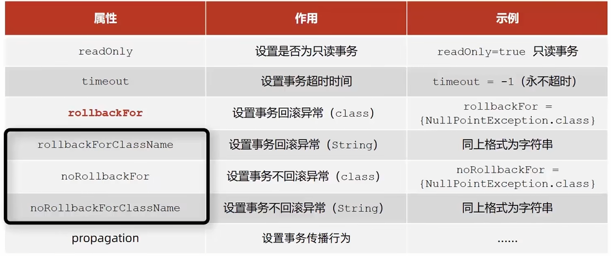


propagation属性，设置事务的传播行为
@Transactional(propagation = Propagation.REQUIRES_NEW)
开启一个新的事务

### spring事务失效的场景
1. 访问权限问题
spring要求被代理的方法必须是public
2. 方法使用final修饰
3. 方法内部调用
如：
```java
@Service
public class UserService {
 
    @Autowired
    private UserMapper userMapper;
 
  
    public void add(UserModel userModel) {
        userMapper.insertUser(userModel);
        updateStatus(userModel);
    }
 
    @Transactional
    public void updateStatus(UserModel userModel) {
        doSameThing();
    }
}
```
解决方法：
- 新加一个service方法，把 @Transactional 注解加到新 Service 方法上，把需要事务执行的代码移到新方法中。具体代码如下：
```java
@Service
public class ServiceA {
   @Autowired
   prvate ServiceB serviceB;
 
   public void save(User user) {
         queryData1();
         queryData2();
         serviceB.doSave(user);
   }
 }
 
@Service
public class ServiceB {

   @Transactional(rollbackFor=Exception.class)
   public void doSave(User user) {
      addData1();
      updateData2();
   }

}
```
- 在该 Service 类中注入自己
如果不想再新加一个 Service 类，在该 Service 类中注入自己也是一种选择。具体代码如下：
```java
@Service
public class ServiceA {
    @Autowired
    prvate ServiceA serviceA;
  
    public void save(User user) {
          queryData1();
          queryData2();
          serviceA.doSave(user);
    }
  
    @Transactional(rollbackFor=Exception.    class)
    public void doSave(User user) {
        addData1();
        updateData2();
    }
}
```
spring ioc 内部的三级缓存保证了它不会出现循环依赖问题。
- 通过 AopContent 类
  需要添加依赖

  在启动类上添加@EnableAspectJAutoProxy(exposeProxy = true)，暴露代理对象
```xml
<dependency>
    <groupId>org.aspectj</groupId>
    <artifactId>aspectjweaver</artifactId>
</dependency>

```
在该 Service 类中使用 AopContext.currentProxy() 获取代理对象。

上面的方法 2 确实可以解决问题，但是代码看起来并不直观，还可以通过在该 Service 类中使用 AOPProxy 获取代理对象，实现相同的功能。具体代码如下：
```java
@Service
public class ServiceA {
 
    public void save(User user) {
          queryData1();
          queryData2();
          ((ServiceA)AopContext.currentProxy ()).doSave(user);
    }
    
    @Transactional(rollbackFor=Exception.    class)
    public void doSave(User user) {
        addData1();
        updateData2();
    }
}  
```
4. 多线程调用


# SpringMVC

## JSON转换坐标
```xml
<dependency>
    <groupId>com.fasterxml.jackson.core</groupId>
    <artifactId>jackson-databind</artifactId>
    <version>2.9.0</version>
</dependency>
```

SpringMVC技术与Servlet技术功能等同，均属于web层开发技术

SpringMVC是一种基于Java实现MVC模型的轻量级web框架

优点：
- 使用简单，开发便捷
- 灵活性强
## 创建
一次性工作：
1. 创建工程，设置服务器，加载工程
2. 导入坐标
3. 创建web容器启动类，加载SpringMVC配置，并设置SpringMVC请求拦截路径
4. SpringMVC核心配置类（设置配置类，扫描controller包，加载Controller控制器bean）

多次工作：
1. 定义处理请求的控制器类
2. 定义处理请求的控制器方法，并配置映射路径（@RequestMapping）与返回json数据（@ResponseBody）


## 数据传输

使用@EnableWebMvc，在SpringMVC的配置类中开启SpringMVC的注解支持，这里面就包含了将JSON转换成对象的功能。

后台接收参数，参数前添加@RequestBody

**@RequestBody与@RequestParam区别**

区别
- **@RequestParam**用于接收url地址传参，表单传参【application/x-www-form-urlencoded】
- **@RequestBody**用于接收json数据【application/json】

应用
- 后期开发中，发送json格式数据为主，@RequestBody应用较广
- 如果发送非json格式数据，选用@RequestParam接收请求参数


**日期参数**
使用@DataTimeFormat注解完成日期参数格式转换

@DateTimeFormat(pattern = "yyyy-MM-dd") 
@DateTimeFormat(pattern ="yyyy/MM/dd HH:mm:ss") 


## 响应
因为异步调用是目前常用的主流方式，所以我们需要更关注的就是如何返回JSON数据，对于其他只需要认识了解即可

### 相应页面
直接返回page.jsp页面
```java
@Controller
public class UserController {
    @RequestMapping("/toJumpPage")
    //注意
    //1.此处不能添加@ResponseBody,如果加了该注入，会直接将page.jsp当字符串返回前端
    //2.方法需要返回String
    public String toJumpPage(){
        System.out.println("跳转页面");
        return "page.jsp";
    }
}
```
### 响应JSON数据（对象集合转JSON数组）

返回值为实体类对象，设置返回值为实体类类型，即可实现返回对应对象的json数据，需要依赖@ResponseBody注解和@EnableWebMvc注解


## @ResponseBody

- 该注解可以写在类上或者方法上
- 写在类上就是该类下的所有方法都有 **@ReponseBody**功能
- 当方法上有 **@ReponseBody**注解后
  - 方法的返回值为字符串，会将其作为文本内容直接响应给前端
  - 方法的返回值为对象，会将对象转换成JSON响应给前端
- 此处又使用到了类型转换，内部还是通过HttpMessageConverter接口完成的，所以Converter除了前面所说的功能外，它还可以实现:

对象转Json数据(POJO -> json)
集合转Json数据(Collection -> json)

## REST风格
访问网络资源的格式


@RequestParam用于接收url地址传参或表单传参
@RequestBody用于接收JSON数据
@PathVariable用于接收路径参数，使用{参数名称}描述路径参数

**区别**
- @RequestParam用于接收url地址传参或表单传参
- @RequestBody用于接收json数据
- @PathVariable用于接收路径参数，使用{参数名称}描述路径参数

**应用**
- 后期开发中，发送请求参数超过1个时，以json格式为主，@RequestBody应用较广
- 如果发送非json格式数据，选用@RequestParam接收请求参数
- 采用RESTful进行开发，当参数数量较少时，例如1个，可以采用@PathVariable接收请求路径变量，通常用于传递id值


# SSM整合

## 添加坐标

```xml
<dependencies>
    <dependency>
        <groupId>org.springframework</groupId>
        <artifactId>spring-webmvc</artifactId>
        <version>5.2.10.RELEASE</version>
    </dependency>

    <dependency>
        <groupId>org.springframework</groupId>
        <artifactId>spring-jdbc</artifactId>
        <version>5.2.10.RELEASE</version>
    </dependency>

    <dependency>
        <groupId>org.springframework</groupId>
        <artifactId>spring-test</artifactId>
        <version>5.2.10.RELEASE</version>
    </dependency>

    <dependency>
        <groupId>org.mybatis</groupId>
        <artifactId>mybatis</artifactId>
        <version>3.5.6</version>
    </dependency>

    <dependency>
        <groupId>org.mybatis</groupId>
        <artifactId>mybatis-spring</artifactId>
        <version>1.3.0</version>
    </dependency>

    <dependency>
        <groupId>mysql</groupId>
        <artifactId>mysql-connector-java</artifactId>
        <version>5.1.46</version>
    </dependency>

    <dependency>
        <groupId>com.alibaba</groupId>
        <artifactId>druid</artifactId>
        <version>1.1.16</version>
    </dependency>

    <dependency>
        <groupId>junit</groupId>
        <artifactId>junit</artifactId>
        <version>4.12</version>
        <scope>test</scope>
    </dependency>

    <dependency>
        <groupId>javax.servlet</groupId>
        <artifactId>javax.servlet-api</artifactId>
        <version>3.1.0</version>
        <scope>provided</scope>
    </dependency>

    <dependency>
        <groupId>com.fasterxml.jackson.core</groupId>
        <artifactId>jackson-databind</artifactId>
        <version>2.9.0</version>
    </dependency>
</dependencies>
<build>
  <finalName>demo3</finalName>
  <plugins>
    <plugin>
      <groupId>org.apache.tomcat.maven</groupId>
      <artifactId>tomcat7-maven-plugin</artifactId>
      <version>2.1</version>
      <configuration>
        <port>80</port>
        <path>/</path>
      </configuration>
    </plugin>
  </plugins>
</build>
```


## 异常
**@RestControllerAdvice**
声明处理异常的类

拦截并处理异常
```java
@RestControllerAdvice
public class ProjectExceptionAdvice {

    @ExceptionHandler(Exception.class)
    public Result doException(Exception ex){
        System.out.println("异常出现了");
        return new Result(12,null,"出现异常了");
    }

}
```


处理异常
定义异常码
在Service层处理异常


# 拦截器
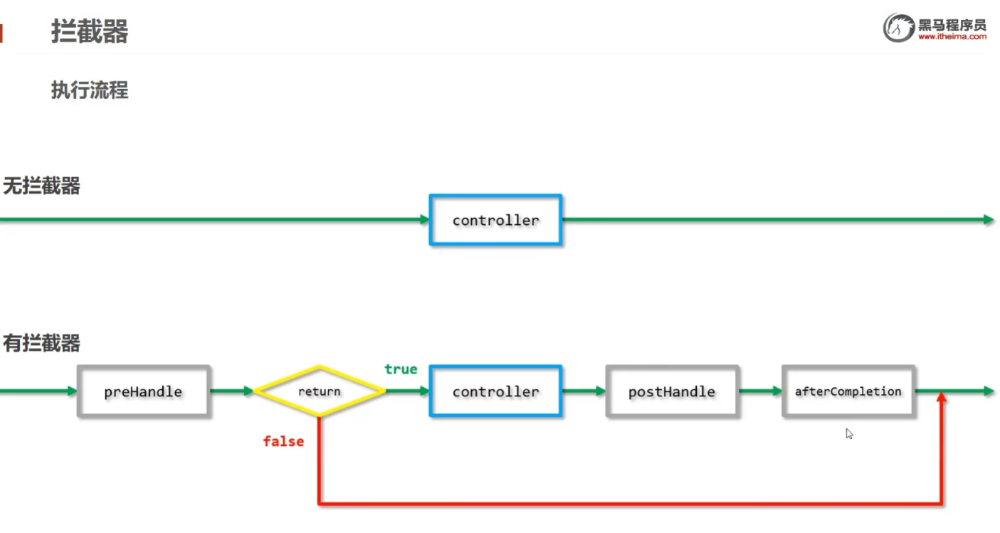


# Mybatis

## @Param

@Param的作用就是给参数命名，比如在mapper里面某方法A（int id），当添加注解后A（@Param("userId") int id），也就是说外部想要取出传入的id值，只需要取它的参数名userId就可以了。将参数值传如SQL语句中，通过#{userId}进行取值给SQL的参数赋值。

mapper中

```java
public User selectUser(@Param("userName") String name,@Param("password") String pwd);
```

映射到xml中

```xml
<select id="selectUser" resultMap="User">  
   select * from user  where user_name = #{userName} and user_password=#{password}  
</select>
```


# MybatisPlus

需要导入依赖
```xml
<dependency>
    <groupId>com.baomidou</groupId>
    <artifactId>mybatis-plus-boot-starter</artifactId>
    <version>3.4.1</version>
</dependency>
```

提供CRUD操作

## 分页查询 selectPage

需要配置分页拦截器

```java
@Configuration
public class MpConfig {

    @Bean
    public MybatisPlusInterceptor mpInterceptor() {
        //定义Mp拦截器
        MybatisPlusInterceptor mybatisPlusInterceptor = new MybatisPlusInterceptor();
        //添加具体的拦截器
        mybatisPlusInterceptor.addInnerInterceptor(new PaginationInnerInterceptor());

        return mybatisPlusInterceptor;

    }
}
```
## 条件查询
方法一：定义QueryWrapper，在查询的时候加入该条件

```java
@Test
void testGetAll() {
    QueryWrapper qw = new QueryWrapper();
    qw.lt("age",18);

    List users = userDao.selectList(qw);
    System.out.println(users);
}
```

方法二
使用Lambda表达式
```java
@Test
void testGetAll() {
    QueryWrapper<User> qw = new QueryWrapper<>();
    qw.lambda().lt(User::getAge,18);
    
    List<User> users = userDao.selectList(qw);
    System.out.println(users);
}
```
第三种
简化Lambda
```java
@Test
void testGetAll() {
    LambdaQueryWrapper<User> qw = new LambdaQueryWrapper<>();
    qw.lt(User::getAge,18);
    List<User> users = userDao.selectList(qw);
    System.out.println(users);
}
```

### 条件非空判断
```java
UserQuery uq = new UserQuery();
uq.setAge(18);
uq.setAge2(30);

qw.lt(uq.getAge()!=null,User::getAge,18);

```
在lt中或者gt中添加一个true或者false
如果为true连接该条件
### 投影查询 select
```java
@Test
void testGetAll() {
    LambdaQueryWrapper<User> qw = new LambdaQueryWrapper<>();
    qw.select(User::getId,User::getName);
    List<User> users = userDao.selectList(qw);
    System.out.println(users);
}
```
使用select选择查询的内容

查询count
只能使用QueryWrapper，不能使用LambdaQueryWrapper
```java
Test
oid testGetAll() {
   QueryWrapper<User> qw = new QueryWrapper<>();
   qw.select("count(*) as count");
   List<Map<String, Object>> users = userDao.selectMaps(qw);
   System.out.println(users);
}
```

## 字段映射
如果数据库中的字段和java中定义的不同
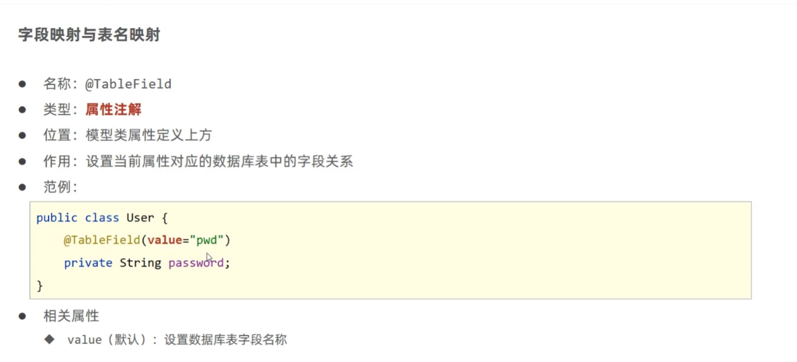

如果java中新定义了属性
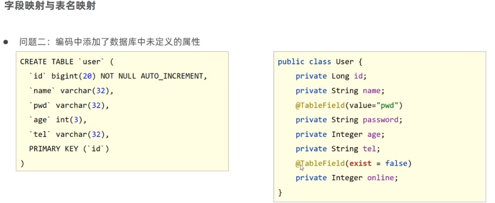


***@TableField***


**名称**：@TableField
**类型**：属性注解
**位置**：模型类属性定义上方
**作用**：设置当前属性对应的数据库表中的字段关系


## id生成策略控制
AUTO(O)：使用数据库id自增策略控制id生成
NONE(1)：不设置id生成策略
O
INPUT(2)：用户手工输入id
.
ASSIGN_ID(3)：雪花算法生成id（可兼容数值型与字符串型）
ASSIGN_UUID(4)：以UUID生成算法作为id生成策略
```java
@TableId(type = IdType.AUTO)
private Long id;
```
```yml
  global-config:
    db-config:
      id-type: assign_id
```
可以设置全局都用这一种生成策略


## 按照多条删除，查询
```java
@Test
void testDelete() {
    ArrayList<Long> list = new ArrayList<>();
    Collections.addAll(list,1L,2L);
    userDao.deleteBatchIds(list);
}

@Test
void testSelect() {
    ArrayList<Long> list = new ArrayList<>();
    Collections.addAll(list,1L,2L);
    userDao.selectBatchIds(list);
    
}
```
## 逻辑删除
```java
@TableLogic(value = "0",delval = "1")
private Integer deleted;
```
默认为0，如果被删除为1


