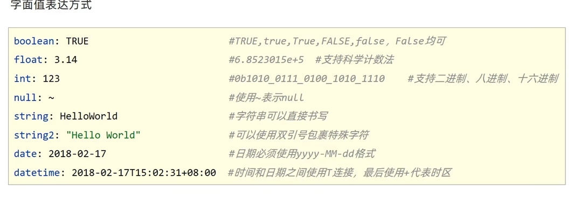
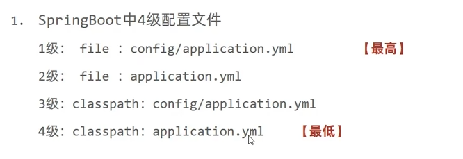
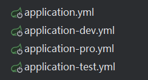
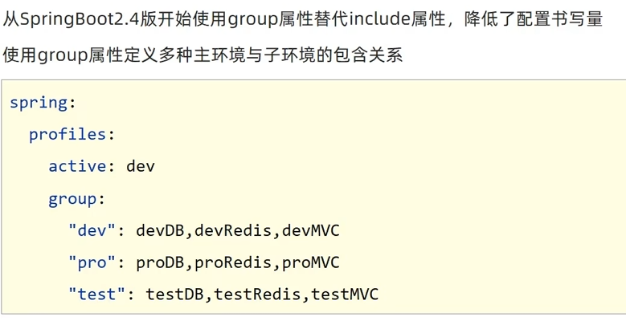
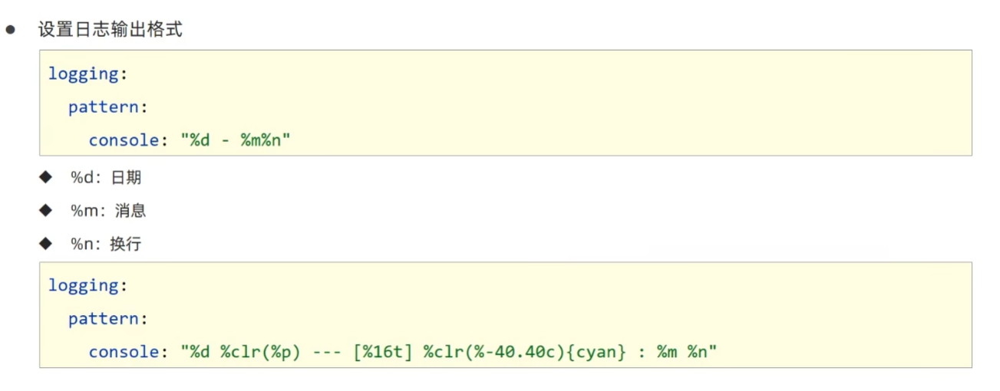
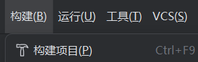
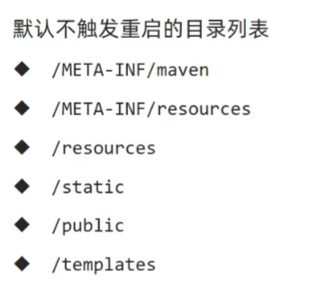
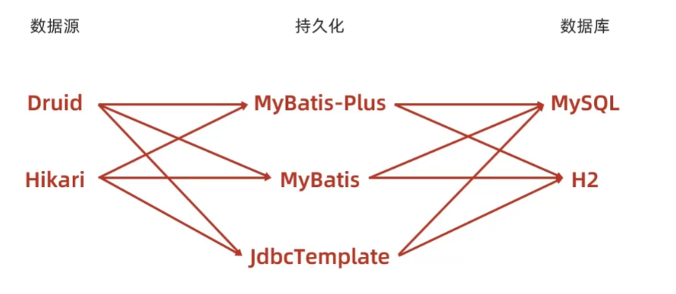
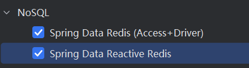

# 内置服务器
- Tomcat（默认）  apache出品，粉丝多，应用面广，负载了若干较重的组件
- jetty      更轻量级，负载性能远不及tomcat
- undertow   负载性能勉强跑赢tomcat

1.内嵌Tomcat服务器是SpringBoot辅助功能之一
2.内嵌Tomcat工作原理是将Tomcat服务器作为对象运行，并
将该对象交给Spring容器管理
# 基础配置

```properties
# 应用服务 WEB 访问端口
server.port=80

# 修改banner
spring.main.banner-mode=off
# 修改照片
spring.banner.image.location=text.jpg

# 日志
logging.level.root=error
```

## 配置文件
1. properties
2. yml
3. yaml

推荐使用yml，优先级如上

不同配置文件中相同配置按照加载优先级相互覆盖，不同配置文件中不同配置全部保留
### yaml
一种数据序列化格式

- 优点:
  - 容易阅读
  - 容易与脚本语言交互
  - 以数据为核心，重数据轻格式

- YAML文件扩展名
  - **·yml（主流）**
  - .yaml

### yaml语法规则

- 大小写敏感

- 属性层级关系使用多行描述，每行结尾使用冒号结束

- 使用缩进表示层级关系，同层级左侧对齐，只允许使用空格（不允许使用Tab键）

- 属性值前面添加空格（属性名与属性值之间使用冒号+空格作为分隔）
- #表示注释


**数据前面要加空格与冒号隔开**
**如果是纯属数字的话，一定要加双引号包裹起来**



### yml数据读取
在程序中加载配置
```java
@Value("${app.name}")
private String name;
```


在yml中加载，引用变量
```yaml
baseDir: c:\win10
tempDir: ${baseDir}\temp
```
在属性值中如果出现转移字符，需要使用双引号把整个配置包裹
```yaml

tempDir: "${baseDir}\temp"
```

可以把配置全部读取，封装到一个对象中
```java
@Autowired
private Environment env;

System.out.println(env.getProperty("user.age"));
System.out.println(env.getProperty("user.name"));
```

如果要读取yml中某一部分的数据，需要先写一个封装这一部分数据的类
```java
@Component
@ConfigurationProperties(prefix = "datasource")//这里面写yml中的名字
@Data
public class MyDateSource {

    private String driver;
    private String url;
    private String username;
    private String password;
    
}
```
然后再用自动装配方法，读取出来


## 整合
### 整合 JUnit

名称：**@SpringBootTest**
类型：测试类注解
位置：测试类定义上方
作用：设置JUnit加载的SpringBoot启动类
```java
@SpringBootTest
class SpringbootO5JUnitApplicationTests {}
```
1. 导入测试对应的starter
2. 测试类使用@SpringbootTest修饰
3. 使用自动装配对象


如果测试类和启动类不在同一个包下，需要在测试类上指定启动类的位置**classes = ?**
```java
@SpringBootTest(classes = Springboot04JUnitApplication.class)
```

### 整合Mybatis
导入对应的starter

如果报错，为mysql版本为5，需要强制加一个时区：?serverTimezone=UTC

```yaml
spring:
  datasource:
    driver-class-name: com.mysql.jdbc.Driver
    url: jdbc:mysql://localhost:3306/ssm?serverTimezone=UTC
    username: root
    password: 20041123zzx.
```
### 整合MyBatis—Plus

手动添加依赖
```xml
<!-- https://mvnrepository.com/artifact/com.baomidou/mybatis-plus-boot-starter -->
<dependency>
    <groupId>com.baomidou</groupId>
    <artifactId>mybatis-plus-boot-starter</artifactId>
    <version>3.4.3</version>
</dependency>

```


**如果数据库表名有下划线，需要配置一下**

```yaml
# 设置mp配置、
mybatis-plus:
  global-config:
    db-config:
      table-prefix: tbl_

```
**开启日志**
```yaml
mybatis-plus:
  global-config:
    db-config:
      table-prefix: tbl_
      id-type: auto

  configuration:
    log-impl: org.apache.ibatis.logging.stdout.StdOutImpl


```
```java
@Mapper
public interface BookDao extends BaseMapper<Book> {

}
```

### 整合Druid

先导入坐标
```xml
<!-- https://mvnrepository.com/artifact/com.alibaba/druid-spring-boot-starter -->
<dependency>
    <groupId>com.alibaba</groupId>
    <artifactId>druid-spring-boot-starter</artifactId>
    <version>1.2.6</version>
</dependency>

```

配置文件yml
```yaml
#spring:
#  datasource:
#    driver-class-name: com.mysql.jdbc.Driver
#    url: jdbc:mysql://localhost:3306/ssm
#    username: root
#    password: 20041123zzx.
#    type: com.alibaba.druid.pool.DruidDataSource


spring:
  datasource:
    druid:
      driver-class-name: com.mysql.jdbc.Driver
      url: jdbc:mysql://localhost:3306/ssm
      username: root
      password: 20041123zzx.
```
### 整合JavaMail

## 分页配置

分页查询current:当前页数

form = (current  -  1) * pageSize 从那一条开始

end = current * pageSize 结束

添加一个拦截器
```java
@Configuration
public class MPConfig {
    
    @Bean
    public MybatisPlusInterceptor mybatisPlusInterceptor(){
        MybatisPlusInterceptor interceptor = new MybatisPlusInterceptor();
        interceptor.addInnerInterceptor(new PaginationInnerInterceptor());
        return interceptor;
    }
}
```

## 条件查询
```java
    @Test
    void testGetBy(){
//        QueryWrapper<Book> qw = new QueryWrapper<>();
//        qw.like("name","spring");
//        bookDao.selectList(qw);
        
        LambdaQueryWrapper<Book> lqw = new LambdaQueryWrapper<>();
        lqw.like(Book::getName,"spring");
        bookDao.selectList(lqw);
    }
```

# 业务层开发
MP可以自动帮你书写简单的，需要继承类

首先需要定义接口
```java
public interface IBookService extends IService<Book> {

}
```

然后定义接口的实现类,而且需要继承一个类
```java
@Service
public class BookServiceImpl2 extends ServiceImpl<BookDao, Book> implements IBookService {

}
```
如果需要的功能别人没有给你提供，需要自己手动在添加

使用MyBatisPlus提供有业务层通用接口（ISerivce<T>）与业务层通用实现类(ServiceImpl<M,T>)
在通用类基础上做功能重载或功能追加
注意重载时不要覆盖原始操作，避免原始提供的功能丢失


# 异常处理器
```java
@RestControllerAdvice
public class ProjectExceptionAdvice {

    @ExceptionHandler(Exception.class)
    public Result doException(Exception ex){
        ex.printStackTrace();
        return new  Result(false,"服务器故障");
    }

}
```

# 运维
## 打包与运行
### Windows
对项目打包，然后运行启动命令
```
java -jar xxxx.jar
```
需要跳过测试
jar支持命令行启动需要依赖maven插件支持，请确认打包时是否具有SpringBoot对应的maven插件
```xml
<build>
  <plugins>
    <plugin>
      <groupId>org.springframework.boot</groupId>
      <artifactId>spring-boot-maven-plugin</artifactId>
    </plugin>
  </plugins>
</build>

```
### 端口操作

Windonws端口被占用
```
查询端口
netstat -ano

#查询指定端口
netstat-ano |findstr "端口号"

#根据进程PID查询进程名称
tasklist|findstr "进程PID号"

#根据PID杀死任务
taskkill/F /PID"进程PID号"

#根据进程名称杀死任务
taskkill-f-t-im"进程名称"

```

### 指定端口
```
java -jar xxxx.jar --server.port=8080
```
## 临时属性设置

可通过编程形式带参数启动Springboot程序，为程序添加运行参数

```java
@SpringBootApplication
public class SpringbootSsmpApplication {

    public static void main(String[] args) {
        String[] arg = new String[1];
        arg[0] = "--server.port=8081";
        SpringApplication.run(SpringbootSsmpApplication.class, arg);
    }

}
```
## 配置文件等级




1. 项目类路径配置文件：服务于开发人员本机开发与测试
2. 项目类路径config目录中配置文件：服务于项目经理整体调控
3. 工程路径配置文件：服务于运维人员配置涉密线上环境
4. 工程路径config目录中配置文件：服务于运维经理整体调控


配置文件还可以设置路径

`--spring.config.name=ebank`


## 多环境开发
```yaml

# 应用环境
spring:
  profiles:
    active: pro

---
# 生产环境
spring:
  profiles: pro
server:
  port: 80


---
# 开发环境
spring:
  profiles: dev
server:
  port: 81


---
#测试环境
spring:
  profiles: test
server:
  port: 82
```
相同的配置卸载应用环境中，作为公共配置
```yaml
# 过时的：
spring:
  profiles: test

# 不过时的：
spring:
  config:
    activate:
      on-profile: test
```

由于把多环境配置放在一起有安全隐患，可以分成多个文件
**注意命名规范**


## 配置文件命名规范
根据功能对配置文件中的信息进行拆分，并制作成独立的配置文件，命名规则如下
- application-devDB.yml
- application-devRedis.yml
- application-devMvC.yml
使用include属性在激活指定环境的情况下，同时对多个环境进行加载使其生效，多个环境间使用逗号分隔

```yaml
spring:
  profiles:
    active: dev
      include: devDB,devRedis,devMVC
```
当主环境dev与其他环境有相同属性时，主环境属性生效；其他环境中有相同属性时，最后加载的环境属性生效


## 日志

### 操作
可以设置单个包的日志级别
```yaml
logging:
  level:
    root: info
    com.zzx.controller: debug
```
把包分组，然后设置分组的级别

```yaml
logging:
  # 设置分组
  group:
    my: com.zzx.controller
  # 设置级别
  level:
    my: debug


```


### 设置滚动日志
```yaml
  logback:
    rollingpolicy:
      file-name-pattern: server.%d{yyyy-MM-dd}.%i.log
      max-file-size: 4KB

```
# 开发
## 热部署
添加坐标
```xml
<dependency>
    <groupId>org.springframework.boot</groupId>
    <artifactId>spring-boot-devtools</artifactId>
</dependency>
```
激活热部署：手动构建项目



**重启（Restart）**：自定义开发代码，包含类、页面、配置文件等，加载位置restart类加载器
**重载(ReLoad)**：jar包，加载位置base类加载器

热部署代表Restart过程

### 自动热部署



### 自定义热部署路径
```yaml
spring:
  devtools:
    restart:
      exclude: static/**

```


## bean

<font color = #b8860b> @ConfigurationProperties</font>
可以为第三方bean绑定属性
```java
@Bean
@ConfigurationProperties(prefix = "datasource")
public DruidDataSource dataSource(){
    DruidDataSource ds = new DruidDataSource();
    return ds;
}
```
@EnableConfigurationProperties注解可以将使用@ConfigurationProperties注解对应的类加入Spring容器
**@EnableConfigurationProperties与@Component不能同时使用**

### 松散绑定
<font color = #b8860b> @ConfigurationProperties</font>绑定属性支持属性名宽松绑定，不强求属性名的书写格式

宽松绑定不支持注解<font color = #b8860b> @value</font>引用单个属性的方式

**绑定前缀名命名规范**：仅能使用纯小写字母、数字、中划线作为合法的字符


## 配置单位
```java

//时间配置单位
@DurationUnit(ChronoUnit.HOURS)
private Duration serverTimeOut;

//空间单位
@DataSizeUnit(DataUnit.MEGABYTES)
private DataSize dataSize;
```

## 数据校验
导入坐标
```xml
导入JSR303规范

<dependency>
    <groupId>javax.validation</groupId>
    <artifactId>validation-api</artifactId>
</dependency>


类似于上面是接口，下面是实现类


使用hibernate框架提供的校验器做实现类
<dependency>
    <groupId>org.hibernate.validator</groupId>
    <artifactId>hibernate-validator</artifactId>
</dependency>
```


需要再哪里做校验，就在哪里添加注解<font color = #b8860b>@Validated</font>
```java
@Validated
public class ServletConfig {
    @Max(value = 8888,message = "最大值不能超过8888")
    private int port;
}
```


## 测试专用属性

properties,args属性可以为当前测试用例添加临时的属性配置

```java
@SpringBootTest(properties = {"test.prop=testValue"})
@SpringBootTest(args = {"--test.prop=testValue"})
class PropertiesAndArgsTest {
    @Value("${test.prop}")
    private String msg;

    @Test
    void testProperties() {
        System.out.println(msg);
    }
}
```

## Import 加载专用配置
可以加载当前测试类专用的配置
```java
@SpringBootTest
@Import(MsgConfig.class)
public class ConfigurationTest {
    @Autowired
    private String msg;
    @Test
    public void msgtest(){
        System.out.println(msg);
    }
}
```
## 测试类启动Web环境
在SpringbootTest中添加属性
```java
@SpringBootTest(webEnvironment = SpringBootTest.WebEnvironment.RANDOM_PORT)
public class WebTest {
    @Test
    void test(){
    }
}
```


开启虚拟MVC调用
<font color = #b8860b>@AutoConfigureMockMvc</font>
```java
@SpringBootTest(webEnvironment = SpringBootTest.WebEnvironment.RANDOM_PORT)
@AutoConfigureMockMvc
public class WebTest {
    @Test
    void testWeb(@Autowired MockMvc mvc) throws Exception {
        //创建虚拟请求
        MockHttpServletRequestBuilder builder = MockMvcRequestBuilders.get("/books");
        //执行请求
        mvc.perform(builder);
    }
}
```

### Web环境模拟测试
#### 请求状态匹配
```java
@Test
   void testStatus(@Autowired MockMvc mvc) throws Exception {
       //创建虚拟请求
       MockHttpServletRequestBuilder builder = MockMvcRequestBuilders.get("/books");
       //执行请求
       ResultActions action = mvc.perform(builder);
       //匹配执行状态
       //定义执行状态匹配器
       StatusResultMatchers status = MockMvcResultMatchers.status();
       //定义预期执行状态
       ResultMatcher ok = status.isOk();
       //使用本次真实执行结果与预期结果进行匹配
       action.andExpect(ok);
   }
```
#### 請求匹配結果
```java
@Test
void testBody(@Autowired MockMvc mvc) throws Exception {
    //创建虚拟请求
    MockHttpServletRequestBuilder builder = MockMvcRequestBuilders.get("/books");
    //执行请求
    ResultActions action = mvc.perform(builder);
    //匹配执行状态
    //定义执行状态匹配器
    ContentResultMatchers content = MockMvcResultMatchers.content();
    //定义预期结果
    ResultMatcher body =content.string("springBoot");
    //使用本次真实执行结果与预期结果进行匹配
    action.andExpect(body);
}
```


### 测试事务回滚
在测试类上面添加<font color = #b8860b>@Transactional</font>

@Rollback(true/false)
默认为true，进行回滚

### 测试用例随机数据
在yml中设置相对应的属性,然后用定义实体类接受一下。
使用Random用来随机

```yaml
testcase:
  book:
    id: ${random.int}
    name: ${random.value}
    uuid: ${random.uuid}
    publishTime: ${random.long}
```
# 数据层解决方案
## 内嵌数据库

SpringBoot提供了3种内嵌数据库供开发者选择，提高开发测试效率
- H2
- HSQL
- Derby

H2的相关坐标
```xml
<dependency>
    <groupId>org.springframework.boot</groupId>
    <artifactId>spring-boot-starter-data-jpa</artifactId>
</dependency>
<dependency>
    <groupId>com.h2database</groupId>
    <artifactId>h2</artifactId>
    <scope>runtime</scope>
</dependency>
```
在配置中指定访问路径，然后再网页中访问相对应的路径


## NoSql解决方案
- Redis
- Mongo
- ES

## Redis
是一款key-value存储结构的内存级NoSQL数据库
- 支持多种数据存储格式
- 支持持久化
- 支持集群

服务器启动命令
```
redis-server.exe redis.windows.conf
```
客户端启动命令
```
redis-cli.exe
```
1. redis-cli.exe
2. shutdown
3. exit
4. redis-server.exe redis.windows.conf


**相关指令**

存储一个key value
```
set name zzx
```
获取Value
```
get name
```

获取所有的keys
```
keys *
```




### java整合

先获取自动装配Redis对象
设置你要存取的结构
然后进行操作


```java
@Autowired
private RedisTemplate redisTemplate;

@Test
void set() {
    ValueOperations ops = redisTemplate.opsForValue();
    ops.set("age",1);
}
@Test
void get() {
    ValueOperations ops = redisTemplate.opsForValue();
    System.out.println(ops.get("age"));
}
```
### 读写Redis客户端
```java
@Autowired
private StringRedisTemplate stringRedisTemplate;
```
这个默认泛型为String，和客户端一样
不带string类型为对象

### jedis
客户端类型
Redis对应于Jedis就相当于关系数据库对应于JDBC。
1. 导入坐标
```xml
<dependency>
    <groupId>redis.clients</groupId>
    <artifactId>jedis</artifactId>
</dependency>
```

2. 添加配置
```yaml
spring:
  redis:
    port: 6379
    host: localhost
    client-type: jedis
```
# 缓存

- 缓存是一种介于数据永久存储介质与数据应用之间的数据临时存储介质

- 使用缓存可以有效的减少低速数据读取过程的次数（例如磁盘IO），提高系统性能

- 缓存不仅可以用于提高永久性存储介质的数据读取效率，还可以提供临时的数据存储空间

springboot 提供了缓存技术，方便缓存使用
导入缓存坐标

```xml
<dependency>
    <groupId>org.springframework.boot</groupId>
    <artifactId>spring-boot-starter-cache</artifactId>
</dependency>
```
在启动类添加<font color = #b8860b>@EnableCaching</font>

在需要缓存的地方加上@Cacheable，当前操作进入缓存
value为大的变量名，key为小的空间
```java
@GetMapping("{id}")
@Cacheable(value = "cacheSpace",key = "#id")
public Book getById(@PathVariable Integer id) {
    return bookService.getById(id);
}
```
SpringBoot提供的缓存技术除了提供默认的缓存方案，还可以对其他缓存技术进行整合，统一接口，方便缓存技术的开发与管理

# 注解

## @ConditionalOnClass

@ConditionalOnClass 是 Spring Boot中的一个条件注解，它的作用是用来指定在特定的类存在时才装配某个 Bean 或者配置某个组件。

如果满足这个条件，才会生效，如果其他工程继承了父工程，而子工程不想要这个，那么可以使用

假设我们有一个自定义的配置类 `MyConfiguration`，我们希望只有在类路径中存在 `org.springframework.web.servlet.DispatcherServlet` 这个类时，才创建和装配这个配置类：

```java
@Configuration
@ConditionalOnClass(DispatcherServlet.class)
public class MyConfiguration {
    // 在这里定义需要配置的 Bean
}
```

整个 Spring MVC 框架中，DispatcherServlet 处于核心位置，它负责协调和组织不同组件完成请求处理并返回响应工作。`DispatcherServlet 是 SpringMVC统一的入口，所有的请求都通过它。`，所有用这个类当做条件即可
