## APP
- app,用户管理
- app，订单管理
- app，网站
- app，api  
多模块开发
创建app
```python
django-admin startapp app01
```
## 注册app
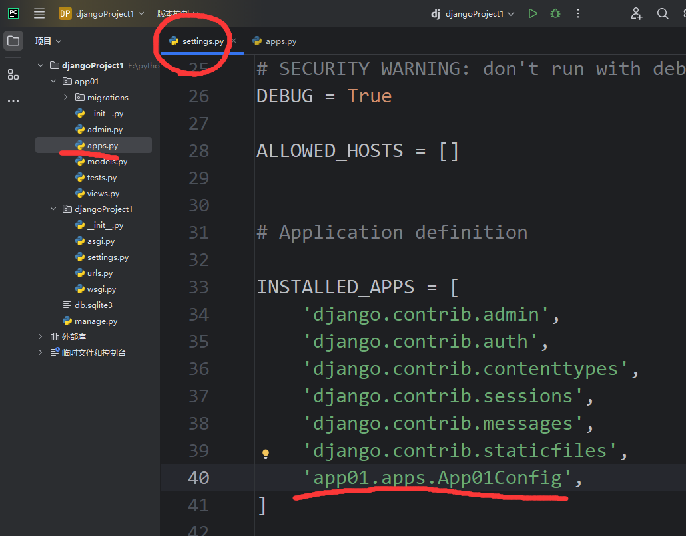

## 模板tempaltes
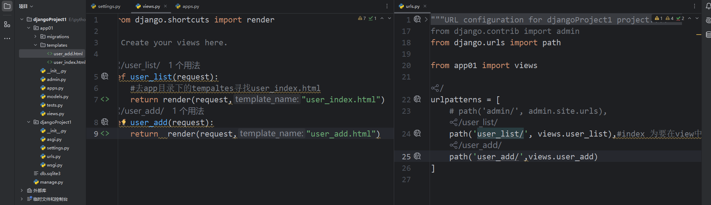
## 静态文件
在开发过程中一般将：
- 图片
- css
- JS

称为静态文件
### static目录
在app目录下创建static文件下
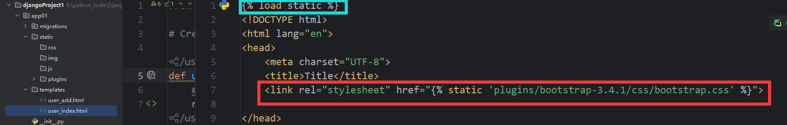

## 模板语法
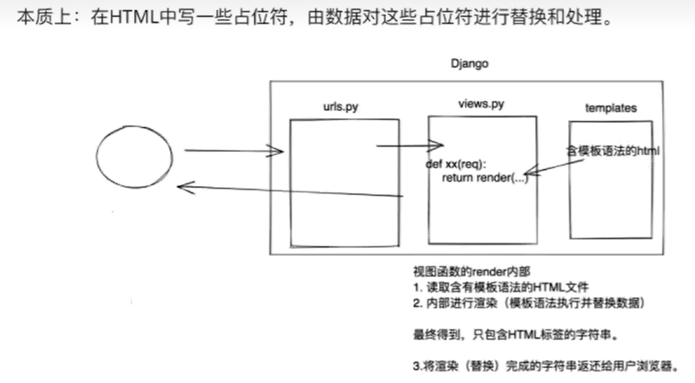

### 请求和响应

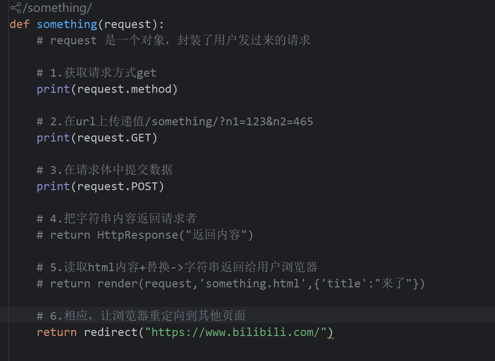
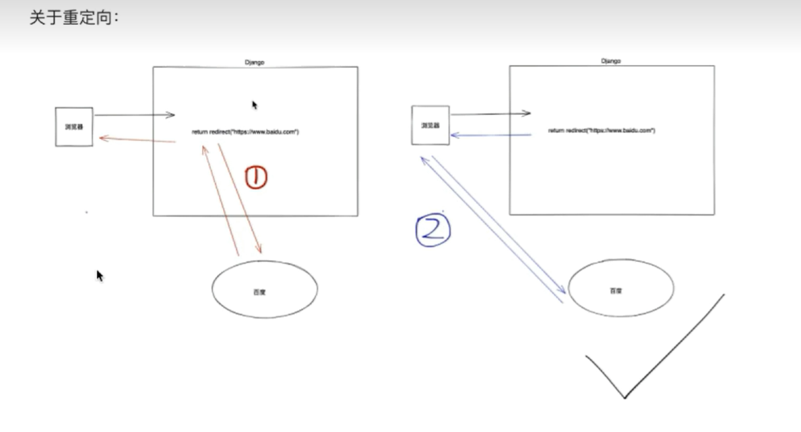

## django 开发操作数据库
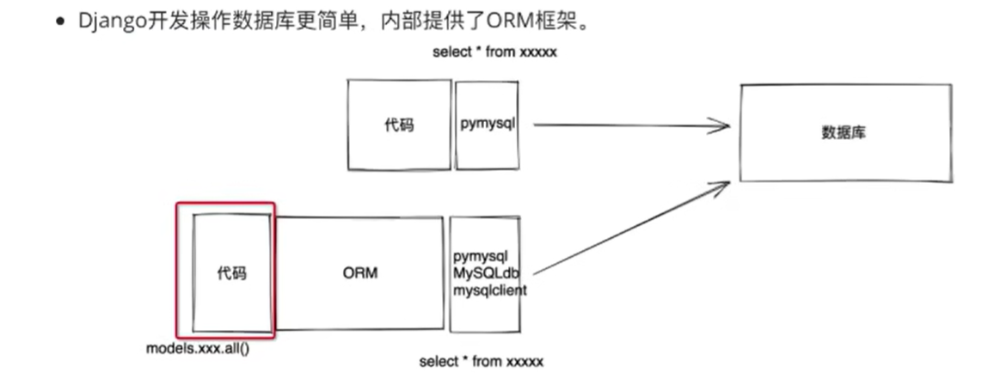
orm如何对数据库增删改查

### ORM
orm可以帮我们做：
- 创建，修改，删除数据库中的表(不用写sql语句)[无法创建数据库]
- 操作表中的数据(不用写SQL语句)


1. 创建数据库
2. django连接数据库
setting.py中进行配置和修改
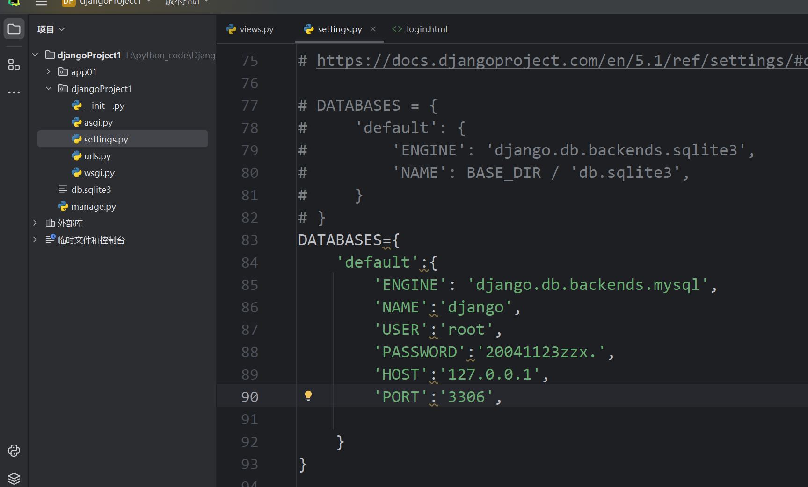


#### 创建表
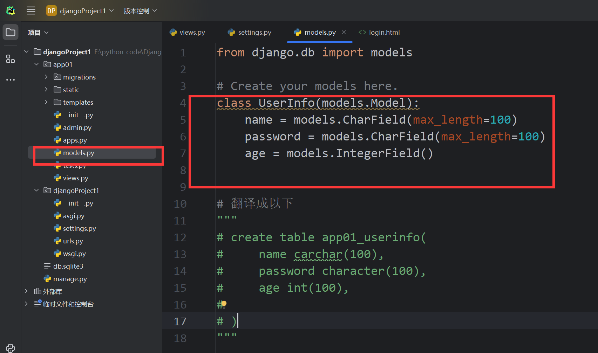

#### 执行命令
**注意：如果app未注册，则不会执行命令**
在终端执行

```python
python manage.py makemigrations 

python manage.py migrate
```
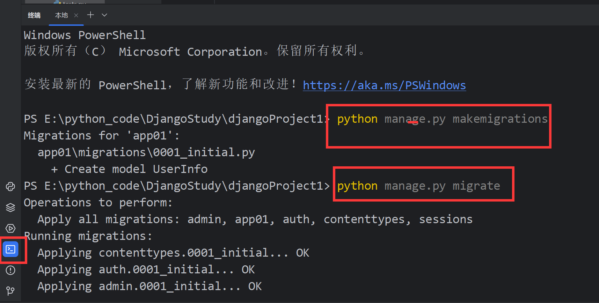

#### 操作表
如果创建新表，直接写一个新类，然后执行命令
不想要那个字段或者表，直接注释然后执行命令

在已有的表中添加新字段，由于已存在列中可能已有数据，所以要指定新增列的数据
将新建的列默认的值要设定一下
```python
age=models.IntegerField(default=1)
```

↓允许为空
```python 
data=models.IntegerField(null=True,blank=True)
```
以后如果想要对表结构进行调整
- 在models.py中操作类即可
- 命令

#### 操作表中的数据
新建
UserInfo.objects.create(name="asdf",age=19,password="123456")

删除
```python
UserInfo.objects.filter(name="asdf",age=19,password="123456").delete()
UserInfo.objects.all().delete()     # 全部删除
```

获取数据
```python
data_list=UserInfo.objects.all() # QuerySet类型
for data in data_list:
    print(data.id,data.name,data.age,data.password)
```
获取第一条数据
```python 
obj=UserInfo.object.filter(id=1).first()
print(obj.id)
```

更新数据
```python
UserInfo.objects.all().update(age=10)
```

#### 添加用户
- GET看到界面
- POST提交写入到数据库
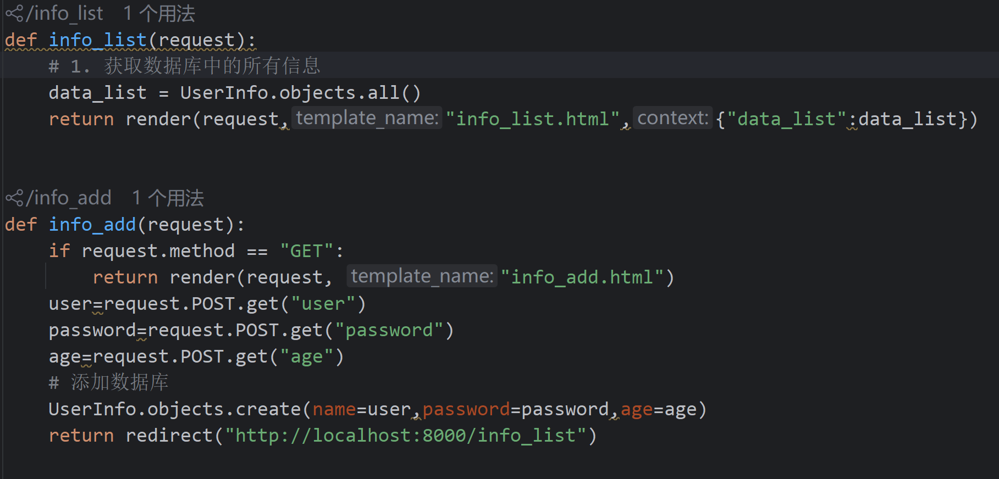


## 继承
为了防止写大量多用重复的html，可以用到继承
可以不用写过多的js和css 
在app的templates中写一个layout.html
不同的地方可以用占位符

**content是自己起的名字**
```html





```

继承母版：
```html



    <h1>首页</h1>

```