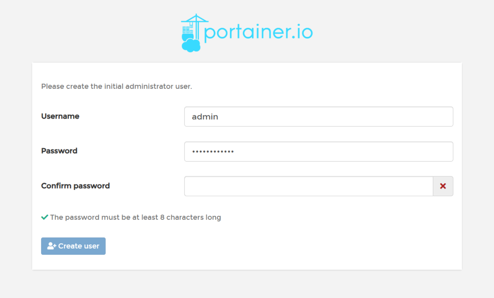
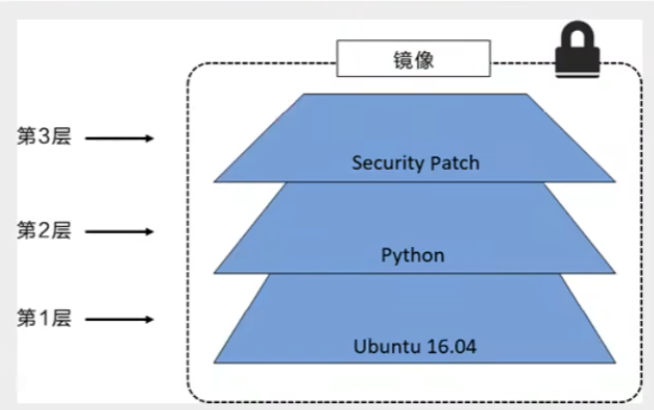
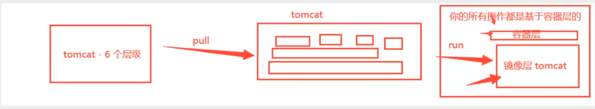
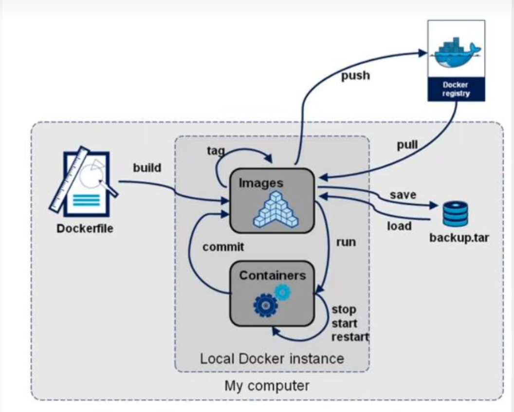
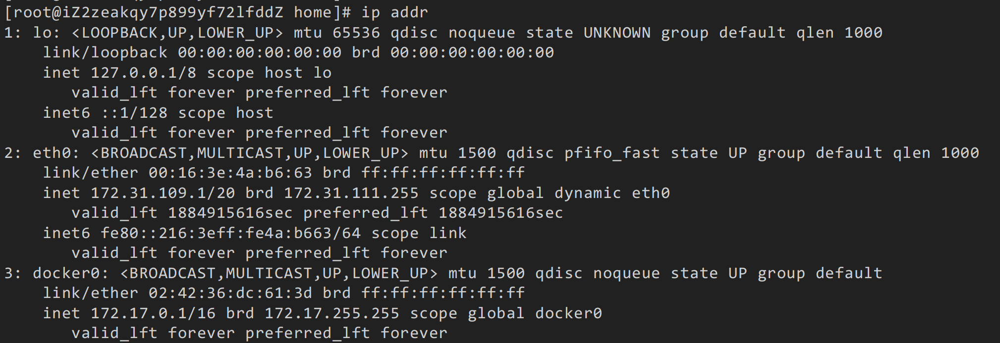
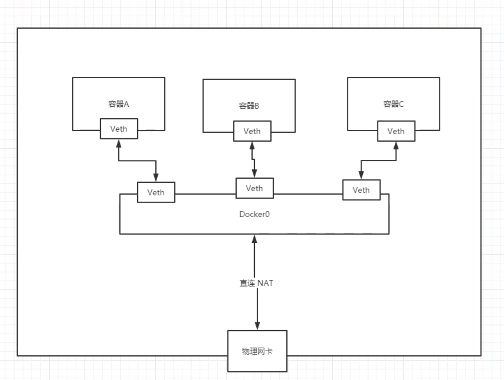

# 安装

1. **卸载旧的版本**

```shell	
yum remove docker \
    docker-client \
    docker-client-latest \
    docker-common \
    docker-latest \
    docker-latest-logrotate \
    docker-logrotate \
    docker-engine \
    docker-selinux 
```

2. **安装成功后，执行命令，配置Docker的yum源（已更新为阿里云源）：**

```shell	
sudo yum-config-manager --add-repo https://mirrors.aliyun.com/docker-ce/linux/centos/docker-ce.repo

sudo sed -i 's+download.docker.com+mirrors.aliyun.com/docker-ce+' /etc/yum.repos.d/docker-ce.repo
```

3. **更新yum，建立缓存**

```bash
sudo yum makecache fast
```

4. **安装docker**

```bash
yum install -y docker-ce docker-ce-cli containerd.io docker-buildx-plugin docker-compose-plugin
```

5. **启动测试**

```bash
# 启动Docker
systemctl start docker

# 查看版本
docker version

# 停止Docker
systemctl stop docker

# 重启
systemctl restart docker

# 设置开机自启
systemctl enable docker

# 执行docker ps命令，如果不报错，说明安装启动成功
docker ps
```

6. 配置镜像加速

[2025 Docker/DockerHub 国内镜像源/加速列表（7月21日更新-长期维护） - 知乎](https://zhuanlan.zhihu.com/p/24461370776)

```bash
sudo mkdir -p /etc/docker
sudo tee /etc/docker/daemon.json <<EOF
{
    "registry-mirrors": [
        "https://docker.xuanyuan.me"
    ]
}
EOF
systemctl daemon-reload
systemctl restart docker


sudo tee /etc/systemd/system/docker.service.d/http-proxy.conf <<EOF
[Service]
Environment="HTTP_PROXY=http://127.0.0.1:7890"
Environment="HTTPS_PROXY=http://127.0.0.1:7890"
Environment="NO_PROXY=localhost,127.0.0.1,.aliyuncs.com,.docker.io"
EOF
```

# Docker常用命令

## 帮助命令

```shell
docker version    # 显示Docker的版本
docker info       # 显示Docker的系统信息，包括镜像和容器的数量
docker 命令--help  # 帮助命令
# 可选
-a   # 列出所有镜像
-q   # 只显示镜像的id
```

帮助文档地址：[Docker 命令大全 | 菜鸟教程](https://www.runoob.com/docker/docker-command-manual.html)

## 镜像命令

### **docker images** 

**查看本地主机上的镜像**

```shell
docker images
REPOSITORY   TAG       IMAGE ID   CREATED   SIZE

# 解释
REPOSITORY 镜像的仓库源
TAG        镜像的标签
IMAGE ID   镜像的ID
CREATED    镜像的创还能时间
SIZE       镜像的大小
```

### **docker search**  

**搜索镜像**

```shell
docker search mysql

```

### docker pull

 **下载镜像**

```shell
# 下载镜像  docker pull 镜像名[:tag]
docker pull docker.xuanyuan.me/library/mysql:5.7
docker pull mysql
# 如果不写 tag 默认就是最后一个版本，就是latest
```

说明：library是一个特殊的命名空间，它代表的是官方镜像。如果是某个用户的镜像就把library替换为镜像的用户名。

使用DockerHub 代理，以下以 docker.xuanyuan.me 为例：可以根据列表自行替换


## 容器命令

说明：我们有了镜像才可以创建容器

```shell
docker pull centos
```

### docker run

**新建容器并启动**

```bash
docker run [可选参数] 容器id

# 参数说明
--name="Name"   容器名字 tomcat01 tomcat02，用来区分容器
-d              后台方式运行
-it             使用交互式方式运行，进入容器查看内容
-p              指定容器的端口 -p 8080:8080
	-p ip:主机端口:容器端口
	-p 主机端口:容器端口
	-p 容器端口

-P         随机指定端口
-e       环境变量


# 测试，启动并进入容器
[root@iZ2zeakqy7p899yf72lfddZ /]# docker run -it centos /bin/bash
[root@aa3cb98b4a6f /]# ls  查看容器内的centos，基础版本，很多命令是不完善的
bin  dev  etc  home  lib  lib64  lost+found  media  mnt  opt  proc  root  run  sbin  srv  sys  tmp  usr 
```

### docker ps

列出所有运行的容器

```shell
docker ps           # 列出当前正在运行的容器
          -a        # 列出当前正在运行的容器+历史运行过的容器
          -n=?      # 显示最近常见的n个容器
          -q        # 只显示出容器的编号
          
[root@iZ2zeakqy7p899yf72lfddZ /]# docker ps
CONTAINER ID   IMAGE     COMMAND   CREATED   STATUS    PORTS     NAMES
[root@iZ2zeakqy7p899yf72lfddZ /]# docker ps -a
CONTAINER ID   IMAGE     COMMAND       CREATED         STATUS                        PORTS     NAMES
aa3cb98b4a6f   centos    "/bin/bash"   2 minutes ago   Exited (127) 21 seconds ago             agitated_cray
```

### exit

**退出容器**

```bash
exit    # 从容器中退出返回主机
Ctrl + P + Q  # 容器不停止退出
```

### docker rm 

**删除容器**

```bash
docker rm 容器id                 # 删除指定的容器，不能删除正在运行的容器，如果要强制删除 rm -f 
docekr rm -f $(docker ps -aq)    # 删除所有的容器
docker ps -a -q|xargs docker rm  # 删除所有的容器 
```

### **启动和停止容器**

```bash
docker start CONTAINER ID      # 启动容器
docker restart CONTAINER ID    # 重启容器
docker stop CONTAINER ID       # 停止当前正在运行的容器
docker kill CONTAINER ID       # 强制停止当前容器
```

## 其他常用命令

### **后台启动容器**

```shell
# docker run -d 镜像名
docker run -d centos

# 问题docker ps，发现centos停止了

# docker容器使用后台运行，就必须要有一个前台进程，docker发现没有应用，就会自动停止
# nginx，容器启动后，发现自己没有提供服务，就会立即停止，就是没有程序了
```

### docker logs

**查看日志**

```bash
# 显示日志
-tf             # 显示日志
--tail number   # 要显示日志的条数

docker logs -f -t --tail 10 容器id  # 查看容器id最近的10条日志
```

### **docker top**

**查看容器中进程信息**

docker top 容器id

```bash
# 命令 docker top 容器id
[root@iZ2zeakqy7p899yf72lfddZ /]# docker top  77e2b273064e
UID 	 PID		 PPID  	    C  		STIME 	   TTY

```

### **查看镜像的元数据**


```bash
# 命令   docker inspect 容器id
[root@iZ2zeakqy7p899yf72lfddZ /]# docker inspect 77e2b273064e
```

### **docker exec**

**进入当前正在运行的容器**

通常容器都是使用后台方式运行，需要进入容器，修改一些配置

`docker exec -it 容器id /bin/bash[bashshell]`

`docker attach 容器id`

```bash
# 命令  docker exec -it 容器id bashshell
[root@iZ2zeakqy7p899yf72lfddZ /]# docker exec -it 77e2b273064e bashshell

docker exec -it 容器id /bin/bash

# 方式二
docker attach 容器id
docker attach 77e2b273064e

# docker exec   # 进入容器后开启一个新的终端，可以在里面操作（常用）
# docker attach # 进入容器正在执行的终端，不会启动新的进程
```

### **docker cp**

**从容器内拷贝文件到主机上**

docker cp 容器id:容器内路径   目的的主机路径

```bash
# 创建文件
[root@afb6536296df home]# touch test.java
# 从容器拷贝到主机上
[root@iZ2zeakqy7p899yf72lfddZ /]# docker cp afb6536296df:/home/test.java /home
                                               Successfully copied 1.54kB to /home
# 查看拷贝文件
[root@iZ2zeakqy7p899yf72lfddZ home]# ls
ecs-assist-user  redis  test.java  www
```

# 部署

## 部署nginx

> xxxxxxxxxx5 12​34    <h1>首页</h1>5html

```bash
docker pull nginx

[root@iZ2zeakqy7p899yf72lfddZ /]# docker run -d --name nginx01 -p 9090:80 nginx

-d #后台运行
--name  # 给容器命名
-p      # 主机端口: 容器内部端口

[root@iZ2zeakqy7p899yf72lfddZ /]# docker ps -a
CONTAINER ID   IMAGE     COMMAND                   CREATED         STATUS         PORTS                                   NAMES
1df312830ac9   nginx     "/docker-entrypoint.…"   2 minutes ago   Up 2 minutes   0.0.0.0:9090->80/tcp, :::9090->80/tcp   nginx01

```

## 部署tomcat

```bash
docker run -it -rm tomcat:9.0
# 用完直接删除，一般用来测试

docker run -d -p 3344:8080 --name tomcat01 tomcat
# 已经可以访问了

# 进入容器后发现没有webapps，镜像的原因，默认是最小的镜像，所有不必要的都删除掉
# 保证最小可运行的环境！
docker stop c0cd7705bc0d

# 查看docker stats  显示docker中cpu占用
CONTAINER ID   NAME      CPU %     MEM USAGE / LIMIT     MEM %     NET I/O           BLOCK I/O         PIDS
1df312830ac9   nginx01   0.00%     2.395MiB / 1.715GiB   0.14%     40.3kB / 54.2kB   12.4MB / 8.19kB   3
```

# 可视化

- portainer（先用这个）

```bash
docker run -d -p 8088:9000 \
--restart=always -v /var/run/docker.sock:/var/run/docker.sock --privileged-true portainer/portainer
```

- rancher（CI/CD再用）

**什么是portainer？**

docker图形化界面管理工具，提供一个后台面板提供我们操作

```bash
docker run -d -p 8088:9000 \
--restart=always -v /var/run/docker.sock:/var/run/docker.sock --privileged=true portainer/portainer
```

http://123.57.53.59:8088/



账号：admin

密码：20041123zzx.

# docker镜像

## 镜像是什么

镜像是一种轻量级、可执行的独立软件包，用来打包软件运行环境和基于运行环境开发的软件，它包含运行某个软件所需的所有内容，包括代码、运行时、库、环境变量和配置文件。

所有的应用，直接打包docker镜像，就可以直接跑起来！

**如何得到镜像：**

- 从远程仓库下载
- 朋友拷贝给你
- 自己制作一个镜像 DockerFile

## 分层

分层结构有利于资源共享，比如有多个镜像都从相同的Base镜像构建而来，那么宿主机只需在磁盘上保留一份base
镜像，同时内存中也只需要加载一份base镜像，这样就可以为所有的容器服务了，而且镜像的每一层都可以被共享。
查看镜像分层的方式可以通过**docker image inspect**命令！

**理解：**

所有的Docker镜像都起始于一个基础镜像层，当进行修改或增加新的内容时，就会在当前镜像层之上，创建新的镜像层。
举一个简单的例子，假如基于UbuntuLinux16.04创建一个新的镜像，这就是新镜像的第一层；如果在该镜像中添加Python包，就会在基础镜像层之上创建第二个镜像层；如果继续添加一个安全补丁，就会创建第三个镜像层。
该镜像当前已经包含3个镜像层。

在添加额外的镜像层的同时，镜像始终保持是当前所有镜像的组合，理解这一点非常重要。

**特点**
docker镜像都是只读的，当容器启动时，一个信的可写层被加载到镜像的顶部

这一层就是我们通常说的容器层，容器之下都叫镜像层



## commit镜像

```bash
docker commit 提交容器成为一个新的副本

# 命令和git原理类似
docker commit -m="提交的描述信息" -a="作者" 容器id  目标镜像名:[TAG]
```

> 将我们操作过的容器通过commit提交为一个镜像，我们以后就使用修改过的镜像即可，这就是我们自己的一个修改过的镜像

```bash
# 查看当前的镜像
[root@iZ2zeakqy7p899yf72lfddZ ~]# docker ps
CONTAINER ID   IMAGE                 COMMAND                   CREATED        STATUS          PORTS                                       NAMES
c0cd7705bc0d   tomcat                "catalina.sh run"         3 hours ago    Up 14 minutes   0.0.0.0:3344->8080/tcp, :::3344->8080/tcp   tomcat01

# 把修改过的tomcat01打包成一个新的镜像tomcat02
[root@iZ2zeakqy7p899yf72lfddZ ~]# docker commit -m="add webapps" -a="zzx" c0cd7705bc0d tomcat02:1.0
sha256:f3961766935518ef48c52e5fb593623175ae48829c5223b41250f39fd76dbd18

[root@iZ2zeakqy7p899yf72lfddZ ~]# docker images
REPOSITORY            TAG       IMAGE ID       CREATED         SIZE
tomcat02              1.0       f39617669355   5 seconds ago   684MB
tomcat                latest    fb5657adc892   3 years ago     680MB

```

> 如果想保存当前容器的状态，就可以通过commit来提交，获得一个镜像
>
> 就好比git中commit提交一个版本
>
> 其中TAG为版本号

# 容器数据卷

如果数据都在容器中，那么我们删除容器，数据就会全部丢失，==需求：数据可以持久化==

容器之间可以有一个数据共享的技术，Docker容器中产生的数据，同步到本地，这就是卷技术

也就是目录的挂载，将我们容器内的目录，挂载到linux上面

**总结：容器的持久化和同步操作，容器之间也是可以数据共享的**

**相关命令：**

```bash
docker volume create  创建数据卷
docker volume ls  查看所有的数据卷
docker volume rm  删除指定数据卷
docker volume inspect  查看某个数据卷的详情
docker volume prune   清空数据卷
```


## 使用数据卷

> 方式一：直接使用命令来挂载   -v

```bash
docker run -it -v 主机目录:容器内目录
# 新建容器并挂载目录
[root@iZ2zeakqy7p899yf72lfddZ home]# docker run -it -v /home/ceshi:/home centos /bin/bash
# 主机查看地址
[root@iZ2zeakqy7p899yf72lfddZ ~]# cd /home
[root@iZ2zeakqy7p899yf72lfddZ home]# ls
ceshi  ecs-assist-user  redis  www

```

在容器内部添加，那么容器外绑定的目录也会同步添加，双向绑定，在服务器上修改，容器内也会同步

## 部署MySQL

MySQL需要持久化数据

```bash
docker run --name mysql01 -e MYSQL_ROOT_PASSWORD=123456 -d mysql:tag

[root@iZ2zeakqy7p899yf72lfddZ /]# docker run -d -p 3310:3306 -v /home/mysql/conf:/etc/mysql/conf.d -v /home/mysql/data:/var/lib/mysql -e MYSQL_ROOT_PASSWORD=123456 --name mysql01 mysql:5.7

-d 后台运行
-p 端口映射 linux中3310映射到Docker3306
-v 卷挂载
-e 环境配置
-- name 容器名字

```

## 具名和匿名挂载

> 匿名挂载：
>
> -v 容器内路径

```bash
# 匿名挂载
docker run -d -p --name nginx01 -v /ect/nginx nginx

# 查看所有的volume情况
docker volume ls

# 发现全是字母数字，这种就是匿名挂载，我们在-v只写了容器内的路径，没有写容器外路径
```

> 具名挂载
>
> -v 卷名字:容器内路径

```bash
# 具名挂载
docker run -d -p --name nginx01 -v jvanMing-nginx:/ect/nginx nginx

# 查看所有的volume情况
docker volume ls
显示名字为jvanMing-nginx为自己起的卷名字

```

docker 的工作目录在`/var/lib/docker`

所有的docker容器内的卷，没有指定目录的情况下，都是在==/var/lib/docker/volumes/xxxx/_data==

大多情况使用具名挂载

```bash
-v 容器内路径        	# 匿名挂载
-v 卷名:容器内路径		   # 具名挂载
-v /主机路径:容器内路径    # 指定路径挂载
```

**权限设置**

```bash
# 通过  -v 容器内路径:ro rw  改变读写权限
ro   readonly   # 只读
rw   readwrite  # 读写

docker run -d -p --name name -v jvming-nginx:/etc/nginx:ro nginx
docker run -d -p --name name -v jvming-nginx:/etc/nginx:rw nginx

ro 说明这个路径只能通过主机进行操作，容器内部无法操作
rw 容器和主机都可以操作

默认是rw
```

## Dockerfile

dockerfile是用来构建docker镜像的构建文件

通过这个脚本可以生成镜像，镜像是一层一层 的，脚本一个个的命令，每个命令都是一层

编写脚本

```bash
# 创建文件dockerfile文件，名字可以随便取，但是建议dockerfile
# 文件内容

FROM centos

VOLUME ["volume01","volume02"]

CMD echo "-----end---"
CMD /bin/bash
```

启动自己写的容器

```bash
[root@iZ2zeakqy7p899yf72lfddZ ceshi]# docker run -it 6536654186b4 /bin/bash
[root@6919641e6cb2 /]# ls -l 
total 56
drwxr-xr-x   2 root root 4096 Jul 24 15:45 volume01
drwxr-xr-x   2 root root 4096 Jul 24 15:45 volume02
```

这俩个卷一定和外部有一个同步的目录，匿名挂载

查看卷挂载的路径

```bash
 "Mounts": [
            {
                "Type": "volume",
                "Name": "15f3980c1491e8effaf41298c15a3fbd25f0448adda98aff2e2c93ecf44d88fa",
                "Source": "/var/lib/docker/volumes/15f3980c1491e8effaf41298c15a3fbd25f0448adda98aff2e2c93ecf44d88fa/_data",
                "Destination": "volume02",
                "Driver": "local",
                "Mode": "",
                "RW": true,
                "Propagation": ""
            },
```

这种方式使用的很多，因为我们通常会构建自己的镜像

假设构建镜像时没有挂载卷，需要手动镜像挂载卷 -v 卷名：容器内路径


## 数据卷容器


docker run -it -name 容器名 --volumes-from 父容器名  镜像

```bash
--volumes-from  
# 相当于java中Son extend Father,

docker run -it --name docker02 --volumes-from docker01 mycentos
```

如果把docker01删除掉，那么docker02的数据依旧存在

这几个容器共享宿主机上面的文件

多个mysql数据共享

```bash
[root@iZ2zeakqy7p899yf72lfddZ /]# docker run -d -p 3310:3306 -v /etc/mysql/conf.d -v /var/lib/mysql -e MYSQL_ROOT_PASSWORD=123456 --name mysql01 mysql:5.7


[root@iZ2zeakqy7p899yf72lfddZ /]# docker run -d -p 3311:3306  -e MYSQL_ROOT_PASSWORD=123456 --name mysql02 --volumes-from mysql01 mysql:5.7
```

如果持久化到了本地，这个时候，本地的数据是不会删除的

# Dockerfile

Dockerfile是用来构建Dockerfile镜像的文件，是命令参数脚本

构建步骤：

1、编写一个Dockerfile文件

2、docker build 构建成一个镜像

3、 docker run 运行镜像

4、 docker push 发布镜像（DockerHub ，阿里云镜像仓库）

## 构建过程

1、每一个保留关键字都必须是大写字母

2、执行从上到下顺序执行

3、#表示注释

4、每一个命令都会创建提交一个信的镜像层，并提交

dockerfile是面向开发的，我们以后要发布项目，做镜像，就需要编写dockerfile文件

dockerfile：构建文件，定义了一切的步骤，源代码

dockerimages：通过dockerfile构建生成的镜像，最终发布和运行和产品

docker容器：容器是镜像运行起来提供服务器

## Dockerfile的指令

```bash
FROM	 		# 基础镜像，一切从这里开始
MAINTAINER   	# 镜像是谁写的，姓名+邮箱
RUN				# 镜像构建的时候需要运行的命令
ADD				# 步骤：tomcat镜像，这个tomcat压缩包，添加内容
COPY			# 类似于ADD,将我们文件拷贝到镜像中
WORKDIR			# 镜像的工作目录
VOLUME			# 挂载主机目录，卷挂载
EXPOSE			# 暴露端口配置
CMD				# 指定这个容器启动的时候要运行的命令，最有最后一个会生效，可被替代
ENTRYPOINT		# 指定这个容器启动的时候要运行的命令，可以追加命令
ONBUILD			# 当构建一个被继承dockerFile 这个时候就会运行ONBUILD 的指令，触发指令
ENV   			# 构建的时候设置环境变量
```

## 构建一个镜像

Docker Hub中99%镜像都是从这个基础镜像过来的  FROM scratch， 然后配置需要的软件和配置来进行的构建

先创建一个dockerFile文件

```BASH
# 编写Dockerfile文件
FROM centos
MAINTAINER zzx<53525430x@gmail.com>
ENV MYPATH /user/local

RUN yum -y install vim
RUN yum -y install net-tools

EXPOSE 80

CMD ceho $MYPATH
CMD echo "----end----"
CMD /bin/bash


# 通过这个文件构建镜像
# docker build -f dockerfile  -t 镜像名 .
. 的意思是指定dockerfile所在目录，如果就在当前目录，则指定为“.”
```

使用docker history 镜像id 可以查看这个镜像是如何构建的

拿到镜像可以研究一下他是如何做的


> CMD 和 ENTRYPOINT的区别

```bash
CMD				# 指定这个容器启动的时候要运行的命令，最有最后一个会生效，可被替代
ENTRYPOINT		# 指定这个容器启动的时候要运行的命令，可以追加命令
```


> Tomcat镜像


1、 准备镜像文件，tomcat压缩包，JDK压缩包

2、 编写dockerfile文件，官方明明==Dockerfile==，build会自动寻找这个文件

使用ADD命令会自动解压

```bash
FROM centos
MAINTAINER zzx<53525430x@gmail.com>

ADD jdk-8u181-linux-x64.tar.gz /usr/local/

ADD apache-tomcat-9.0.107-src.tar.gz /usr/local/
FROM centos
MAINTAINER zzx<53525430x@gmail.com>

ADD apache-tomcat-9.0.107-src.tar.gz /usr/local/

RUN yum -y install vim

ENV MYPATH /usr/local
WORKDIR $MYPATH

ENV JAVA_HOME /usr/local/jdk1.8.0_181
ENV CLASSPAH $JAVA_HOME/lib/dt.jar:$JAVA_HOME/lib/tools.jar
ENV CATALINA_HOME /usr/local/apache-tomcat-9.0.107-src
ENV CATALINA_BASH /usr/local/apache-tomcat-9.0.107-src
ENV PATH $PATH:$JAVA_HOME/bin/:$CATELINA_HOME/lib:$CATALINA_HOME/bin

EXPOSE 8080

CMD /usr/local/apache-tomcat-9.0.107-src/bin/startip.sh && tail -F /url/local/apache-tomcat-9.0.107-src/bin/logs/catalina.out
```

```bash
构建镜像
docker build -t diytomcat .
```

## 发布镜像

参考阿里云文档[容器镜像服务 ACR 控制台](https://cr.console.aliyun.com/repository/cn-beijing/persion1/zhaozhixuan/details)


## 小结


# Docker网络



有三个地址

1、环回地址

2、内网地址

3、Docker的地址

```bash
# 查看容器的内部网络地址
ip addr

发现容器启动时会得到一个ip地址，Docker分配的

linux可以ping通Docker容器内部
```

我们每启动一个dockerfile容器，Docker就会给Docker容器分配一个ip，只要安装了Docker，就回有一个网卡

桥接模式，使用的技术的veth-pair技术

每启动一个容器，就会多了一对网卡，我们发现这些容器带来的网卡，都是一对一对的，这就是evth-pair技术

> veth-pair 就是一对的虚拟设备接口，他们都是承兑出现的，一段连着协议，一段彼此相连
>
> 正因为有这个协议，veth-pair 充当一个桥梁，连接各种虚拟网络设备

**容器和容器之间是可以相互通信的**



 ## --link

> 如何用名字访问容器？

```bash
docker run -d -P --name tomcat01 --link tomcat02 tomcat

# 使用--link 可以解决的网络连通问题
# 这样tomcat01 是可以ping同tomcat02

但是反向是ping不同的，需要配置
```

如何反向配置？

`/ext/hosts`是配置本地绑定的

```bash
# 查看hosts配置
[root@iZ2zeakqy7p899yf72lfddZ home]# docker exec -it tomcat02 cat /etc/hosts
127.0.0.1       localhost
172.17.0.2      tomcat01 1d0437fa8a1d
```

--link就是我们在tomcat02中添加了一个配置

==我们现在已经不建议使用--link==

## 自定义网络

查看Docker所有的网络

```bash
[root@iZ2zeakqy7p899yf72lfddZ home]# docker network ls
NETWORK ID     NAME        DRIVER    SCOPE
546d42d30bf3   baota_net   bridge    local
cd1748878b34   bridge      bridge    local
71a6f01e88c8   host        host      local
9caf25a623d2   none        null      local
```

**网络模式**

bridge：桥接 docker（默认）

none：不配置网络

host： 和宿主机共享网络

container：容器网络联通（用得少，局限性很大）

测试

```bash
# 我们直接启动的命令，默认有一个--net bridge，而这个就是我们的docker0
docker run -d -P --name tomcat01 tomcat
docker run -d -P --name tomcat01 --net bridge tomcat

# docker0特点，默认，域名不能访问，--link可以打通连接

# 我们可以自定义一个网络
# --driver bridg  		桥接
# 192.168.0.0/16  		子网地址
# --gateway 192.168.0.1 网关

[root@iZ2zeakqy7p899yf72lfddZ home]# docker network create --driver bridge --subnet 192.168.0.0/16 --gateway 192.168.0.1 mynet
9aa85e0df65833b4d8ffc2f972494b080eff2e289a3106b965b5f45ddf2da3bd
[root@iZ2zeakqy7p899yf72lfddZ home]# 
# 查看网络
[root@iZ2zeakqy7p899yf72lfddZ home]# docker network ls
NETWORK ID     NAME        DRIVER    SCOPE
9aa85e0df658   mynet       bridge    local
```

> 使用自己的网络创建容器

```bash
docker run -d -P --name tomcat01 --net mynet tomcat
docker run -d -P --name tomcat02 --net mynet tomcat

现在可以直接ping名字，可以ping通

```

以后使用这个样的网络


## 网络连通

我们需要打通**docker0**和**mynet**的网络，也就是把docker默认的网和我自己创建的网联通

**docker network connect**

```bash
# 打通tomcat01 - mynet     tomcat01是用的docker默认的ip
dokcer network mynet tomcat01
# 网卡和网卡是不能打通的，但是可以把容器和网络进行连接，实现一个容器两个IP
# 类似于阿里云服务器有公网ip和私网ip

[root@iZ2zeakqy7p899yf72lfddZ home]# docker run -d -P --name tomcat01 tomcat
29c54959ff0136a9646d173ff7168c1a66f8f52ce3d192be44ed8364e677b64f
[root@iZ2zeakqy7p899yf72lfddZ home]# docker run -d -P --name tomcat-mynet01 --net mynet tomcat
7be78d1a0ddd7600b60436683474dc843959356ae6aeead30e2f73fd78f16961
[root@iZ2zeakqy7p899yf72lfddZ home]# docker network connect mynet tomcat01
[root@iZ2zeakqy7p899yf72lfddZ home]# docker network inspect mynet
```

> 测试连通

```bash
# 查看我自己的网情况
[root@iZ2zeakqy7p899yf72lfddZ home]# docker network inspect mynet

"Containers": {
    "29c54959ff0136a9646d173ff7168c1a66f8f52ce3d192be44ed8364e677b64f": {
        "Name": "tomcat01",
        "EndpointID": "ffe096e44ae5e64916d5d44bcb4e18c55bb0b77d15f097a5f16c2ccee42b77f7",
        "MacAddress": "02:42:c0:a8:00:03",
        "IPv4Address": "192.168.0.3/16",
        "IPv6Address": ""
    },
    "7be78d1a0ddd7600b60436683474dc843959356ae6aeead30e2f73fd78f16961": {
        "Name": "tomcat-mynet01",
        "EndpointID": "5640a5b6cb5aa9b405ac7ce1922c8b25a2df99cdd0ea3392b51666d8bd0390aa",
        "MacAddress": "02:42:c0:a8:00:02",
        "IPv4Address": "192.168.0.2/16",
        "IPv6Address": ""
    }
},
```

> 发现在外边的tomcat01直接加入mynet进来了
>
> 也就是一个容器两个IP

假设需要跨网络操作别人，就需要使用docker network connect连通

# 部署springboot

```bash
FROM java:8
LABEL authors="zzx"
COPY *.jar /app.jar


CMD ["--server.port=8080"]

EXPOSE 8080

ENTRYPOINT ["java","-jar","/app.jar"]
```


# Docker Compose

docker compose是一键启动所有的容器，需要编写compose.yaml文件

## compose语法

顶级元素

```bash
name       名字    本次部署的名字
services   服务    接下来要启动的应用
networks   网络    
volumes    卷
configs    配置
secrets    密钥
```

```yaml
name: myblog
services:
	mysql:    # 应用名字
        container_name: mysql01     # 容器名字，如果不声明，默认是应用名字
        image: mysql:5.7            # 版本
        ports:                      # 端口映射
            - "3306:3306"
        environment:                 # 环境变量配置
            - MYSQL_ROOT_PASSWORD=123456    
            - MYSQL_DATABASE=wordpress     
        volumes:          # 目录挂载，如果是路径挂载无所谓，如果是具名挂载，需要在下面声明一下
            - mysql-data:/var/lib/mysql
            - /app/myconf:/etc/mysql/conf.d
        restart: always     # 重启
        networds:           # 网络名字
            - blog
    springboot:
    	depends_on:
    	- mysql     # 启动依赖,表示出这个应用依赖于那些项目
     
volumes:  
	mysql-data:    # 具名挂载要声明一下，可以在这里配置详细信息，也可以不管


networks:
	blog:     # 声明网络名字
```

## 常用命令

```bash
# 上线
docker compose up -d

# 下线
docker compose down

# 启动
docker compose start x1 x2 x3

# 停止
docker compose stop x1 x2 x3

# 扩容
docker compose scale x2=3

```

```bash
docker compose -f compose.yaml up -d 
-f: 如果文件不叫compose，需要指定文件名字
-d: 后台启动
```


# Docker Swarm

# CI/CD之Jenkins

