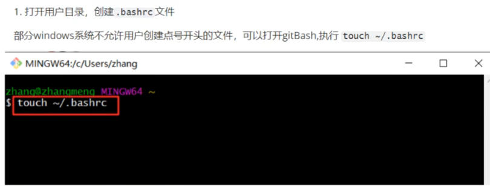
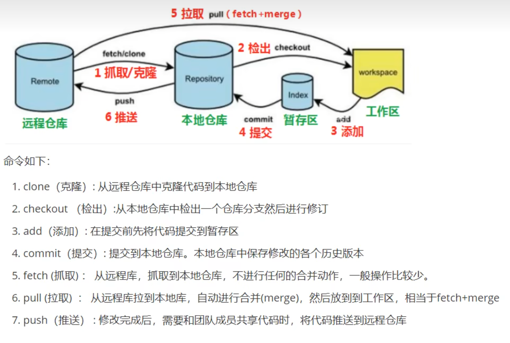
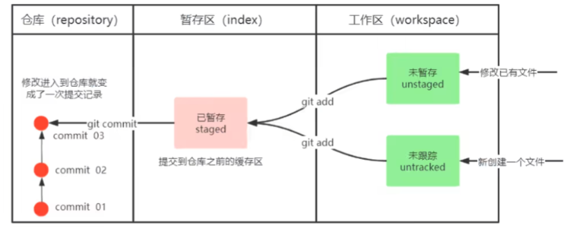
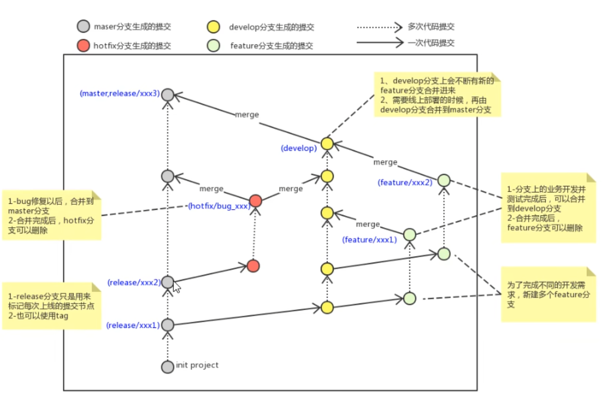
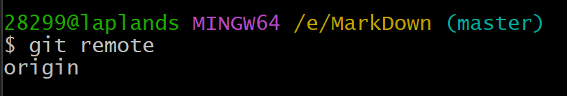

# git 安装与常用命令
- ls/ll
- cat 查看文件内容
- touch 创建文件
- vi 编辑器


## 配置
1. 打开Git Bash
2. 设置用户信息
```
git config --global user.name 用户命zzx

git config --global user.password 密码

git config --global user.email "1548429568@qq.com"
```
查看配置信息
```
git config --global user.name
```

给常用指令配置别名(可选)
1. 打开用户目录创建`.bashrc`文件
部分win系统不允许用户创建点号开头的文件



2. 然后在.bashrc文件中写:
```bash
alias git-log='git log --pretty=oneline --all --graph --abbrev-commit'
alias ll='ls -al'
```
3. 再执行
```bash
source ~/.bashrc
```
4. 解决GItBash乱码问题
  - 打开GitBash执行：
  `git config-- global core.quotepath false`
  - ${git_home}/ect/bash.bashrc 文件下加入
  `export LANG="zh-CN.UTF-8"`
  `export LC_ALL="zh-CN.UTF-8"`


## git工作流


# 获取本地仓库

要使用Git对我们的代码进行版本控制，首先需要获得本地仓库
(1) 在电脑的任意位置创建一个空目录（例如test）作为我们的本地Git仓库

(2)进入这个目录中，点击右键打开Gitbash窗口

(3)执行命令git init

(4)如果创建成功后可在文件夹下看到隐藏的.git目录。

# 基础指令


## add
1. git add . 
添加文件到缓存区 通配符为.

## statius
2. git status 
查看当前文件状态
## commit
3. git commit -m "注释" 
添加文件到仓库
## log
4. git log
命令形式: git log [option]
options:
  - all显示所有分支
  - pretty=oneline将提交信息显示为一行
  - abbrev-commit使得输出的commitld更简短
  - graph以图的形式显示


前面已经配置过了
直接使用 ```git-log```即可

`git reflog `查看之前所有的操作

## 版本回退
作用：版本切换
```
git reset --hard commitID
```

Commid可以使用Git-1og或Gitlog指令查看

Git reflog这个指令可以看到已经删除的提交记录

## 忽略文件
如果一些文件不想纳入git管理，可以创建一个.gitignore文件，列出需要忽略的文件模式


# 分支

几乎所有的版本控制系统都以某种形式支持分支。使用分支意味着你可以把你的工作从开发主线上分离开来进行
重大的Bug修改、开发新的功能，以免影响开发主线。

## 查看本地分支
```git branch```
## 创建本地分支
```git branch 分支名```
## 切换分支
```git checkout 分支名```
切换一个不存在的分支，创建并切换
`git checkout -b 分支名`
## 合并分支
`git merge 分支名称`

## 删除分支
`git branch -d b1 `
删除分支时，需要做各种检查

`git branch -D b1 `
不做任何检查，强制删除
## 合并分支时的冲突
merge时有冲突
手动修改，然后再add commit

只有在master和dev上**都有修改时**才会有分叉的出现，也就是git-log上面的拱形的分支合并

如果只带dev上面有修改，然后合并到master上，不会有分叉，这叫**合并的快进模式**

## 开发中的分支使用原则与流程
几乎所有的版本控制系统都以某种形式支持分支。使用分支意味着你可以把你的工作从开发主线上分离开来进行
重大的Bug修改、开发新的功能，以免影响开发主线。
在开发中，一般有如下分支使用原则与流程：

- **master(生产)分支**
线上分支，主分支，中小规模项目作为线上运行的应用对应的分支
- **develop(开发)分支**
是从master创建的分支，一般作为开发部门的主要开发分支，如果没有其他并行开发不同期上线要求，都可以在此版本进行开发，阶段开发完成后，需要是合并到master分支，准备上线。
- **feature/xxxx分支**
从develop创建的分支，一般是同期并行开发，但不同期上线时创建的分支，分支上的研发任务完成后合并到develop分支。
- **hotfix/xxxx分支**
从master派生的分支，一般作为线上bug修复使用，修复完成后需要合并到master、test、develop分支
- 还有一些其他分支，在此不再详述，例如test分支（用于代码测试）、pre分支（预上线分支）等等。


# Git远程仓库
1. github
2. 码云
3. GitLab


## 配置SSH公钥

生成SSH公钥
`ssh-keygen -t rsa`
不断回车即可

Gitee设置账户共公钥
* 获取公钥
* `cat ~/ssh/id_rsa.pub

把你需要推送远程仓库的文件绑定联系
在Git Bash中输入
```
git remote add origin 获取的SSH公钥
```
例如
```
git remote add origin git@gitee.com:laplands/git_photos.git
```


## 查看远程仓库
`git remote`


## 推送远程仓库
命令：
`git push[-f][-set-upstream][远端名称[本地分支名][:远端分支名]]`
- 如果远程分支名和本地分支名称相同，则可以只写本地分支
- `git push origin master`
- -f表示强制覆盖

`--set-upstream`推送到远端的同时并且建立起和远端分支的关联关系。
如果当前分支已经和远端分支关联，则可以省略分支名和远端名。
```
git push --set-upstream origin master
```

```
git push
```
将master分支推送到已关联的远端分支。

## 查看关联管理

查看本地分支与远程分支的关联关系
```
git branch -vv
```

# 克隆
```
git clone 项目地址 [名字]
```
是直接把整个项目全部克隆过来

库中抓联有拉
远程分支和本地的分支一样，我们可以进行merge操作，只是需要先把远端仓库里的更新都下载到本地，再进行操作。

**抓取命令:**
`git fetch [remote name] [branch name]`

**抓取指令就是将仓库里的更新都抓取到本地，不会进行合并**
如果不指定远端名称和分支名，则抓取所有分支。


**取** 
命令:
`git pull [remote name] [branch name]`
拉取指令就是将远端仓库的修改拉到本地并自动进行合并，等同于fetch+merge
如果不指定远端名称和分支名，则抓取所有并更新当前分支。


