java字符串常用操作


#### **判断两字符串是否相同(不忽视大小写)**
```java

boolean a = str1.equals(str2);
```
<br>

#### **判断两字符串是否相同(忽视大小写)**
```java

boolean a = str1.equalsIgnoreCase(str2);
```
<br>

#### **获取字符串单个字符**
```java
int index = 0;
String s = "str123";
char c = s.charAt(index);
```
<br>

#### **获取字符串长度**
```java
String s="asdf";
int len=s.length();
```
<br>

#### **字符串切片操作**
```java
String s = "1234564789";
String s1 = s.substring(3,6);//左取右不取
```

#### **字符串替换**
```java
String s="asgfs";
s=s.replace("a","1");
//
```
#### 判断是否以特定前缀开头
```java
String myStr = "Hello";
System.out.println(myStr.startsWith("He")); // 输出 true
System.out.println(myStr.startsWith("e")); // 输出 false
```
#### 切割 split
```java
String s = "12346579";
String[] s1 = s.split("4");
for (String string : s1) {
    System.out.println(string);
}
```

#### **StringBuilder()操作**
```java
StringBuilder sb = new StringBuilder;
sb.append("asf");//添加
sb.reverse();//翻转
int len = sb.length();//求长度
String s = sb.toString();//把StringBuilder 变成 String
```
#### **StringJoiner()操作**
StringJoiner(间隔符号)  
创建StringJoiner对象，指定拼接时的间隔符号
StringJoiner(间隔符号,开始符号，结束符号)  
创建StringJoiner对象，指定拼接时的间隔符号，开始符号，结束符号


```java
StringJoiner sj = new StringJoiner("---");
sj.add("asf");
sj.length();
sj.toString();
```

### 集合列表操作
#### **ArrayList操作**

<>中为集合中类型,要写所对应的包装类
byte -> Byte
short -> Short
char -> Character
int -> Integer
long -> Long
float -> Float
double -> Double
boolean -> Boolean

java中集合只能存储一种数据类型
#### **定义列表**
```java
ArrayList<String> list = new ArrayList<String> ();
// <>中为集合中类型
```
#### **添加数据**
```java 
list.add("asdf");
//boolean bool = list.add("asdf");
System.out.println(list);
```

#### **删除数据(根据索引删除)**
```java
list.remove(2);
//String s = list.remove(2);
//删除索引为2的元素
```

#### **删除数据(根据数据删除)** 
```java
String s = list.remove("asdf");
//list.remove("asdf");
//删除括号中元素
```

#### **修改替换值**
```java
String s = list.set(1,"aaa");
//把1索引的值修改成"aaa",并且把1索引的值赋值给s
```

#### **查询索引的值**
```java
String s = list.get(1);
//把索引为1的值给s
```

#### **获取集合的长度**

```java
int a = list.size();
//获取长度
```

### static
#### 静态变量
**特点：**
- 被该类的所有对象共享

**调用方法：**
- 类名调用
- 对象名调用
#### 静态方法
**特点：**
- 多在测试类和工具类中
- Javabean类中很少会用

<font color = FF0000>静态方法中是没有this的</font>

**调用方法：**
- 类名调用
- 对象名调用

#### 静态代码块
特点


#### 工具类
帮助我们做一些事情的，但是不描述任何事物的类
**要私有化构造方法**

```java
public class ArrayUtil{
    private ArrayUtil(){}
}
```
定义方法时候，最好定义静态的，方便调用


### 继承
Java中提供extends关键字，让一个类和另一个类建立起继承关系
只支持单继承：一个子类只能继承一个父类

```java
public class Student extends Person{}
```

子类只能访问父类中非私有的成员

打印子类的成员用**this**
打印父类的成员用**super**

#### 语法
- 继承中不能继承父类的构造方法，但是可以通过super调用
- 子类构造方法的第一行，有一个默认的super()
- 默认访问附列中午餐的构造方法，在执行自己
- 如果要访问父类的有参构造，要写super(参数)

```java
//父类
public class Person {
    String name;
    int age;

    public Person(String name, int age) {
        this.name = name;
        this.age = age;
    }

    public Person() {
    }
}
//子类
class Student extends Person {
    public Student() {
    }

    public Student(String name, int age) {
        super(name, age);
    }
}
//主程序
public class Text {
    public static void main(String[] args) {
        Student stu = new Student("asf",16);
        System.out.println(stu.name);
    }
}
```

#### 重写继承中方法

当父类中的方法，不满足子类现在的需求时，需要吧这个方法进行重写

**1.** 重写方法的名称，形参列表必须与父类中的一致

**2.** 子类重写父类方法时，返回值类型子类必须小于等于父类

**3.** 子类重写父类方法时，访问权限子类必须大于等于父类

**4.** 建议 ：重写的方法尽量和父类保持一致

**5.** 只有被添加到虚方法表中的方法才能被重写

**在重写的方法的上面要加上@Override**

```java
@Override
public void eat(){
    System.out.println("asgf");
}

```
### 多态
同类型的对象，表现出不同的形态

父类类型 对象名称 = 自类对象

peison p = new Student();


多态的前提：
- 有继承关系
- 有父类引用指向子类对象
- 有方法重写

使用父类型作为参数，可以接受所有子类对象

#### 多态调用成员的特点
- 变量调用：编译看左边，运行也看左边
- 方法调用：编译看左边，运行看右边

<br>
<br>

*判断对象是否为某类型*
```java
if(a instanceof Dog){
    Dog d = (Dog)a;
}else if(a instanceof Cat){
    Cat c  = (Cat)a;
}else{
    System.out.println("无这个类型")
}
```

### final
final修饰方法:表明该方法是最后最终方法
final修饰基本数据类型，记录的值不能发生改变

记录的地址值不能发生改变
内部属性值可以改变


### 权限修饰符
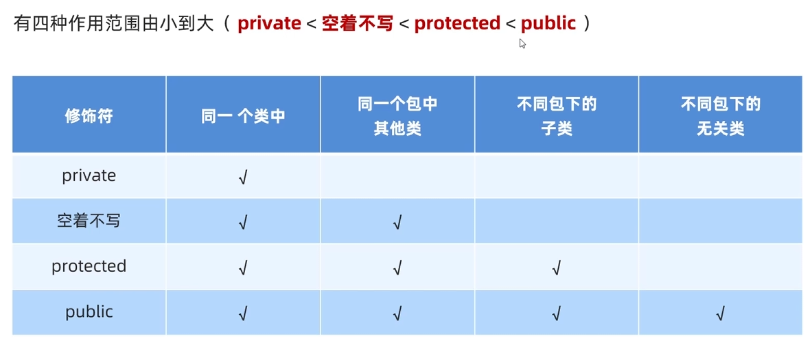


### 抽象类
抽取共性时，无法确定方法体，把方法定义为抽象的
强制让子类按照某种格式重写
抽象方法所在的类，一定是抽象类
加上abstract关键字

### 接口
接口就是一种规则

接口用关键字interface来定义
```java
public interface 接口名 {}
```

接口不能实例化

接口和类之间是实现关系，通过implements关键字表示
```java
public class 类名 implements 接口名{}

```
接口的子类（实现类）
- 重写接口中所偶的抽象方法 
- 要么是抽象类

注意：
1. 接口和类实现关系，可以但实现，也可以多实现
```java
public class 类名 implements 接口名1，接口名2{}
```
2. 实现类可以在继承一个类的同时实现多个接口
```java
public class 类名 extends 父类 implements 接口名1，接口名2{}
```

#### 接口成员方法
- 成员变量：
只能是常量
默认修饰符：public static final
- 没有构造方法
- 成员方法
  只能是抽象方法
  默认修饰符 ：public abstract

接口和接口之间是继承关系的话，可以单继承，也可以多继承
如果实现类实现了最下面的子接口，那么要重写所有的抽象方法

#### 接口方法

接口代表规则，是行为的抽象，想要让哪个类拥有一颗行为，就让这个类实现对应的接口
当一个方法的参数是接口时，可以传递接口所有实现类的对象，这成为接口多态

#### 适配器
1. 当一个接口中抽象方法过多时，但我只要使用其中一部分的时候，可以使用适配器设计模式
2. 书写步骤

    编写中间类XXXAdapter，实现对应的接口
    对接口中抽象的方法进行空实现
    让真正的实现类继承中间类，并重写需要用的方法
    为了避免其他类创还能适配器类的对象，中间的适配器类用abstract进行修饰
### 内部类
内部类可以直接访问外部来的成员包括私有
外部类要访问内部类的成员，要创建对象

#### 成员内部类
1. 成员内部类可以被一些修饰符修饰
2. 在成员内部类中，JDK16之前不能定义静态变量，JDk16后可以


获取成员内部类的对象的两种方式
1. 当成员内部类被private修饰时，外部类编写方法，对外提供内部类对象(private)
2. 被非私有修饰时，直接创建
```java
Outer.Inner oi = new Outer().new Inner();

```
外部类成员变量和内部类成员变量重命名时，在内部类如何访问：
```java
System.out.println(Outer.this.变量名);
```

#### 静态内部类
静态内部类只能访问外部类中静态变量和方法，如果访问非静态的需要创建对象
创建静态内部类对象的格式：
```java
Outer.Inter oi = new Outer.Inter();
```
调用非静态方法的格式:先创建对象，用对象调用方法
调用静态方法的格式：**外部类名.内部类.方法名();**

#### 局部内部类

#### 匿名内部类
隐藏了名字的内部类，可以写在成员位置，也可以写在局部位置
匿名内部类的格式：

```java
new 类名或者接口名(){
    重写方法;
};

```

包含了继承或者实现，方法重写，创建静态内部类对象的格式
整体就是一个类的子类对象或者接口的视线类对象

使用：
当方法的参数是接口或者类时，
以接口为例，可以传递这个接口的实现类对象，
如果实现类是需要实现一次，就可以用匿名内部类简化代码

### 打包exe安装包
核心步骤：
1. 把所有的代码打包成一个压缩包，jar后缀的压缩包
2. 把jar包转换成exe安装包
3. 把第二部的exe，图片，jdk整合在一起，变成最终的exe安装包

### 常用API
#### 正则表达式
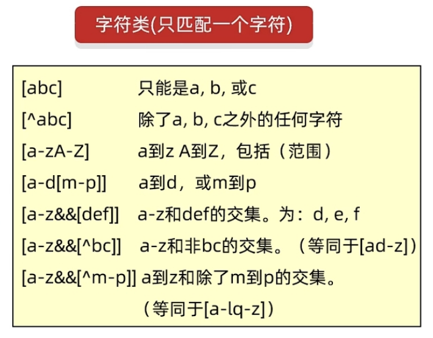
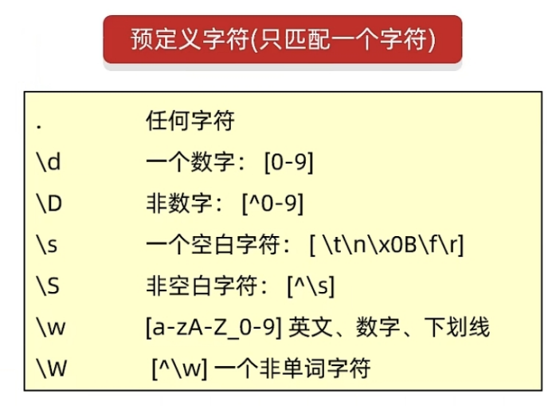
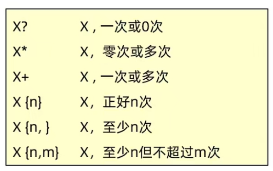


#### LocalDate
Date：存储的是自Unix纪元以来的毫秒数，因此它的精度是到毫秒级别。
LocalDate：只表示日期，没有时间信息，精度到天。
LocalDateTime：同时表示日期和时间，精度同样是到纳秒级别。
plus - 按给定数量增加日期值
begin.plusDays(x)增加x天


#### System
##### 1. exit
方法的形参：
状态码：
0:表示当前虚拟机是正常停止
非0:表示当前虚拟机异常停止
```java
System.exit(0);
```
当需要把整个程序结束的时候，可以调用这个方法

##### 2. System.currentTimeMillis
获取该程序运行时的毫秒时间
1970年1月1日 08:00:00开始计时

```java
start = System.currentTimeMillis();
```
可以统计程序运行了多长时间

##### 3. System.arraycopy

``` java 
int [] arr1 = new int{1,2,3,4,5,6};
int [] arr2 = new int[10];
System.arraycopy(arr1,0,arr2,0,6);
```
参数1：数据源，要拷贝的数据从哪个数组而来
参数2：从数据源数组中的第几个索引开始拷贝
参数3：目的地，要把数据拷贝到那个数组中
参数4：目的地参数的索引
参数5：拷贝的个数

注意：
1. 如果数据源数组和目的地数组都是基本数据类型，要求保持一致
2. 拷贝时要考虑数组的长度
3. 如果数据源数组和目的地数组都是引用数据类型，那么子类类型可以赋值给父类类型
```java
Student[] arr1 = {s1,s2,s3};
Person[] arr2=new Person[3];
System.arraycopy(arr1,0,arr2,0,3);
Student stu = (Student)arr[0];
//可以类型强转
```

#### Runtime
##### 1. getRuntime
当前系统运行环境对象
```java
Runtime r1 = Runtime.getRuntime();
```

##### 2. exit
停止虚拟机
和System中的exit一样
```java
Runtime.getRuntime.exit(0);
```
##### 3. availableProcessors
获取CPU线程数
```java
println(Runtime.getRuntime.availableProcessors());
```
##### 4. maxMemory
获取JVM能从系统中获取总内存大小(单位：byte)
1kb = 1024byte
1MB = 1024kb
```java 
Runtime.getRuntime.maxMemory();
```

##### 5. totalMemory
已经获取的总内存大小,单位字节
```java
Runtime.getRuntime.totalMemory();
```
##### 6. freeMemory
剩余的内存大小内存大小,单位字节
```java
Runtime.getRuntime.freeMemory();
```
##### 7. exec
运行cmd命令
```java
Runtime.getRuntime.exec("");
//括号中为命令
```

shutdown:关机
加上参数才能执行
-s:默认一分钟后关机
-s -t：指定时间：关机时间，秒钟
-a：取消关机操作
-r：关机并重启

#### Object
##### toString
返回字符串对象
```java
Object obj = new Object()
String s = obj.toString()
```
println方法，在打印一个对象时，底层会调用toString方法，把对象变成字符串

Object类中，toString方法，把对象变成字符串打印的是地址值
需要把这个方法重写

##### equals

比较两个对象是否相等
默认比较的是地址值
需要把这个方法重写

##### clone
Object中的克隆是浅克隆

这个方法是用protected修饰，受保护的
需要重写，一般在javabean中书写，相当于让Java帮我们克隆一个对象，并把克隆后的对象返回出去

需要再当前这个类调用Cloneable这个接口
这个接口没有抽象方法
表示当前接口是一个标记性接口


```java
@Override
    protected Object clone() throws CloneNotSupportedException {
        return super.clone();
    }
```

**注意：**
重写object中的clone方法
让Javabean类实现cloneable接口

***对象克隆：***
**1. 浅克隆**
 不管对象内部的属性是基本数据类型还是引用数据类型，都完全拷贝过来
**2. 深克隆**
基本数据类型拷贝过来
字符串复用
引用数据类型会重新创建新的

#### Objects
##### 比较对象：equals
先做非空判断，在比较两个对象
```java 
int a = null;
int b = 1;
Boolean bool = Objects.equals(a,b);
```
##### isNull
判断对象是否为空
```java
int a = null;
system.out.println(Objects.isNull(a));
//true
```
##### nonNull
判断对象是否为空,结果与isNull相反
```java
int a = null;
system.out.println(Objects.isNull(a));
//false
```
#### BigInteger
1. BigInteger(num，Random r)  获取随机大整数，范围[0~2的num次方)
2. BigInteger(String val)  获取指定大的整数
3. BigInteger(String val , int radix)   获取指定进制的大整数

**code :**

4. 随机获得一个pow(2,130)-1的整数
```java 

Random r = new Random();
BigInteger a = new BigInteger(130, r);
```
2. 获取一个指定大小的整数
注意类中参数为字符串，字符串中必须是整数
```java
BigInteger num = new BigInteger("123456789");
```

3. 获取指定进制大的整数
参数1为指定的进制整数， 参数2为进制
输出结果为该进制下的十进制数为多少
```java
BigInteger bd = new BigInteger("100",2);
//sout(bd)=4
```
4. valueOf
静态方法获取BigInteger的对象，内部有优化
BigInteger.valueOf()
内部只能穿long的取值范围，超出long就不行了
在内部对常用的-16~16数字进行优化
提前创建好-16~16的对象，多次获取不会创建新的

```java
BigInteger bd1 = BigInteger.valueOf(16);
BigInteger bd2 = BigInteger.valueOf(16);
System.out.println(bd1 == bd2);//true

BigInteger bd3 = BigInteger.valueOf(17);
BigInteger bd4 = BigInteger.valueOf(17);
System.out.println(bd3 == bd4);//false

```
#### BigDecimal

##### 构造方法获取对象
1. 通过传递double类型的小数来创建对象

**注意：**
这种方式有可能是不精确的，所以不建议使用

```java
BigDecimal bd1 = new BigDecimal(0.01)

```

2. 通过传递字符串创建对象
这种方式是精确的
```java 
BigDecimal bd1 = new BigDecimal("0.001");

```
3. 通过静态方法获取对象
如果传递的数是0-10之间的整数，那么方法会返回已经创建好的对象，不回重新new
```java
BigDecimal bd1 =  BigDecimal.valueOf(10);
// sout = 10.0
BigDecimal bd2 = BigDecimal.valueOf(10);
// sout(bd1==bd2);true

```

细节：
当取值范围小于double时候，建议用静态方法
当取值过大，建议用字符串创建对象

##### 运算方法
###### add、加法
```java
BigDecimal bd1 = new BigDecimal(1.0);
BigDecimal bd2 = new BigDecimal(2.0);
BigDecimal bd3 = bd1.add(bd2);
System.out.println(bd3);
```
###### subtract、减法
```java
BigDecimal bd4 = bd1.subtract(bd2);
```
###### multiply、乘法
```java
System.out.println(bd1.multiply(bd2));
```
###### divide、除法

1. 当可以整除时：
```java
BigDecimal bd1 = new BigDecimal(10);
BigDecimal bd2 = new BigDecimal(2);
System.out.println(bd1.divide(bd2));
```
2. 当不能整除时：
参数1：除数
参数2：保留几位小数
参数3：舍入模式
```java
BigDecimal bd1 = new BigDecimal(10);
BigDecimal bd2 = new BigDecimal(3);
System.out.println(bd1.divide(bd2,2, RoundingMode.HALF_UP));
```
四舍五入：RoundingMode.HALF_UP

#### Arrays
这个类是操作数组的工具类
里面的方法都是静态方法，直接用'.'调用即可

##### toString
数组变字符窜类型
输出的和Python中list一样

```java
int[] arr = {1,23,3,5,6,13,1,6,61,54};
System.out.println(Arrays.toString(arr));
//[1, 23, 3, 5, 6, 13, 1, 6, 61, 54]
```


##### 查找元素的索引：binarySearch
传入要查询的数组和元素，返回值为下标索引
如果查询元素存在，返回真实的索引
否则返回-插入点-1
```java
System.out.println(Arrays.binarySearch(arr,1));
```

##### 拷贝数组1：copyOf
把arr的数组的前n个拷贝给一个新的数组
如果n > arr.length,其余默认补0
```java
int[] newarr = Arrays.copyOf(arr,3);
//newarr = [1,23,3]
```
##### 拷贝数组(指定范围)：copyOfRange
包头不包尾
```java
int[] newarr1 = Arrays.copyOf(arr,3,7);
//newarr = [5, 6, 13, 1]
```

##### 填充数组：fill
把指定的数组全部替换成你指定的字符
```java
Arrays.fill(arr,100);
//arr = [100, 100, 100, 100, 100, 100, 100, 100, 100, 100]
```
##### 排序：sort
底层为插入排序和二分查找
默认为升序
```java
Arrays.sort(arr);
```
**倒序排序：**

传递匿名内部类，传递一个接口的实现类

```java
Integer[] arr = {1, 23, 3, 5, 6, 13, 1, 6, 61, 54};
Arrays.sort(arr, new Comparator<Integer>() {
    @Override
    public int compare(Integer o1, Integer o2) {
        return o2 - o1;
    }
});

```

#### Lambda

<font color=#FF0000 >函数式编程：</font>
函数式编程是一种思想的特点

函数式编程思想，忽略面向对象的复杂语法，<font color=#FF0000>强调做什么，而不是谁去做</font>

Lambda 表达式是JDK 8 开始后的一种新语法形式

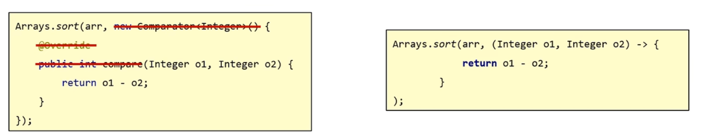
- Lambda表达式可以用来简化匿名内部类的书写
- 只能简化函数式接口的匿名内部类的写法，抽象类不能用Lambda
- 函数式接口：有且仅有一个首相方法的接口焦作函数式接口，接口上方可以加@FunctionalInterface注解


<font color=#FF0000 >Lambda省略写法：</font>

- 参数类型可以省略不写
- 如果只有一个参数，参数类型可以省略，同时（）可以省略
- 如果Lambda表达式的方法体只有一行，大括号分号return可以省略，需要同时省略

```java
Arrays.sort(arr, (o1, o2)-> o2 - o1);
System.out.println(Arrays.toString(arr));
//逆序排序
```

### 数据结构
#### 红黑树

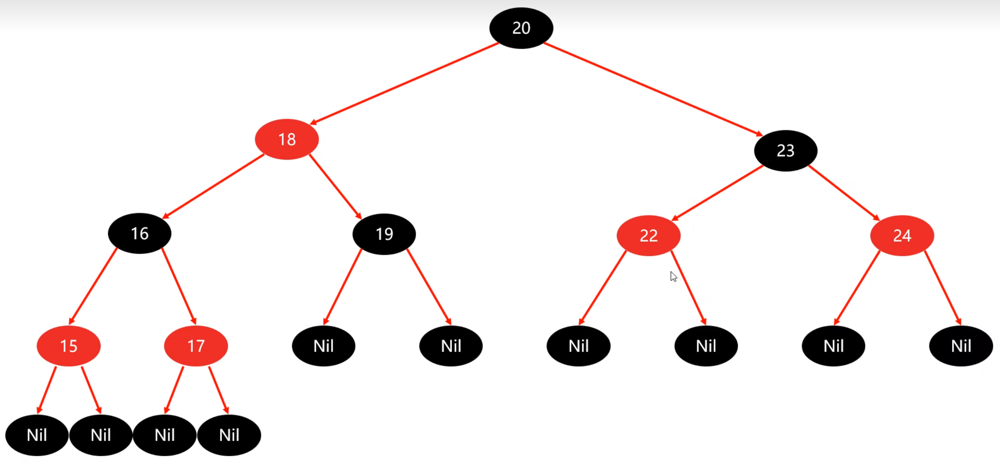

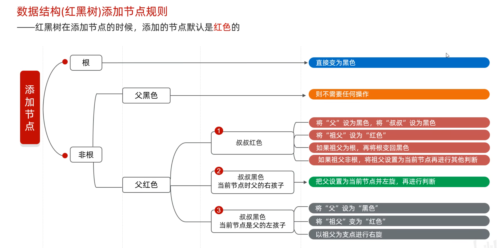

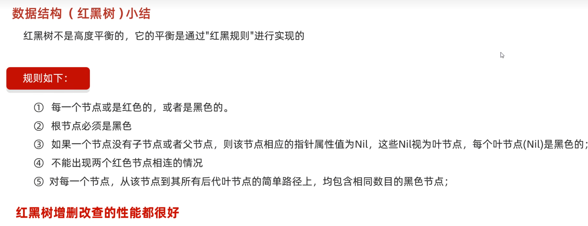

### 集合

集合分为：

1. **单列集合：Collection**
2. **双列集合:Map**
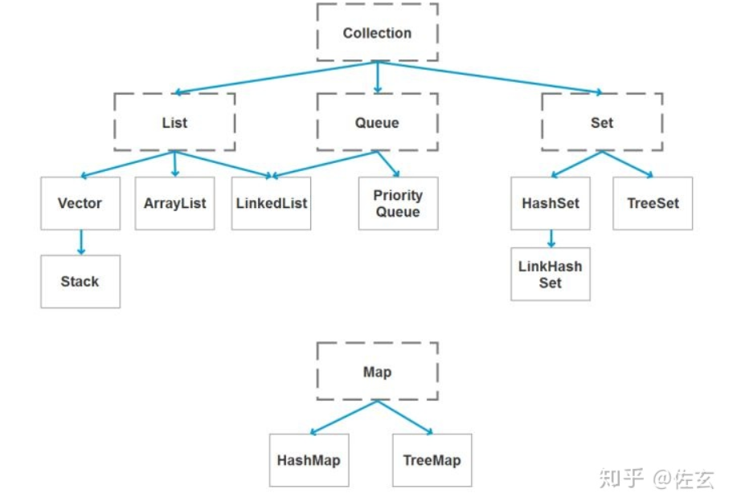
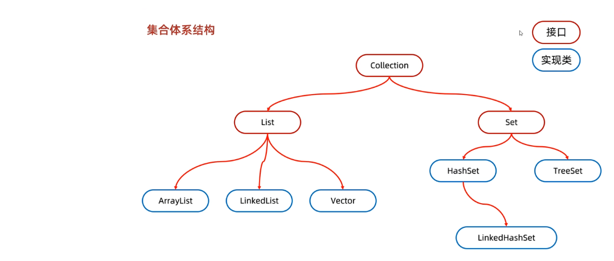
**List系列集合：**添加的元素是有序的，可重复，有索引

**Set系列集合**：添加的元素是无序的，不重复，无索引

#### Collection

Collection是单列集合的祖宗接口，他的功能是全部单列集合都可以继承使用的

打印时可以直接打印变量名
##### Collection相关操作：

##### 添加元素：add
如果往List系列添加数据，方法永远返回true
如果往Set系列添加元素，如果元素不存在返回true，存在的话返回false

```java
Collection coll = new ArrayList<>();
Boolean b = coll.add("asdf");
//true
```
##### 清空集合：clear
```java
coll.clear();
```
##### 删除元素：remove
因为Collection中定义的是共性的方法
所以不能用索引删除
```java
coll.remove("a");
```

##### 判断集合是否包含：contains
底层通过循环遍历，依赖equals方法进行判断是否存在

如果是自己写的类，用equals比较的是地址值
需要在自定义的javabean中重写equals方法
```java
System.out.println(coll);
boolean b = coll.contains("a");
System.out.println(b);
```

##### 判断集合是否为空:isEmpty()
```java 
Boolean b = coll.isEmpty();
//  true/false
```
##### 求集合的长度：size()
```java 
int a = coll.size();
```
#### Collection的遍历方式

##### 迭代器遍历
迭代器不依赖索引
迭代器在Java中的类是Iterator,迭代器是集合专用的遍历方式

**需要先获得迭代器对象**
迭代器好比一个箭头，默认指向集合的0索引
```java
Collection<String> coll = new ArrayList<>();

Iterator<String> it = coll.iterator();
while(it.hasNext()){
    System.out.println(it.next());
}
```
指针不会复位，如果要再次遍历，需要再次获得迭代器对象
循环只能用一个next方法
迭代器遍历时，不能用集合的方法进行增加或者删除
删除时，要用迭代器提供的方法：remove方法
```java
it.remove("aaa");
```
next方法的两件事：
1. 获取元素
2. 移动指针

##### 增强for遍历

增强for格式：
for(数据类型 变量名 ： 集合/数组){

}

```java
Collection<String> coll = new ArrayList<>();
for (String s : coll) {
    System.out.println();
}
```
s是一个第三方变量，再循环的过程中一次表示集合中的每一个数据

快捷生成方式：
集合的名字.for

该方式与Python中的for类似


##### Lambda表达式遍历

与JDK8开始
匿名内部类的表示方式：
底层原理：
自己遍历集合，一次得到每一个元素
s表示集合中的每一个数据
```java 
coll.forEach(new Consumer<String>() {
    @Override
    //s表示集合中的每一个数据
    public void accept(String s) {
        
    }
});
```

简化后的Lambda表达式：
```java 
coll.forEach( s-> System.out.print(s+" "));
```


**三种遍历方式：**
- **迭代器**：在遍历时需要删除元素，可以用迭代器
- **增强for**：Lambda:仅仅想遍历，用这两种


#### List系列集合
- 有序
- 有索引
- 可重复
```java
List<String> list  = new ArrayList<>();
```
Collection的方法List都继承了
List特有的方法：
##### 增add
```java
//void add(int index,E element);
list.add(1,"asfdg");
```
##### 删remove
```java
//E remove(int index);
list.remove(1);
```
如果列表中是int类型
删除元素删除的是索引，而不是删除这个元素
调用方法时候，优先调用实参和形参相同的
如果要删除这个元素，要装箱操作
```java
Integer i = Integer.valueOf;
list.remove(i);
```
##### 改set
```java
//E set(int index,E element); 修改索引的元素，并且返回修改的元素
String result = list.set(0,"asg");
```
##### 查get
```java
//E get(int index);  查找索引元素
String s = list.get(0);
```
##### 特有的遍历
因为有索引
**有普通的for循环**

**列表迭代器**
在列表迭代器中可以添加元素
用迭代器自身的方法进行添加和删除
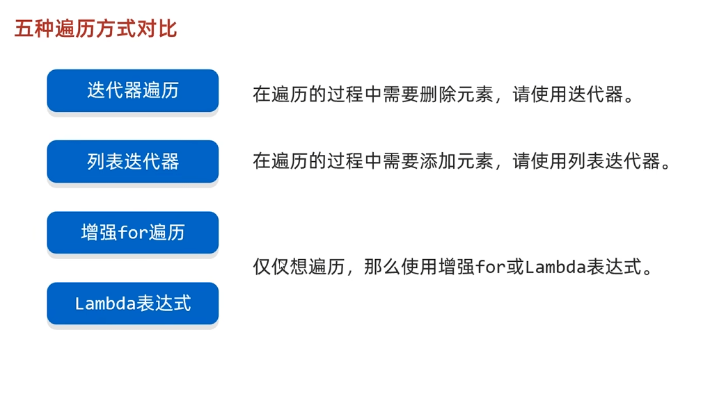

#### 泛型

<font color=#FF0000 >泛型：</font>是JDK5引入的特性，可以在编译阶段约束操作的数据类型
<font color=#FF0000 >泛型的格式：</font><数据类型>
注意：泛型只能支持引用数据类型

如果不写泛型
遍历集合时，类型为object,因为使用了多态的方式，所以不能访问子类特有的功能

泛型的好处：
- 统一数据类型
泛型中：
* 泛型中不能写几本数据类型
* 指定泛型具体类型后，传递数据时，可以传入该类型或者子类类型
* 如果不写泛型，类型默认是object
  
##### 泛型类
当一个类中，某个类型的数据类型不确定时，可以定义带有泛型的类
<font color = #FF0000>代码演示：</font>

<!-- 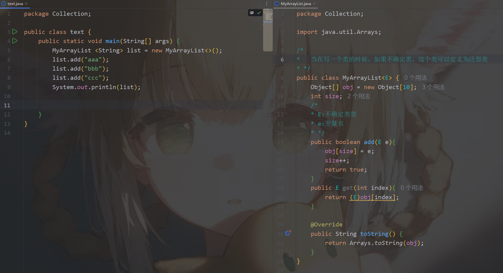 -->
```java

/*
*   当在写一个类的时候，如果不确定类，这个类可以定义为泛型类
* */
public class MyArrayList<E> {
    Object[] obj = new Object[10];
    int size;
    /*
    * E:不确定类型
    * e:变量名
    * */
    public boolean add(E e){
        obj[size] = e;
        size++;
        return true;
    }
    public E get(int index){
        return (E)obj[index];
    }

    @Override
    public String toString() {
        return Arrays.toString(obj);
    }
}
```
测试函数：

```java
public class text {
    public static void main(String[] args) {
        MyArrayList <String> list = new MyArrayList<>();
        list.add("aaa");
        list.add("bbb");
        list.add("ccc");
        System.out.println(list);
        
    }
}
```

##### 泛型方法
方法中形参类型不确定时
- 可以使用类名后面定义的泛型<E>    ，所有方法都能用
- 再方法上申明上定义自己的泛型，只有本方法能用
泛型要写在限制词后面
```java
public class ListUtil {
    private ListUtil(){}
    public static<E> void addAll(ArrayList<E> list ,E e1,E e2,E e3,E e4){
        list.add(e1);
        list.add(e2);
        list.add(e3);
        list.add(e4);

    }
    public static<E> void addAll(ArrayList<E> list ,E...e){
        for(E e1 : e){
            list.add(e1);
        }
    }
}
```
##### 泛型接口
当一个接口中类型不确定时，可以用泛型接口

泛型接口的使用方式：
实现类给出具体类型
实现类延续泛型，创建实现类对象时在确定类型

```java
public class MyArrayList2 implements List<String>{

}
```
```java
public class MyArrayList3<E> implements List<E>{

}

```
当遇到泛型接口时，如果可以确定类型，使用第一种
如果无法确定类型，使用第二种


##### 泛型的继承和通配符
泛型不具备继承性，但是数据具有继承性
泛型写的是什么类型，就只能传入什么类型的数据


泛型方法有弊端，可以传入任意的数据类型

当只想传递继承结构时可以使用泛型的通配符

<font color = #FF0000>？也表示不确定的类型</font>
<font color = #FF0000>他可以进行类型的限定</font>

**？ extends E:**表示可以传递E或者E所有的子类类型
**？ super E：**表示可以传递E或者E所有的父类类型
```java
class ye { }
class fu extends ye { }
class zi extends fu { }
public static void method(ArrayList<? extends ye> list) {}
public static void main(String[] args) {
    ArrayList<ye> list1 = new ArrayList<>();
    ArrayList<fu> list2 = new ArrayList<>();
    method(list1);
    method(list2);
}
```

应用：
1. 在定义类，方法，接口的时候，如果类型不确定，就可以定义泛型类，泛型方法，泛型接口
2. 如果类型不确定，但是知道以后只能传递某个继承体系中的，可以用泛型的通配符


#### Set系列集合
- 无序：存取顺序不一致
- 不重复：可以去除重复
- 无索引：没有带索引的方法，所以不能使用普通for循环遍历，也不能通过索引来获得元素
set的实现类：
- HashSet:无序，不重复，无索引
- LinkedHashSet:有序，不重复，无索引
- TreeSet:可排序，不重复，无索引

Set接口中的方法基本上与Collectin的api一致
遍历方式有三种：迭代器，增强for，Lambda表达式
##### HashSet
**底层原理：**
- 采用哈希表存储数据
- 是一种对于增删改查数据性能都很好的结构

哈希表的组成：
JDK8之前：数组+链表
JDK8开始：数组+链表+红黑树

1. 创建一个默认长度16，默认加载因子为0.75的数组，数组名为table
2. 根据元素的哈希值跟数组的长度 计算出应存入的位置
3. 判断当前位置是否为null，如果是null，直接存入
4. 如果位置不为null，表示有元素，则调用equals方法比较属性值
5. 一样：不存   不一样：存入数组，形成链表

JDK8之前：新元素存入数组，老元素挂在新元素下面
JDK8以后：新元素直接挂在老元素下面

JDK8以后：当链表长度<font color=FF0000>超过8</font>，并且数组的长度<font color=FF0000>大于等于64时</font>，自动转换成红黑树
如果集合总存储的是自定义对象，必须要在javabean中重写hashcode和equals方法

##### LinkedHashSet
继承了HashSet
有序，不重复，无索引
使用双向链表记录添加顺序
去重默认使用HashSet
##### TreeSet
可排序，不重复，无索引
可排序：按照元素的默认规则（从小到大）排序
底层基于红黑树的数据结构实现排序的，增删改查性能都很好
<font color = FF0000>传入自定义对象时候，要指定排序规则</font>


**排序一：**
<font color = FF0000>自然排序：</font>javabean类实现comparable结构指定比较规则

```java
@Override
public int compareTo(Students o) {
    return this.getAge() - o.getAge();
}
```
this:表示当前要添加的元素
o:表示已经在红黑树中的元素

返回值：
负数：认为添加的元素是小的，存左边
正数：腾威添加的元素是大的，存右边
0：认为已经添加的元素已经存在

**排序二：**

<font color = FF0000>比较器排序：</font>创还能TreeSet对象的时候，传递比较器Comparator指定规则

默认使用排序一，如果排序一不能满足当前需求，就是用第二种

```java
TreeSet<String> ts = new TreeSet<>(new Comparator<String>() {
    @Override
    //o1:当前要添加的元素
    //o2:在红黑树中已经存在的元素
    //返回值规则和之前一样
    public int compare(String o1, String o2) {
        //按照长度排序
        int i = o1.length() - o2.length();
        if (i == 0) i = o1.compareTo(o2);
        return i;
    }
});
```

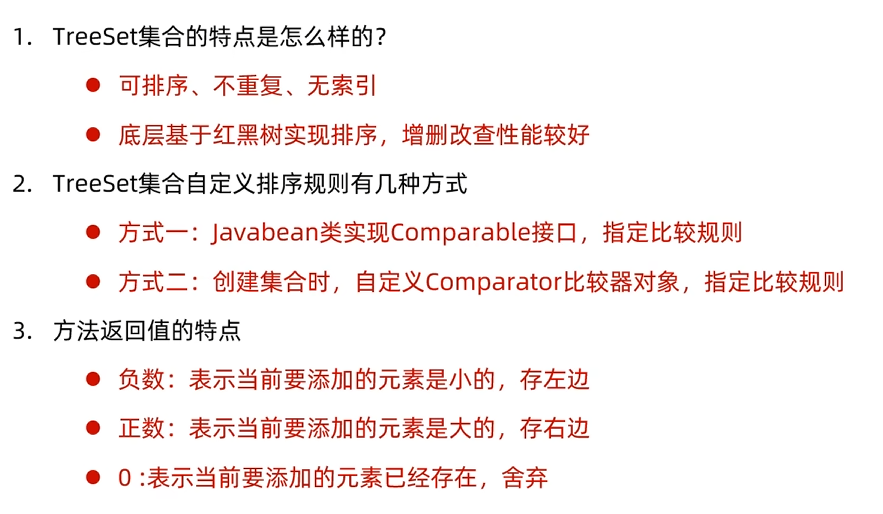


##### 使用场景
1. 集合中元素可重复
- 用ArrayList集合，基于数组
2. 集合中元素可重复，并且当前的<font color = FF0000>增删操作明显多余查询</font>
- 用LinkedList集合，基于链表
3. 对集合中的元素去重
- 用HashSet集合，基于哈希表
4. 对集合中的元素去重，并且<font color = FF0000>保证存取顺序</font>
- 用LinkedHashSet集合，基于哈希表和双链表，效率低于HashSet
5. 对集合中的元素进行<font color = FF0000>排序</font>
- 用TreeSet集合，基于红黑树。后序可以用List集合实现排序
  

<font color = FF0000>ArrayList和HashSet用的最多</font>

#### Collections
是集合的工具类
Collections不是集合，而是集合的工具类
常用API
1. 批量添加元素:addAll
2. 打乱List集合元素的顺序:shuffle
3. 排序:sort
4. 以二分法查找元素:binarySearch
5. 拷贝集合中的元素:copy
6. 使用指定的元素填充集合:fill
7. 用默认的自然排序获取最大/最小值:max/min
8. 交换集合中指定位置的元素:swap

#### Map
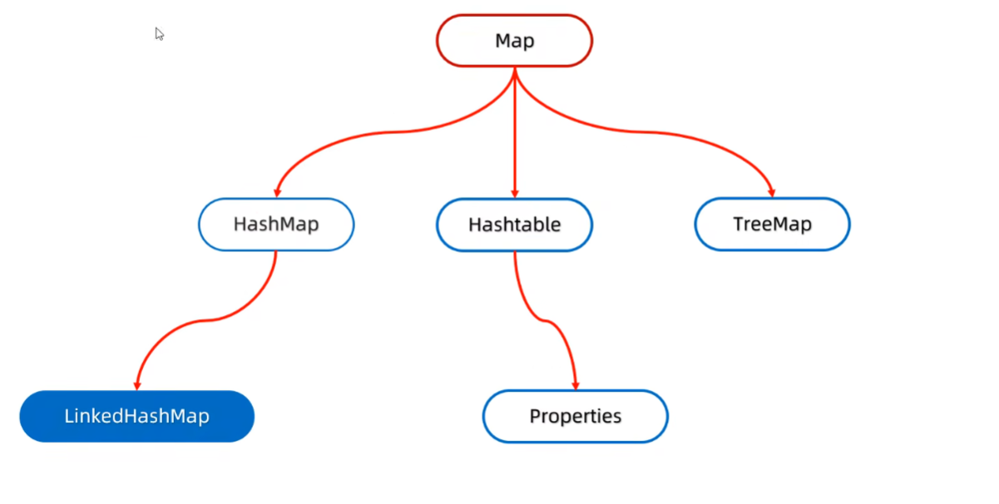
##### Map常用操作：
键不可重复
值可以相同
类似于Python中map

##### 构造对象
构造对象时，要构造实现类对象
```java
Map<String,String> map = new HashMap<>();
```
##### 添加元素:put
put方法：
添加、覆盖
再添加数据时，如果键不存在，那么把键值对对象添加到map集合中
在添加数据时，如果键是存在的，那么会把原有的键值对对象覆盖，会把覆盖的值进行返回
```java
map.put("zhangsan","123");
map.put("lisi","123");
map.put("wangwu","123");
System.out.println(map);
```

##### 删除元素:remove
传入key，删除整个键值对，然后把value返回
```java
String s = map.remove("list");
```

##### 清空:clear
清空整个集合
返回值为空
```java
map.clear();
```

##### 判断是否包含指定的键：containsKey
返回值为布尔类型
```java
Boolean boll = map.containsKey("lisi");
```

##### 判断是否包含指定的值：containsValue
返回值为布尔类型
```java
Boolean boll = map.containsValue("123");
```

##### 判断是否为空：isEmpty
返回值为布尔类型
如果为空，则返回true,否则返回false
```java
Boolean boll = map.isEmpty();
```
##### 取出所有的key:keySet
```java
Set<String> keys = map.keySet();

```
##### 获得相应的值：get
传入key，获得相应的值


##### 获取所有的键值对对象：EntrySet
```java
Set<Map.Entry<String, String>> entries = map.entrySet();
//[lisi=123, zhangsan=123, wangwu=123]
```


##### 遍历
1. 增强for
```java
Set<String> keys = map.keySet();
for (String key : keys) {
    System.out.println(key + " = " + map.get(key));
}
```

2. 迭代器
```java
Iterator<String> it = keys.iterator();
while(it.hasNext()){
    System.out.println(it.next());
}
```

3. Lambda
```java
keys.forEach(s -> System.out.println(s));
```
**键找值**
1. 获取所有的键值对对象，返回一个Set集合
2. 遍历这个集合获取每一个键值对对象
3. 通过get方法，传入key，可以获得值

**键值对**
**Lambda表达式**
##### HashMap
1. HashMap是Map的实现类
2. 直接调用Map的方法即可
3. 底层和HashSet一样，都是哈希表结构

如果键储存的是自定义对象，需要重写hashcode和equals方法
如果值储存的是自定义对象，不需要重写hashcode和equals方法

##### LinkedHashMap
1. 由键决定：有序，不重复，无索引
2. 有序指的是保证存储和取出的元素顺序一致
3. 底层原理是哈希表，双向链表

##### TreeMap
1. 底层与TreeSet原理一样，都是红黑树结构
2. 由键决定特性
3. 可排序：对键排序
4. 默认按照键从大到小进行排序，也可以自己规定键的排序规则
默认排序规则为升序 

排序规则
1. 实现Comparable接口，指定比较规则
2. 创建集合时传递Comparator比较器对象，指定比较规则


#### 可变参数
格式：
数据类型...参数名称
例:int...a


方法的形参的个数是可以发生变化的 0,1,2,3,4,5...
底层：创建了一个数组
只不过不需要我们自己创建了，java会自己创建好
```java
public static void main(String[] args) {
    int sum = sum(1, 2, 3, 4, 5, 6, 7);
    System.out.println(sum);
}
public static int sum(int... args) {
    int sum = 0;
    for (int arg : args) {
        sum += arg;
    }
    return sum;
}
```
注意：
1. **在方法的形参中，最多只能写一个可变参数**
2. **在方法形参中，如果出现了可变参数，还有其他的形参，那么可变参数要写在最后面**

作用：在形参中接受多个数据

### 不可变集合
不可被修改的集合
如果不想让别人修改集合中的内容，可以定义不可变集合

定义：
在List,Set,Map接口中，都存在静态的of方法，可以获取一个不可变的集合

<font color = FF0000>注意：</font>
这个集合不能添加，不能删除，不能修改
```java
List<Integer> list  = List.of(1,2,3,4,6);
System.out.println(list);

Set<Integer> set = Set.of(1,2,3,4,5);
System.out.println(set);

Map<Integer,Integer> map = Map.of(1,1,2,2,3,4,6,9);
System.out.println(map);
/*[1, 2, 3, 4, 6]
[3, 4, 5, 1, 2]
{2=2, 3=4, 6=9, 1=1}*/
```
可以进行索引查询

<font color = FF0000> 注意：</font>
获取一个不可变set集合时，里面的参数要保证唯一性
获取一个不可变Map集合时，里面的键要保证唯一性

Map里面的of，参数是有上限的，最多只能传递20个参数，也就是是个键值对
因为List和Set的of方法是可变参数，所以可以传递无数个
又因为在方法中只能传递一个可变参数，而Map有两个参数，一个是键，一个是值，不能定义两个可变参数


如果要创建超过20个参数的Map不可变集合

```java
Map<Object, Object> map = Map.ofEntries(m.entrySet().toArray(new Map.Entry[0]));
```

简单方法：
在jdk10才有
使用Map中的copyOf()方法
```java
Map<String, Integer> map = Map.copyOf(m);
```
### Stream流
使用步骤：
1. 先得到一条stream流(流水线),并把数据放上去
2. 使用中间方法对流水线上的数据进行操作
3. 使用终结方法对流水线上的数据进行操作

单列集合获取stream流：
直接获取
```java
ArrayList<Integer> list = new ArrayList<>();
Collections.addAll(list,2,3,4,5,68,73,13,1);
list.Stream().forEach(s->System.out.println(s));
```

双列集合不能直接获取
方法一：
获取所有的键(keySet)，然后放入stream流上
方法二：
获取所有的键值对对象(EntrySet)，然后放入stream流上
```java
HashMap<String,Integer> hm = new HashMap<>();
hm.put("aaa",1);
hm.put("bbb",2);
hm.put("ccc",3);
hm.keySet().stream().forEach(System.out::println);
hm.entrySet().stream().forEach(System.out::println);
```


数组获取stream流
调用arrays中的stream方法
```java
int[] arr = {1,2,3,4,5,6,9,8,9};
Arrays.stream(arr).forEach(s-> System.out.println(s));
```

零散的数据
```java
Stream.of(1,2,3,4,5).forEach(System.out::println);
```
#### 中间方法
中间方法，返回新的Stream流，原来的stream流只能使用一次，建议使用链式变成
修改Stream流中的数据，不会影响原来集合或数组中的数据
##### filter 过滤
```java
ArrayList<String> list = new ArrayList<>();
Collections.addAll(list,"aaa","bbb","ccc","sss","ddd");
list.stream().filter(new Predicate<String>() {
    @Override
    public boolean test(String s) {
        //如果返回值为true，则当前数据流下
        return s.startsWith("a");
    }
}).forEach(s-> System.out.println(s));
```
```java
list.stream().filter(s->s.startsWith("a")).forEach(s-> System.out.println(s));
```
##### 获取前几个元素 limit
limit中的参数为int，含义为个数，并非索引
```java
list.stream().limit(2).forEach(s-> System.out.println(s));
```
##### 跳过前几个元素 skip
参数为跳过几个参数
```java
list.stream().skip(3).forEach(s-> System.out.print(s+" "));
```
##### 元素去重 distinct
依赖Hashcode和equals方法
如果是自定义类型，要自己重写这两个方法 
利用Hashset方法去重
```java
list.stream().distinct().forEach(s-> System.out.println(s));
```
##### 合并集合 concat
```java
Stream.concat(list.stream(),list2.stream()).forEach(s-> System.out.println(s));
```
##### 类型转换 map

```java
//第一个为流中原本的数据类型，第二个为要转换的类型
list.stream().map(new Function<String, Integer>() {
    @Override
    public Integer apply(String s) {
        String arr = s.split("-")[1];
        return Integer.parseInt(arr);
    }
}).forEach(s-> System.out.println(s));
```

```java
list.stream().map(s->Integer.parseInt(s.split("-")[1])).forEach(System.out::println);
```
#### 终结方法
##### 遍历 forEach
```java
list.stream().forEach(s-> System.out.println(s));
```
##### 统计 count
<font color = FF0000>统计目前流中有多少个元素</font>

```java
long count = list.stream().count();
System.out.println(count);
```

##### 收集流中的数据，放到数组中 toArray

**空参：**
```java
Object[] array = list.stream().toArray();
System.out.println(Arrays.toString(array));
```
**有参数：**
参数作用：负责创建一个指定类型的数组
方法底层：会一次获得流里面的每一个数据，并把数据放到数组当中
返回值：装着流里面所有数据的数组
```java
//IntFunction的泛型：负责创建一个指定类型的数组
//apply形参：流中数据的个数，要跟数组的长度保持一致
//apply返回值：具体类型的数组
//方法体就是创建数组

String[] arr = list.stream().toArray(new IntFunction<String[]>() {
    @Override
    public String[] apply(int value) {
        return new String[value];
    }
});
```
Lambda表达式写法：

```java
list.stream().toArray(n->new String[n]);
```


##### 收集流中的数据，放到集合中 collect

**放入List中**

```java
List<String> collect = list.stream().collect(Collectors.toList());
```
**放入Set中**

```java
System.out.println(list.stream().collect(Collectors.toSet()));
```
**放入Map中：**
toMap:
参数一：表示键生成的规则
参数二：表示值生成的规则

参数一：
Function
泛型一：表示流中的每一个数据的类型
泛型二：表示Map集合中键的数据类型

方法apply形参：依次表示流里面的每一个数据
方法体：生成键的代码
返回值：已经生成的键

参数二：
Function
泛型一：表示流中的每一个数据的类型
泛型二：表示Map集合中值的数据类型

方法apply形参：依次表示流里面的每一个数据
方法体：生成值的代码
返回值：已经生成的值
```java
Map<String, String> collect = list.stream()
        .collect(Collectors.toMap(
        new Function<String, String>() {
            @Override
            public String apply(String s) {
                return s.substring(0,1);
            }
        }, new Function<String, String>() {
            @Override
            public String apply(String s) {
                return s.substring(1);
            }
        }));
```
Lambda省略写法:
```java
System.out.println(
        list.stream()
          .collect(Collectors
          .toMap(s -> s.substring(0, 1), s -> s.substring(2))));
```
<font color = FF0000>注意：</font>
<font color = FF0000>收集数据到Map集合，里面的键不能重复</font>

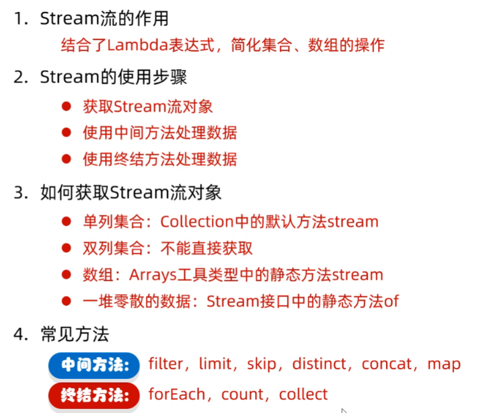
### 方法引用
把已经有的方法拿过来用，当做函数式接口中的抽象方法的方法体

使用条件：

1. 引用处必须是函数式接口
2. 被引用的方法必须已经存在
3. 被引用的方法的形参和返回值需要和抽象方法保持一致
4. 被引用的方法的功能要满足当前需求

```java
    public static void main(String[] args) {
        Integer[] arr = {5, 453, 45, 4, 753, 6, 8, 94, 651, 89, 8, 64};
        //Arrays.sort(arr, (o1, o2) -> o2 - o1);
        Arrays.sort(arr,demo1::subtraction);
        for (Integer i : arr) {
            System.out.print(i + " ");
        }
    }
    public static int subtraction(int num1,int num2){
        return num2-num1;
    }
```

*::是方法引用符号*

#### 方法引用的分类

##### 引用静态方法

<font color = FF0000>格式：</font>类名::静态方法

<font color = FF0000>范例：</font>Integer::parseInt

```java
List<String> list = new ArrayList<>();
Collections.addAll(list, "1", "2", "3", "4", "5", "6", "7");
list.stream()
     .map(Integer::parseInt)
     .forEach(s-> System.out.println(s));
```

##### 引用成员方法

<font color = FF0000>格式：</font>对象::成员方法

1. <font color = FF0000>其他类：</font>其他类对象::方法名

如果是在本类，而且是非静态的，需要先new一个自己的对象，然后进行调用

```java
   public static void main(String[] args){     
		list.stream()
            .filter(new demo2()::test)
            .forEach(s-> System.out.println(s));
    }
    public boolean test(String s){
        return s.length() == 3 && s.substring(0,1).equals("张");
    }
```


**<font color = FF0000>因为静态方法中没有this和super关键字，所以引用出不能是静态方法</font>**


2. <font color = FF0000>本类：</font>this::方法名

3. <font color = FF0000>父类：</font>super::方法名


##### 引用构造方法

<font color = FF0000>格式：</font>类名::new

<font color = FF0000>范例：</font>Student::new

```java
    public static void main(String[] args) {
        List<String> list = new ArrayList<>();
        Collections.addAll(list,"张无忌,15","周芷着,14","赵敏,13","张强,20","张三丰,100","张翠山,40","张良,35","王二麻子,37");
        //List<FunctionStudent> list1 = list.stream().map(s -> new FunctionStudent(s.split(",")[0], Integer.parseInt(s.split(",")[1]))).collect(Collectors.toList());
        List<FunctionStudent> List2 = list.stream()
                .map(FunctionStudent::new)
                .collect(Collectors.toList());
        System.out.println(List2);
    }
```

需要在自定义类型中写一个相对应的构造方法

```java
    public FunctionStudent(String str) {
        String[] arr = str.split(",");
        this.age =Integer.parseInt(arr[1]) ;
        this.name = arr[0];
    }
```

##### 类名引用成员方法

<font color = FF0000>格式：</font>类名::成员方法

<font color = FF0000>范例：</font>String::substring
方法引用的规则:
1. 需要有函数式接口
2. 被引用的方法必须已经存在
3. 被引用方法的形参，需要跟抽象方法的第二个形参到最后一个形参保持一致，返回值需要保持一致。
4. 被引用方法的功能需要满足当前的需求
抽象方法形参的详解:
第一个参数:表示被引用方法的调用者，决定了可以引用哪些类中的方法
在stream流当中，第一个参数一般都表示流里面的每一个数据。
假设流里面的数据是字符串，那么使用这种方式进行方法引用，只能引用string这个类中的方法
第二个参数到最后一个参数:跟被引用方法的形参保持一致，如果没有第二个参数，说明被引用的方法需要是无参的成员方法

```java
List<String> list1 = list.stream().map(String::toUpperCase).collect(Collectors.toList());
```
##### 引用数组的构造方法

<font color = FF0000>格式：</font>数据类型[]::new

<font color = FF0000>范例：</font>int[]::new

数据类型要与流中的数据类型一样

```java
String[] array = list.stream().toArray(String[]::new);
```
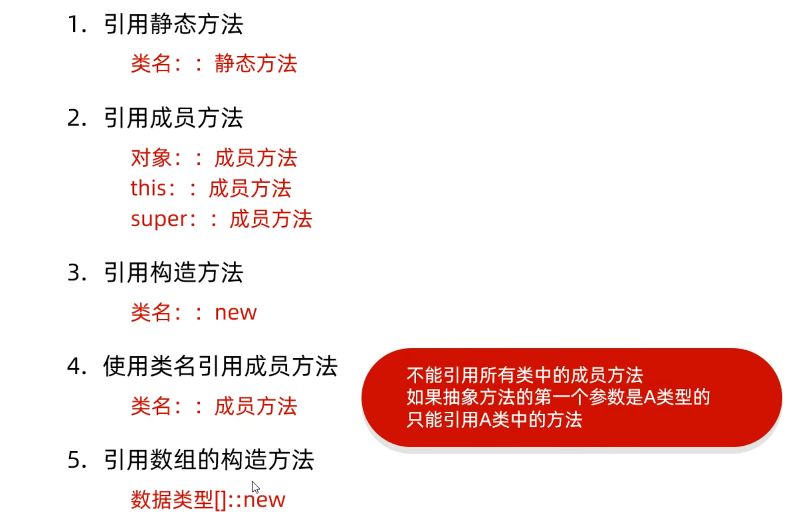
### 异常
异常就是代表程序出现的问题
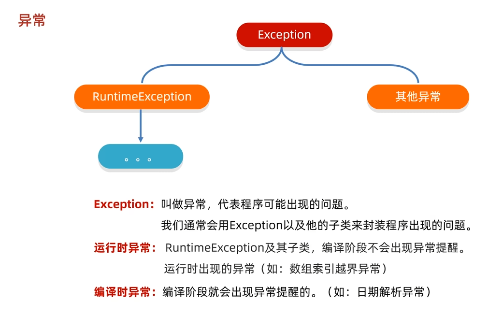

编译时异常：除了RuntimeExcpetion和他的子类，其他都是编译时异常。编译阶段需要进行处理，作用在于提醒程序员
运行时异常：RuntimeExcpetion本身和所有的子类，都是运行时异常。编译阶段不报错，是程序运行时出现的，一般是由于参数传递错误带来的问题
异常的作用：
<font color = FF0000>1. </font> 用来查询bug的关键参考信息
<font color = FF0000>2. </font> 可以作为方法内部的一种特殊返回值，以便通知调用者底层的执行情况
#### 捕获异常
格式：
```java
try{
    可能出现的异常代码
}catch(){
    异常的处理代码
}
```
与catch小括号中对比，看括号中的变量是否可以接受这个对象
如果能被接收，就表示该异常被抓住，执行catch对应的代码

如果try中有多个问题，可以写多个catch与之对应
如果要捕获多个异常，这些异常中如果存在父子关系，那么父类一定要写在下面

在JDK7中我们可以在catch中同时捕获多个异常，中间用 <font color = FF0000>|</font> 进项隔开；
如果出现这些异常，那么同时用这个方法进行处理

如果try中遇到的问题没有被捕获，那么直接会报错
如果try中遇到问题，会直接跳转到catch中进行运行，不会运行try后面的代码

#### getMessage方法

获得异常的信息

```java
int[] arr = {1,2,3,4,5,6};
try {
     System.out.println(arr[10]);
} catch (ArrayIndexOutOfBoundsException e) {
     String message = e.getMessage();
     System.out.println(message);
}
//Index 10 out of bounds for length 6
```


#### toString方法

获取异常的名字和异常的信息

```java
int[] arr = {1,2,3,4,5,6};
try {
     System.out.println(arr[10]);
} catch (ArrayIndexOutOfBoundsException e) {
     String string = e.toString();
     System.out.println(string);
}
//java.lang.ArrayIndexOutOfBoundsException: Index 10 out of bounds for length 6
```


#### printStackTrace方法

把错误信息以红色的信息打印到控制台，它不会停止虚拟机，会继续执行代码

他会获得toString()和getMessage的所有结果

他包含的信息是最多的，使用的是最多的


**输出语句**

```
System.out.println(123);
System.err.println(123);
```

第一行：为正常输出

第二场输出为红色字体：<font color= FF0000>123 </font>	

#### 抛出异常 throw throws
在方法中出现异常了
方法没有继续进行下去的意义了，采用抛出异常
让方法结束运行并告诉调用者出现了问题
#### 自定义异常
1. 定义异常类
2. 写继承关系
3. 空参构造
4. 带参构造

**起名字要见名知意**

运行时异常
继承：RuntimeException 核心：由于参数错误导致异常
编译：Exception 核心：提醒程序员检查本地信息

意义：就是为了让控制台的报错信息更加见名知意
### File
File对象就表示一个路径，也可以是文件的路径，也可以是文件夹的路径
这个路径可以是存在的，也可以是不存在的

在java中，路径拼接符为\\\\\
第一个\为转义字符，转义路径
拼接路径时候一定要用java提供的方法进行拼接，因为win系统中路径为\，但是在Linux系统重路径为/
在Java底层会根据不同的操作系统获取不同的拼接符号
#### 创建对象
##### 方式1
根据文件路径创建文件对象
```java
String s = "E:\\javayvan\\123.txt";
File f = new File(s);
System.out.println(f);
```

##### 方式2
根据父级路径和子级路径创建
```java
String parent = "E:\\javayvan";
String child = "123.txt";
File f1 = new File(parent,child);
System.out.println(f1);
```
##### 方式3
把File表示的路径和String拼接

```java
String parent = "E:\\javayvan";
File f1 = new File(parent);
String child = "123.txt";
File f2 = new File(f1,child);
System.out.println(f2);
// E:\\javayvan\\123.txt
```

#### 成员方法
##### 判断是否为文件夹 isDirectory
```java
String s1 = "E:\\javayvan";
File f = new File(s1);
System.out.println(f.isDirectory());
```

##### 判断是否为文件 isFile
```java
String s1 = "E:\\javayvan\\123.txt";
File f = new File(s1);
System.out.println(f.isFile());
```

##### 判断这个File是否存在 exists

```java
String s1 = "E:\\javayvan\\111.txt";
File f = new File(s1);
System.out.println(f.exists());
```

##### 求这个文件的大小 length()

放回的不是这个文件里内容的长度，而是这个文件的大小

只能求一个文件的大小，不能求一个文件夹的大小

<font color = FF0000>单位是字节，如果要求M，G ，需要/1024</font>


```java
String s1 = "E:\\javayvan\\123.txt";
File f = new File(s1);
System.out.println(f.length());
```

##### 获取文件的绝对路径 getAbsolutePath()

```java
String s1 = "E:\\javayvan\\123.txt";
File f = new File(s1);
String path = f.getAbsolutePath();
System.out.println(path);
// E:\javayvan\123.txt
```

##### 获取定义文件时的路径 getPath

```java
String s1 = "E:\\javayvan\\123.txt";
File f = new File(s1);
String path = f.getAbsolutePath();
System.out.println(path);
// E:\javayvan\123.txt
```

##### 获取名字 getName

如果File是一个文件，则返回文件名字+扩展名

如果是一个文件夹，则返回文件夹的名字


```java
String s1 = "E:\\javayvan\\123.txt";
File f = new File(s1);
String name1 = f.getName();
System.out.println(name1);
// 123.txt
```

##### 获取文件最后的修改时间 lastModified

返回值是毫秒值

需要进一步转化

```java
String s1 = "E:\\javayvan\\123.txt";
File f = new File(s1);
long l = f.lastModified();
```

##### 创建文件 createNewFile

创建一个新的文件

如果当前路径文件不存在，则创建成功返回true，如果存在，则创建失败返回false

如果父级路径不存在，则方法会有异常

该方法创建的一定是一个文件，如果路径中不包含后缀，则会创建一个不包含后缀名的文件

```java
String s1 = "E:\\javayvan\\111\\123.txt";
File f1 = new File(s1);
boolean newFile = f1.createNewFile();
```

##### 创建文件夹 mkdir

只能创建单级路径

在windows中路径是唯一的，如果存在这个路径则创建失败

```java
String s = "E:\\javayvan\\111\\1";
File f1 = new File(s);
boolean mkdir = f1.mkdir();
```

##### 创建文件夹 mkdirs

既可以创建单级路径，也可以创建多级路径

```java
String s = "E:\\javayvan\\111\\122\\13.txt";
File f1 = new File(s);
boolean mkdir = f1.mkdirs();
```

##### 删除文件，空文件夹 delete

如果删除的是文件，则直接删除，不走回收站

如果删除的是空文件夹，也是直接删除，不走回收站

如果删除的不是空的文件夹，则无法删除

```java
String s = "E:\\javayvan";
File f1 = new File(s);
System.out.println(f1.delete());
```

##### 获取当前路径所有的文件

1. 当调用者FIle表是的路径是不存在时候，返回null
2. 当调用者File表示的路径是文件时，返回null
3. 当调用者File表示的路径是一个空文件夹时，返回一个长度为0的数组
4. 当调用者File表示的路径是一个有内容的文件夹时，将里面所有的文件和文件夹的路径放在File数组中返回
5. 当调用者File表示的路径是一个有隐藏文件的文件夹时，将里面所有的文件和文件夹的路径放在File数组中返回，包含隐藏文件
6. 当路径是需要权限才能访问的文件夹时，返回null

```java
String s = "C:\\";
File f1 = new File(s);
File[] files = f1.listFiles();
for (File file : files) {
     System.out.println(file);
}
```


### IO
分类：
流的方向：
1. 输出流：读取input
2. 输入流：写出output

操作文件类型
1. 字节流：所有类型的文件
2. 字符流：纯文本文件

纯文本文件：Windows自带的记事本打开能读懂
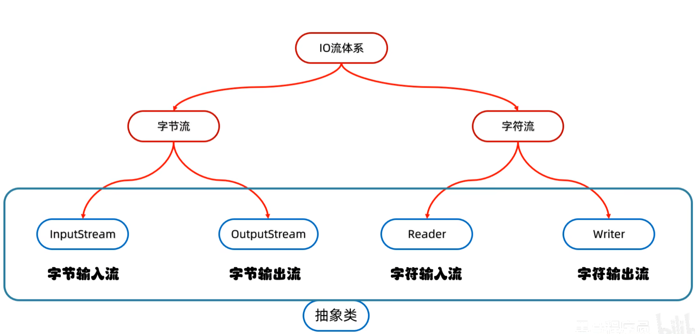
#### 字节流
##### FileOutputStream
1. **创建对象：**
参数是字符串表示路径或者是File对象都是可以的
如果文件不存在会创建一个文件
如果文件已经存在，则会清空文件

2. **写数据**
write方法的参数是整形，但是实际写到本地的文件中是整形在ASCII上对应的字符


3. **释放资源**
每次使用完流只有都要释放资源

###### 写入数据方法write
1. 一次写一个字节数据
```java
fos.write(97);
```
2. 一次写一个字节数组数据
```java
byte []data = {97,98,99,100,101,102,103};
fos.write(data);
```
3. 一次写一个字节数组的部分数据
从索引x开始，写入n个数据
write(data,x,n);
```java
byte []data = {97,98,99,100,101,102,103};
fos.write(data,0,3);
```
**续写：**
如果想要续写，打开续写开关即可，开关位置在创建对象第二个参数
默认为false，表示关闭续写

**换行操作：**
windows:    \r\n
Linux       \n
Mac:        \r

在windows操作系统当中，jav对回车换行进行了优化，虽然完整的是\r\n但是只写其中一个，java也可以实现，在底层会补全

##### FileInputStream
创建输入流对象，如果文件不存在，则直接报错
一次读一个字节，读出来的是数据在ASCII上对应的数字
读到文件末尾，read方法返回-1
###### read读取
读取所有内容：
```java
int b ;
while ((b = fis.read()) != -1) {
    System.out.print((char) b);
}
```

文件拷贝：
```java
//获取要拷贝的文件
FileInputStream fip = new FileInputStream(".\\src\\myio\\copy.mp4");
//要拷贝的位置
FileOutputStream fop = new FileOutputStream(".\\src\\myio\\copy.mp4",true);
int b;
while ((b = fip.read()) != -1) {
    fop.write(b);
}
fop.close();
fip.close();
```
**先创建的后关闭**

FileInputStream一次读写一个字节，所以拷贝时很慢

可以一次读取多个数据，对read传递byte数组
数组越大，传送越快
最好是1024的整数倍，1024*1024\*5
```java
long start = System.currentTimeMillis();
//要拷贝的内容
FileInputStream fis = new FileInputStream("D:\\照片视频\\小姐姐\\视频\\喜欢就分享给你的hxd_614981739.mp4");
//要拷贝的位置
FileOutputStream fos = new FileOutputStream(".\\src\\myio\\copy.mp4");
int len;
byte[] data = new byte[1024 * 1024 * 20];
while((len = fis.read(data)) != -1){
    fos.write(data,0,len);
}
fos.close();
fis.close();
long end = System.currentTimeMillis();
System.out.println(end - start);
```
#### 编码
1. 在计算机中，任意数据都是以二进制的形式来存的
2. 计算机中最小的存储单元室一个字节
3. ASCII字符集中，一个英文占一个字节
4. 简体中文版windows，默认使用GBK字符集
5. GBK字符集完全兼容ASCII字符集
一个英文占一个字节，二进制第一位是0
一个中文占两个字节，二进制高位字节第一位是1

Unicode 字符集的UTF-8编码格式
- 一个英文占一个字节，二进制第一位是0，转成十进制是正数
- 一个中文占三个字节，二进制第一位是1，第一个字节转成十进制是负数

**编码方法getBytes**
```java
String s = "123赵志轩";
//使用默认编码
byte[] bytes = s.getBytes();
System.out.println(Arrays.toString(bytes));

//使用固定方式编码
byte[] bytes1 = s.getBytes("gbk");
System.out.println(Arrays.toString(bytes1));
```
#### 解码
```java
//默认解码
String str = new String(bytes);
System.out.println(str);

//固定方式解码
System.out.println(new String(bytes1,"GBK"));
```


#### 字符流
字符流的底层是字节流
字符流 = 字节流 + 字符集

输入流：一次读一个字节，遇到中文时，一次读多个字节
输出流：底层会把数据按照指定的编码方式进行编码，变成字节在写到文件中
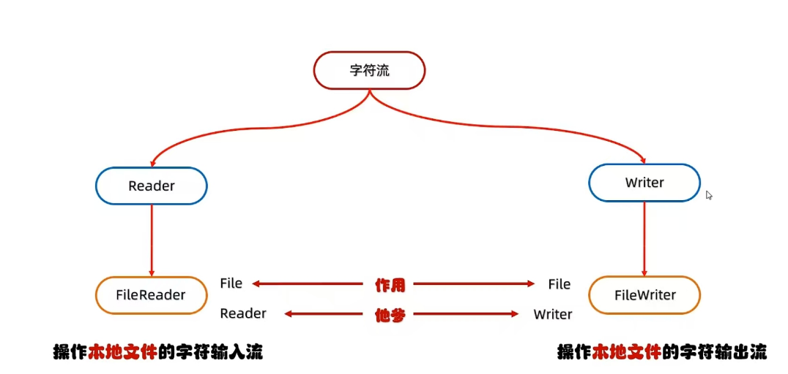

##### 读取FileReader
创建时如果文件不存在，就直接报错
**read():**
默认是一个字节一个字节读取的，如果遇到中文就回一次读取多个
在读取之后，方法的底层会进行解码并转换成十进制，最终把这个十进制作为返回值，
这个十进制数据也表示在字符集上的数字
```java
FileReader fr = new FileReader("a.txt");
int ch;
while ((ch = fr.read()) != -1){
    System.out.print((char) ch);
}
fr.close()
```
带参数的：读取数据，解码，强转三步合并，把强转之后的字符放到数组当中
```java
FileReader fr = new FileReader("a.txt");
char[] chars = new char[3];
int len ;
while((len = fr.read(chars))!= -1){
    System.out.print(new String(chars,0,len));
}
```
##### FileWriter
和字节输出流一样
```java
FileWriter fos = new FileWriter("a.txt");
fos.write("逻辑驱动器是一种虚拟存储设备，它可以将物理存储设备分割成多个逻辑单",3,10);
fos.close();
```

#### 缓冲流
高级流，把基本流包装成高级流，提到读写数据的性能
原理：底层自带了长度为8192的缓冲区提高性能
- 自带长度8192的缓冲区提高性能
- 可以显著提高字节流的读写性能
- 对字符流提升不明显，字符流关键点是两个特有的方法

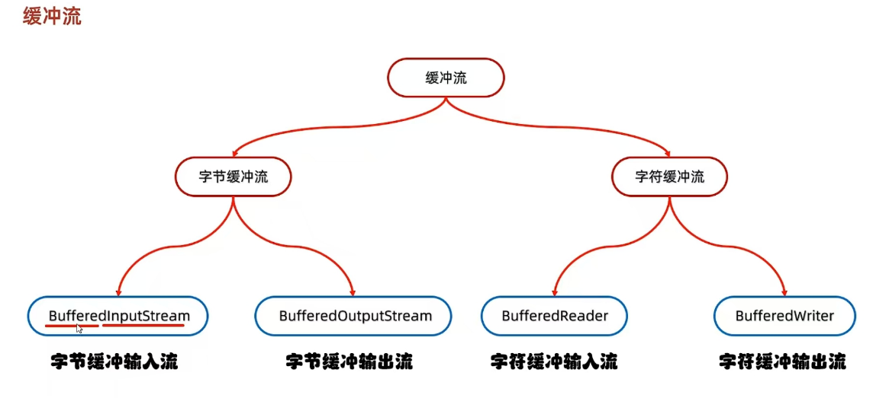
##### 字节缓冲流
底层为字节流，使用方法和字节流一样

```java
BufferedInputStream bis = new BufferedInputStream(new FileInputStream(".\\src\\BufferStream\\a.txt"));
BufferedOutputStream bos = new BufferedOutputStream(new FileOutputStream(".\\src\\BufferStream\\copy.txt"));
int b;
while ((b = bis.read()) != -1) {
    bos.write(b);
}
bos.close();
bis.close();
```
##### 字符缓冲流

**BufferedReader特有的方法：readLine**
每一次读一行，不包括换行符

```java
BufferedReader br = new BufferedReader(new FileReader(".\\src\\BufferStream\\a.txt"));
String s = br.readLine();
System.out.println(s);
```
**BufferedWriter特有的方法：newLine()**
跨平台的换行

```java
BufferedWriter bw = new BufferedWriter(new FileWriter(".\\src\\BufferStream\\b.txt"));
bw.write(s);
bw.newLine();
```
#### 转换流
转换流是字符流和字节流之间的桥梁


**利用转换流按照指定字符编码写入：**

**jdk11之前：**
```java
InputStreamReader isr = new InputStreamReader(new FileInputStream(".\\src\\ConvereStream\\gbkfile.txt"),"GBK");
int ch;
while((ch = isr.read())!=-1){
    System.out.print((char) ch);
}
isr.close();
```
**jdk11之后：**
可以使用FileReader的新方法
```java
FileReader fr = new FileReader(".\\src\\ConvereStream\\gbkfile.txt", Charset.forName("GBK"));
int ch;
while((ch = fr.read())!=-1){
    System.out.print((char) ch);
}
fr.close();
```
**利用转换流按照指定字符编码写入：**
```java
OutputStreamWriter osw = new OutputStreamWriter(new FileOutputStream(".\\src\\ConvereStream\\a.txt"),"GBK");
osw.write("你好你好");
osw.close();
```
**jdk11之后：**
```java
FileWriter fw = new FileWriter(".\\src\\ConvereStream\\a.txt", Charset.forName("GBK"));
fw.write("你好你好");
fw.close();
```
#### 序列化流
可以把java中的对象写到本地文件中
把基本流包装成高级流
使用对象输出流奖对象保存文件是会出现异常，需要让javabean类实现Serializable接口
Serializable接口里面没有抽样方法，为标记性接口
一旦实现这个接口，那么就表示当前的类可以被序列化
##### ObjectOutputStream写入
使用writeObject写入

```java
Student stu = new Student("zhangsan", 23);
ObjectOutputStream oos = new ObjectOutputStream(new FileOutputStream(".\\src\\ConvereStream\\a.txt"));
oos.writeObject(stu);
oos.close();
```
#### 反序列化流/对象操作输入流
可以把序列化到本地文件的对象，读取到程序中来
使用readObject读取

##### ObjectInputStream
```java
ObjectInputStream ois = new ObjectInputStream(new FileInputStream(".\\src\\ConvereStream\\a.txt"));
Object o = ois.readObject();
System.out.println(o);
ois.close();
```
<font color= FF0000>注意： </font>
- 使用序列化流写入到文件，需要让javabean类实现Serializable接口，否则会出现异常
- 序列化流写到文件中的数据时不能修改的，一旦修改就无法再次读回来了
- 序列化对象后，修改了javabean类，再次反序列化，会出现版本号问题


- 如果需要把类序列化文件，需要添加一个版本号
```java
private static final long serialVersionUID = 2678874640306825278L;
```
- 如果一个对象的某个成员变量的值不想被序列化，，需要给成员变量加**transient**关键字修饰，该关键字标记的成员变量不参与序列化过程


#### 打印流
往文件中打印

打印流有：
- PrintStream
- PrintWrite
共两个类

特点：
- 打印流只操作文件目的地，不操作数据源
- 特有的写出方法可以实现，数据原样写出
- 特有的写出方法，可以实现自动刷新，自动换行
##### 字节打印流
###### write方法
常规方法，规则跟之前一样，将指定的字节写出

###### println
打印任意数据，自动刷新，自动换行
```java
PrintStream ps = new PrintStream(new FileOutputStream(".\\src\\ConvereStream\\a.txt"));
ps.println(97);
ps.close();
```
###### print() printf()
与普通的print一样
```java
PrintStream ps = new PrintStream(new FileOutputStream(".\\src\\ConvereStream\\a.txt"));
ps.println(97);
ps.print(132);
ps.printf("");
ps.close();
```
##### 字符打印流
PrintWriter
字符打印流底层有缓冲区，想要自动刷新需要开启

```java
PrintWriter pw = new PrintWriter(new FileWriter(".\\src\\ConvereStream\\a.txt"));
pw.println("asgha");
```
<font color = FF0000>注意:</font>
- 打印流有字节打印流和字符打印流
- 打印流不操作数据源，只操作目的地，只能写不能读
- 字节打印流：默认自动刷新，特有的println自动换行
- 字符打印流：自动刷新需要开启，特有的println自动换行

#### 解压缩流、压缩流
解压流是读取文件

解压缩是把压缩包里面的每一个文件或者文件夹读取出来，按照层级拷贝到目的地当中


压缩流是写入文件


##### 解压缩流
把每一个ZipEntry按照层级拷贝到本地另一个文件夹中


##### 压缩流
先创建压缩流关联压缩包
创建zipEntry对象，表示压缩包里面的每一个文件和文件夹
把对象放入压缩包当中，
把要压缩的文件中的数据接入压缩包当中

#### 工具包
##### commons-IO
是开源基金组织提供的一组有关io操作的开源工具包
###### copyFile
复制文件
```java
File src = new File("F:\\a.txt");
File dest = new File("F:\\copy.txt");
FileUtils.copyFile(src,dest);
```
###### FileUtils.copyDirectory(a,b);
把a复制到b
###### FileUtils.copyDirectoryToDirectory(a,b);
把a复制到b里面
###### FileUtils.deleteDirectory(a);
删除a文件夹
###### FileUtils.cleanDirectory();
清空文件夹


##### Hutool工具包
###### file
创建一个File对象
```java
File file = FileUtil.file("D:\\" +"aaa\\" + "bbb\\"+"a.txt");
System.out.println(file)
```
###### touch
根据参数创建文件
如果父级路径不存在，则自动创建
```java
FileUtil.touch(file);
```
###### writeLines
把集合中的数据写出到文件中，覆盖模式

```java
ArrayList<String> list = new ArrayList<();
list.add("aaa");
list.add("bbb");
FileUtil.writeLines(list,"F:\\aaa.txt""UTF-8");
```
###### appendLines
把集合中的数据写入文件中，续写模式

###### readLine
指定字符编码，把文件中的数据读到集合中

###### readUtf8Lines
按照UTF-8的形式，把文件中的数据读到集合中

###### copy
拷贝文件或者文件夹

#### properties配置文件
键值对存储
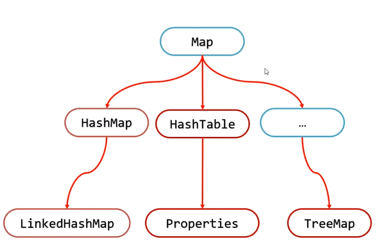
是一个双列集合，可以把集合中的数据，按照键值对的形式写到配置文件当中
也可以把配置文件中的数据读取到集合中
##### store写出

##### load 读入


### 多线程
**线程：**
现成是操作系统能够进行运算调度的最小单位。他被包含在进程中，是进程中的实际运作单位
应用软件中相互独立，可以同时运行的功能
**并发：**
在同一时刻，有多个指令在单个CPU上交替执行
**并行：**
在同一是个，有多个指令在多个CPU上同时执行

#### 继承Thread类的方式实现多线程
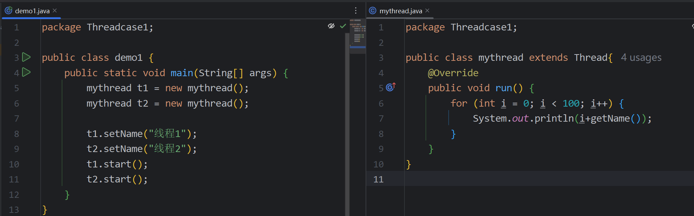
#### 实现Runnable接口的方式进行实现
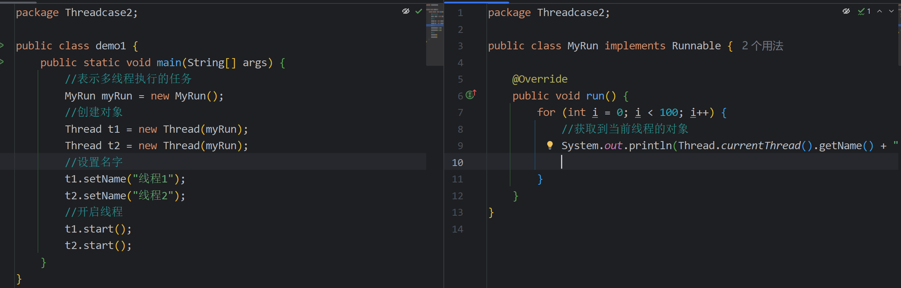
#### 利用Callable接口和Future接口方式实现
先创建一个类实现Callable接口
重写call(有返回值的，表示多线程运行的结果)
创建MyCallable对象，表示多线程要执行的任务
创建FutureTask对象，作用管理多线程运行的结果
创建Thread类的对象， 并启动


**三种方式的对比：**

|                  | 优点                                       | 缺点                                      |
| ---------------- | ------------------------------------------ | ----------------------------------------- |
| 继承Thread       | 编程比较简单，可以直接使用Thread类中的方法 | 可以扩展性较差，不能在继承其他的类        |
| 实现Runnable接口 | 扩展性强，实现该接口的同时可以继承其他类   | 编程相对复杂，不能直接使用Tread类中的方法 |
| 实现Callable接口 |                                            |                                           |

#### 线程Thread的成员方法
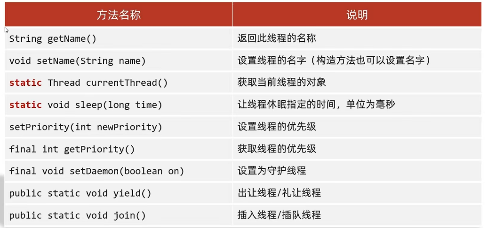
###### getName 返回此线程的名字
如果没有给线程设置名字，线程也是有默认名字
格式：Thread—X(X序号，从0开始)
###### setName 设置线程名字
可以用方法进行设置，也可以用构造方法设置
###### Thread.currentThread获取当前线程对象
当JVM虚拟机启动时，会自动启动多条线程
其中有一条叫main
作用是调用main方法， 并执行里面所有的代码
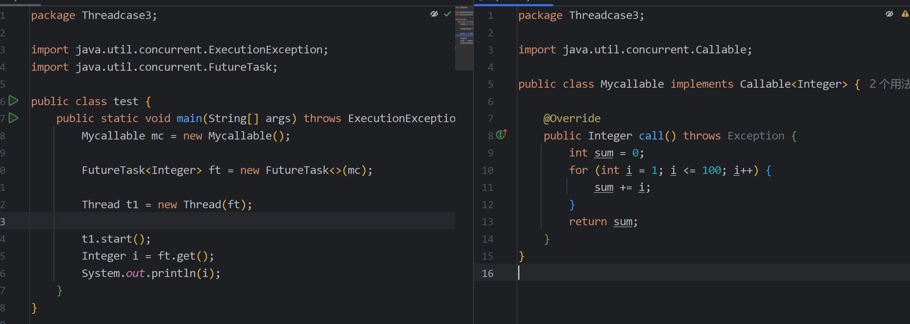
```java
Thread thread = Thread.currentThread();
System.out.println(thread.getName());
```
###### sleep 让线程休眠指定时间，单位为毫秒
1s = 1000ms
那一条现成执行到这个方法，那么那条线程就会在这里停留对应的时间
当时间到了之后，现成会自动的醒来，继续执行下面的其他代码

###### getPriority 获得线程
```java
myRunnable mr = new myRunnable();

Thread t1 = new Thread(mr,"飞机");
Thread t2 = new Thread(mr,"坦克");
//获得线程的优先级
t1.setPriority(1);
t2.setPriority(9);

System.out.println(t1.getPriority());
System.out.println(t2.getPriority());

System.out.println(Thread.currentThread().getPriority());
```
###### setPriority设置线程
```java
myRunnable mr = new myRunnable();

Thread t1 = new Thread(mr,"飞机");
Thread t2 = new Thread(mr,"坦克");
//设置线程的优先级
t1.setPriority(1);
t2.setPriority(9);
```
###### setDaemon(Boolean on)设置为守护线程
当其他的非守护线程执行完毕之后，守护线程会陆续结束

当女神结束后，那么备胎也没有存在的必要了

应用场景：
后台下载，如果关闭软件，则下载停止

```java
MysThread1 t1 = new MysThread1();
MysThread2 t2 = new MysThread2();

t1.setName("女神");
t2.setName("备胎");

t2.setDaemon(true);

t1.start();
t2.start();
```
###### yield() 出让线程/礼让线程
表示出让当前CPU的执行权
Thread.yield
###### join() 插入线程/插队线程
把这个线程插入其他线程之前
t1.join;
#### 生命周期
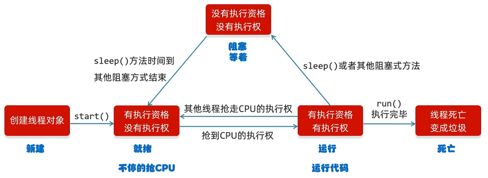
#### 线程安全问题
线程执行时候，有随机性
##### 同步代码块
把操作共享数据的代码锁起来
**格式:**
```java
synchronized(锁对象){
    操作共享数据的代码
}
```
锁默认打开，有一个线程进去了，锁自动关闭
里面的代码全部执行完毕，线程出来，锁自动打开
锁对象一定要是唯一的，一般写当前类的字节码文件.class文件
##### 同步方法
就是把synchronized关键字加到方法上
***格式：***

选中synchronized中的所有代码，ctrl + alt + m,自动抽取方法

```java
修饰符 synchronized 返回值 方法名(方法参数)
```
```java
@Override
public void run() {
    while (true) {
        synchronized (MyRunnable.class) {
            if (method()) break;
        }
    }
}
private synchronized boolean method() {
    if (ticket == 100000) {
        return true;
    } else {
        ticket++;
        System.out.println(Thread.currentThread().getName() + "再买第" + ticket + "张票");
    }
    return false;
}
```

##### Lock锁
Lock锁中提供了获得锁和释放锁的方法
比使用synchronized方法获得更广泛的锁定操作
可以手动上锁，手动释放锁

Lock锁是接口，不能直接实例化，要采用他的实现类ReentrantLock来实例化

```java
static Lock lock = new ReentrantLock();
lock.lock();
lock.unlock();
```


##### 死锁
两个锁发生嵌套，无法出去
#### 生产者和消费者(等待唤醒机制)
生产者消费者模式是一个经典的多线程协作模式
让两个线程轮流执行
```java

wait();//当前线程等待，知道其他线程唤醒

notify() // 随机唤醒单个线程

notifyAll()//唤醒所有线程

```
```java
public class Cook extends Thread{
    @Override
    public void run() {
        while (true){
            synchronized (Desk.lock){
                if(Desk.count==0){
                    break;
                }else{
                    if(Desk.foodFlag == 1){
                        try {
                            Desk.lock.wait();
                            Desk.lock.notifyAll();
                        } catch (InterruptedException e) {
                            e.printStackTrace();
                        }
                    }else {
                        System.out.println("做了一碗");
                        Desk.foodFlag = 1;
                        Desk.lock.notifyAll();
                    }
                }
            }
        }
    }
}
public class Foodie extends Thread{
    @Override
    public void run() {
        while(true){
            synchronized (Desk.lock){
                if(Desk.count == 0){
                    break;
                }else{
                    if(Desk.foodFlag == 0){
                        try {
                            Desk.lock.wait();
                        } catch (InterruptedException e) {
                            e.printStackTrace();
                        }
                    }else {
                        Desk.count--;
                        System.out.println("还有"+Desk.count);
                        Desk.lock.notifyAll();
                        Desk.foodFlag  = 0;
                    }
                }
            }
        }
    }
}
public class Desk {
    //0：没有
    //1：有
    public static Object lock = new Object();
    public static int foodFlag = 0;
    public static int count = 10;
}

```
#### 等待唤醒机制(堵塞队列方式实现)
put数据：放不进去，会等着，也叫堵塞
take数据：取出第一个数据，取不到也会等着，也叫堵塞
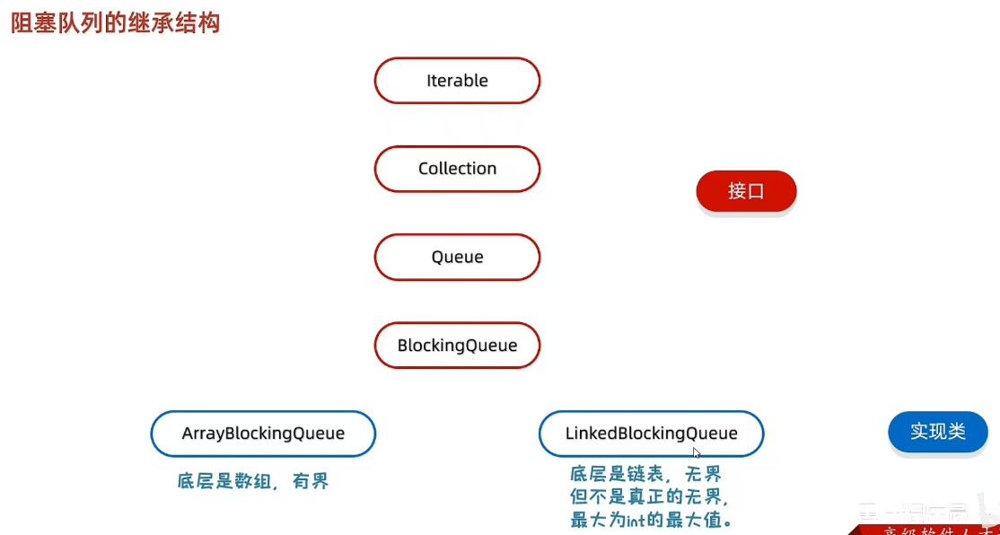
在测试类创建一个队列，使用带参构造传递队列

put和take方法底层使用了Lock锁，不需要自己在写，否则会发生死锁
```java

public class Cook extends Thread{
    ArrayBlockingQueue<String> queue;
    public Cook(ArrayBlockingQueue<String> queue) {
        this.queue = queue;
    }
    @Override
    public void run() {
        while(true){
            try {
                queue.put("面条");
                System.out.println("厨师放了一碗面条");
            } catch (InterruptedException e) {
                e.printStackTrace();
            }
        }
        
    }
}

public class Foodie extends Thread{
    ArrayBlockingQueue<String> queue;
    public Foodie(ArrayBlockingQueue<String> queue) {
        this.queue = queue;
    }
    @Override
    public void run() {
        while(true){
            try {
                String food = queue.take();
                System.out.println("吃了一碗");
            } catch (InterruptedException e) {
                e.printStackTrace();
            }
        }
    }
}
public class demo {
    public static void main(String[] args) {
        ArrayBlockingQueue<String> queue = new ArrayBlockingQueue<>(1);

        Cook c = new Cook(queue);
        Foodie f = new Foodie(queue);

        c.start();
        f.start();

    }
}

```


#### 线程的状态
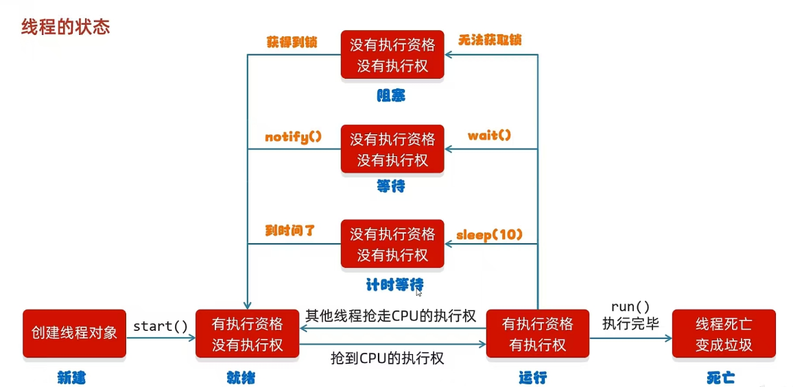

只有六种状态，没有运行状态
#### 线程池
创建一个线程池
提交任务时，池子会创建新的线程对象，任务执行完毕，线程归还给池子，下一次在提交任务时候，不需要创建新的线程，直接复用已有的线程即可
如果提交任务池子中没有空闲线程，也无法创建新的线程，任务就回排队等待
```java
//创建没有上限的线程池
ExecutorService pool1 = Executors.newCachedThreadPool();
//创建有上限的线程池
ExecutorService pool2 = Executors.newFixedThreadPool(3);
//提交任务，添加到线程池
pool1.submit(mr);

//销毁线程池
poll.shutdown

```
##### 自定义线程池
构造元素：
1. 核心线程数量(不能小于0)
2. 线程池中最大线程的数量(最大数量>=核心线程数量)
3. 空闲时间(值)(不能小于0)
4. 空闲时间(单位)(用TimeUnit指定)
5. 阻塞队列(不能为null)
6. 创建线程的方式(不能为null)
7. 要执行的任务过多时的解决方案(不能为null)
```java
ThreadPoolExecutor pool = new ThreadPoolExecutor(
                3,//核心线程数量
                6,//最大现成数量
                60,//空闲线程最大存活时间
                TimeUnit.SECONDS,//时间单位
                new ArrayBlockingQueue<>(3),//任务队列
                Executors.defaultThreadFactory(),//创建线程工厂 
                new ThreadPoolExecutor.AbortPolicy()//任务的拒绝策略
        );

```
##### 电脑最大并行数

```
int count = Runtime.getRuntime().availableProcessors();
System.out.println(count);
```
20线程
##### 线程多大合适
CPU密集型运算：
计算多，对数据库操作比较少，采用最大并行数+1

I/O密集型运算：
大多项目都是I/O
读取本地文件或者读取数据库操作比较多，
最大并行数\*期望CPU利用率\*总时间\*(CPU计算时间+等待时间)/CPU计算时间
可以用thread dump工具进行测试 ：CPU计算时间和等待时间

### 网络编程
网络编程：在网络通信协议下，不同计算机上运行的程序，进行的数据传输
不管什么场景，都是计算机跟计算机之间通过网络进行数据传输
java可以使用java.net包下的技术轻松开发出常见的网络应用程序
<font color = BLUE>常见的软件架构:</font>
**C/S：Client/Server 客户端/服务器**
在用户本地需要下载斌安装客户端程序，在远程有一个服务器端程序

*优缺点：*

- 画面可以做的非常精美，用户体验好
- 需要开发客户端，也需要开发服务端
- 用户需要下载和更新的时候太麻烦

**B/S:Browser/Server 浏览器/服务器**
只需要一个浏览器，用户通过不同的网址
*优缺点：*

- 不需要开发客户端，只需要页面+服务端
- 用户不需要下载，打开浏览器就能用
- 如果应用过大，用户体验收到影响

<font color = blue>网络编程三要素：</font>

- IP：设备在网络中的地址，是唯一的标识
- 端口号：应用程序在设备中唯一的标识
- 协议：数据在网络中传输的规则，常见协议有UDP,TCP,http,https,ftp


#### IP
IPv4:
互联网通信协议第四版
采用**32**位地址长度，分为四组，**32bit**，**4字节**
分为**公网地址**(万维网)和**私有地址**(局域网使用)
192.168.开头的是私有地址，从192.168.0.0 - 192.168.255.255

127.0.0.1 / localhost:是回送地址也称作本地回环地址，也称本机IP,永远只会寻找当前所在本机,**永远表示本机**

**常用cmd命令：**
ipconfig:查看本机IP地址
ping:查看网络是否连通


IPv6:
128位地址长度，分为八组，冒分十六进制表示法

##### InetAddress.getByName获取IP对象
```java
InetAddress address = InetAddress.getByName("192.168.0.100");
System.out.println(address);
```

##### getHostName获取主机名字
```java
String name = address.getHostName();
System.out.println(name);
//laplands
```

##### getHostAddress
返回文本显示中的IP地址字符串
```java
String ip = address.getHostAddress();
System.out.println(ip);
```
#### 端口号
应用程序在设备中的唯一标识
端口号：由两个字节表示的整数，取值范围：0~65535
其中 0~1023之间的端口号用于一些知名的网络服务或应用
自己使用用1024以上的端口

<font color = red>注意：一个端口号只能被一个应用程序使用</font>

#### 协议
计算机网络中，连接和通信的规则被称为协议
1. **UDP协议：**
- 用户数据报协议(User Datagram Protocol)
- UDP是<font color = red>面向无连接</font>通信协议
  速度快，有大小限制一次最多发送64k，数据不安全，易丢失数据

不管网络是否已经连接，直接发送

2. **TCP协议：**
- 传输控制协议
- TCP是<font color = red>面向连接</font>的通信协议
 速度慢，没有大小限制，数据安全

确保连接成功，才会发送

##### UDP通信(发送数据)
创建对象，数据打包，发送数据，释放资源
```java
DatagramSocket ds = new DatagramSocket();

String str = "你好你好";
byte[] b = str.getBytes();
InetAddress address = InetAddress.getByName("127.0.0.1");
int port = 10086;

DatagramPacket dp = new DatagramPacket(b,b.length,address,port);
//发送数据
ds.send(dp);
ds.close();
```
##### UDP协议(接收数据)
1. 创建接受端的DatagramSocket对象
2. 接受打包好的数据
3. 解析数据包
4. 释放资源

接受时，一定要绑定端口，而且和绑定的端口和发送的端口一样
```java
DatagramSocket ds = new DatagramSocket(10086);

byte[] bytes = new byte[1024];
DatagramPacket dp = new DatagramPacket(bytes,bytes.length);
ds.receive(dp);

byte[] data = dp.getData();
int len = dp.getLength();
InetAddress address = dp.getAddress();
int port = dp.getPort();

System.out.println(new String(data,0,len));
System.out.println(address);
System.out.println(port);

ds.close();

```
##### UDP三种通信方式
1. 单播：一对一发送
2. 组播：
组播地址：224.0.0.0~239.225.225.225
其中224.0.0.0~224.0.0.255
3. 广播：
   全部接受
   255.255.255.255

##### TCP协议
TCP通信协议是一个可靠的网络协议，在通信两端各建立一个Socket对象
通信之前要保证连接已经建立
通过IO流来进行网络通信

客户端Socket
1. 创建客户端Socket对象(Socket)与指定服务端连接
   <font color = blue>Socket(String host,int port)</font>
2. 获取输出流，写入数据
   
3. 释放资源
```java
Socket socket = new Socket("127.0.0.1",10000);
OutputStream os = socket.getOutputStream();
os.write("你好".getBytes());
os.close();
socket.close();
```

服务器ServerSocket
1. 创建服务器端的Socket对象(ServerSocket)
   <font color = blue>ServerSocket(int port)</font>
2. 监听客户端连接，返回一个Socket对象
   
3. 获取输入流，读数据，并把数据显示在控制台
   
4. 释放资源   

```java
ServerSocket ss = new ServerSocket(10000);
Socket accept = ss.accept();
InputStream is = accept.getInputStream();
InputStreamReader isr = new InputStreamReader(is);
int b;
while((b = isr.read())!=-1){
    System.out.println((char) b);
}
accept.close();
ss.close();
```

##### 三次握手
客户端想服务端发出连接请求，等待服务器确认
服务器想客户端返回一个响应，告诉客户端收到了请求

客户端向服务器再次发出确认信息，连接建立

##### 四次挥手
确保连接断开，且数据处理完毕

1. 客户端向服务器发出取消连接请求
2. 服务器向客户端返回一个响应，表示收到客户端取消请求
3. 服务器向客户端发出确认取消信息
4. 客户端再次发送确认信息，取消连接
### 反射
反射允许对成员变量，成员方法和构造方法的信息进行编程访问
#### 获取class对象的三种方式
1. Class.forName("全类名");
全类名：包名+类名
*最常用*
2. 类名.class
一般是当做参数传递   
3. 对象.getClass();
当有这个类的对象时，才能使用
```java
Class<?> clazz = Class.forName("myreflect1.Student");

Class<Student> clazz2 = Student.class;

Student s = new Student();
Class<? extends Student> clazz3 = s.getClass();
```

#### 反射获得构造方法
先获得Class对象，方法为静态方法
##### getConstructors 
**获取所有公共构造方法**
```java
Class<?> clazz = Class.forName("myreflect2.Student");
Constructor<?>[] cons = clazz.getConstructors();
for (Constructor<?> constructor : cons) {
    System.out.println(constructor);
}
```
##### getDeclaredConstructors()
**获取所有构造方法**
```java
Class<?> clazz = Class.forName("myreflect2.Student");
Constructor<?>[] cons = clazz.getDeclaredConstructors();
for (Constructor<?> con : cons) {
    System.out.println(con);
}
```
##### 获取单个构造方法
getConstructor()
getDeclaredConstructor()
把构造方法的参数类型的Class类型传递过去
```java
Constructor<?> con2 = clazz.getDeclaredConstructor(String.class);
System.out.println(con2);
```
##### setAccessible(true)
**临时取消权限校验**
##### 创建对象newInstance()
```java
Constructor<?> con2 = clazz.getDeclaredConstructor(String.class);
//con2 = private myreflect2.Student(java.lang.String)
con2.setAccessible(true);
Object stu = con2.newInstance("zhangsan");
```
#### 利用反射获取成员变量
class类中用于获取成员变量的方法
##### getFields()
**获取公有成员变量**
```java
Class<?> clazz = Class.forName("MyField1.Student");

Field[] fields = clazz.getFields();
```
##### getDeclaredFields()
**获取所有的成员变量**
##### getField()
**获取单个的公有成员变量**
参数为自己定义的成员变量

```java
Field age = clazz.getField("gender");
System.out.println(age);
```
##### getDeclaredField()
**无视修饰符
获取单个的成员变量**

##### getModifiers
**获取权限修饰符**

```java
Field age = clazz.getDeclaredField("age");
int modifiers = age.getModifiers();
```
##### getType()
**获取数据类型**
```java
Field age = clazz.getDeclaredField("age");
Class<?> type = age.getType();

```
##### 获取成员变量记录的值
```java
Field age = clazz.getDeclaredField("age");
//先创建对象
Student stu = new Student("张三",18,"男");
//无视权限修饰符
age.setAccessible(true);
//获取值
Object o = age.get(stu);
System.out.println(o);
```
##### 修改成员变量记录的值
```java
Field age = clazz.getDeclaredField("age");
//先创建对象
Student stu = new Student("张三",18,"男");
//无视权限修饰符
age.setAccessible(true);
//获取值
age.set(stu,"李四");

```
#### 获取反射的成员方法
##### getMethods()
**返回所有公共成员方法对象的数组，包括继承的**
```java
 Class<?> clazz = Class.forName("MyMethod1.Student");
 Method[] methods = clazz.getMethods();
 for (Method method : methods) {
     System.out.println(method);
 }
```
##### getDeclaredMethods
获得所有成员方法对象的数组，不包括继承的


##### getMethod()
获得单个的公共成员方法对象
参数1：方法名字
参数2：所有参数的字节码
```java
Class<?> clazz = Class.forName("MyMethod1.Student");

Method eat = clazz.getDeclaredMethod("eat", String.class);

System.out.println(eat);
```
##### getDeclaredMethod()
获得单个成员方法对象

##### getModifiers
获取方法的修饰符

##### getName()
获取方法的名字
##### getParameters()
获取方法的形参

##### getExceptionTypes()
获取方法抛出的异常

##### invoke()方法运行
参数一：方法调用者
参数二：调用方法的实际参数
返回值

```java
Class<?> clazz = Class.forName("MyMethod1.Student");

Method eat = clazz.getDeclaredMethod("eat", String.class);

Student stu = new Student();

eat.setAccessible(true);
eat.invoke(stu,"13");
```


#### 反射的作用
1. 获取一个类里面所有的信息，获取到了之后，再执行其他的业务逻辑
2. 结合配置文件，动态的创还能对象并调用方法


**get:获取
Constructor:构造方法
Field:成员变量
Method:方法**


**set:设置**
**Parameter:参数**
**modifiers:修饰符
Declared:私有的** 

### 动态代理
可以无侵入式的给代码增加额外功能

通过接口，后面的对象和代理需要实现同一个接口
接口中就是被代理的所有方法

**Proxy.newProxyInstance()**

**参数一：** 获得代理类的字节码文件对象，利用字节码文件对象去反射获取这个类的加载器对象。

**参数二：** 指定接口，这些接口用于指定生成的代理长什么样，也就是要有哪些方法
要把接口的字节码放到数组中

**参数三：** 用在指定生成的代理对象要干什么事

public Object invoke();
参数一：代理的对象
参数二：要运行的方法
参数三：调用这个方法需要传递的参数


```java
public class ProxyUtil {
    //创建代理
    public static Star createProxy(BigStar bigStar){
        Star star  =(Star) Proxy.newProxyInstance(
                ProxyUtil.class.getClassLoader(),
                new Class[]{Star.class},
                new InvocationHandler() {
                    @Override
                    public Object invoke(Object proxy, Method method, Object[] args) throws Throwable {
                        if ("sing".equals(method.getName())) {
                            System.out.println("准备话筒");
                        } else {
                            System.out.println("准备场地");
                        }
                        return method.invoke(bigStar, args)；
                        
                    }
                }
        );
        
        return star;
    }
}
```

```java
//获取代理对象
BigStar bigStar = new BigStar("张三");
Star proxy = ProxyUtil.createProxy(bigStar);
        
String asg = proxy.sing("asg");
System.out.println(asg);
```

###  单元测试Junit


对部分代码进行测试。

#### Junit的特点

- 是一个第三方的工具。（把别人写的代码导入项目中）（专业叫法：导jar包）

- 如果运行结果显示绿色，表示运行结果是正确的。

  如果运行结果显示红色，表示运行结果是错误的。

#### 基本用法

1，一定要先写一个方法。

2，在这个方法的上面写@Test

3，鼠标点一下@Test 按alt + 回车，点击Junit4

 此时就可以自动导包。

 如果自动导包失败（连接外网，或者自己手动导包）

 如果导包成功在左下角就会出现Junit4的相关jar包

##### 手动导包

1，在当前模块下，右键新建一个文件夹（lib）

2，把jar包，拷贝到lib文件夹里面

3，选中两个jar右键点击add as a lib....

4，到代码中，找到@Test，按alt + 回车，再来导入。

##### 运行测试代码

- 只能直接运行无参无返回值的非静态方法
- 想要运行谁，就右键点击哪个方法。如果想要运行一个类里面所有的测试方法，选择类名，有点点击即可。

##### Junit正确的打开方式

注意点：并不是直接在要测试的方法上面直接加@Test

原因：因为要测试的方法有可能是有参数的，有返回值，或者是静态的。

##### 正确的使用方式：

1，新建测试类

2，新建测试方法（要测试的方法名 + Test） methodTest

3，在这个方法中直接调用要测试的方法

4，在测试方法的上面写@Test

代码示例：

```java
//真正用来测试的类
//测试用例（测试类）
public class JunitTest {

    //在这个类里面再写无参无返回值的非静态方法
    //在方法中调用想要测试的方法

    @Test
    public void method2Test(){
        //调用要测试的方法
        JunitDemo1 jd = new JunitDemo1();
        jd.method2(10);
    }
}
```

### 注解

#### 注释和注解的区别？

共同点：都可以对程序进行解释说明。

不同点：注释，是给程序员看的。只在Java中有效。在class文件中不存在注释的。

 当编译之后，会进行注释擦除。

 注解，是给虚拟机看的。当虚拟机看到注解之后，就知道要做什么事情了。

#### 如何使用注解

在以前看过注解@Override。

当子类重写父类方法的时候，在重写的方法上面写@Override。

当虚拟机看到@Override的时候，就知道下面的方法是重写的父类的。检查语法，如果语法正确编译正常，如果语法错误，就会报错。

#### Java中已经存在的注解

@Override：表示方法的重写

@Deprecated：表示修饰的方法已过时

@SuppressWarnings("all")：压制警告

除此之外，还需要掌握第三方框架中提供的注解：

比如：Junit

@Test 表示运行测试方法

@Before 表示在Test之前运行，进行数据的初始化

@After 表示在Test之后运行，进行数据的还原

#### 自定义注解

自定义注解单独存在是没有什么意义的，一般会跟反射结合起来使用，会用发射去解析注解。

针对于注解，只要掌握会使用别人已经写好的注解即可。

关于注解的解析，一般是在框架的底层已经写好了。

#### 特殊属性

value：

 当注解中只有"一个属性",并且属性名是"value",使用注解时,可以省略value属性名

代码示例：

```java
//注解的定义
public @interface Anno2 {
    public String value();

    public int age() default 23;
}

//注解的使用
@Anno2("123")
public class AnnoDemo2 {

    @Anno2("123")
    public void method(){

    }
}
```

#### 元注解

可以写在注解上面的注解

@Target ：指定注解能在哪里使用

@Retention ：可以理解为保留时间(生命周期)

##### Target:

 作用：用来标识注解使用的位置，如果没有使用该注解标识，则自定义的注解可以使用在任意位置。

 可使用的值定义在ElementType枚举类中，常用值如下

- TYPE，类，接口
- FIELD, 成员变量
- METHOD, 成员方法
- PARAMETER, 方法参数
- CONSTRUCTOR, 构造方法
- LOCAL_VARIABLE, 局部变量

##### Retention：

 作用：用来标识注解的生命周期(有效范围)

 可使用的值定义在RetentionPolicy枚举类中，常用值如下

- SOURCE：注解只作用在源码阶段，生成的字节码文件中不存在
- CLASS：注解作用在源码阶段，字节码文件阶段，运行阶段不存在，默认值
- RUNTIME：注解作用在源码阶段，字节码文件阶段，运行阶段

注解的解析：

#### 模拟JUnit自带的@Test注解

代码示例：

```java
@Target(ElementType.METHOD)
@Retention(RetentionPolicy.RUNTIME)
public @interface MyTest {
}

public class MyTestMethod {

    @MyTest
    public void method1(){
        System.out.println("method1");
    }

    public void method2(){
        System.out.println("method2");
    }

    @MyTest
    public void method3(){
        System.out.println("method3");
    }
}

public class MyTestDemo {
    public static void main(String[] args) throws ClassNotFoundException, IllegalAccessException, InstantiationException, InvocationTargetException {
        //1,获取class对象
        Class clazz = Class.forName("com.itheima.test2.MyTestMethod");

        //获取对象
        Object o = clazz.newInstance();

        //2.获取所有方法
        Method[] methods = clazz.getDeclaredMethods();
        for (Method method : methods) {
            //method依次表示类里面的每一个方法
            method.setAccessible(true);
            //判断当前方法有没有MyTest注解
            if(method.isAnnotationPresent(MyTest.class)){
                method.invoke(o);
            }
        }
    }
}
```

##### 小结：

@Override：表示方法的重写

@Deprecated：表示修饰的方法已过时

@SuppressWarnings("all")：压制警告

@Test：表示要运行的方法

在以后的实际开发中，注解是使用框架已经提供好的注解。

自定义注解+解析注解（很难的，**了解**），一般会出现在框架的底层。当以后我们要自己写一个框架的时候，才会用到自定义注解+解析注解。

### XML

解析XML框架用Dom4j

### 枚举
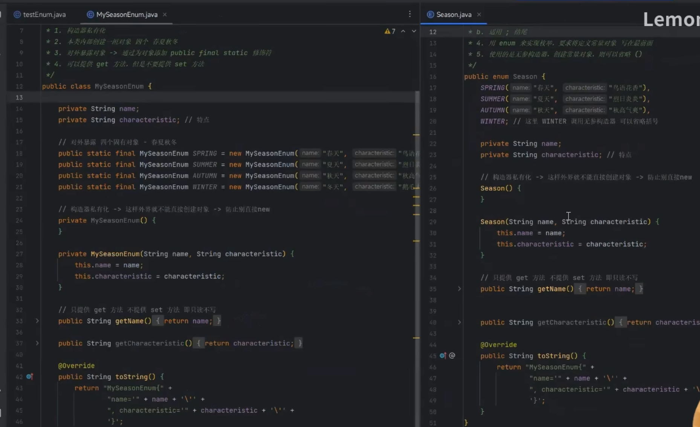
