# maven
​	Maven是一款服务于Java平台的自动化构建工具，主要用于项目管理和构建。它不仅可以用作包管理，还有许多插件，可以支持整个项目的开发、打包、测试及部署等一系列行为
​	Maven的核心功能之一是依赖管理。在传统的Java项目中，需要手动下载和管理第三方依赖包，这个过程既繁琐又容易出错。而使用Maven后，只需在pom.xml文件中添加依赖的坐标（包括groupId、artifactId和version），Maven会自动从中央仓库或私服仓库下载并管理这些依赖
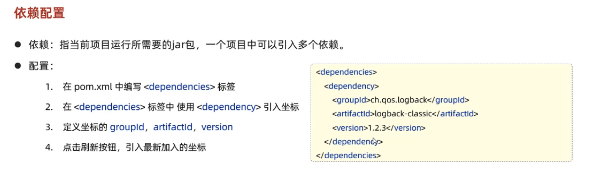
## 依赖传递
依赖具有传递性
- 直接依赖：在当前项目中通过依赖配置建立的依赖关系
- 间接依赖：被依赖的资源如果依赖其他资源，当前项目间接依赖其他资源
- 排除依赖：主动断开依赖的资源，被排除的资源无需指定版本

## 依赖范围
依赖的jar包，默认情况下，可以在任何地方使用。可以通过
```html
<scope>...</scope>
```
设置其作用范围
作用范围：
- 主程序范围有效(main文件夹范围内)
- 测试程序范围有效(test文件夹内)
- 是否参与打包运行(package指令范围内)


| scope值 | 主程序 | 测试程序 | 打包(运行) | 范例|
| ---- | :-----: | :----: | :-----: | :----: |
| compile | Y | Y | Y | log4j |
| test | - | Y | - | junit |
| provided | Y | Y | - | servlet-api |
| compile | - | Y | Y | jdbc驱动 |

## 生命周期
Maven的生命周期就是为了对所有的Maven项目构建过程进行抽象和统一

Maven有三套相互独立的<font color = red>生命周期</font>
1. clean:清理工作
2. default：核心工作，如：编译，测试，打包，安装，部署
3. site：生成报告，发布站点等

每一套生命周期包含一些阶段，阶段是有顺序的，后面的阶段依赖与前面的阶段
- clean：移除上一次构建生成的文件
- compile：编译项目源代码
- test：使用合适的单元测试框架运行测试junit
- package：将编译后的文件打包，如：jar，war
- install：安装项目到本地仓库


### 运行生命周期
- 在idea中，右侧Maven工具栏直接运行
- 命令行中 mvn clean

# HTTP协议
超文本传输协议，规定了浏览器和服务器之间数据传输的规则
1. 基于TCP协议：面向链接，安全
2. 基于请求-响应模型的：一次请求对应一次响应
3. HTTP协议是无状态的协议：对于事务处理没有记忆能力，每一次请求响应都是独立的
    - 多次请求不能共享数据
    - 速度快

## 请求数据格式
| HOST | 请求的主机名字 |
| ---- | :----- |
| User-Agent| 浏览器版本|
| Accept| 表示浏览器能接受的资源类型 |
| Accept-Language| 浏览器偏好的语言| 
| Accept-Encoding | 浏览器可以支持的压缩类型 |
| Content_Type | 请求主体的数据类型 |
| Content_Length | 请求主体的大小(字节) |

**请求方式-GET:** 请求参数在请求行中，没有请求体，如/brand?name=OPPO&status=1。GET请求大小有限制

**请求方式-POST：** 请求参数在请求体中，没有限制

## 请求响应
**相应行：** 相应数据第一行(协议，状态码，描述)
**响应头：** 第二行开始，格式key:value
**响应体：** 最后一部分，存放响应数据

<font color = red>响应的状态码：</font>
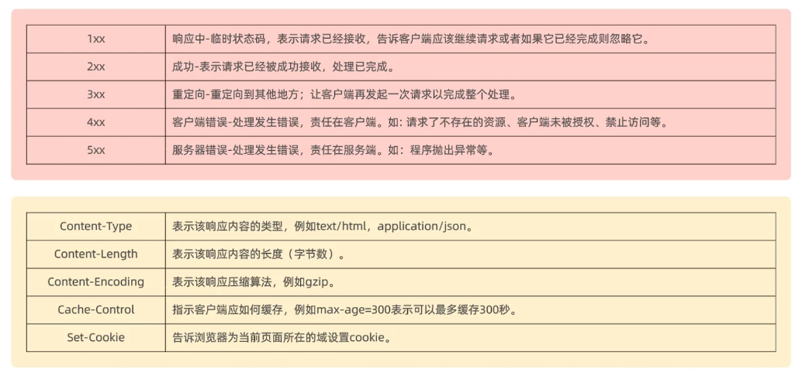

| 状态码分类 | 说明                                                         |
| ---------- | ------------------------------------------------------------ |
| 1xx        | **响应中**——临时状态码，表示请求已经接受，告诉客户端应该继续请求或者如果它已经完成则忽略它 |
| 2xx        | **成功**——表示请求已经被成功接收，处理已完成                 |
| 3xx        | **重定向**——重定向到其它地方：它让客户端再发起一个请求以完成整个处理。 |
| 4xx        | **客户端错误**——处理发生错误，责任在客户端，如：客户端的请求一个不存在的资源，客户端未被授权，禁止访问等 |
| 5xx        | **服务器端错误**——处理发生错误，责任在服务端，如：服务端抛出异常，路由出错，HTTP版本不支持等 |

| 状态码  | 英文描述                               | 解释                                                         |
| ------- | -------------------------------------- | ------------------------------------------------------------ |
| ==200== | **`OK`**                               | 客户端请求成功，即**处理成功**，这是我们最想看到的状态码     |
| 302     | **`Found`**                            | 指示所请求的资源已移动到由`Location`响应头给定的 URL，浏览器会自动重新访问到这个页面 |
| 304     | **`Not Modified`**                     | 告诉客户端，你请求的资源至上次取得后，服务端并未更改，你直接用你本地缓存吧。隐式重定向 |
| 400     | **`Bad Request`**                      | 客户端请求有**语法错误**，不能被服务器所理解                 |
| 403     | **`Forbidden`**                        | 服务器收到请求，但是**拒绝提供服务**，比如：没有权限访问相关资源 |
| ==404== | **`Not Found`**                        | **请求资源不存在**，一般是URL输入有误，或者网站资源被删除了  |
| 405     | **`Method Not Allowed`**               | 请求方式有误，比如应该用GET请求方式的资源，用了POST          |
| 428     | **`Precondition Required`**            | **服务器要求有条件的请求**，告诉客户端要想访问该资源，必须携带特定的请求头 |
| 429     | **`Too Many Requests`**                | 指示用户在给定时间内发送了**太多请求**（“限速”），配合 Retry-After(多长时间后可以请求)响应头一起使用 |
| 431     | **` Request Header Fields Too Large`** | **请求头太大**，服务器不愿意处理请求，因为它的头部字段太大。请求可以在减少请求头域的大小后重新提交。 |
| ==500== | **`Internal Server Error`**            | **服务器发生不可预期的错误**。服务器出异常了，赶紧看日志去吧 |
| 503     | **`Service Unavailable`**              | **服务器尚未准备好处理请求**，服务器刚刚启动，还未初始化好   |

状态码大全：https://cloud.tencent.com/developer/chapter/13553 

## Web服务器 —— Tomcat
Tomcat被称为web容器，servlet容器，servlet程序需要依赖Tomcat才能运行
1. web服务器对HTTP协议操作进行封装，简化web程序开发
    部署web项目，对外提供网上信息浏览服务

2. Tomcat是一个轻量级的web服务器，支持servlet,jsp等少量javaEE规范

HTTP协议默认端口为80，如果把Tomcat改为80，则不用输入端口号
**安装：** 直接解压
**部署程序**： 放到webapps目录下，及部署完成
**卸载：** 直接删除目录

起步依赖：
- spring-boot-starter-web
- spring-boot-starter-test
  

内嵌Tomcat服务器
- 基于Springboot开发的web应用程序，内置了Tomcat服务器，当启动类运行时，会自动启动内嵌的Tomcat服务器

# 请求响应
## 请求
### postman
Postman是网页调试与发送网页HTTP请求的Chrome插件
作用：常用于进行接口调试
### 简单参数
Springboot中接受简单参数：

**只需要在Controller方法中声明形参即可**

- 请求参数名与方法形参变量名相同
- 会自动进行类型转换


@RequestParam注解
- 方法形参名与请求参数名称不匹配，通过该注解完成映射
- 该注解的required默认是**true**，代表请求参数必须传递, 如果是**false**，表示可以有可以没有

指定默认值

```java
public Result page(@RequestParam(defaultValue = "1") Integer page)
```
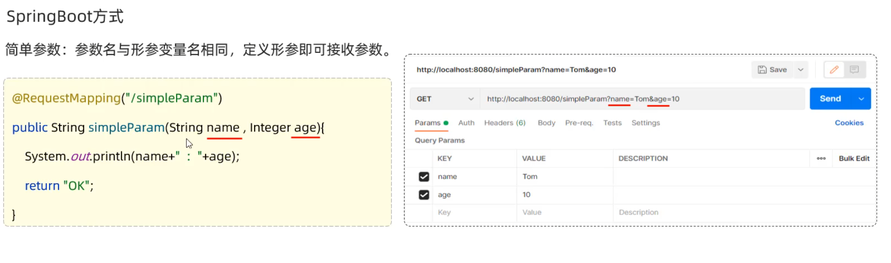

### 实体参数
请求参数与形参对象属性名相同

需要创建一个实体类
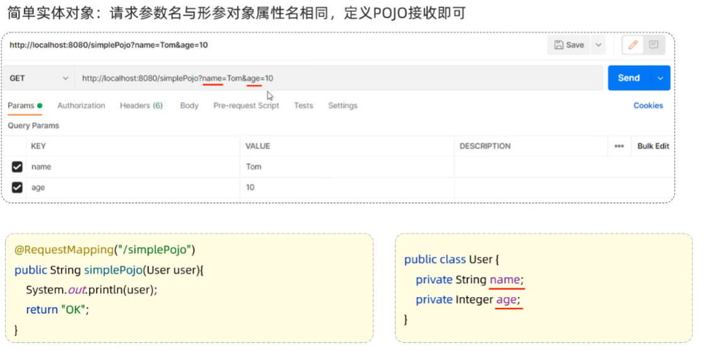

### 数组集合参数
数组参数：请求参数名与形参数组名称相同且请求参数为多个，定义数组类型形参即可接受参数
集合参数：请求参数名与形参集合名称相同且请求参数为多个，@RequestParam绑定参数关系

### 日期参数
使用@DataTimeFormat注解完成日期参数格式转换
```java
@RequestMapping("/dateParam")
public String dateParam(@DateTimeFormat(pattern = "yyyy-MM-dd HH:mm:ss") LocalDateTime updateTime){
    System.out.println(updateTime);
    return "OK";
}
```

### Json参数
json数据键名与形参对象属性名相同，定义POJO类型形参即可接受参数，需要@RequestBody标识
```java
@RequestMapping("/jsonParam")
public String jsonParam(@RequestBody User user){
System.out.println(user);
return "OK";
}
public class User {
    private String name;
    private Integer age;
    private Address address;
}

public class Address {
    private String province;
    private Integer city;
}
```
### 路径参数
通过请求URL直接传递参数，使用{...}来标识路径参数，需要使用@PathVariable获取路径参数
```java

@RequestMapping(value = "/path/{id}",method =RequestMethod.GET)
@ResponseBody
public String  pathParam(@PathVariable Integer id) {
    System.out.println(id);
    return "OK";
}
```
## 响应
<font color = red>@ResponseBody</font>
类型：方法注解，类注解
位置：方法上、类上
作用：将方法返回值直接相应，如果返回值类型是实体对象/集合，将会转换成JSON格式相应

<font color = red>**@RestController = @Controller + @ResponseBody**</font>

### 统一响应结果
1. 响应码：1代表成功，0代表失败
2. 提示信息
3. 返回的数据

```java
public class Result{
    private Integer code;
    private String msg;
    private Object data;
}
```
# 分层解耦
## 三层架构
- **controller：** 控制层，接受前端发送的请求，对请求进行处理并响应数据。
- **service：** 业务逻辑层，处理具体的业务逻辑
- **dao：** 数据访问层，负责数据访问操作,包括对数据的增删改查

1. 内聚：软件中各个功能模块内部的功能联系
2. 耦合：衡量软件中各个层/模块之间的依赖，关联的程度

**软件设计原则：高内聚低耦合**

**控制反转：** 简称IOC，或者spring容器。对象的创建控制权由程序自身转移到外部(容器)，这种思想焦作控制反转
**依赖注入：** 简称DI。容器为应用程序提供运行时，所以来的资源称之为依赖注入。
**Bean对象：** IOC容器中创建，管理的对象，称之为Bean


# IOC&DI
步骤：
1. Server层及Dao层的实现类，交给IOC容器管理
2. 为Controller和service注入运行时，依赖的对象
3. 测试

加上注解：
<font color = #b8860b>@Component </font>当前类交给IOC,成为IOC容器中的bean
<font color = #b8860b>@Autowired </font>运行时，IOC容器会提供该类型的Bean对象，并赋值给该变量，称之为<font color = red>依赖注入</font>

## Bean的声明
要把某个对象交给IOC容器管理，需要在对应的类上加注释

<font color = red>**@RestController = @Controller + @ResponseBody**</font>


| 注释  | 说明        | 位置        |
| ------- | ------------------ | -- |
| @Component | 声明Bean的基本注解  | 不属于以下三类时用此注解 |
| @Controller     |  @Component的衍生注解 | 标注在控制器类上 |
| @Service     | @Component的衍生注解 | 标注在业务类上 |
| @Repository | @Component的衍生注解   |    标注在数据访问类上(由于与Mybatis整合，用得少)              |

- 声明bean，可以通过value属性指定bean的名字，如果没有指定，默认为类的首字母小写
- 使用以上四个注解都可以声明bean，但是在springboot继承的web开发中，声明控制器只能用@Controller

<font color = #b8860b>@SpringBootApplication </font>具有包扫描作用，默认扫描当前包和子包

<font color = #b8860b>@Autowired </font>默认按照类型进行，如果存在多个相同类型的bean，会报错


解决方法：
1. 通过在@Service上面加一个@Primary来说明用这个bean
2. 在<font color = #b8860b>@Autowired </font> + <font color = #b8860b>@Qualifier("bean的名称")</font>
3. @Resource(name=="bean的名称")

**<font color = #b8860b>@Autowired </font>和<font color = #b8860b>@Resource </font>的区别：**
1. <font color = #b8860b>@Autowired </font>是Spring提供的注解，c是JDK提供的
2. <font color = #b8860b>@Autowired </font>按照类型注入，<font color = #b8860b>@Resource </font>按照名称注入

# MyBatis
是持久层框架，用于简化JDBC的开发
操作数据库的框架

配置mybatis:
```java
spring.datasource.driver-class-name=com.mysql.cj.jdbc.Driver

spring.datasource.url=jdbc:mysql://localhost:3306/mybatis

spring.datasource.username=root

spring.datasource.password=20041123zzx.
```
编写SQL语句
加上mapper语句，程序框架会自动生成接口的实现类对象
会把这个代理对象放到IOC容器中，在测试中，可以用依赖注入方法获取数据

```java
@Mapper
public interface UserMapper {
    @Select("select * from user")
    public List<User> list();
}
```
## JDBC
用java操作关系型数据库的一套API
数据库产商提供实现，称为驱动


缺点：
硬编码：连接信息写在java代码中，修改不便
繁琐，需要写出表中的所有字段
资源浪费，性能降低


## 数据库连接池
- 数据库连接池是一个容器，负责分配，管理数据库连接
- 允许应用程序重复使用一个现有的数据库连接，不在重新建立一个
-  释放空闲时间超过最大空闲时间的连接，来避免因为没有释放连接而引起的数据库连接遗漏

连接池：
常用的有Druid,Hikari(springboot默认)
- Druid(德鲁伊):是阿里巴巴开源的数据库连接池项目

切换德鲁伊连接池加上依赖即可
```java
<dependency>
   <groupId>com.alibaba</groupId>
   <artifactId>druid-spring-boot-starter</artifactId>
   <version>1.2.8</version>
</dependency>
```
## lombok
是一个java类库，能通过注解的形式自动生成构造器，setter,setter,equals,hashcode,tostring等方法，并可以自动化生成日志变量，简化java开发。

需要引入lombok的依赖
```xml
<dependency>
    <groupId>org.projectlombok</groupId>
    <artifactId>lombok</artifactId>
</dependency>
```

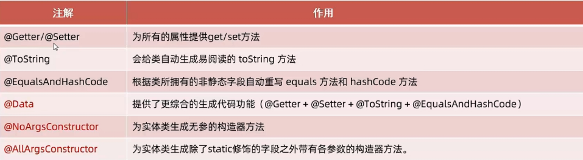

<font color = #b8860b>@Data</font>
<font color = #b8860b>@NoArgsConstructor</font> :无参构造
<font color = #b8860b>@AllArgsConstructor</font> : 全参构造


预编译SQL：
- 性能更高
- 更安全，可以防止SQL注入

SQL注入：通过操作输入的数据来修改实现定义好的SQL语句，已达到代码对服务器进行攻击的方法
### 参数占位符
#{...}
执行SQL时，会替换成？，生成预编译SQL，会自动设置参数值
在传递参数时使用

${...}
拼接SQL，直接将参数拼接才SQL语句中，存在SQL注入问题
对表名，列明进行动态设置时使用

### 删

```java
@Mapper
public interface EmpMapper {
    @Delete("delete from emp where id = #{id}")
    public void delete(Integer id);
}
```

### 新增
如果有多个参数，可以使用实体类封装，大括号中直接写属性名
```java
    @Insert("insert into emp(username, name, gender, image, job, entrydate, dept_id, create_time, update_time)" +
            "value (#{username},#{name},#{gender},#{image},#{job},#{entrydate},#{deptId},#{createTime},#{updateTime})")
    public void insert(Emp emp);

```

主键返回
在数据添加成功后，需要获取插入数据库数据的主键

实现：
在SQL注解语句上面添加：
```java
@Options(keyProperty = "id",useGenerateKeys = true)
```

### 更新

如果实体类名字与属性名字不同，可以起别名与实体类一致

通过@Results,@Result手动映射封装
```java
@Results({
    @Result(column = "dept_id",property = "deptId"),
    @Result(column = "create_time",property = "createTime")
})
```
开启mybatis的驼峰命名自动映射开关
添加配置文件
```mybatis.configuration.map-underscore-to-camel-case=true```

### XML映射文件
- XML映射文件的名称与mapper接口名称一致，并且将XML映射文件和mapper接口放置在相同包下，同包同名
- xml映射文件的namespace属性为mapper接口全限定名一致
- XML文件中SQL语句的id与mapper接口中的方法名一致，并保持返回类型一致

**需要在XML中添加配置文件**

```xml
<?xml version="1.0" encoding="UTF-8" ?>
<!DOCTYPE mapper
  PUBLIC "-//mybatis.org//DTD Mapper 3.0//EN"
  "http://mybatis.org/dtd/mybatis-3-mapper.dtd">
```
### **XML可复制模版**
```xml
<?xml version="1.0" encoding="UTF-8" ?>
<!DOCTYPE mapper
        PUBLIC "-//mybatis.org//DTD Mapper 3.0//EN"
        "http://mybatis.org/dtd/mybatis-3-mapper.dtd">

<mapper namespace="com.zzx.mapper.EmpMapper">
    <select id="list" resultType="com.zzx.pojo.Emp">
        
    </select>


</mapper>
```


idea插件：
mybatisx
基于idea快速开发的插件

## Mybatis动态SQL
随着用户输入或者外部条件的改变而变化的SQL语句，成为动态SQL
### \<if>
写在xml中

用于判断条件是否成立，使用test属性进行条件判断，如果条件为true，拼接SQL

用\<where>标签代替where语法

\<where>：where元素只会在子元素有内容的情况下才插入where子句，而且会自动去除子句的and或者or

```xml
    <select id="list" resultType="com.zzx.pojo.Emp">
        select *
        from emp
        <where>
            <if test="name != null">
                name list concat('%',${name}, '%')
            </if>
            <if test="gender != null">
                and gender = #{gender}
            </if>
            <if test="begin != null and end!=null">
                and entrydate between # #{begin} and #{end}
            </if></where>
        order by update_time desc

    </select>
```
### \<set>:动态的在行首插入set关键字，并会删掉额外的逗号，用在update语句中

### \<foreach>:
```xml
<foreach collection="" item="" separator="" open="" close=""
```
collection:遍历的集合，与Mapper接口中的变量名相同

| 写法    | 作用               | 备注                                               |
| ------- | ------------------ | -------------------------------------------------- |
| `#{id}` | 预编译参数，防注入 | 用于 `IN (...)`                                    |
| `${id}` | 字符串拼接         | 用于 `FIELD(id, ...)`，**必须保证 ids 来自可信源** |

## item:遍历出来的元素，可以自己定义名字

separator:分隔符
open:遍历开始前拼接的SQL片段
close:遍历结束后拼接的SQL片段

### \<sql>
\<sql>定义可重用的SQL片段
\<include> 通过属性refid，指定包含sql片段

```xml
<sql id="commonSelect"></sql>
```
直接自闭和

```xml
<include refid="commonSelect"/>
```

# 简单的项目
## 环境搭建
需要springboot工程，引入web,mybatis,mysql驱动,lombok依赖
需要准备对应的mapper，Service(接口，实现类),controller基础结构，使用三层架构开发
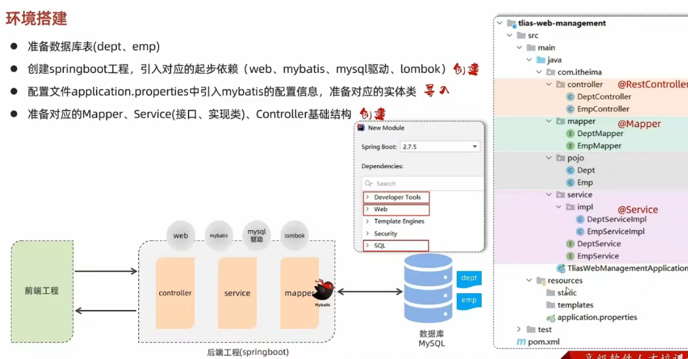

## 开发规范-Restful
REST，是一种软件架构风格

## 分页插件pageHelper
使用这个插件需要引入依赖
```xml
<dependency>
    <groupId>com.github.pagehelper</groupId>
    <artifactId>pagehelper-spring-boot-starter</artifactId>
    <version>1.4.2</version>
</dependency>
```
只需要正常查询即可
```java
    @Select("select * from emp")
    public List<Emp> list();


    @Override
    public PageBean page(Integer page, Integer pageSize) {
        
        PageHelper.startPage(page, pageSize);

        List<Emp> empList = empMapper.list();
        Page<Emp> p = (Page<Emp>) empList;

        long count = p.getTotal();
        List<Emp> empList1 = p.getResult();
        return new PageBean(count, empList1);
    }
```
## MultipartFile
服务端接受文件需要用MultipartFile定义变量接受，上传的文件为临时文件，需要存储下来

### 本地存储

在springboot中，文件上传，默认单个文件允许最大大小为1M，如果需要上传大文件，可以进行如下配置

在java配置文件中

```properties
# 配置单个文件上传大小限制
spring.servlet.multipart.max-file-size=10MB

# 配置单个请求最大大小限制，一次请求中可以上传多个文件
spring.servlet.multipart.max-request-size=10MB
```
## MultipartFile常用方法
### 获取原始文件名
String getOriginalFilename()

### 将接受的文件转存到磁盘文件中
transferTo(File dest)

### 获取文件的大小 字节
long getSize

### 获取文件内容的字节数组
byte[] getByte

### 获取接受到的文件内容的输入流
InputStream getInputStream()

## 使用云服务

SDK：软件开发工具包，包括辅助软件开发的依赖(jar包)，代码示例等，都可以叫做SDK
Bucket:存储空间是用户用于存储对象的容器，所有的对象都必须隶属于某个存储空间

## 配置阿里云
可以把阿里云的配置文件放到springboot的配置文件中
然后使用注解进行注入
@Value(${配置文件名字})

```properties
aliyun.oss.endpoint=https://oss-c
aliyun.oss.accessKeyId=LTAI4
aliyun.oss.accessKeySecret=yBsh
aliyun.oss.bucketName=we
```
```java
@Value("${aliyun.oss.endpoint}")
private String endpoint ;
@Value("${aliyun.oss.accessKeyId}")
private String accessKeyId ;
@Value("${aliyun.oss.accessKeySecret}")
private String accessKeySecret ;
@Value("${aliyun.oss.bucketName}")
private String bucketName ;
```
## 配置文件
Springboot提供多种属性配置方式
**properties > yml > yaml**
- application.properties
```properties
server.port=8080
server.address=127.0.0.1
```

- application.yml

```yaml
server:
    port:8080
    address:127.0.0.1
```
- application.yaml
```yaml
server:
    port:8080
    address:127.0.0.1
```
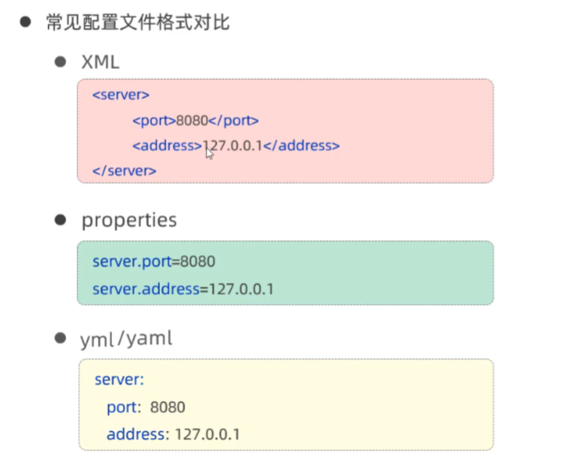


## yml
- 大小写敏感
- 数值前边必须有空格，作为分隔符
- 使用缩进表示层级关系，缩进时，不允许使用Tab键，只能用空格 (idea中会自动将Tab转换为空格)
- 缩进的空格数目不重要，只要相层级的元素左侧对齐即可
- #表示注释，从这个字符一直到行尾，都会被解析器忽略

```yaml
server:
    port:8080
    address:127.0.0.1
```

## yml数据格式
- 对象、MAP集合
```yml
user:
  name: zhangsan
  age: 18
  password: 13246
```
- 数组，List，Set集合
```yml
hobby:
  - java
  - game
  - sport
```
## ConfigurationProperties
省略了@value注解
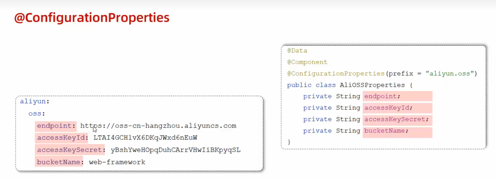

注入外来配置的属性

- @Value注解只能一个一个的进行外部属性的注入
- @ConfigurationProperties可以批量的将外部属性注入到bean对象的属性中

# 登录功能

## 登录校验
会话技术：
用户打来浏览器，访问web服务器的资源，会话建立，直到有一方断开连接，会话结束，在一次会话中可以包含多次请求和响应

会话跟踪：一种维护浏览器状态的方法，服务器需要识别多次请求是否来自同一浏览器，以便同一次会话的多次请求间共享数据
会话跟踪方案：
- 客户端会话跟踪技术：Cookie
- 服务端会话跟踪技术：Session
- 令牌技术


### Cookie
优点：
- HTTP协议中支持的技术
缺点：
- 移动端APP无法使用Cookie
- 不安全，用户可以自己禁用Cookie
- 不能跨域
跨域：跨域分为三个维度，协议，IP/域名，端口号一个不同为跨域

### Session

优点：存储在服务器端，安全
缺点：
- 服务器集群环境下无法直接使用session
- Cookie缺点


### 令牌技术
优点：
- 支持PC端，移动端
- 解决集群环境下的认证问题
- 减轻服务器端存储压力

缺点：
- 需要自己实现 
## JWT
全称：JSON Web Token
定义了一种简洁的，自包含的格式，用于在通信双方以JSON数据格式安全的传输信息，由于数字签名的存在，这些信息都是可靠的

base64：是一种基于64个可打印字符来表示二进制数据的编码方式

引入JWT依赖
```xml
        <dependency>
            <groupId>io.jsonwebtoken</groupId>
            <artifactId>jjwt</artifactId>
            <version>0.12.0</version>
        </dependency>
```
## 过滤器Filter
是javaweb的三大组件(servlet，filter，listener)之一
过滤器可以把对资源的请求拦截下来，从而实现一些特殊的功能
一般完成一些通用的操作，比如登录校验，统一编码处理，敏感字符处理等

步骤：
定义Filter，定义一个类，实现filter接口，并重写所有的方法
配置：
filter类上加@WebFilter注解，配置拦截资源的路径，引导类上加@ServletComponentScan开启Servlet组件支持
```java

@WebFilter(urlPatterns = "/*")
public class DemoFilter implements Filter {

    //拦截到请求之后调用，调用多次
    @Override
    public void doFilter(ServletRequest servletRequest, ServletResponse servletResponse, FilterChain filterChain) throws IOException, ServletException {
        System.out.println("拦截到请求之后");
        //放行
        filterChain.doFilter(servletRequest,servletResponse);

    }

    //初始化的方法，只会调用一次
    @Override
    public void init(FilterConfig filterConfig) throws ServletException {
        Filter.super.init(filterConfig);
        System.out.println("初始化");
    }

    //销毁方法，只会调用一次
    @Override
    public void destroy() {
        Filter.super.destroy();
        System.out.println("销毁方法");
    }
}
```
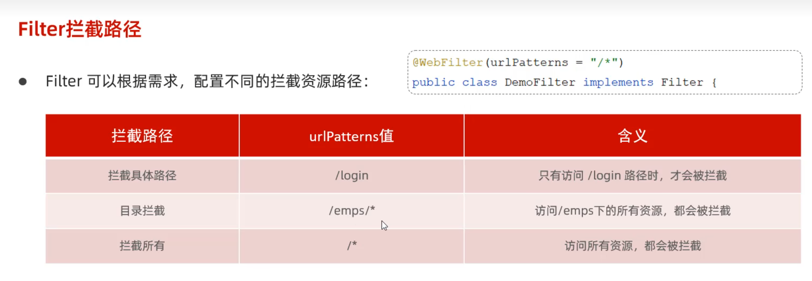

过滤器链：
一个web应用中，可以配置多个过滤器，多个过滤器就形成了一个顾虑器链
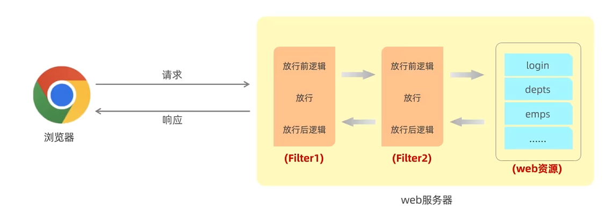

顺序：注解配置的Filter，优先级是按照过滤器类名的自然排序


## 登录校验Filter流程
- 获取请求url。
- 判断请求url中是否包含login，如果包含，说明是登录操作，放行
- 获取请求头中的令牌 (token)
- 判断令牌是否存在，如果不存在，返回错误结果 (未登录)
- 解析token，如果解析失败，返回错误结果 (未登录)
- 放行。
- 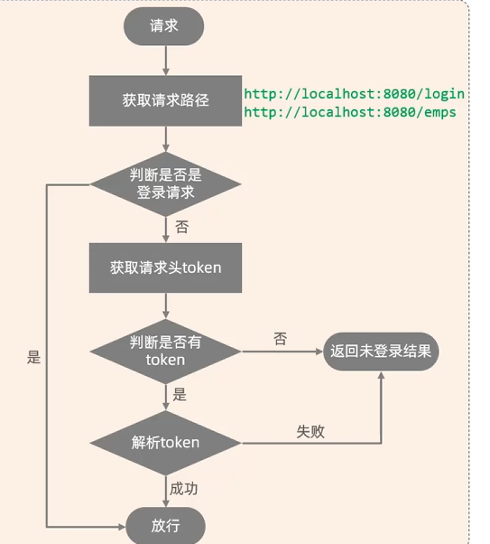

## 拦截器 Interceptor
是一种动态拦截方法调用的机制，类似于过滤器，Spring框架中提供的，用来动态拦截控制器方法的执行
作用：拦截请求，在执行的方法调用前后，根据业务需要执行预先设定的代码


### 拦截路径
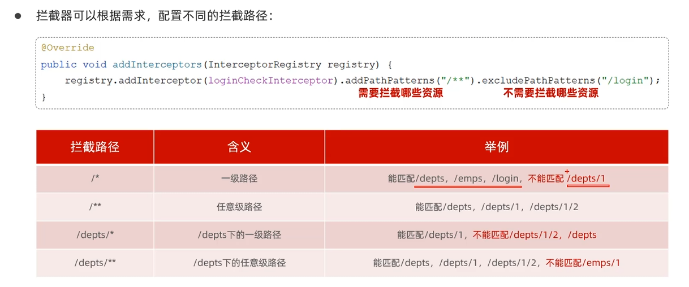


**过滤器优先于拦截器**

## 异常处理

定义全局异常处理器
在这个类上面加
<font color = #b8860b>@RestControllerAdvice</font>

在方法上面加：
<font color = #b8860b>@ExceptionHandler</font>(Exception.class)//捕获所有异常

指定捕获的异常

# Spring事务管理
<font color = #b8860b>@Transactional</font>

业务(Server)层上的方法，类上，接口上
将当前方法交给Spring进行事务管理，方法执行前开启事务，成功执行完毕，提交事务，出现异常，回滚事务

一般加载业务执行增删改这一类多次操作上

## 回滚rollbackFor

默认情况下，只有出现RuntimeException才回滚异常
rollbackFor属性用于控制出现何种异常类型，回滚事务

@Transactional(rollbackFor = Exception.class)


## 传播行为propagation
事务传播行为，指的是当一个事务方法被另一个事务方法调用时，这个事务应该束河进行事务控制
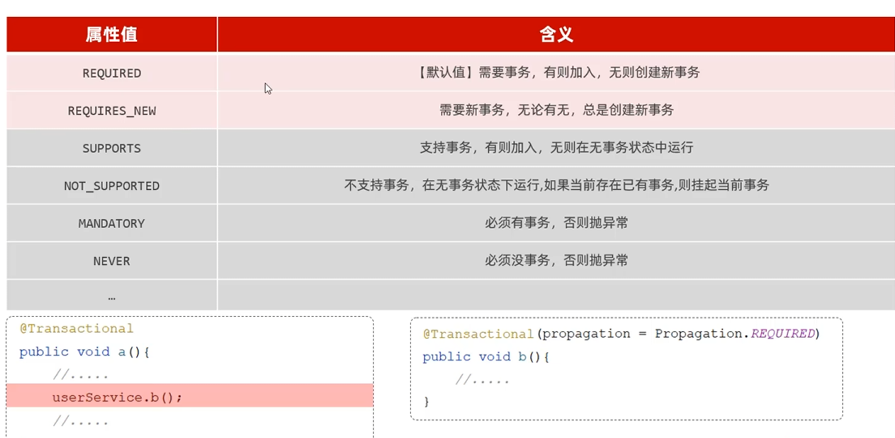


# AOP
AOP：面向切面编程，面向方面编程，就是面向特定方法编程

场景：案例部分功能运行较慢，需要统计每一个业务方法的执行耗时

导入依赖
```xml
<!--AOP-->
<dependency>
    <groupId>org.springframework.boot</groupId>
    <artifactId>spring-boot-starter-aop</artifactId>
</dependency>
```
```java

@Component
@Aspect//AOP
@Slf4j
public class TimeAspect {

    @Around("execution(* com.zzx.service.*.*(..))")
    public Object recordTime(ProceedingJoinPoint joinPoint) throws Throwable {
        long begin = System.currentTimeMillis();

        Object proceed = joinPoint.proceed();

        long end = System.currentTimeMillis();
        log.info(joinPoint.getSignature() + "方法执行耗时：{}ms", end - begin);
        return  proceed;
    }
}

```

- 连接点： JoinPoint,可以被AOP控制的方法
- 通知：Advice，那些重复的逻辑，也就是共性的功能，最终体现为一个方法
- 切入点：PointCut，匹配连接点的条件，通知仅会在切入点方向执行时被应用
- 切面，Aspect，描述通知与切入点的对应关系（通知+切入点）
- 目标对象：Target，通知所应用的对象


## 通知类型

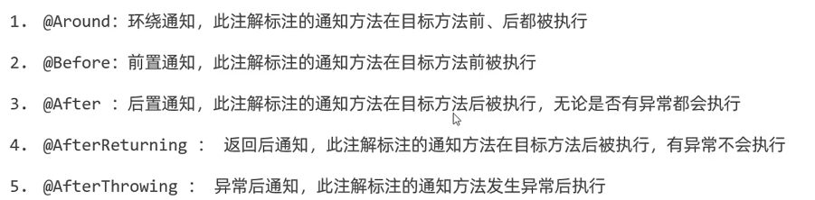

- 环绕通知需要自己调用proceedingJoinPoint.proceed();来让原始方法执行，其他通知不需要考虑目标方法执行
- 环绕方法通知需要把**返回方法返回值**必须指定为**Object**，来接受原始方法返回值

**@PointCut**:该注解作用是将公共的切点表达式抽取出来，需要时引用该切点表达式即可

## 通知顺序
当有多个切面的切入点都匹配到了目标方法，目标方法运行是，多个通知方法都会被执行
1. 不同切面类中，默认按照切面类的名字字母排序
2. 用<font color = #b8860b>@Order</font>(数字)加载切面类上来控制顺序，数字越小，越先执行

## 切入点表达式
描述切入点方法的一种表达式
主要用来决定项目中的那些方法需要加入通知
形式：
1. execution()根据方法的签名来匹配
2. @annotation()根据注解来匹配

### execution
主要根据方法的返回值，包名，类名，方法名，方法参数等信息来匹配
语法：
**execution(访问修饰符? 返回值 包名类名?方法名(方法参数) throws 异常?)**
其中带?的表示可以省略的部分
- 访问修饰符:可省略 (比如: public、protected)
- 包名.类名: 可省略
- throws 异常:可省略(注意是方法上声明抛出的异常，不是实际抛出的异常)

可以使用通配符描述切入点：
- *：单独的任意符号，可以通配任意返回值
- **..**:多个连续的任意符号，可以统配任意层级的包，或者任意类型任意个数的参数

根据业务需要，可以使用 **&&** **||** **！** 来组合比较复杂的切入点表达式

书写建议：
所有业务方法名在命名时尽量规范，方便切入点表达式快速匹配。如: 查询类方法都是 **find** 开头，更新类方法都是 **update**开
描述切入点方法通常基于接口描述，而不是直接描述实现类，增强拓展性。
在满足业务需要的前提下，尽量缩小切入点的匹配范围。如: 包名匹配尽量不使用 .，使用匹配单个包。

### @annotation

用于匹配标识有特定注解的方法

<font color = #b8860b>@annotation</font>(com.zzx.anno.Log)

需要自定义注解
## 连接点
在Spring中用JoinPoint抽象了连接点，用它可以获得方法执行时的相关信息，如目标类，方法名，方法参数等

- 对于@Around通知，获取连接点信息只能使用ProceedingJoinPoint
- 对于其他四种通知，获取连接点信息只能使用JoinPoint，他是ProceedingJoinPoint的父类型

## 将增删改的操作日志记录到数据库表中
要获取request对象，从请求头中获取到jwt令牌，解析令牌获取出当前用户的id

# 打包
java -jar tlias-web-management-0.0.1-SNAPSHOT.jar
配置端口，**命令行属性>系统属性**

java -Dserver.port=9000 -jar tlias-web-management-0.0.1-SNAPSHOT.jar --server.port=10010
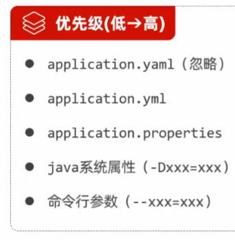

# 获取bean
默认情况下，Spring项目启动时，会把bean都创建好放在IOC容器中，可以手动获取这些bean
## betBean
根据name获取bean：
Object getBean(String name)

## 根据类型获取bean
```java
<T> T getBean(class<T> requiredType)
```

## 根据类型获取bean，带类型转换
```java
<T> T getBean(String name,class<T> requiredType)
```
```java
@Autowired
private ApplicationContext applicationContext;
@Test
public void testGetBean(){
    DeptController bean1 =(DeptController) applicationContext.getBean("deptController");
    System.out.println(bean1);
    
    DeptController bean2 = applicationContext.getBean(DeptController.class);
    System.out.println(bean2);
    
    DeptController bean3 = applicationContext.getBean("deptController", DeptController.class);
    System.out.println(bean3);
    
}
```
## bean作用域
Spring支持物种作用于，后三种在web环境才生效
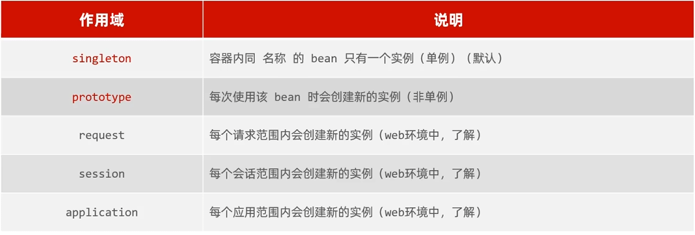

通过<font color = #b8860b> @Scope</font> 注解来配置作用域


- 默认singleton的bean，在容器启动时被创建，可以使用@Lazy注解来延迟初始化(延迟到第一次使用时)
- prototype的bean，每一次使用该bean的时候都会创建一个新的实例。
- 实际开发当中，绝大部分的Bean是单例的，也就是说绝大部分Bean不需要配置scope属性


## 第三方Bean
- 如果要管理的bean对象来自于第三方(不是自定义的)，是无法用 @Component 及衍生注解声明bean的，就需要用到 <font color = #b8860b> @Bean</font>注解
- 若要管理的第三方bean对象，建议对这些bean进行集中分类配置，可以通过 @Configuration 注解声明一个配置类.

不建议在启动类
```java
@SpringBootApplication
public class SpringbootwebConfig2Application {
    @Bean //将方法返回值交给IOC容器管理,成为IOC容器的bean对象
    public SAXReader saxReader(){
    return new SAXReader();
    }
}
```

```java
@Configuration
public class CommonConfig {
    @Bean
    public SAXReader saxReader(){
    return new SAXReader();
    }
}
```
可以通过@Bean注解的name/value属性指定Bean名称，如果未指定，默认是方法名

**依赖注入时在配置类形参中声明要注入的类名即可**


# 原理
## 自动配置原理
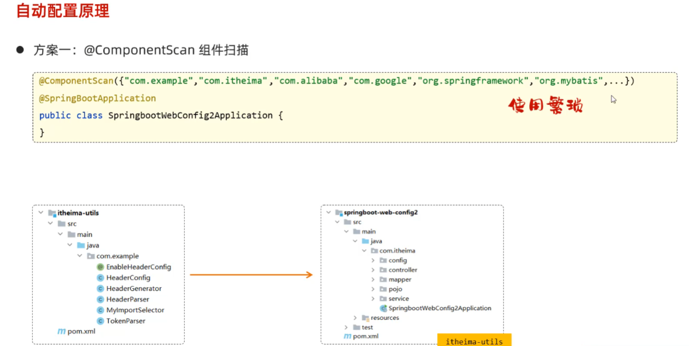
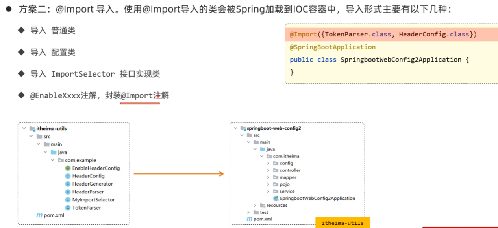

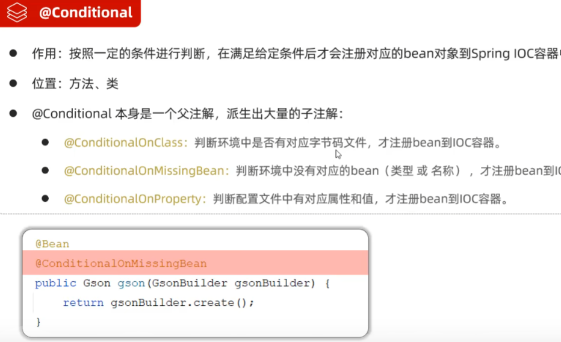
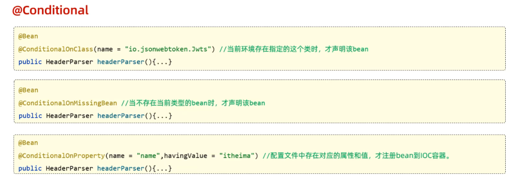

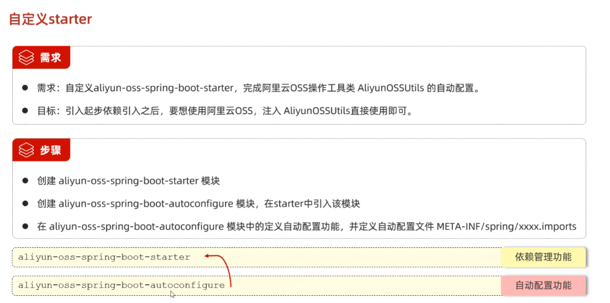