# 微服务


## 导入黑马商城项目

### 安装mysql

```bash
docker run -d \
  --name mysqlmall \
  -P \
  -e TZ=Asia/Shanghai \
  -e MYSQL_ROOT_PASSWORD=20041123zzx. \
  -v /home/lxmall/mysql/data:/var/lib/mysql \
  -v /home/lxmall/mysql/conf:/etc/mysql/conf.d \
  -v /home/lxmall/mysql/init:/docker-entrypoint-initdb.d \
  --network mynet\
  mysql:8.0
  
  
docker run -d --name mysqlmall -p 32778:3306 -e TZ=Asia/Shanghai -e MYSQL_ROOT_PASSWORD=20041123zzx. -v /home/lxmall/mysql/data:/var/lib/mysql -v /home/lxmall/mysql/conf:/etc/mysql/conf.d -v /home/lxmall/mysql/init:/docker-entrypoint-initdb.d --network hm-net mysql:8.0
```

微服务架构，是服务化思想指导下的一套最佳时间架构方案。

服务化就是把单体架构中的功能模块拆分为多个独立的项目


springcloud继承了各种微服务功能组件，并基于springboot实现了这些组件的自动装配，从而提供了良好的开箱即用体验

拆分单体项目要做到：

1、**高内聚**：每个微服务的职责要尽量单一，包含的业务相关联度高，完整度高

2、**低耦合**：每个微服务的功能要相对独立，尽量减少对其他微服务的依赖

如何拆分：

1、纵向拆分：按照业务模块拆分

2、横向拆分：抽取公共服务，提高复用性

拆分服务

工程结构有两种：独立Project，maven聚合

# 注入方式

如果不推荐使用@autoword注入，可以定义为final，然后再类上面加**@RequiredArgsConstructor**

# 远程调用

spring给我们提供了一个RestTemplate工具，可以方便的视线Http请求的发送使用步骤如下

1、 注入RestTemplate到Spring容器

```java
@Bean
public RestTemplate restTemplate(){
    return new RestTemplate();
}
```

2、 发起远程调用

```java
public <T> ResponseEntity<T> exchange(
		String url, //请求路径             "http:/localhost:8081/items/items?id={id}"
    	HttpMethod method, // 请求方式           HttpMethod.GET
    	@Nullable HttpEntity<?> requseEntity,  // 请求实体，可以为空
   		Class<T> respinseType,       // 返回值类型            User.class
    	Map<String, ?> uriVarivales   // 请求参数       Map.of("id", "1")
)
    
    restTemplate.exchange()
```

这种方式把路径写死了，没办法做到负载均衡，需要用注册中心

# 注册中心

## 注册中心原理

类似于spring容器
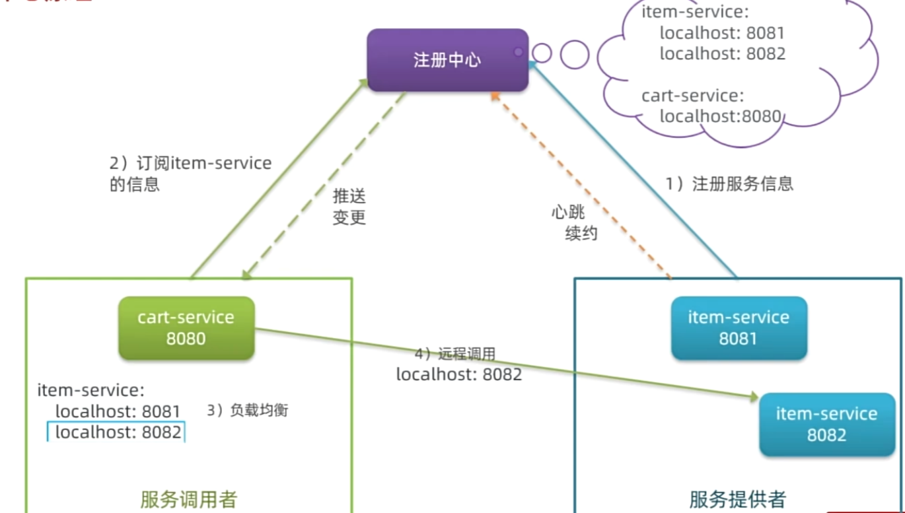

服务治理中三个角色为：

1、提供者：暴漏服务接口，提供其他服务调用

2、消费者：调用其他服务提供的接口

3、注册中心：记录并监控微服务个实例状态，推送服务变更信息

服务提供者通过心跳机制想注册中心报告自己的健康状态，当心跳异常时，注册中心会将异常服务剔除，并通知订阅了该服务的消费者

消费者使用负载均衡的算法，从多个实例中选择一个

## Nacos注册中心

Nacos是目前国内企业中占比最多的注册中心组件，是阿里巴巴的产品，目前已经加入springcloudalibaba

导入sql，启动docker服务

```bash
docker run -d \
--name nacos \
--env-file ./nacos/custom.env \
-p 8848:8848 \
-p 9848:9848 \
-p 9849:9849 \
--restart=always \
nacos/nacos-server:v2.1.0-slim


此服务配置在192.168.72.128服务上面，阿里云内存太小，不够用

账号：nacos
密码：nacos
```

## 服务注册

这一部就是提供者

步骤为：

1、引入nacos discovery依赖

```xml
<!--nacos 服务注册发现-->
<dependency>
    <groupId>com.alibaba.cloud</groupId>
    <artifactId>spring-cloud-starter-alibaba-nacos-discovery</artifactId>
</dependency>
```

2、配置Nacos地址

在`item-service`的`application.yml`中添加nacos地址配置：

```YAML
spring:
  application:
    name: item-service # 服务名称
  cloud:
    nacos:
      server-addr: 192.168.150.101:8848 # nacos地址
```

## 注册发现

这一步是消费者，消费者需要连接nacos用来拉去和订阅服务，因此服务发现的前两步骤与服务注册时一样的，后面再加上服务调用即可

1、引入nacos依赖

2、配置nacos地址

3、服务发现

```java
// 定义
private final DiscoveryClient discoveryClient;   
	
private void handleCartitems(List<CartVO> vos){
    // 根据服务名称，拉去服务的实例列表
    List<ServiceInstance> instances = discoveryClient.getInstances("item-service");
    if (CollUtil.isEmpty(instances)) {
        return;
    }
    // 2.2.手写负载均衡
   ServiceInstance instance =  instances.get(RandomUtil.randomInt(instances.size()));
   // 3获取实例的IP和端口
    URI uri = serviceInstance.getUri();// http://localhost:8081
}
```

# OpenFeign

OpenFeign是一个声明式的http客户端，是SpringCloud在Eureka公司开源的Feign基础上改造而来。

官方地址：https://github.com/OpenFeign/feign

其作用就是基于SpringMVC的常见注解，帮我们优雅的实现http请求的发送。

## 使用OpenFeign

OpenFeign已经被springcloud自动装配，实现起来很简单

1、引入依赖，包裹OpenFeign和负载均衡组件springcloudLoadBalancer

```xml
  <!--openFeign-->
  <dependency>
      <groupId>org.springframework.cloud</groupId>
      <artifactId>spring-cloud-starter-openfeign</artifactId>
  </dependency>
  <!--负载均衡器-->
  <dependency>
      <groupId>org.springframework.cloud</groupId>
      <artifactId>spring-cloud-starter-loadbalancer</artifactId>
  </dependency>
```

2、通过@EnableFeignClients注解，启用OpenFeign功能

在`Application`启动类上添加注解，启动OpenFeign功能：

```java
@SpringBootApplication
// 开启 OpenFeign
@EnableFeignClients
public class CartApplication {
    public static void main(String[] args) {
        SpringApplication.run(CartApplication.class, args);
    }
}
```

3、编写FeignClient

用来代替之前写的服务发现的代码

在消费者中定义一个新的**接口**，编写Feign客户端

@FeignClient：根据服务名称，去拉去实例列表

```java
@FeignClient("item-service")
public interface ItemClient {

    @GetMapping("/items")  // 请求路径和方式
    List<ItemDTO> queryItemByIds(@RequestParam("ids") Collection<Long> ids);
}
```

这里只需要声明接口，不需要实现方法

有了上述信息，就可以利用动态代理帮我们实现这个方法，并发送一个get请求，并自动处理返回值

4、使用FeignClient

最后在需要的地方调用`ItemClient`的方法

```java
private final ItemClient itemClient;

List<ItemDTO> items = itemClient.queryItemByIds(itemIds);
```

## 连接池

Feign底层发起http请求，依赖于其它的框架。其底层支持的http客户端实现包括：

- HttpURLConnection：默认实现，不支持连接池
- Apache HttpClient ：支持连接池
- OKHttp：支持连接池

默认实现它不支持连接池，性能较差

因此我们通常会使用带有连接池的客户端来代替默认的HttpURLConnection。比如，我们使用OK Http.

更换OK Http方法：

1、引入依赖

```xml
<!--OK http 的依赖 -->
<dependency>
  <groupId>io.github.openfeign</groupId>
  <artifactId>feign-okhttp</artifactId>
</dependency>
```

2、在yaml中开启连接池功能

```yaml
feign:
  okhttp:
    enabled: true # 开启OKHttp功能
```

这样就可以切换OK Http方式，

## 最佳实践

如果好多微服务都需要其中一个服务的接口，那么这些微服务都需要去配置openFeign去写Client接口，非常麻烦

而且如果被调用的这个接口发生了变化，那么其他调用的接口也要去修改

方案一：
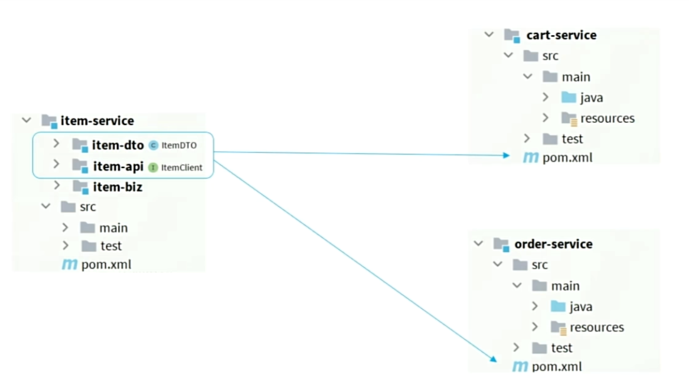

这种方案是最好的，但是非常麻烦，需要继续拆分，增加很多模块

方案二：
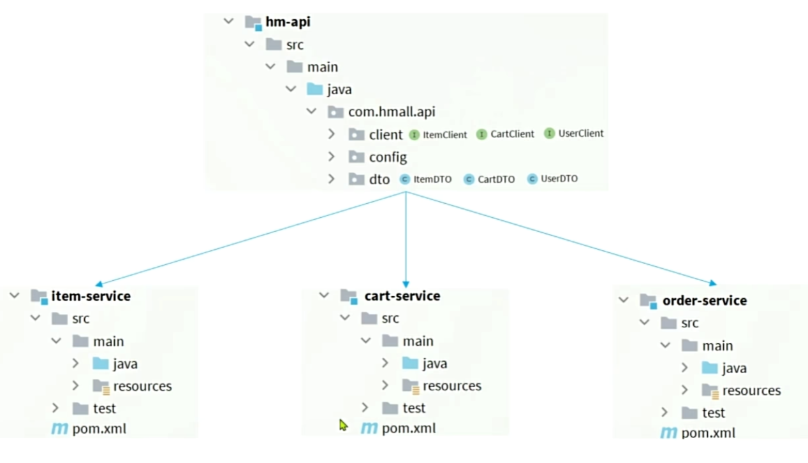

这种方案耦合度较高，但是比较方便

当自定义FeignClient不在springbootApplicaion的扫描包范围时，这些FeignCient无法使用，有两种解决方法：

方法一：指定FeignClient所在的包

```java
@EnableFeignClients(basePackages = "com.hamll.api.client")
public class CartApplication {
    
}
```

方法二：指定FeignClient字节码

```java
@EnableFeignClients(clients = {ItemClient.class})
public class CartApplication {
    
}
```

## 日志配置

OpenFeign只会在FeignClient所在包的日志级别为**DEBUG**时，才会输出日志。而且其日志级别有4级：

- **NONE**：不记录任何日志信息，这是默认值。
- **BASIC**：仅记录请求的方法，URL以及响应状态码和执行时间
- **HEADERS**：在BASIC的基础上，额外记录了请求和响应的头信息
- **FULL**：记录所有请求和响应的明细，包括头信息、请求体、元数据。

Feign默认的日志级别就是NONE，所以默认我们看不到请求日志。

在hm-api模块下新建一个配置类，定义配置类等级

```java
public class DefaultFeignConfig {
    @Bean
    public Logger.Level feignLogLevel(){
        return Logger.Level.FULL;
    }
}
```

但是此时这个Bean并未生效，想要配置某个FeiClient的日志，可以在**@FeignClient**注解中声明

```java
@FeignClient("item-service", configuration = DefaultFeignConfig.class)
```

如果想要全局配置，让FeignClient都按照这个日志配置，则需要在`@EnableFeignClients`中配置，针对所有`FeignClient`生效。

```java
@EnableFeignClients(defaultConfiguration = DefaultFeignConfig.class)
```

# 网关

网关：就是网络的关口，负责请求的路由，转发，身份校验

在SpringCloud中网关的实现包括两种

1、Spring Cloud Gateway

> 他是Spring官方出品
>
> 基于WebFlux响应式编程
>
> 无需调优即可获得优异性能

2、Netfilx Zuul

> Netfilx出品
>
> 基于Servlet的阻塞式编程
>
> 需要调优才能获得与SpringCloudGateway类似的性能
>
> 目前已经被淘汰

## 网关路由

需要创建一个网管服务步骤为：

1、创建新模块

2、引入网关依赖

3、编写启动类

4、配置路由规则

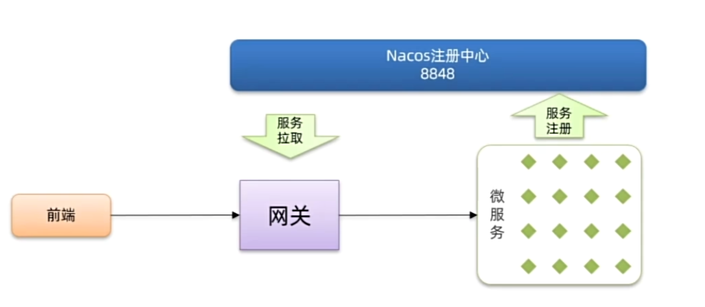

需要重新新建一个模块

然后编写yaml文件

```yaml
server:
  port: 8080
spring:
  application:
    name: gateway
  cloud:
    nacos:
      server-addr: 192.168.150.101:8848
    gateway:
      routes:
        - id: item # 路由规则id，自定义，唯一
          uri: lb://item-service # 路由的目标服务，lb代表负载均衡，会从注册中心拉取服务列表
          predicates: # 路由断言，判断当前请求是否符合当前规则，符合则路由到目标服务
            - Path=/items/**,/search/** # 这里是以请求路径作为判断规则
        - id: cart
          uri: lb://cart-service
          predicates:
            - Path=/carts/**
```

## 路由属性

网关路由对应的java类型是RouteDefinition，其中常见的属性有

- id：路由唯一标示
- uri：路由目标地址
- predicates：路由断言，判断请求是否符合当前路由
- filters：路由过滤器，对请求或响应做特殊处理

### 路由断言


这里我们重点关注`predicates`，也就是路由断言。SpringCloudGateway中支持的断言类型有很多：

| **名称**   | **说明**                       | **示例**                                                     |
| :--------- | :----------------------------- | :----------------------------------------------------------- |
| After      | 是某个时间点后的请求           | - After=2037-01-20T17:42:47.789-07:00[America/Denver]        |
| Before     | 是某个时间点之前的请求         | - Before=2031-04-13T15:14:47.433+08:00[Asia/Shanghai]        |
| Between    | 是某两个时间点之前的请求       | - Between=2037-01-20T17:42:47.789-07:00[America/Denver], 2037-01-21T17:42:47.789-07:00[America/Denver] |
| Cookie     | 请求必须包含某些cookie         | - Cookie=chocolate, ch.p                                     |
| Header     | 请求必须包含某些header         | - Header=X-Request-Id, \d+                                   |
| Host       | 请求必须是访问某个host（域名） | - Host=**.somehost.org,**.anotherhost.org                    |
| Method     | 请求方式必须是指定方式         | - Method=GET,POST                                            |
| Path       | 请求路径必须符合指定规则       | - Path=/red/{segment},/blue/**                               |
| Query      | 请求参数必须包含指定参数       | - Query=name, Jack或者- Query=name                           |
| RemoteAddr | 请求者的ip必须是指定范围       | - RemoteAddr=192.168.1.1/24                                  |
| weight     | 权重处理                       |                                                              |

### 路由过滤器
网关中提供了33种路由过滤器，
常用的有AddRequestHeader,StripRrefix
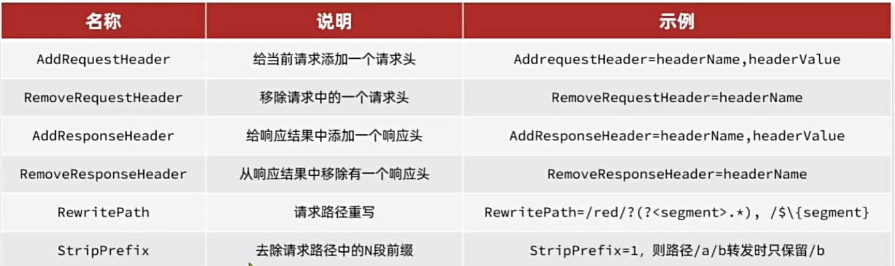

## 网关登录校验

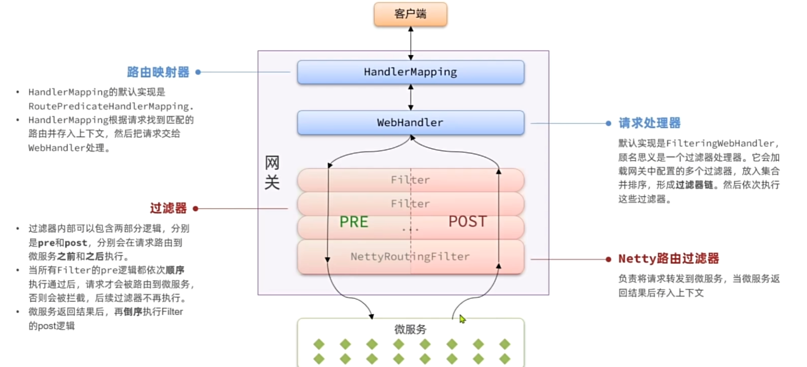
需要自定义一个过滤器（pre）

## 自定义过滤器

网关过滤器有两种

1、GatewayFilter：路由过滤器，作用于任意指定的路由，默认不生效，需要配置到路由后生效

2、GlobalFilter：全局过滤器，作用范围是所有的路由；声明后自动生效

全局过滤器需要实现GlobalFilter接口

```java
@Component
public class MyGlobalFilter implements GlobalFilter, Ordered {
    @Override
    public Mono<Void> filter(ServerWebExchange exchange, GatewayFilterChain chain) {
        // 获取请求
        ServerHttpRequest request = exchange.getRequest();
        // 获取请求头
        HttpHeaders headers = request.getHeaders();
        System.out.println("headers = " + headers);
        // 放行
        return chain.filter(exchange);
    }

    @Override
    public int getOrder() {
        // 定义优先级
        return 0;
    }
}
```

GatewayFilter我们一般不使用

## 实现登录校验

```java
@Component
@RequiredArgsConstructor
public class MyGlobalFilter implements GlobalFilter, Ordered {

    private final AuthProperties authProperties;

    private final JwtTool jwtTool;

    private final AntPathMatcher antPathMatcher = new AntPathMatcher();

    @Override
    public Mono<Void> filter(ServerWebExchange exchange, GatewayFilterChain chain) {
        // 先获取request
        ServerHttpRequest request = exchange.getRequest();
        // 判断是否需要做拦截
        if (isExclude(request.getPath().toString())) {
            return chain.filter(exchange);
        }
        // 获取token
        String token = null;
        List<String> headers = request.getHeaders().get("authorization");
        if (headers != null && !headers.isEmpty()) {
            token = headers.get(0);
        }
        // 解析token
        Long userId = null;
        try {
            userId = jwtTool.parseToken(token);
        } catch (Exception e) {
            // 设置拦截码为401
            ServerHttpResponse response = exchange.getResponse();
            response.setStatusCode(HttpStatus.UNAUTHORIZED);
            return response.setComplete();
        }
        // 保存用户信息
        System.out.println("userId = " + userId);

        return chain.filter(exchange);
    }


    /**
     * 判断是否需要拦截
     *
     * @param path 本次请求的路径
     * @return
     */
    private boolean isExclude(String path) {
        List<String> excludePaths = authProperties.getExcludePaths();
        for (String excludePath : excludePaths) {
            if (antPathMatcher.match(excludePath, path)) {
                return true;
            }
        }
        return false;
    }

    @Override
    public int getOrder() {
        // 定义优先级
        return 0;
    }
}
```

## 网关传递用户

可以在网关保存用户信息到请求头，然后再mvc拦截器中获取用户信息保存到ThreadLocal
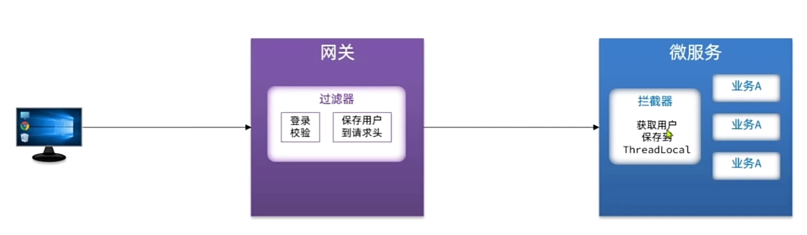

要修改网管转发到微服务的请求，需要用到**ServerWebExchange**类提供的API

```java
// 传递用户信息
String userInfo = userId.toString();
ServerWebExchange serverWebExchange = exchange.mutate()
        .request(builder -> builder.header("user-info", userInfo))
        .build();
```

然后写一个mvc的拦截器

1、实现 `HandlerInterceptor` 接口

2、注册拦截器，在Spring配置类中注册拦截器并指定拦截路径:

```java
@Configuration
public class WebConfig implements WebMvcConfigurer {

    @Override
    public void addInterceptors(InterceptorRegistry registry) {
        registry.addInterceptor(new UserInfoInterceptor());
    }
}
```

这里不需要配置拦截路径，因为默认就是全部拦截

## OpenFeign传递用户

微服务项目中的很多业务要多个微服务共同合作完成，而这个过程中也需要传递登录用户

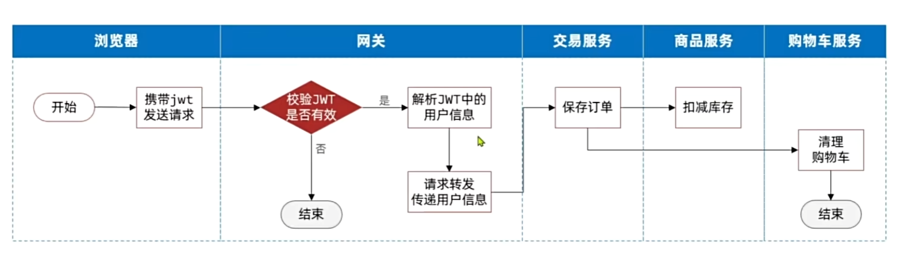

OpenFeign中提供了一个拦截器接口，所有由openFeign发起的请求都会先调用拦截器处理请求

```java
public interface RequesInterceptor{
    void apply(RequestTemplate template);
}
```

RequesInterceptor类中提供了一些方法可以让我们修改请求头

```java
@Bean
public RequestInterceptor userInfoRequestInterceptor() {
    return new RequestInterceptor() {
        @Override
        public void apply(RequestTemplate requestTemplate) {
            Long userId = UserContext.getUser();
            if(userId != null){
                requestTemplate.header("user-info", userId.toString());
            }
        }
    };
}
```

# 配置管理

微服务重复配置过多，维护成本高

业务配置经常变动，每次修改都要修改服务

网关路由配置写死，如果变动需要重启网关

这里Nacos中就可以进行配置

## 共享配置

第一步：添加配置

添加一些共享配置到Nacos中，包括JDBC，MybatisPlus，日志，Swagger，OpenFeign等配置
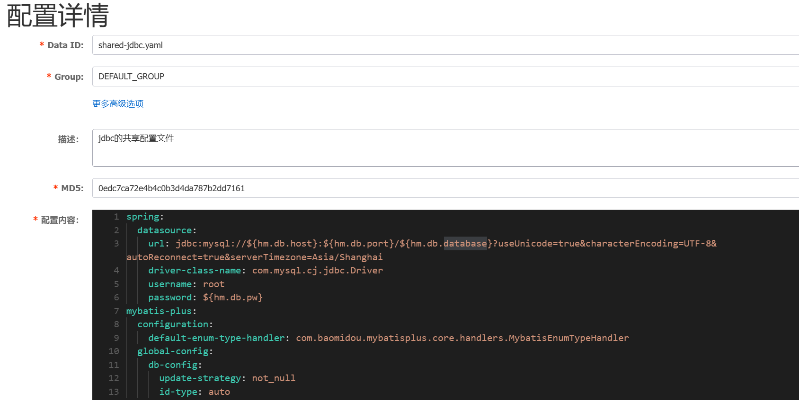

第二部：拉取共享配置

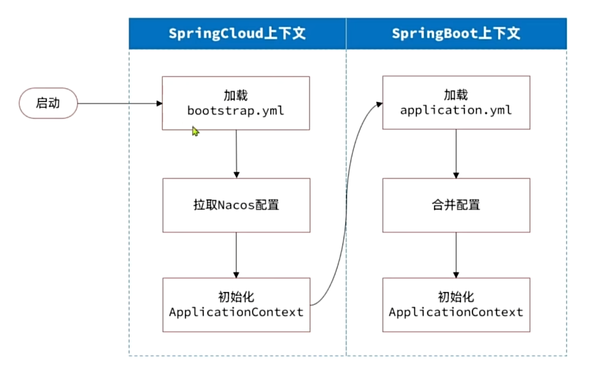

基于NacosConfig拉取共享配置代替微服务的本地配置


1. 首先要引入依赖，在每个微服务引入

```xml
<!--nacos配置管理-->
<dependency>
  <groupId>com.alibaba.cloud</groupId>
  <artifactId>spring-cloud-starter-alibaba-nacos-config</artifactId>
</dependency>
<!--读取bootstrap文件-->
<dependency>
  <groupId>org.springframework.cloud</groupId>
  <artifactId>spring-cloud-starter-bootstrap</artifactId>
</dependency>
```

2. 新建bootstrap.yaml

```yaml
spring:
  application:
    name: cart-service # 服务名称
  profiles:
    active: dev
  cloud:
    nacos:
      server-addr: 192.168.150.101 # nacos地址
      config:
        file-extension: yaml # 文件后缀名
        shared-configs: # 共享配置
          - dataId: shared-jdbc.yaml # 共享mybatis配置
          - dataId: shared-log.yaml # 共享日志配置
          - dataId: shared-swagger.yaml # 共享日志配置
```

## 配置热更新

当修改配置文件中的配置时，微服务**无需重启**即可使配置生效

前提条件：

1、nacos中要有一个与微服务名有关的配置文件

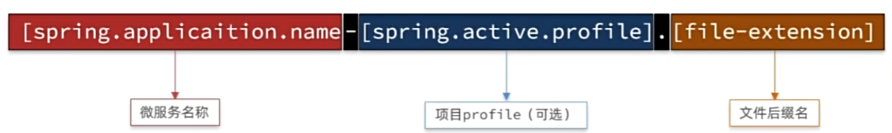

2、微服务中要以特定方式读取需要热更新的配置属性

需要用@ConfigurationProperties(prefix = "hm.jwt")注解

```java
@Data
@ConfigurationProperties(prefix = "hm.jwt")
public class JwtProperties {
    private Resource location;
    private String password;
    private String alias;
    private Duration tokenTTL = Duration.ofMinutes(10);
}
```

## 动态路由

要实现动态路由首先要将路由配置保存到nacos，当nacos中的路由配置变更时，推送最新配置到网关，实时更新

网关中的路由信息


需要完成两件事：

1、监听nacos配置变更的信息

2、当配置变更时，将最新的路由信息更新到网关路由表

```java
private final NacosConfigManager nacosConfigManager;
public void initRouteConfigListener() throws NacosException {
	// 1，注册监听器并首次拉取配置
	String configInfo = nacosConfigManager.getConfigService()
        .getConfigAndSignListener(dataId, group, 5000, new Listener() {
		@Override
        public Executor getExecutor() {
        return null;
        }

		@Override
        public void receiveConfigInfo(String configInfo) {
        //TODO监听到配置变更，更新一次配置
        }
        });
	//TODO2.首次启动时，更新一次配置
}
```

更新路由表：

```java
/**
* @author Spencer Gibb
*/
public interface RouteDefinitionWriter {
    /**
    *更新路由到路由表，如果路由id重复，则会覆盖旧的路由
    */
    Mono<Void><save(Mono<RouteDefinition> route);
    /**
    *根据路由id删除某个路由
    */
	Mono<Void> delete(Mono<String> routeId);
}
```

为了方便解析从nacos读取到的路由配置，我们不使用yaml格式配置路由，推荐使用JSON格式的路由配置

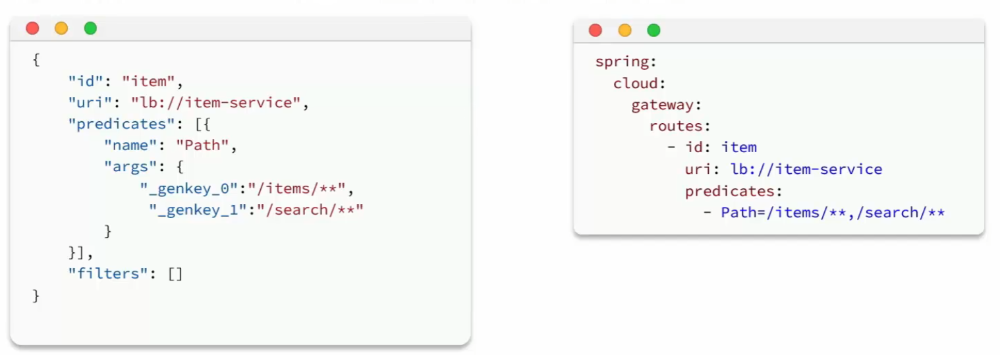

### 监听nacos配置变更

在Nacos官网中给出了手动监听Nacos配置变更的SDK：

如果希望 Nacos 推送配置变更，可以使用 Nacos 动态监听配置接口来实现。

```Java
public void addListener(String dataId, String group, Listener listener)
```

请求参数说明：

| **参数名** | **参数类型** | **描述**                                                     |
| :--------- | :----------- | :----------------------------------------------------------- |
| dataId     | string       | 配置 ID，保证全局唯一性，只允许英文字符和 4 种特殊字符（"."、":"、"-"、"_"）。不超过 256 字节。 |
| group      | string       | 配置分组，一般是默认的DEFAULT_GROUP。                        |
| listener   | Listener     | 监听器，配置变更进入监听器的回调函数。                       |

示例代码：

```Java
String serverAddr = "{serverAddr}";
String dataId = "{dataId}";
String group = "{group}";
// 1.创建ConfigService，连接Nacos
Properties properties = new Properties();
properties.put("serverAddr", serverAddr);
ConfigService configService = NacosFactory.createConfigService(properties);
// 2.读取配置
String content = configService.getConfig(dataId, group, 5000);
// 3.添加配置监听器
configService.addListener(dataId, group, new Listener() {
        @Override
        public void receiveConfigInfo(String configInfo) {
        // 配置变更的通知处理
                System.out.println("recieve1:" + configInfo);
        }
        @Override
        public Executor getExecutor() {
                return null;
        }
});
```

这里核心的步骤有2步：

- 创建ConfigService，目的是连接到Nacos
- 添加配置监听器，编写配置变更的通知处理逻辑

只要我们拿到`NacosConfigManager`就等于拿到了`ConfigService`，第一步就实现了。

第二步，编写监听器。虽然官方提供的SDK是ConfigService中的addListener，不过项目第一次启动时不仅仅需要添加监听器，也需要读取配置，因此建议使用的API是这个：

```Java
String getConfigAndSignListener(
    String dataId, // 配置文件id
    String group, // 配置组，走默认
    long timeoutMs, // 读取配置的超时时间
    Listener listener // 监听器
) throws NacosException;


@Component
@Slf4j
@RequiredArgsConstructor
public class DynamicRouteLoader {

    private NacosConfigManager nacosConfigManager;

    @PostConstruct
    public void initRouterConfigListener() {
        nacosConfigManager.getConfigService().getConfigAndSignListener(
        
        )
    }
}
```

既可以配置监听器，并且会根据dataId和group读取配置并返回。我们就可以在项目启动时先更新一次路由，后续随着配置变更通知到监听器，完成路由更新。

### 更新路由

更新路由表：

```java
/**
* @author Spencer Gibb
*/
public interface RouteDefinitionWriter {
    /**
    *更新路由到路由表，如果路由id重复，则会覆盖旧的路由
    */
    Mono<Void><save(Mono<RouteDefinition> route);
    /**
    *根据路由id删除某个路由
    */
	Mono<Void> delete(Mono<String> routeId);
}


routeDefinitionWriter.save(Mono.just(routeDefinition)).subscribe();
routeDefinitionWriter.delete(Mono.just(routeDefinition)).subscribe();

// 这里需要用Mono封装一下，然后再最后调用subscribe订阅一下
```

这里更新的路由，也就是RouteDefinition，之前我们见过，包含下列常见字段：

- id：路由id
- predicates：路由匹配规则
- filters：路由过滤器
- uri：路由目的地

将来我们保存到Nacos的配置也要符合这个对象结构，将来我们以JSON来保存，格式如下：

```JSON
{
  "id": "item",
  "predicates": [{
    "name": "Path",
    "args": {"_genkey_0":"/items/**", "_genkey_1":"/search/**"}
  }],
  "filters": [],
  "uri": "lb://item-service"
}
```

以上JSON配置就等同于：

```YAML
spring:
  cloud:
    gateway:
      routes:
        - id: item
          uri: lb://item-service
          predicates:
            - Path=/items/**,/search/**
```

OK，我们所需要用到的SDK已经齐全了。

### 实现动态路由

首先在网管gateway引入依赖

```XML
<!--nacos配置管理-->
<dependency>
    <groupId>com.alibaba.cloud</groupId>
    <artifactId>spring-cloud-starter-alibaba-nacos-config</artifactId>
</dependency>
<!--加载bootstrap-->
<dependency>
    <groupId>org.springframework.cloud</groupId>
    <artifactId>spring-cloud-starter-bootstrap</artifactId>
</dependency>
```

```java
@Component
@Slf4j
@RequiredArgsConstructor
public class DynamicRouteLoader {

    private final NacosConfigManager nacosConfigManager;
    private final RouteDefinitionWriter writer;

    private final String dataId = "gateway-routes.json";
    private final String group = "DEFAULT_GROUP";
	// 用来存放订阅的路由id
    Set<String> set = new HashSet<String>();

    @PostConstruct
    public void initRouterConfigListener() throws NacosException {

        // 项目启动，先拉去一次配置，并添加配置监听器
        String configInfo = nacosConfigManager.getConfigService().getConfigAndSignListener(dataId, group, 5000,
                new Listener() {
                    @Override
                    public Executor getExecutor() {
                        // 这里是配置线程池
                        return null;
                    }

                    @Override
                    public void receiveConfigInfo(String configInfo) {
                        // 当配置变更时，需要更新路由表
                        updateConfigInfo(configInfo);
                    }
                });
        // 第一次读取到配置，也需要更新到路由表
        // configInfo就是yaml中的配置路由转发的文件，我们为了方便解析，定义成了JSON
        updateConfigInfo(configInfo);
    }

    private void updateConfigInfo(String configInfo) {
        // 解析获取到的配置文件
        List<RouteDefinition> routeDefinitionList = JSONUtil.toList(configInfo, RouteDefinition.class);

        // 删除旧的路由表
        for (String routeDefinition : set) {
            writer.delete(Mono.just(routeDefinition)).subscribe();
        }
        set.clear();
        // 更新路由表
        for (RouteDefinition routeDefinition : routeDefinitionList) {
            writer.save(Mono.just(routeDefinition)).subscribe();
            set.add(routeDefinition.getId());

        }
    }
}
```

# Sentinel

微服务调用链路中的某个服务故障，引起整个链路中的所有微服务都不可用，这就是雪崩

雪崩问题的原因 为：

1、微服务相互调用，服务提供者出现故障或阻塞。
2、服务调用者没有做好异常处理，导致自身故障。
3、调用链中的所有服务级联失败，导致整个集群故障

解决方案：

尽量避免服务出现故障或阻塞。

- 保证代码的健壮性;
- 保证网络畅通;
- 能应对较高的并发请求;

服务调用者做好远程调用异常的后备方案，避免故障扩散

微服务保护的技术有很多，但在目前国内使用较多的还是**Sentinel**，所以接下来我们学习Sentinel的使用。

## Sentinel

Sentinel是阿里巴巴开源的一款服务保护框架，目前已经加入SpringCloudAlibaba中

### 使用

1、先下载jar包

[Releases · alibaba/Sentinel](https://github.com/alibaba/Sentinel/releases)

2、运行

将jar包放在任意非中文、不包含特殊字符的目录下，重命名为`sentinel-dashboard.jar`：

然后运行如下命令启动控制台：

```Shell
java -Dserver.port=8090 -Dcsp.sentinel.dashboard.server=localhost:8090 -Dproject.name=sentinel-dashboard -jar sentinel-dashboard.jar
```

3、访问

访问[http://localhost:8090](http://localhost:8080)页面，就可以看到sentinel的控制台了

### 微服务整合

我们在需要整合微服务的模块中连接Sentinel

步骤如下：

 1）引入sentinel依赖

```XML
<!--sentinel-->
<dependency>
    <groupId>com.alibaba.cloud</groupId> 
    <artifactId>spring-cloud-starter-alibaba-sentinel</artifactId>
</dependency>
```

2）配置控制台

修改application.yaml文件，添加下面内容：

```YAML
spring:
  cloud: 
    sentinel:
      transport:
        dashboard: localhost:8090
```

### 簇点链路

Restful风格的API请求路径一般都相同，这导致簇点资源名称重复，因此我们要修改配置，把请求方式+请求路径作为簇点资源名称

```yaml
spring:
  cloud:
    sentinel:
      transport:
        dashboard: localhost:8090
      http-method-specify: true # 开启请求方式前缀
```

## 请求限流

在簇点链路后面点击流控按钮，可对其做限流配置

使用jmeter进行测试

## 线程隔离

当商品服务出现阻塞或故障时，调用商品服务的购物车服务可能因此而被拖慢，甚至资源耗尽。所以必须限制购物车服务中查询商品这个业务的可用线程数，实现线程隔离。

限流可以降低服务器压力，尽量减少因并发流量引起的服务故障的概率，但并不能完全避免服务故障。一旦某个服务出现故障，我们必须隔离对这个服务的调用，避免发生雪崩。
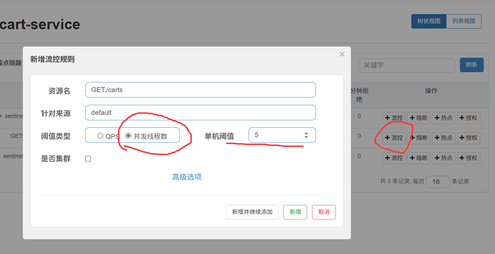

## Fallback

1、将FeignClient作为Sentinel的簇点资源

修改cart-service模块的application.yml文件，开启Feign的sentinel功能：

```YAML
feign:
  sentinel:
    enabled: true # 开启feign对sentinel的支持
```

2、FeignClient的Fallback有两种配置方式

- 方式一：FallbackClass，无法对远程调用的异常做处理
- 方式二：FallbackFactoey，可以对远程调用的异常做处理，通常都会选择这种

我们使用FallbackFactoey这种方式

第一步：

自定义类，实现FallbackFactoey，编写对某个FeignClient的fallback逻辑

```java
@Slf4j
public class ItemClientFallbackFactory implements FallbackFactory<ItemClient> {
    @Override
    public ItemClient create(Throwable cause) {
        return new ItemClient() {
            @Override
            public List<ItemDTO> queryItemByIds(Collection<Long> ids) {
                log.error("查询商品失败", cause);
                return Collections.emptyList();
            }

            @Override
            public void deductStock(List<OrderDetailDTO> items) {
                log.error("扣减商品库存失败", cause);
                throw new RuntimeException(cause);
            }
        };
    }
}
```

第二步：

将刚刚定义的这个注册成一个Bean

```java
@Bean
public ItemClientFallbackFactory itemClientFallbackFactory() {
    return new ItemClientFallbackFactory();
}
```

第三步：

在FeignClient接口中使用我们注册的这个Bean

```java
@FeignClient(value = "item-service", fallbackFactory = ItemClientFallbackFactory.class)
public interface ItemClient {

    @GetMapping("/items")  // 请求路径和方式
    List<ItemDTO> queryItemByIds(@RequestParam("ids") Collection<Long> ids);

    @PutMapping("/items/stock/deduct")
     void deductStock(@RequestBody List<OrderDetailDTO> items) ;
}
```

最后在购物车配置类开启流量控制

```yaml
feign:
  sentinel:
    enabled: true
```

## 服务熔断

熔断是解决雪崩问题的重要手段。思路是由**断路器**统计服务调用的异常比例、慢请求比例，如果超出阈值则会**熔断**该服务。即拦截访问该服务的一切请求；而当服务恢复时，断路器会放行访问该服务的请求。

在控制台中簇点资源后的熔断按钮，即可配置熔断策略

# 分布式事务

在分布式系统中，如果一个业务需要多个服务合作完成，而且每一个服务都有事务，多个事务必须同时成功或失败，这样的事务就是分布式事务。其中的每个服务的事务就是一个分支事务。整个业务称为全局事务。

## Seata

Seata是2019年1月份蚂蚁金服和阿里巴巴共同开源的分布式事务解决方案。致力于提供高性能和简单易用的分布式事务服务，为用户打造一站式的分布式解决方案。

官网地址：http://seata.io/，其中的文档、播客中提供了大量的使用说明、源码分析。

Seata事务管理中有三个重要的角色

1、TC - 事务协调者：维护全集与分支事务的状态，协调全局事务提交或回滚

2、TM - 事务管理器：定义全局事务的范围、开始全局事务、提交或回滚全局事务。 

3、 RM - 资源管理器：管理分支事务，与TC交谈以注册分支事务和报告分支事务的状态，并驱动分支事务提交或回滚。 

## 部署TC服务

1、导入Seata的数据库文件

2、准备Seata运行的配置文件

在docker中部署

需要注意，要确保nacos、mysql都在hm-net网络中。如果某个容器不再hm-net网络，可以参考下面的命令将某容器加入指定网络：

```Shell
docker network connect [网络名] [容器名]
```

在虚拟机的`/root`目录执行下面的命令：

```Shell
docker run --name seata \
-p 8099:8099 \
-p 7099:7099 \
-e SEATA_IP=192.168.150.101 \
-v ./seata:/seata-server/resources \
--privileged=true \
--network hm-net \
-d \
seataio/seata-server:1.5.2
```

## 微服务集成Seata

首先在项目引入Seata依赖

```xml
<!--统一配置管理-->
  <dependency>
      <groupId>com.alibaba.cloud</groupId>
      <artifactId>spring-cloud-starter-alibaba-nacos-config</artifactId>
  </dependency>
  <!--读取bootstrap文件-->
  <dependency>
      <groupId>org.springframework.cloud</groupId>
      <artifactId>spring-cloud-starter-bootstrap</artifactId>
  </dependency>
  <!--seata-->
  <dependency>
      <groupId>com.alibaba.cloud</groupId>
      <artifactId>spring-cloud-starter-alibaba-seata</artifactId>
  </dependency>
```

首先在nacos上添加一个共享的seata配置，命名为`shared-seata.yaml`

```yaml
seata:
  registry: # TC服务注册中心的配置，微服务根据这些信息去注册中心获取tc服务地址
    type: nacos # 注册中心类型 nacos
    nacos:
      server-addr: 192.168.72.128:8848 # nacos地址
      namespace: "" # namespace，默认为空
      group: DEFAULT_GROUP # 分组，默认是DEFAULT_GROUP
      application: seata-server # seata服务名称
      username: nacos
      password: nacos
  tx-service-group: hmall # 事务组名称
  service:
    vgroup-mapping: # 事务组与tc集群的映射关系
      hmall: "default"
```

## XA模式

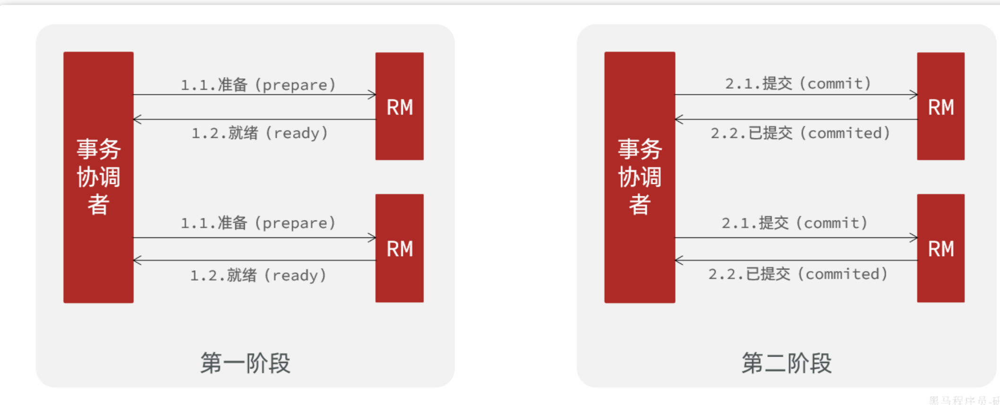

一阶段：

- 事务协调者通知每个事务参与者执行本地事务
- 本地事务执行完成后报告事务执行状态给事务协调者，此时事务不提交，继续持有数据库锁

二阶段：

- 事务协调者基于一阶段的报告来判断下一步操作
- 如果一阶段都成功，则通知所有事务参与者，提交事务
- 如果一阶段任意一个参与者失败，则通知所有事务参与者回滚事务


`XA`模式的优点：

>  事务的强一致性，满足ACID原则
>
> 常用数据库都支持，实现简单，并且没有代码侵入

`XA`模式的缺点：

> 因为一阶段需要锁定数据库资源，等待二阶段结束才释放，性能较差
>
> 依赖关系型数据库实现事务

### 实现方式

1、我们要在配置文件中指定要采用的分布式事务模式。我们可以在Nacos中的共享shared-seata.yaml配置文件中设置

```YAML
seata:
  data-source-proxy-mode: XA
```

2、我们要利用`@GlobalTransactional`标记分布式事务的入口方法

在需要实现全局事务入口的方法添加注解

```java
	@Override
    @Transactional ->  @GlobalTransactional
    public Long createOrder(OrderFormDTO orderFormDTO) {}
```

## AT模式

`AT`模式同样是分阶段提交的事务模型，不过缺弥补了`XA`模型中资源锁定周期过长的缺陷。
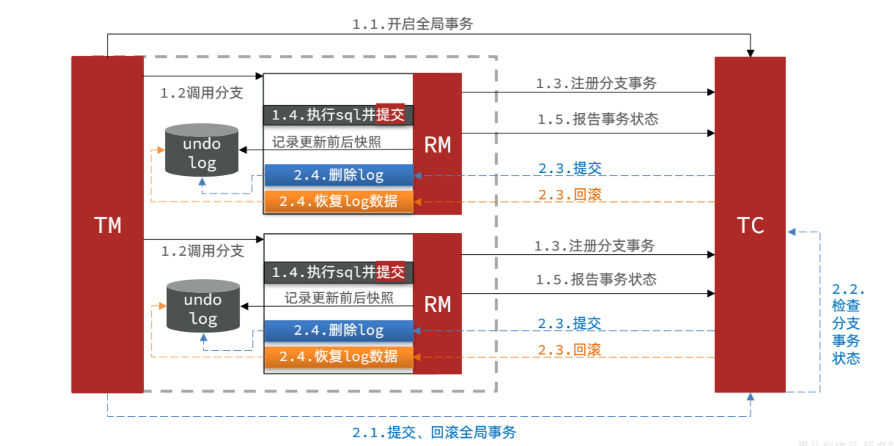

和XA不同的是在执行sql之前，要保存一个快照，然后执行sql后立即提交

阶段一`RM`的工作：

- 注册分支事务
- <font color = red>记录undo-log（数据快照）</font>
- 执行业务sql并提交
- 报告事务状态

阶段二提交时`RM`的工作：

- 删除undo-log即可

阶段二回滚时`RM`的工作：

- 根据undo-log恢复数据到更新前

### AT 和 XA 区别

简述`AT`模式与`XA`模式最大的区别是什么？

- `XA`模式一阶段不提交事务，锁定资源；`AT`模式一阶段直接提交，不锁定资源。
- `XA`模式依赖数据库机制实现回滚；`AT`模式利用数据快照实现数据回滚。
- `XA`模式强一致；`AT`模式最终一致

可见，AT模式使用起来更加简单，无业务侵入，性能更好。因此企业90%的分布式事务都可以用AT模式来解决。

### 实现AT模式

把seata-at.sql导入到微服务对应的数据库中

每一个微服务都需要这张表，所以都需要执行一下

```mysql
-- for AT mode you must to init this sql for you business database. the seata server not need it.
CREATE TABLE IF NOT EXISTS `undo_log`
(
    `branch_id`     BIGINT       NOT NULL COMMENT 'branch transaction id',
    `xid`           VARCHAR(128) NOT NULL COMMENT 'global transaction id',
    `context`       VARCHAR(128) NOT NULL COMMENT 'undo_log context,such as serialization',
    `rollback_info` LONGBLOB     NOT NULL COMMENT 'rollback info',
    `log_status`    INT(11)      NOT NULL COMMENT '0:normal status,1:defense status',
    `log_created`   DATETIME(6)  NOT NULL COMMENT 'create datetime',
    `log_modified`  DATETIME(6)  NOT NULL COMMENT 'modify datetime',
    UNIQUE KEY `ux_undo_log` (`xid`, `branch_id`)
) ENGINE = InnoDB
  AUTO_INCREMENT = 1
  DEFAULT CHARSET = utf8mb4 COMMENT ='AT transaction mode undo table';
```

然后修改application.yml中将事务模式修改为AT模式

```yaml
seata:
  data-source-proxy-mode: AT
```

# MQ

MQ（MessageQueue），字面来看就是存放消息的队列，也就是也不调用的Broker

直接使用docker安装：

```shell
docker run \
 -e RABBITMQ_DEFAULT_USER=zhaozhixuan \
 -e RABBITMQ_DEFAULT_PASS=20041123zzx. \
 -v mq-plugins:/plugins \
 --name mq \
 --hostname mq \
 -p 15672:15672 \
 -p 5672:5672 \
 --network hm-net\
 -d \
 rabbitmq:3.8-management
```

安装完成后，我们访问 http://192.168.72.128:15672即可看到管理控制台。首次访问需要登录，默认的用户名和密码在配置文件中已经指定了。

我们使用 [SpringAmqp](https://spring.io/projects/spring-amqp) ，他是对官方的进行二次封装，用起来更好用

## 如何使用

### 发送消息

在父工程引入spring-amqp依赖，这样publisher和consumer服务都可以使用，无论是发送者还是接受者都需要引入这个依赖

```xml
<!--AMQP依赖，包含RabbitMQ-->
<dependency>
    <groupId>org.springframework.boot</groupId>
    <artifactId>spring-boot-starter-amqp</artifactId>
</dependency>
```

然后需要进行配置，不管是发消息还是收消息，都是这样配置

```yaml
spring:
  rabbitmq:
    host: 192.168.72.128 # 你的虚拟机IP
    port: 5672 # 端口
    virtual-host: /hmall # 虚拟主机
    username: zhaozhixuan # 用户名
    password: 20041123zzx. # 密码
```

发送消息：

SpringAMQP提供了RabbitTemplate工具类，我们引入完依赖后，直接注入即可使用

```java
@SpringBootTest
public class SpringAmqpTest {

    @Autowired
    private RabbitTemplate rabbitTemplate;

    @Test
    public void testSimpleQueue() {
        // 队列名称
        String queueName = "simple.queue";
        // 消息
        String message = "hello, spring amqp!";
        // 发送消息
        rabbitTemplate.convertAndSend(queueName, message);
    }
}
```

接受消息：

```java
@Component
public class SpringRabbitListener {
    @RabbitListener(queues = "simple.queue")
    public void listen(String message) {
        log.info("SpringRabbitListener: {}", message);
    }
}
```

大致流程为：

1、引入spring-boot-starter-amqp依赖

2、配置rabbitmq服务端信息

3、利用RabbitTrmplate发送消息

4、利用@RabbitListener注解声明要监听的队列，监听消息

## Work Queue

任务模型，就是让多个消费者绑定到一个队列，共同消费队列中的信息

默认情况下，RabbitMQ会将消息一次轮训投递给绑定在队列上的每一个消费者，但这并没有考虑到消费者是否已经处理完消息，可能出现消息堆积

因此，我们需要修改application.yml，设置preFetch的值为1，确保统一时刻最多投递给消费者1条信息

这样可以确保能者多劳

```YAML
spring:
  rabbitmq:
    listener:
      simple:
        prefetch: 1 # 每次只能获取一条消息，处理完成才能获取下一个消息
```

```java
@RabbitListener(queues = "work.queue")
public void listenWorkQueue1(String message) throws InterruptedException {
    System.out.println("消费者1接受到的信息：" + message + "," + LocalTime.now());
    Thread.sleep(100);
}

@RabbitListener(queues = "work.queue")
public void listenWorkQueue2(String message) {
    System.err.println("消费者2.......接受到的信息：" + message + "," + LocalTime.now());
}
```

## Fanout交换机

交换机的作用主要是接受发送者发送的信息，并将消息路由到与其绑定的队列

常见的交换机类型有以下三种：

- Fanout：广播
- Direct：定向
- Topic：话题

需要再控制台创建一个交换机，并且绑定消息队列

```java
@Test
public void testFanoutQueue() {
    // 交换机名字
    String exchangeName = "hmall.fanout";
    // 信息
    String message = "hello, everyone!";
    //发送消息
    rabbitTemplate.convertAndSend(exchangeName,null, message);
}

    @RabbitListener(queues = "fanout.queue1")
    public void listenFanoutQueue2(String message) {
        System.err.println("fanout.queue1.......接受到的信息：" + message + "," + LocalTime.now());
    }
    @RabbitListener(queues = "fanout.queue2")
    public void listenFanoutQueue1(String message) {
        System.err.println("fanout.queue2.......接受到的信息：" + message + "," + LocalTime.now());
    }
```

## Direct交换机

Direct Exchange 会将接收到的消息根据规则路由到指定的Queue，因此称为**定向**路由

- 每一个Queue都与Exchange设置一个BandingKey
- 发布者发送消息时，指定消息的RoutingKey
- Exchange将消息路由到bandingKey与消息RoutingKey一致的队列

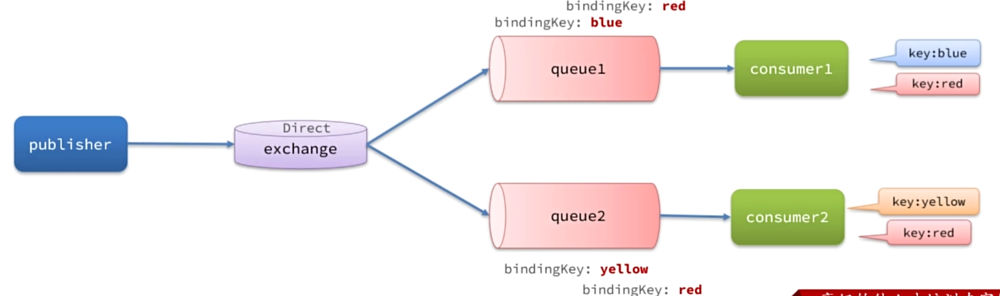

发送消息时需要指定一个key，如果这个key与那个消息队列一样，才会发给他

```java
@Test
public void testDirectQueue() {
    // 交换机名字
    String exchangeName = "hmall.direct";
    // 信息
    String message = "hello, everyone!";
    //发送消息
rabbitTemplate.convertAndSend(exchangeName,"red", message);
}
@RabbitListener(queues = "direct.queue1")
public void listenDirectQueue2(String message) {
    System.err.println("direct.queue1.......接受到的信息：" + message + "," + LocalTime.now());
}

@RabbitListener(queues = "direct.queue2")
public void listenDirectQueue1(String message) {
    System.err.println("direct.queue2.......接受到的信息：" + message + "," + LocalTime.now());
}
```

## Topic交换机

TopicExchange也是基于RoutingKey做消息路由，但是routingKey通常是多个单词的组合，并且以`.`分割

Queue与Exchange指定BindingKey时可以使用通配符：

#：代指0个或多个单词

*：代指1个单词

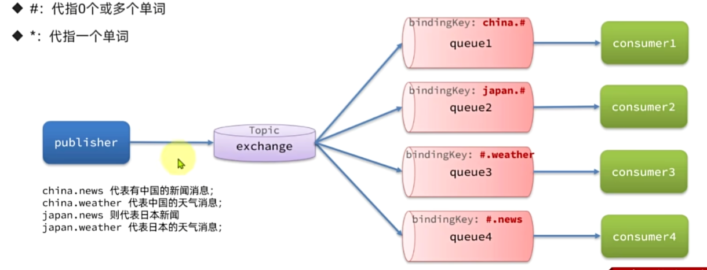


```java
@Test
public void testTopicQueue() {
    // 交换机名字
    String exchangeName = "hmall.topic";
    // 信息
    String message = "hello, topic!";
    //发送消息
    rabbitTemplate.convertAndSend(exchangeName,"china.weather", message);
}
    @RabbitListener(queues = "topic.queue1")
    public void listenTopicQueue2(String message) {
        System.err.println("topic.queue1.......接受到的信息：" + message + "," + LocalTime.now());
    }

    @RabbitListener(queues = "topic.queue2")
    public void listenTopicQueue1(String message) {
        System.err.println("topic.queue2.......接受到的信息：" + message + "," + LocalTime.now());
    }

```

这种拓展性更强，可以使用通配符

## 声明队列和交换机

我们之前使用的是控制台面板创建交换机和队列，但是开发中最好使用代码来进行创建队列和交换机

SpringAMQP提供了及各类，可以声明交换机和队列

一般会在消费者一端进行声明

```java
@Configuration
public class fanoutConfig {

    // 创建交换机
    @Bean
    public FanoutExchange fanoutExchange() {
        return new FanoutExchange("hmall.fanout");
    }

    // 创建队列
    @Bean
    public Queue fanoutQueue1() {
        return new Queue("fanout.queue1");
    }

    @Bean
    public Queue fanoutQueue2() {
        return new Queue("fanout.queue2");
    }

    // 绑定
    @Bean
    public Binding fanoutQueue1Binding(Queue fanoutQueue1, FanoutExchange fanoutExchange) {
        return BindingBuilder.bind(fanoutQueue1).to(fanoutExchange);
    }
    @Bean
    public Binding fanoutQueue2Binding(Queue fanoutQueue2, FanoutExchange fanoutExchange) {
        return BindingBuilder.bind(fanoutQueue2).to(fanoutExchange);
    }

}
```

如果使用Direct交换机，需要使用with进行绑定key

```java
/**
 * 绑定队列和交换机
 */
@Bean
public Binding bindingQueue1WithRed(Queue directQueue1, DirectExchange directExchange){
    return BindingBuilder.bind(directQueue1).to(directExchange).with("red");
}
/**
 * 绑定队列和交换机
 */
@Bean
public Binding bindingQueue1WithBlue(Queue directQueue1, DirectExchange directExchange){
    return BindingBuilder.bind(directQueue1).to(directExchange).with("blue");
}
```

就会显得很麻烦

我们可以使用基于@RabbitListener注解进行声明队列和交换机的方式

```java
@RabbitListener(bindings = @QueueBinding(
        value = @Queue(name = "direct.queue1"),
        exchange = @Exchange(name = "hmall.direct", type = ExchangeTypes.DIRECT),
        key = {"red","blue"}
))
public void listenDirectQueue2(String message) {
    System.err.println("direct.queue1.......接受到的信息：" + message + "," + LocalTime.now());
}

@RabbitListener(bindings = @QueueBinding(
        value = @Queue(name = "direct.queue2"),
        exchange = @Exchange(name = "hmall.direct", type = ExchangeTypes.DIRECT),
        key = {"red","yellow"}
))
public void listenDirectQueue1(String message) {
    System.err.println("direct.queue2.......接受到的信息：" + message + "," + LocalTime.now());
}
```

## 消息转换器

Spring的对消息对象的处理是基于JDK的ObjectOutputStream来完成序列化

JDK的序列化有安全风险，消息太大，可读性差

建议采用JSON序列化代替默认的JDK序列化：

1、引入依赖：

```XML
<dependency>
    <groupId>com.fasterxml.jackson.dataformat</groupId>
    <artifactId>jackson-dataformat-xml</artifactId>
    <version>2.9.10</version>
</dependency>
```

2、在publisher和consumer中都需要配置MessageConverter:

```Java
@Bean
public MessageConverter messageConverter(){
    // 1.定义消息转换器
    Jackson2JsonMessageConverter jackson2JsonMessageConverter = new Jackson2JsonMessageConverter();
    // 2.配置自动创建消息id，用于识别不同消息，也可以在业务中基于ID判断是否是重复消息
    jackson2JsonMessageConverter.setCreateMessageIds(true);
    return jackson2JsonMessageConverter;
}
```

# MQ高级

## 发送者可靠性

### 发送者重连

有时候由于网络波动，可能出现发送者连接MQ失败的情况，通过配置可以开启连接失败后的重连机制

```YAML
spring:
  rabbitmq:
    connection-timeout: 1s # 设置MQ的连接超时时间
    template:
      retry:
        enabled: true # 开启超时重试机制
        initial-interval: 1000ms # 失败后的初始等待时间
        multiplier: 1 # 失败后下次的等待时长倍数，下次等待时长 = initial-interval * multiplier
        max-attempts: 3 # 最大重试次数
```

**注意**：当网络不稳定的时候，利用重试机制可以有效提高消息发送的成功率。不过SpringAMQP提供的重试机制是**阻塞式**的重试，也就是说多次重试等待的过程中，当前线程是被阻塞的。

如果对于业务性能有要求，建议禁用重试机制。如果一定要使用，请合理配置等待时长和重试次数，当然也可以考虑使用异步线程来执行发送消息的代码。

### 发送者确认

- 当消息投递到MQ，但是路由失败时，通过**Publisher Return**返回异常信息，同时返回ack的确认信息，代表投递成功
- 临时消息投递到了MQ，并且入队成功，返回ACK，告知投递成功
- 持久消息投递到了MQ，并且入队完成持久化，返回ACK ，告知投递成功
- 其它情况都会返回NACK，告知投递失败

**开启生产者确认：**

```YAML
spring:
  rabbitmq:
    publisher-confirm-type: correlated # 开启publisher confirm机制，并设置confirm类型
    publisher-returns: true # 开启publisher return机制
```

这里`publisher-confirm-type`有三种模式可选：

- `none`：关闭confirm机制
- `simple`：同步阻塞等待MQ的回执
- `correlated`：MQ异步回调返回回执

一般我们推荐使用`correlated`，回调机制。

然后需要写一个配置类，在项目启动过程中配置：

**实现发送者确认**

```Java
package com.itheima.publisher.config;

import lombok.AllArgsConstructor;
import lombok.extern.slf4j.Slf4j;
import org.springframework.amqp.core.ReturnedMessage;
import org.springframework.amqp.rabbit.core.RabbitTemplate;
import org.springframework.context.annotation.Configuration;

import javax.annotation.PostConstruct;

@Slf4j
@AllArgsConstructor
@Configuration
public class MqConfig {
    private final RabbitTemplate rabbitTemplate;

    @PostConstruct
    public void init(){
        rabbitTemplate.setReturnsCallback(new RabbitTemplate.ReturnsCallback() {
            @Override
            public void returnedMessage(ReturnedMessage returned) {
                log.error("触发return callback,");
                log.debug("exchange: {}", returned.getExchange());
                log.debug("routingKey: {}", returned.getRoutingKey());
                log.debug("message: {}", returned.getMessage());
                log.debug("replyCode: {}", returned.getReplyCode());
                log.debug("replyText: {}", returned.getReplyText());
            }
        });
    }
}
```

然后再发送消息时，指定消息ID，ConfirmCallback

```java
@Test
public void testConfirmCallback() throws InterruptedException {
    // 创建correlationData
    CorrelationData cd = new CorrelationData(UUID.randomUUID().toString());
    cd.getFuture().addCallback(new ListenableFutureCallback<CorrelationData.Confirm>() {
        /**
         * mq 在处理这个信息的时候出现异常
         * @param ex
         */
        @Override
        public void onFailure(Throwable ex) {
            log.error("amqp 处理确认结果异常", ex);
        }

        /**
         * mq 成功处理了信息
         * @param result
         */
        @Override
        public void onSuccess(CorrelationData.Confirm result) {
            // 判断是否成功
            if (result.isAck()) {
                log.debug("amqp 确认结果：成功");
            } else {
                log.error("amqp 确认结果：失败:{}", result.getReason());
            }
        }
    });

    // 交换机名字
    String exchangeName = "hmall.direct";
    // 信息
    String message = "testConfirmCallback";
    // 发送消息
    rabbitTemplate.convertAndSend(exchangeName, "red", message, cd);
    Thread.sleep(2000);
}
```

## MQ的可靠性

默认情况下，MQ会将接受到的信息保存在内存中，以降低消息发送的延迟

- 一旦MQ宕机，内存中的消息会丢失
- 内存空间有限，当消费者故障或者处理过慢时，，会导致消息积压，引发MQ阻塞

### 数据持久化

- 交换机持久化（默认开启）

- 队列持久化（默认开启）

- 消息持久化：

需要再控制台中进行开启，但是在SpringAMQP中发消息默认都是持久化的，我们在写代码时不需要额外处理

而且数据持久化效率也会变高

### Lazy Queue

 从RabbitMQ的3.6.0版本开始，就增加了Lazy Queue的概念：

接受到消息后直接存入磁盘，不在存储到内存

消费者要消费消息时才会从磁盘中读取并加载到内存（可以提前缓存部分消息到内存，最多2048条）

在3.12版本后，所有的队列都是Lazy Queue模式，无法更改

在控制台中：要设置一个队列为惰性队列，只需要在声明队列时，指定 `Arguments` 的属性 `x-queue-mode` 为 `lazy` 即可

在代码中可以这样实现：

```Java
@Bean
public Queue lazyQueue(){
    return QueueBuilder
            .durable("lazy.queue")
            .lazy() // 开启Lazy模式
            .build();
}
```

或者使用注解实现：

```Java
@RabbitListener(queuesToDeclare = @Queue(
        name = "lazy.queue",
        durable = "true",
        arguments = @Argument(name = "x-queue-mode", value = "lazy")
))
public void listenLazyQueue(String msg){
    log.info("接收到 lazy.queue的消息：{}", msg);
}
```

## 消费者可靠性

### 消费者确认机制

消费者确认机制是为了确认消费者是否成功处理消息，当消费者处理消息结束后，应该想RabbitMQ发送一个回执，告知自己的消息处理状态

- ack：成功处理消息，RabbitMQ从队列中删除该消息
- nack：消息处理失败，RabbitMQ需要再次投递消息
- reject：消息处理失败并拒绝该消息，RabbitMQ从队列中删除该消息

AMQP已经实现了消息确认功能，并且允许我们通过配置文件选择ACK处理方式

- **`none`**：不处理。即消息投递给消费者后立刻ack，消息会立刻从MQ删除。非常不安全，不建议使用
- **`manual`**：手动模式。需要自己在业务代码中调用api，发送`ack`或`reject`，存在业务入侵，但更灵活
- **`auto`**：自动模式。SpringAMQP利用AOP对我们的消息处理逻辑做了环绕增强，当业务正常执行时则自动返回`ack`.  当业务出现异常时，根据异常判断返回不同结果：
  - 如果是**业务异常**，会自动返回`nack`；
  - 如果是**消息处理或校验异常**，自动返回`reject`;

```YAML
spring:
  rabbitmq:
    listener:
      simple:
        acknowledge-mode: none # 不做处理
```

### 消费者失败重试机制

当消费者出现异常后，消息会不断requeue（重入队）到队列，再重新发送给消费者。如果消费者再次执行依然出错，消息会再次requeue到队列，再次投递，直到消息处理成功为止。

极端情况就是消费者一直无法执行成功，那么消息requeue就会无限循环，导致mq的消息处理飙升，带来不必要的压力： 

 修改consumer服务的application.yml文件，添加内容：

```YAML
spring:
  rabbitmq:
    listener:
      simple:
        retry:
          enabled: true # 开启消费者失败重试
          initial-interval: 1000ms # 初识的失败等待时长为1秒
          multiplier: 1 # 失败的等待时长倍数，下次等待时长 = multiplier * last-interval
          max-attempts: 3 # 最大重试次数
          stateless: true # true无状态；false有状态。如果业务中包含事务，这里改为false
```

如果开启重试模式之后，重试次数耗尽，如果消息依然失败，他默认将消息给丢弃

失败消息处理策略一共有三种：

第一种为重试耗尽后，直接reject，丢弃消息，默认

第二种为重试耗尽后，返回nack,消息重新入队

第三种为将消息投递到指定的交换机

如何更改失败策略：

1、首先在consumer定义接受失败消息的交换机，队列及其绑定关系

```Java
@Bean
public DirectExchange errorMessageExchange(){
    return new DirectExchange("error.direct");
}
@Bean
public Queue errorQueue(){
    return new Queue("error.queue", true);
}
@Bean
public Binding errorBinding(Queue errorQueue, DirectExchange errorMessageExchange){
    return BindingBuilder.bind(errorQueue).to(errorMessageExchange).with("error");
}
```

2、然后定义这个策略，关联队列和交换机

```Java
@Bean
public MessageRecoverer republishMessageRecoverer(RabbitTemplate rabbitTemplate){
    return new RepublishMessageRecoverer(rabbitTemplate, "error.direct", "error");
}
```

### 业务幂

**幂等**是一个数学概念，用函数表达式来描述是这样的：`f(x) = f(f(x))`，例如求绝对值函数。

在程序开发中，则是指同一个业务，执行一次或多次对业务状态的影响是一致的。例如：

- 根据id删除数据
- 查询数据
- 新增数据

**方案一：**

唯一消息ID

给每一个消息都设置一个唯一ID，利用id区分是否重复消息

在我们之前jackson消息转换器中：

```Java
@Bean
public MessageConverter messageConverter(){
    // 1.定义消息转换器
    Jackson2JsonMessageConverter jjmc = new Jackson2JsonMessageConverter();
    // 2.配置自动创建消息id，用于识别不同消息，也可以在业务中基于ID判断是否是重复消息
    jjmc.setCreateMessageIds(true);
    return jjmc;
}
```

然后再接收数据类型时，使用Message来接收

方案二：

业务判断

结合业务逻辑，基于业务本身做判断

类似于乐观锁

## 延迟消息

延迟消息：发送者发送消息时指定一个时间，消费者不会立即收到消息，而是在指定时间之后才收到消息

延迟任务：设置一定时间后才执行的任务

### 死信交换机

当一个队列中的消息满足下列情况之一时，可以成为死信（dead letter）：

- 消费者使用`basic.reject`或 `basic.nack`声明消费失败，并且消息的`requeue`参数设置为false
- 消息是一个过期消息，超时无人消费
- 要投递的队列消息满了，无法投递

如果一个队列中的消息已经成为死信，并且这个队列通过**`dead-letter-exchange`**属性指定了一个交换机，那么队列中的死信就会投递到这个交换机中，而这个交换机就称为**死信交换机**（Dead Letter Exchange）。而此时加入有队列与死信交换机绑定，则最终死信就会被投递到这个队列中。
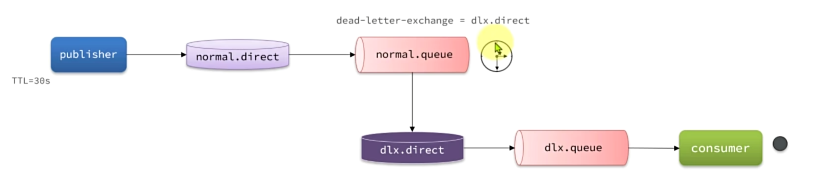

```java
@Configuration
public class NormalConfiguration {

    @Bean
    public DirectExchange normalExchange() {
        return new DirectExchange("normal.direct");
    }

    @Bean
    public Queue normalQueue() {
        return QueueBuilder.durable("normal.queue").deadLetterExchange("dlx.direct").build();
    }

    @Bean
    public Binding normalBinding(Queue normalQueue, DirectExchange normalExchange) {
        return BindingBuilder.bind(normalQueue).to(normalExchange).with("hi");
    }
}

    /**
     * 死信队列
     * @param message
     */
    @RabbitListener(bindings = @QueueBinding(
            value = @Queue(name = "dlx.queue", durable = "true"),
            exchange = @Exchange(name = "dlx.direct", type = ExchangeTypes.DIRECT),
            key = {"hi"}
    ))
    public void listenDlxQueue(String message) {
        System.err.println("dlx.queue.......接受到的信息：" + message );
    }
```

### 延迟消息插件

这个插件可以将普通交换机改造为支持延迟消息功能的交换机，当消息投递到交换机后可以暂存一定时间，到期后再投递到队列


DelayExchange插件

由于我们安装的MQ是`3.8`版本，因此这里下载`3.8.17`版本

安装：

因为我们是基于docker安装，所以要查看RabbitMQ的插件目录对应的数据卷

```Shell
[root@localhost ~]# docker volume inspect mq-plugins
[
    {
        "CreatedAt": "2025-10-29T04:42:02-07:00",
        "Driver": "local",
        "Labels": null,
        "Mountpoint": "/var/lib/docker/volumes/mq-plugins/_data",
        "Name": "mq-plugins",
        "Options": null,
        "Scope": "local"
    }
]
docker volume inspect mq-plugins
```

我们直接把插件上传到该目录，然后执行命令安装插件：

```Shell
docker exec -it mq rabbitmq-plugins enable rabbitmq_delayed_message_exchange
```

**声明延迟交换机：**

基于注解方式：

```Java
@RabbitListener(bindings = @QueueBinding(
        value = @Queue(name = "delay.queue", durable = "true"),
        exchange = @Exchange(name = "delay.direct", delayed = "true"),
        key = "delay"
))
public void listenDelayMessage(String msg){
    log.info("接收到delay.queue的延迟消息：{}", msg);
}
```

基于`@Bean`的方式：

```Java
package com.itheima.consumer.config;

import lombok.extern.slf4j.Slf4j;
import org.springframework.amqp.core.*;
import org.springframework.context.annotation.Bean;
import org.springframework.context.annotation.Configuration;

@Slf4j
@Configuration
public class DelayExchangeConfig {

    @Bean
    public DirectExchange delayExchange(){
        return ExchangeBuilder
                .directExchange("delay.direct") // 指定交换机类型和名称
                .delayed() // 设置delay的属性为true
                .durable(true) // 持久化
                .build();
    }

    @Bean
    public Queue delayedQueue(){
        return new Queue("delay.queue");
    }
    
    @Bean
    public Binding delayQueueBinding(){
        return BindingBuilder.bind(delayedQueue()).to(delayExchange()).with("delay");
    }
}
```

发送消息时，必须通过x-delay属性设定延迟时间：

```Java
@Test
void testPublisherDelayMessage() {
    // 1.创建消息
    String message = "hello, delayed message";
    // 2.发送消息，利用消息后置处理器添加消息头
    rabbitTemplate.convertAndSend("delay.direct", "delay", message, new MessagePostProcessor() {
        @Override
        public Message postProcessMessage(Message message) throws AmqpException {
            // 添加延迟消息属性
            message.getMessageProperties().setDelay(5000);
            return message;
        }
    });
}
```