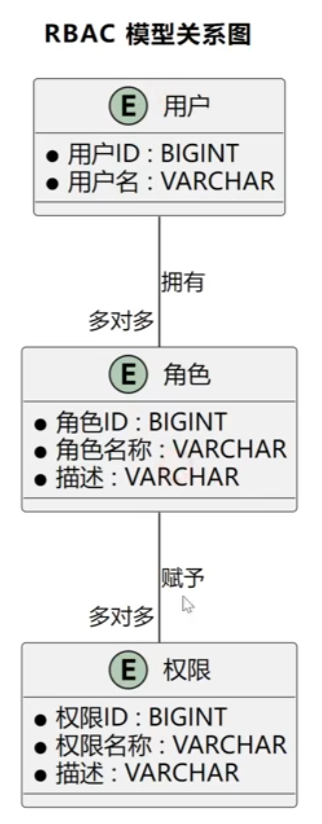

 

# 创建项目

## 前端

可以使用npm前端包管理工具[NVM](https://github.com/coreybutler/nvm-windows/releases/tag/1.1.12)，安装node.js

```bash
# 安装node 20 版本
nvm install 20
# 使用20版本
nvm use 20
# 查看所有可以用的版本
nvm list
```

### **创建项目：**

使用脚手架create-vue创建Vue3的项目

```bash
# 创建最新版本
npm create vue@latest

# 创建指定版本
npm create vue@3.12.1
```

接下来按照؜如下选项创建项目，脚؜手架会自动帮我们安装⁢ Vue Route‌r 路由、Pinia⁡ 全局状态管理等实用类库：

```bash
E:\web\code>npm create vue@latest
Need to install the following packages:
create-vue@3.18.0
Ok to proceed? (y) y
> npx
> create-vue

T  Vue.js - The Progressive JavaScript Framework
|
o  请输入项目名称：
|  text
|
o  请选择要包含的功能： (↑/↓ 切换，空格选择，a 全选，回车确认)
|  TypeScript, Router（单页面应用开发）, Pinia（状态管理）, ESLint（错误预防）, Prettier（代码格式化）
|
o  选择要包含的试验特性： (↑/↓ 切换，空格选择，a 全选，回车确认)
|  none
|
o  跳过所有示例代码，创建一个空白的 Vue 项目？
|  No

# 安装依赖
npm install
# 启动项目
npm run dev
```


### **引入组件库：**

可以使用element ui 或者Ant Design Vue类似的组件库，这里使用[Ant Design Vue](https://antdv.com/docs/vue/getting-started-cn)

执行安装`npm i --save ant-design-vue@4.x`

我们全局注册组件（为了方便），在`main.ts`文件中注册，参考官方文档


### **开发规范：**

遵循组合式API，开发参考模版如下

```vue
<template>
  <div id="xxPage">   <!-- 文件名字 -->

  </div>
</template>

<script setup lang="ts">

</script>

<style scoped>
#xxPage {
}

</style>
```

可以在根目录下的`index.html`来定义页面的元信息，如标题等


### **全局通用布局：**

新建Layout文件夹，创建`BasicLayout.vue`通用布局文件，然后再App.vue全局页面入口中引入

```vue
<template>
  <div id="app">
    <BasicLayout />
  </div>
</template>

<script setup lang="ts">
import BasicLayout from '@/layouts/BasicLayout.vue'
</script>

<style scoped></style>
```

可以移除创建vue时默认创建的样式，移除`main.ts`，`main.css`文件

使用Ant Design组件的 Layout组件，使用上中下布局编排，在填写内容

### **顶部栏：**

使用[Menu导航菜单]([导航菜单 Menu - Ant Design Vue](https://www.antdv.com/components/menu-cn)) 来实现顶部栏

```vue
<template>
  <div class="globalHeader">
    <a-menu v-model:selectedKeys="current" mode="horizontal" :items="items" />
  </div>
</template>
<script lang="ts" setup>
import { h, ref } from 'vue'
import { HomeOutlined } from '@ant-design/icons-vue'

const current = ref<string[]>(['mail'])
const items = ref<MenuProps['items']>([
  {
    key: '/',
    icon: () => h(HomeOutlined),
    label: '主页',
    title: '主页',
  },
  {
    key: '/about',
    label: '关于',
    title: '关于',
  },
  {
    key: '/other',
    label: h('a', { href: 'https://www.bilibili.com', target: '_blank' }, '其他'),
    title: '其他',
  },
])
</script>
```

使用栅格中Flex 填充组件，实现顶部导航栏的实现

左中右结构，左侧右侧宽度固定，中间菜单栏自适应

### **路由：**

先修改路由配置，在router包中的index.ts的路由配置，需要定义页面的路由，每一个path对应一个组件

```css
const router = createRouter({
  history: createWebHistory(import.meta.env.BASE_URL),
  routes: [
    {
      path: '/',
      name: 'home',
      component: HomeView,
    },
    {
      path: '/about',
      name: 'about',
      // route level code-splitting
      // this generates a separate chunk (About.[hash].js) for this route
      // which is lazy-loaded when the route is visited.
      component: () => import('../views/AboutView.vue'),
    },
  ],
})
```

给需要调转的地方绑定跳转事件

```vue
<a-menu
  v-model:selectedKeys="current"
  mode="horizontal"
  :items="items"
  @click="doMenuClick"
/>
```

然后执行doMenuClick这个函数

```typescript
// 路由跳转事件
const doMenuClick = ({ key }: { key: string }) => {
  router.push({
    path: key,
  })
}
```

高亮同步：

刷新页面后؜，你会发现当前菜单؜项并没有高亮，所以⁢需要同步路由的更新‌到菜单项高亮。

```tsx
const router = useRouter();
// 当前选中菜单
const current = ref<string[]>([]);
// 监听路由变化，更新当前选中菜单
router.afterEach((to, from, next) => {
  current.value = [to.path];
});
```

### **请求：**

前端向后端发起请求，需要使用axios库

安装：

```bash
npm install axios
```

定义全局请求：样板代码

```ts
import axios from 'axios'
import { message } from 'ant-design-vue'

// 创建Axios实例
const myAxios = axios.create({
  baseURL: 'http://localhost:8223',
  timeout: 60000,
  withCredentials: true
})

// 全局响应拦截器
myAxios.interceptors.response.use(
  function (response) {
    const { data } = response
    // 未登录
    if (data.code === 40100) {
      // 不是获取用户信息的请求，并且用户目前不是已经在用户登录页面，则跳转到登录页面
      if (
        !response.request.responseURL.includes('user/get/login') &&
        !window.location.pathname.includes('/user/login')
      ) {
        message.warning('请先登录')
        window.location.href = `/user/login?redirect=${window.location.href}`
      }
    }
    return response
  },
  function (error) {
    // Any status codes that falls outside the range of 2xx cause this function to trigger
    // Do something with response error
    return Promise.reject(error)
  },
)
// 导出这个实例
export default myAxios
```

**自动生成请求代码：**

如果采用传؜统开发方式，针对每؜个请求都要单独编写⁢代码，很麻烦。

推荐使用 OpenAPI 工具，直接自动生成即可：https://www.npmjs.com/package/@umijs/openapi

先安装

```bash
npm i --save-dev @umijs/openapi
```

然后写相关配置，也是**样板代码**

在 **项目根目录 **新建 `openapi.config.js`，根据自己的需要定制生成的代码：

```ts
import { generateService } from '@umijs/openapi'

generateService({
  requestLibPath: "import request from '@/request'",
  schemaPath: 'http://localhost:8223/api/v2/api-docs',
  serversPath: './src',
})

```

**注意，要将 schemaPath 改为自己后端服务提供的 Swagger 接口文档的地址。**

在 package.json 的 script 中添加 `"openapi": "node openapi.config.js"`

执行即可生成请求代码，还包括 TypeScript 类型：

然后执行**openAPI**，最后会在src中生成API的目录和文件，以后每次后端接口变更时，只需要重新生成一遍就好

然后可以在任意界面中调用api

```ts
import { healthUsingGet } from '@/api/mainController'

healthUsingGet().then((res) => {
  console.log(res)
})
```

healthUsingGet为生成的代码中controller中的方法名字


### 全局状态管理

所有页面全局共享的变量，而不是局限在某一个页面中。

适合作为全؜局状态的数据：已登؜录用户信息（每个页⁢面几乎都要用），类似于后端的常量类

Pinia 是一个主流的状态管理库，此处由于 ؜create-vu؜e 脚手架已经帮我⁢们整合了 Pini‌a，无需手动引入，直接⁡使用即可。

在 **src؜/stores** 目؜录下定义 **user**⁢ 模块，定义了用户‌的存储、远程获取、⁡修改逻辑：

## 后端

使用java11+springboot2+MYSQL8.0

整合mybatisplus，HuTool工具库，Knife4j，AOP依赖

创建通用基础代码，可以直接复制的

- 自定义异常 
- 响应返回值包装类
- 全局异常处理器
- 请求包装类
- 全局跨域配置


# 用户模块

## 后端

需要对用户权限进行控制

权限校验一般使用 **Spring AOP切面** + **自定义权限校验注解**

先分析有哪些需求：

需要对用户进行登录校验

- 用户注册
- 用户登录
- 获取登录信息
- 用户退出登录
- 管理用户

用户权限控制：

使用AOP注解来校验权限


用户管理： 这些操作都需要是管理员权限才可以执行

- 创建用户

- 根据id删除用户

- 更新用户

- 分页查询用户

- 根据id查询用户


获取登录信息时，id由于js和java的long范围不同会丢失精度，所以需要转换成字符串，要么定义数据库时直接定义为字符串，要么需要添加一个配置类

```java
/**
 * Spring MVC Json 配置
 */
@JsonComponent
public class JsonConfig {
    /**
     * 添加 Long 转 json 精度丢失的配置
     */
    @Bean
    public ObjectMapper jacksonObjectMapper(Jackson2ObjectMapperBuilder builder) {
        ObjectMapper objectMapper = builder.createXmlMapper(false).build();
        SimpleModule module = new SimpleModule();
        module.addSerializer(Long.class, ToStringSerializer.instance);
        module.addSerializer(Long.TYPE, ToStringSerializer.instance);
        objectMapper.registerModule(module);
        return objectMapper;
    }
}
```

MyBatisPlus分页插件在3.5.9版本以后需要独立按擦混个

```xml
<!-- MyBatis Plus 分页插件 -->
<dependency>
    <groupId>com.baomidou</groupId>
    <artifactId>mybatis-plus-jsqlparser-4.9</artifactId>
</dependency>
```

```xml
<dependencyManagement>
    <dependencies>
        <dependency>
            <groupId>org.springframework.boot</groupId>
            <artifactId>spring-boot-dependencies</artifactId>
            <version>${spring-boot.version}</version>
            <type>pom</type>
            <scope>import</scope>
        </dependency>
        <dependency>
            <groupId>com.baomidou</groupId>
            <artifactId>mybatis-plus-bom</artifactId>
            <version>3.5.9</version>
            <type>pom</type>
            <scope>import</scope>
        </dependency>
    </dependencies>
</dependencyManagement>

```

安装好依赖以后再config包下添加拦截器配置

```java
@Configuration
@MapperScan("com.yupi.yupicturebackend.mapper")
public class MyBatisPlusConfig {

    /**
     * 拦截器配置
     *
     * @return {@link MybatisPlusInterceptor}
     */
    @Bean
    public MybatisPlusInterceptor mybatisPlusInterceptor() {
        MybatisPlusInterceptor interceptor = new MybatisPlusInterceptor();
        // 分页插件
        interceptor.addInnerInterceptor(new PaginationInnerInterceptor(DbType.MYSQL));
        return interceptor;
    }
}
```

## Redis存储Session

有两种方法，一种是自己进行维护

使用String结构，每次登录前进行判断，登录完成之后再存入Redis中


第二种让Redis自己管理Session，可以更好的维护登录态

首先引入依赖

```xml
<!-- Spring Session + Redis -->
<dependency>
    <groupId>org.springframework.session</groupId>
    <artifactId>spring-session-data-redis</artifactId>
</dependency>
```

然后修改配置文件，设置Cookie和Session的过期时间

```yaml
spring: 
  # session 配置
  session:
    store-type: redis
    # session 30 天过期
    timeout: 2592000
server:
  port: 8123
  servlet:
    context-path: /api
    # cookie 30 天过期
    session:
      cookie:
        max-age: 2592000
```

这样就可以了


# 图片功能

1）管理员功能

- 图片上传与创建（"/upload"）
- 图片管理
- 图片修改（编辑信息）

2）用户功能

- 查看与搜索图片列表（主页）
- 查看图片详情（详情页）
- 图片下载


具体分析每个需求：

1）图片上传与؜创建：仅管理员可用，支持选择؜本地图片上传，并填写相关信息⁢，如名称、简介、标签、分类等‌。系统会自动解析图片的基础信⁡息（如宽高和格式等），便于检索。

2）图片管؜理：管理员可以对图؜库内的图片资源进行⁢管理，包括查询‌和删除。

3）图片修؜改：管理员可以对图؜片信息进行编辑，例⁢如修改名称、简介、‌标签、分类等。

4）查看与؜搜索图片列表：用户؜在主页上可按关键词⁢搜索图片，并支持按‌分类、标签等筛选条⁡件分页查看图片列表。

5）查看图片详؜情：用户点击列表中的图片后؜，可进入详情页，查看图片的⁢大图及相关信息，如名称、简‌介、分类、标签、其他图片信⁡息（如宽高和格式等）。

6）图片下؜载：用户在详情页可؜点击下载图片按钮，⁢将图片保存至本地。


方案设计阶段我们需要确认：

- 库表设计
- 如何实现图片上传和下载？
- 创建图片的业务流程
- 如何解析图片的信息？

我们选择腾讯云的cos对象存储 + [数据万象](https://cloud.tencent.com/product/ci) 来实现

数据万象服务可以直接获取到图片的各种基础信息

**图片管理：**

根据id删除图片  （"/delete"）

[管理员] 更新图片  ("/update")

[管理员] 分页获取图片 ("/list/page")

[管理员] 根据id获取图片 ("/get")

分页获取图片列表，需要脱敏和限制条数("/list/page/vo")

根据id获取图片，需要脱敏 ("/get/vo")

修改照片("/edit")

```java
cos:
  client:
    host: https://z
    secret-id: AKID
    secret-key: iEYkw01
    bucket: zz
    region: ap-be


```

## 前端

图片下载

```bash
npm install file-saver  
npm i --save-dev @types/file-saver
```

## 审核功能

需要添加审核相关字段

并且创建审核请求包装类

该功能仅管理员可用

```sql
-- 支持审核功能，给图片表添加审核相关字段
ALTER TABLE picture
    -- 添加新列
    ADD COLUMN reviewStatus  INT DEFAULT 0 NOT NULL COMMENT '审核状态：0-待审核; 1-通过; 2-拒绝',
    ADD COLUMN reviewMessage VARCHAR(512)  NULL COMMENT '审核信息',
    ADD COLUMN reviewerId    BIGINT        NULL COMMENT '审核人 ID',
    ADD COLUMN reviewTime    DATETIME      NULL COMMENT '审核时间';

-- 创建基于 reviewStatus 列的索引
CREATE INDEX idx_reviewStatus ON picture (reviewStatus);
```

## 批量添加图片

使用bing的图片请求接口

https://cn.bing.com/images/async?q=%明日方舟铃兰壁纸高清&mmasync=1

可以使用jsoup来发请求

https://cn.bing.com/images/async?q=风景

# 图库优化

## 图片查询优化

### 缓存

一般情况下就 4 个字 **“读多写少”**，要频繁查询的、不怎么修改的数据适合缓存

在我们的项目中，؜主页是用户高频访问的内容，调用؜的获取图片列表的接口也是高频访⁢问的。而且即使数据更新存在一定‌延迟，也不会对用户体验造成明显⁡影响，因此非常适合缓存。

```xml
<!-- Redis -->
<dependency>
    <groupId>org.springframework.boot</groupId>
    <artifactId>spring-boot-starter-data-redis</artifactId>
</dependency>
```

```yaml
spring:
  # Redis 配置
  redis:
    database: 0
    host: 127.0.0.1
    port: 6379
    timeout: 5000
```

### Redis分布式缓存

- 高性能：基于内存操作，访问速度极快。**单节点 Redis 的读写 QPS 可达 10w 次每秒！**

- 丰富的数据结构：支持字符串、列表、集合、哈希、位图等，适用于各种数据结构存储。

- 分布式支持：可以通过 Redis Cluster 构建高可用、高性能的分布式缓存，还提供哨兵集群机制提升可用性、提供分片集群机制提高可扩展性。

#### 缓存设计

需要缓存首页的图؜片列表数据，也就是对 **list؜PictureVOByPage⁢** 接口进行缓存。首先按照缓存 ‌3 要素 “key、value⁡、过期时间” 进行设计。

key的设计：

可以使用`picture:listPictureVOByPage:${查询条件}`

value的设计：

有两种选择：

- 为了可读性，可以转换为JSON结构的字符串
- 为了可压缩空间，可以存为二进制等其他结构

但是对应的Redis的数据结构都是String

也可以考虑hash结构

一定要设置过期时间，根据实际业务场景和缓存空间的大小，而且考虑到图片会持续更新，设置为5-60分钟即可

注意要考虑缓存雪崩等问题

### Caffeine本地缓存

当应用需要频繁访问某些数据时，可以将这些数据缓存到应用中，比如JVM，直接从内存读取，而不需要经过网络或者其他存储结构

对于 Java 项目，[Caffeine](https://github.com/ben-manes/caffeine) 是主流的本地缓存技术，拥有极高的性能和丰富的功能。比如可以精确控制缓存数量和大小、支持缓存过期、支持多种缓存淘汰策略、支持异步操作、线程安全等。

由于本地缓存不需要؜引入额外的中间件，成本⁢更低。因此如果只是要提‌升数据访问性能，优先考⁡虑本地缓存而不是分布式缓存。

```xml
<!-- 本地缓存 Caffeine -->
<dependency>
  <groupId>com.github.ben-manes.caffeine</groupId>
  <artifactId>caffeine</artifactId>
  <version>3.1.8</version>
</dependency>
```


#### 缓存设计

本地缓存的؜设计和分布式缓存基؜本一致，不再赘述。⁢但有 2 个区别：

1. 本地缓存需要自己创建初始化缓存结构（可以简单理解为要自己 new 一个 HashMap）。
2. 由于本地缓存本身就是服务器隔离的，而且占用服务器的内存，key 可以更精简一些，不用再添加项目前缀。

### 注意事项


**1、手动刷新缓存**

在某些情况؜下，数据更新较为频؜繁，但自动刷新缓存⁢机制可能存在延迟，‌可以通过手动刷⁡新来解决。

比如：

- 提供一个刷新缓存的接口，仅管理员可调用。
- 提供管理后台，支持管理员手动刷新指定缓存。

**2、解决缓存常见问题**

使用缓存时，一般要注意下面几个问题：

1）**缓存击穿**：某些 **热点数据** 在缓存过期后，大量请求直接打到数据库。

解决方案：؜设置热点数据的超长؜过期时间，或使用互⁢斥锁（如 Redi‌sson）控制⁡缓存刷新。

2）**缓存穿؜透**：用户频繁请求不؜存在的数据，导致大⁢量的请求直接触发数据‌库查询。

解决方案：؜对无效查询结果也进؜行缓存（如设置空值⁢缓存），或者使用布隆‌过滤器。

3）**缓存雪؜崩**：大量缓存同时过؜期，导致请求打到数⁢据库，系统崩溃。

解决方案：؜设置不同缓存的过期؜时间，避免同时过期⁢；或者使用多级缓存‌，减少对数据库的依⁡赖。

## 图片上传优化

### 图片压缩

 把文件后缀改成webp格式，可以有损和无损压缩

可以使用数据万象提供的 [文档](https://cloud.tencent.com/document/product/460/72229)

主要有两种方式压缩：

1、访问图片时实时压缩
这个功能是要按量**付费**的

2、上传图片时实时压缩 （**免费**）

其实还可以对已经上传的 图片进行压缩处理

```java
// 4.1 配置WebP格式压缩规则
List<PicOperations.Rule> rules = new ArrayList<>();
// 生成WebP格式文件名
String webpKey = FileUtil.mainName(uploadPath) + ".webp";
PicOperations.Rule compressRule = new PicOperations.Rule();
// 4.1.1 设置图片处理规则：转换为WebP格式
compressRule.setRule("imageMogr2/format/webp");
// 设置目标存储桶
compressRule.setBucket(cosClientConfig.getBucket());
// 设置处理后文件的存储路径
compressRule.setFileId(webpKey);
rules.add(compressRule);

// 应用图片处理规则
picOperations.setRules(rules);
putObjectRequest.setPicOperations(picOperations);
```


## 图片加载优化

### 缩略图

首页直接加载原؜图，原图文件通常比缩⁢略图大数倍甚至数十倍‌，不仅导致加载时间长⁡，还会造成大量流量浪费。

解决方案：؜上传图片时，同时生成؜一份较小尺寸的缩⁢略图。用户浏览图片列表时‌加载缩略图，只有在进⁡入详情页或下载时才加载原图。

**如何实现：**

和图片压缩一样，[参考 Java SDK 文档](https://cloud.tencent.com/document/product/436/55377#.E4.B8.8A.E4.BC.A0.E6.97.B6.E5.9B.BE.E7.89.87.E6.8C.81.E4.B9.85.E5.8C.96.E5.A4.84.E7.90.86) ，使用数据万象服务，具体的图片缩放参数可 [参考文档](https://cloud.tencent.com/document/product/436/113295)

需要新增缩略图字段

```mysql
ALTER TABLE picture
    -- 添加新列
    ADD COLUMN thumbnailUrl varchar(512) NULL COMMENT '缩略图 url';

```

然后再上传图片时，添加一些规则

```java
// 4.1.2 添加规则缩略图处理 ,仅对大于 500 KB 的图片进行缩略图处理
if (file.length() > 50 * 1024) {
    PicOperations.Rule thumbnailRule = new PicOperations.Rule();
    thumbnailRule.setBucket(cosClientConfig.getBucket());
    String thumbnailKey = FileUtil.mainName(uploadPath) + "_thumbnail." + FileUtil.getSuffix(uploadPath);
    thumbnailRule.setFileId(thumbnailKey);
    // 缩放规则 /thumbnail/<Width>x<Height>>（如果大于原图宽高，则不处理）
    thumbnailRule.setRule(String.format("imageMogr2/thumbnail/%sx%s>", 256, 256));
    rules.add(thumbnailRule);
}
```

之后再上传图片后获得的返回值中,可以获得缩略图，之后写入数据库，返回给前端

```java
ProcessResults processResults = putObjectResult.getCiUploadResult().getProcessResults();
List<CIObject> objectList = processResults.getObjectList();

// 如果存在处理后的图片（如压缩后的WebP），优先返回处理后的结果
if (CollUtil.isNotEmpty(objectList)) {
    CIObject compressedCiObject = objectList.get(0);
    // 有缩略图才得到缩略图
    CIObject thumbnailCiObject = compressedCiObject;
    if (objectList.size() > 1) {
        thumbnailCiObject = objectList.get(1);
    }
    // 封装压缩图返回结果
    return getUploadPictureResult(originalFilename, compressedCiObject, thumbnailCiObject);
}
```

### 懒加载

懒加载（Lazy Loading）可以避免一次性加载所有图片，**只有当资源需要显示时才进行加载**。比如对于图片列表来说，仅在用户滚动到图片所在区域时才加载该图片资源。

**实现方案：**

虽然懒加载؜的实现更多的是依赖前؜端，但后端也有一定的⁢优化策略，比如对图片‌列表进行分页，每页不⁡需要展示过多的内容。

### CDN 加速

CDN（内容分发网络؜）是通过将图片文件分发到全球各地的节点؜，用户访问时从离自己最近的节点获取资源⁢的技术，常用于文件资源或后端动态请求的‌网络加速，也能大幅分摊源站的压力、支持⁡更多请求同时访问，是性能提升的利器。

### 浏览器缓存

通过设置 HTT؜P 头信息（如 Cache-Co؜ntrol），可以让用户的浏览器⁢将资源缓存在本地。在用户再次访问‌同样的资源时，直接从本地缓存加载⁡资源，而无需再次请求服务器。


# 空间模块

管理空间---管理员

用户创建私有空间

私有空间权限控制

空间级别和限额控制


1）管理空间：仅管理员可用，可以对整个系统中的空间进行管理，比如搜索空间，编辑空间，删除空间

2）用户创建私有空间：用户最多创建一个私有空间，并且可以在私有空间内上传和管理图片，这里可以类比成百度网盘

3）私有空间权限控制：用户技能访问和管理自己的私有空间和其中的图片，私有空间的图片不会展示在公共图库，也不需要管理员审核

4）空间级别和限额控制：每个空间有不同的级别，（比如普通版和专业版），对应了不同的容量和图片数量限制，如果超出限制则无法继续上传图片

```mysql
-- 空间表
create table if not exists space
(
    id         bigint auto_increment comment 'id' primary key,
    spaceName  varchar(128)                       null comment '空间名称',
    spaceLevel int      default 0                 null comment '空间级别：0-普通版 1-专业版 2-旗舰版',
    maxSize    bigint   default 0                 null comment '空间图片的最大总大小',
    maxCount   bigint   default 0                 null comment '空间图片的最大数量',
    totalSize  bigint   default 0                 null comment '当前空间下图片的总大小',
    totalCount bigint   default 0                 null comment '当前空间下的图片数量',
    userId     bigint                             not null comment '创建用户 id',
    createTime datetime default CURRENT_TIMESTAMP not null comment '创建时间',
    editTime   datetime default CURRENT_TIMESTAMP not null comment '编辑时间',
    updateTime datetime default CURRENT_TIMESTAMP not null on update CURRENT_TIMESTAMP comment '更新时间',
    isDelete   tinyint  default 0                 not null comment '是否删除',
    -- 索引设计
    index idx_userId (userId),        -- 提升基于用户的查询效率
    index idx_spaceName (spaceName),  -- 提升基于空间名称的查询效率
    index idx_spaceLevel (spaceLevel) -- 提升按空间级别查询的效率
) comment '空间' collate = utf8mb4_unicode_ci;


-- 添加新列
ALTER TABLE picture
    ADD COLUMN spaceId  bigint  null comment '空间 id（为空表示公共空间）';

-- 创建索引
CREATE INDEX idx_spaceId ON picture (spaceId);

```


## 创建空间

流程如下：

1. 填充参数默认值
2. 校验参数
3. 校验权限，非管理员只能创建普通级别的空间
4. 控制同一用户只能创建一个私有空间

如何保证同一用户只能创建一个私有空间呢？

最粗暴的方式是给空间表的 userId 加上唯一索引，但由于后续用户还可以创建团队空间，这种方式不利于扩展。所以我们采用 **加锁 + 事务** 的方式实现。

如果需要给一整个方法加锁，那么直接加一个**@Synchronized**锁，但是如果需要给方法内部加锁，直接使用**synchronized(lock)**


如果要保证事务的一致性,，可以在方法上面加上**@Transactional**，如果只在方法内部一部分逻辑需要保证事务一致性，需要引入

```java
// 创建事务模板
@Resource
private TransactionTemplate transactionTemplate;
```

可以自定义事务

```java
// 控制同一个用户只能创建一个空间 加锁
String lock = String.valueOf(userId).intern();
synchronized (lock) {
    Long newSpaceId = transactionTemplate.execute(status -> {
        // 判断用户是否已经有一个空间
        boolean exists = this.lambdaQuery().eq(Space::getUserId, userId).exists();
        ThrowUtils.throwIf(exists, ErrorCode.OPERATION_ERROR, "用户已创建空间");
        // 写入数据库
        boolean result = this.save(space);
        ThrowUtils.throwIf(!result, ErrorCode.OPERATION_ERROR, "创建空间失败");\
        return space.getId();
    });
    return newSpaceId;
}
```

我们使用本地 synchronized 锁对 userId 进行加锁，这样不同的用户可以拿到不同的锁，对性能的影响较低。在加锁的代码中，我们使用 Spring 的 **编程式事务管理器** transactionTemplate 封装跟数据库有关的查询和插入操作，而不是使用 @Transactional 注解来控制事务，这样可以保证事务的提交在加锁的范围内。


## 权限控制

需要给图片表添加spaceId字段，null为默认，表示公共图库

上传和更新图片时，需要指定空间的Id，表示要将图片上传到那个空间

需要修改上传图片和修改图片的方法

需要校验空间是否存在和上传的是否为个人的空间

如果是更新图片，还需要校验传递的SpaceId和原本的是否一致


# 以图搜图

**1. 第三方API**

如果想从自检的图库中搜索：可以使用百度AI提供的图片搜索API，[参考官方文档](https://ai.baidu.com/tech/imagesearch/)

Bing 以图搜图：利用必应的图库，可以从全网进行搜索，而且可以免费使用，[参考官方文档]()

**2. 数据抓取**

利用已有的؜以图搜图网站，通过؜数据抓取的方式实时⁢查询搜图网站的返‌回结果。

为了让大家学习到更多知识，此处我们选择这种方案。

以百度搜图؜网站为例，我们可以؜先体验一遍流程，并⁢且对接口进行分析：

1）进到百度图片搜索，通过 url 上传图片，发现接口：https://graph.baidu.com/upload?uptime= ，该接口的返回值为 “以图搜图的页面地址”

这一步可以直接复制curl请求到cmd，获得数据

```json
{"status":0,"msg":"Success","data":{"url":"https://graph.baidu.com/s?card_key=\u0026entrance=GENERAL\u0026extUiData%5BisLogoShow%5D=1\u0026f=all\u0026isLogoShow=1\u0026session_id=15007717926573518334\u0026sign=1215a9aadbc7daed163d301758806377\u0026tpl_from=pc","sign":"1215a9aadbc7daed163d301758806377"}}
C:\Users\28299>
```

可以拿到url

可以让ai重新编码一下得到

`https://graph.baidu.com/s?card_key=&entrance=GENERAL&extUiData%5BisLogoShow%5D=1&f=all&isLogoShow=1&session_id=15007717926573518334&sign=1215a9aadbc7daed163d301758806377&tpl_from=pc`

2）访问上一步得到的url，在F12中找到请求的响应得到

```json
{
    "cardName": "simipic",
    "tplData": {
        "title": "相似图片",
        "firstUrl": "https:\/\/graph.baidu.com\/ajax\/pcsimi?carousel=503&entrance=GENERAL&extUiData%5BisLogoShow%5D=1&inspire=general_pc&limit=30&next=2&render_type=card&session_id=15007717926573518334&sign=1215a9aadbc7daed163d301758806377&tk=0f701&tpl_from=pc",
        "moreUrl": "",
        "imageUrl": "https:\/\/shitu-query-bj.bj.bcebos.com\/2025-09-25\/21\/9aadbc7daed163d3?authorization=bce-auth-v1%2F7e22d8caf5af46cc9310f1e3021709f3%2F2025-09-25T13%3A33%3A10Z%2F300%2Fhost%2F014aea5958e233c6a9b3824d71f1edbac8ec5905741cb52ec184ed13272706fc",
        "panoImg": ""
    },
    "commonData": {},
    "extData": {
        "template_name": "simipic",
        "template_id": "G573"
    }
}];
```

拿到firstUrl

```
https://graph.baidu.com/ajax/pcsimi?carousel=503&entrance=GENERAL&extUiData%5BisLogoShow%5D=1&inspire=general_pc&limit=30&next=2&render_type=card&session_id=15007717926573518334&sign=1215a9aadbc7daed163d301758806377&tk=0f701&tpl_from=pc
```

访问这个可以获得到图片的

## 门面模式

这里使用一种设计模式来提供图片搜索服务，门面模式通过提供一个统一的接口来简化多个接口的调用，使得客户端不需要关注内部的具体实现

可以将多个API整合到一个门面类中，调用简化过程

## 修改上传图片

因为百度以图识图无法解析webp文件的图片，所以我们需要再表中添加图片原图字段，每次上传图片需要添加图片原图的地址

```java
/**
 * 图片原图
 */
private String originalUrl;
```

在调用以图搜图接口时，返回给前端最原始的图片

# 颜色搜图

使用数据万象可以获得图片主色调功能

然后使用欧几里得距离 算法可以计算相似度


图片分享

只用前端实现


# Spring表达式

如果需要动态替换内容，，Spring 表达式语言（Spring Expression Language，简称SpEL)，用在Spring配置文件或者java代码中动态的查询和操作对象。SpEL可以在运行时解析表达式，并执行对 Java 对象的访问，操作和计算，支持丰富的功能，如条件判断，方法调用，属性访问，集合处理，正则表达式等

```java
#{user.name}   // 访问 user 对象的 name 属性
#{person.address.city}  // 访问嵌套对象地址中的 city 属性
#{user.getFullName()}   // 调用 user 对象的 getFullName() 方法
#{user.age > 18 ? 'Adult' : 'Child'}  // 根据 age 判断是否为成年人

```

在缓存注解中，使用表达式根据方法参数动态生成缓存的key:

```java
/**
 * 根据用户 ID 获取用户信息，并将结果缓存。
 * 使用 SpEL 动态生成缓存的 key，加入用户 ID 和请求的语言（locale）。
 *
 * @param userId 用户 ID
 * @param locale 当前语言环境（如 en, zh）
 * @return 用户信息
 */
@Cacheable(value = "users", key = "#userId + ':' + #locale")
public String getUserInfo(Long userId, String locale) {
    // 模拟数据库查询
    System.out.println("Fetching user info from DB...");
    return "User " + userId + " info in " + locale + " language";
}

```


# AI 编辑图片

在日常的图片管理中，用户经常需要对图片进行简单处理，比如裁剪多余部分，旋转图片，放大缩小尺寸等

因此需要引入基础图片编辑功能

图片编辑功能主要是一前端为主，编辑完成后通过调用现有的图片上传接口，将编辑后的图片保存至平台

可以使用开源的 [vue-cropper](https://github.com/xyxiao001/vue-cropper?tab=readme-ov-file#2-%E5%BC%95%E5%85%A5-vue-cropper) 组件


最后注意要注意跨域问题，需要在腾讯云中配置改一下，要不然获取不到图片


# AI扩图

因为AI绘画任务计算量大且耗时长，同步调用会导致服务器线程长时间呗单个任务占用，限制了并发处理能力，增加了超时和系统崩溃的风险。

通过异步调用，服务器可以将任务放入队列中，合理调度资源，避免阻塞主线程，从而更高效地服务多个用户请求，提升整体系统的稳定性和可扩展性、


同步调用好处是可以直接获取到结果，调用更方便


异步调用流程是：客户端需要再提交任务后，不断轮询请求，来检查任务是否执行完成，如果完成了，才可以获取到生成的图片


如果前端传递参数为xScale 字段，第二位为大写的，是传不了值，这是因为 SpringMVC 杜宇第二个大写是首字母的参数无法映射（和参数类别无关）

解决这个方案是，给这些字段增加@JsonProperty() 注解

```java
/**
 * 可选，图像居中，在水平方向上按比例扩展，默认值 1.0，范围 [1.0, 3.0]
 */
@Alias("x_scale")
@JsonProperty("xScale")
private Float xScale;

/**
 * 可选，图像居中，在垂直方向上按比例扩展，默认值 1.0，范围 [1.0, 3.0]
 */
@Alias("y_scale")
@JsonProperty("yScale")
private Float yScale;
```


# 图库分析


根据我们空间表和图片表的已有字段，可以挖掘出很多分析需求，整体分为用户空间图库分析和管理员全空间分析两类

## 分析类需求的实现流程

对于分析类需求，实现流程几乎都是一直的

1） 数据采集：从数据源获取原始数据，要提前明确设计的表和字段，必要时采用分页查询处理大数据量

2） 数据预处理：对数据进行清洗，加工和格式化，包括过滤无效数据，解析复杂字段，以及通过字段关联补充上下文信息

3）数据计算：根据需求进行分组、聚合、排序等，从而计算关键指标，比如计算空间各分类图片的占用比例、用户上传图片的时间趋势。可以根据场景调整计算方案，比如对于大数据量，可以采用Spark之类的大数据计算组件做离线计算；对于数据实时性要求较高的实时分析场景，可以采用Flink做流失处理

4） 数据存储（可选）： 针对频繁查询的分析结果，可将结果数据存储为单独的表或者缓存，减少计算，提高查询效率

5）数据接口设计：为前端提供统一接口，从而支持查询和展示。需要考虑到数据量较大导致前端渲染卡顿的情况，可以按需精简返回字符串、分页查询等。

6）数据可视化：通过图表直观展示分析结果，前端可以使用ECharts等可视化库渲染，也可以让后端生成图表图片并返回，但这种实现方法的灵活度有限

## 实现方案

queryAll 字段：为true时表示查询全空间，仅管理员可用

queryPublic字段：为true时表示查询公共空间图库，仅管理员可用

spaceId 字段： 尽在queryAll 和 queryPublic 均为false 使使用，查询个人空间，仅管理员和空间创建者可用


```java
@Override
public List<SpaceSizeAnalyzeResponse> getSpaceSizeAnalyze(SpaceSizeAnalyzeRequest spaceSizeAnalyzeRequest, User loginUser) {
    ThrowUtils.throwIf(spaceSizeAnalyzeRequest == null, ErrorCode.PARAMS_ERROR);

    // 检查权限
    checkSpaceAnalyzeAuth(spaceSizeAnalyzeRequest, loginUser);

    // 构造查询条件
    QueryWrapper<Picture> queryWrapper = new QueryWrapper<>();
    fillAnalyzeQueryWrapper(spaceSizeAnalyzeRequest, queryWrapper);

    // 查询所有符合条件的图片大小
    queryWrapper.select("picSize");
    List<Long> picSizes = pictureService.getBaseMapper().selectObjs(queryWrapper)
            .stream()
            .map(size -> ((Number) size).longValue())
            .collect(Collectors.toList());

    // 定义分段范围，注意使用有序 Map
    Map<String, Long> sizeRanges = new LinkedHashMap<>();
    sizeRanges.put("<100KB", picSizes.stream().filter(size -> size < 100 * 1024).count());
    sizeRanges.put("100KB-500KB", picSizes.stream().filter(size -> size >= 100 * 1024 && size < 500 * 1024).count());
    sizeRanges.put("500KB-1MB", picSizes.stream().filter(size -> size >= 500 * 1024 && size < 1 * 1024 * 1024).count());
    sizeRanges.put(">1MB", picSizes.stream().filter(size -> size >= 1 * 1024 * 1024).count());

    // 转换为响应对象
    return sizeRanges.entrySet().stream()
            .map(entry -> new SpaceSizeAnalyzeResponse(entry.getKey(), entry.getValue()))
            .collect(Collectors.toList());
}

```


## 前端

使用Echarts组件

```bash
npm i echarts vue-echarts
```

在需要的图标页面js引入

```js
import VChart from "vue-echarts";
import "echarts";
```

模版代码：

```vue
<template>
  <div class="space-usage-analyze">
    <a-card title="空间资源使用分析">
      <v-chart :option="options" style="height: 320px" :loading="loading" />
    </a-card>
  </div>
</template>

<script setup lang="ts">
import VChart from "vue-echarts";
import "echarts";
import { ref } from 'vue'

interface Props {
  queryAll?:boolean
  queryPublic?:boolean
  spaceId?:number
}

const props = withDefaults(defineProps<Props>(), {
  queryAll: false,
  queryPublic: false,
})

// 加载状态
const loading = ref(false)

// 图标选项
const options = {}
</script>

<style scoped></style>
```

安装词云图

```bash
npm install echarts-wordcloud
```


# 团队空间

## 需求分析

1） 创建团队空间共享共建

用户可以创建 **最多一个** 团队共享空间

2） 空间成员管理

成员邀请：空间管理员可以邀请新成员加入团队，共享空间内的图片

设置权限：空间管理员可以为成员设置不同的角色（查看者，编辑者，管理员），控制成员的权限范围

3）空间成员权限控制：仅限特定的角色的成员可以访问或操作空间内的图片

4）空间数据管理：考虑到团队空间的图片数量可能比较多，可以对特定空间的数据进行单独的管理，而不是和公共私有空间混在一起

## 方案设计

因为已经开发了空间模块，可以直接给空间表添加一个spaceType字段，用于区分私有空间和团队空间

```sql
ALTER TABLE space
    ADD COLUMN spaceType int default 0 not null comment '空间类型：0-私有 1-团队';

CREATE INDEX idx_spaceType ON space (spaceType);
```

### 空间成员管理

为了减少原有代码的修改，设定 **只有团队空间才有成员的概念**

需要有：

1） 成员邀请：空间管理员可以直接输入成员的id来添加新成员，无需该用户确认，这样可以提高开发效率

2） 设置权限：空间管理员可以为已经加入成员设置不同的角色，控制成员的权限范围，类似于编辑成员信息

至此空间和用户是**多对多**的关系，需要建立一张关联表：

```sql
-- 空间成员表
create table if not exists space_user
(
    id         bigint auto_increment comment 'id' primary key,
    spaceId    bigint                                 not null comment '空间 id',
    userId     bigint                                 not null comment '用户 id',
    spaceRole  varchar(128) default 'viewer'          null comment '空间角色：viewer/editor/admin',
    createTime datetime     default CURRENT_TIMESTAMP not null comment '创建时间',
    updateTime datetime     default CURRENT_TIMESTAMP not null on update CURRENT_TIMESTAMP comment '更新时间',
    -- 索引设计
    UNIQUE KEY uk_spaceId_userId (spaceId, userId), -- 唯一索引，用户在一个空间中只能有一个角色
    INDEX idx_spaceId (spaceId),                    -- 提升按空间查询的性能
    INDEX idx_userId (userId)                       -- 提升按用户查询的性能
) comment '空间用户关联' collate = utf8mb4_unicode_ci;
```

不需要使用逻辑删除字段，否则无法退出后再重新加入

创建团队空间时，要自动将创建人作为空间管理员，保存到空间成员表中

### 空间成员权限控制

仅限特定角色的成员可访问或操作团队空间内的图片

**1、RBAC权限控制**

对于复杂的权限控制场景，可以采用经典的RBAC权限控制模型（基于角色的访问控制，Role-Based Access Control），核心概念包括 **用户、角色、权限。**

- 一个用户可以有多个角色

- 一个角色可以有多个权限



一般来说，标准的 RBAC 实现需要 5 张表：用户表，角色表，权限表，用户角色关联表，角色权限关联表。由于我们的项目中，团队空间不需要怎么多角色，可以简化 RBAC 的实现方式，比如将角色和权限直接定义到配置文件中

角色：

| 角色   | 描述                         |
| ------ | ---------------------------- |
| 浏览者 | 仅可查看空间中的照片内容     |
| 编辑者 | 可查看、上传和编辑图片内容   |
| 管理员 | 拥有管理空间和成员的所有权限 |

角色权限

| 权限键           | 功能名称 | 描述 |
| ---------------- | -------- | ---- |
| spaceUser:manage | 成员管理 |      |
| picture:view     | 查看图片 |      |
| picture:upload   | 上传图片 |      |
| picture:edit     | 修改图片 |      |
| picture:delete   | 删除图片 |      |

角色与权限映射：

浏览者：查看图片

编辑者：查看，上传，修改，删除图片

管理员：查看，上传，修改，删除图片，成员管理


RBAC只是一种权限设计模型

1）最直接的方法就是与之前校验私有空间权限一样，封装团队空间的权限校验方法，或者类似用户全新啊校验一样，写个注解 + AOP 切面

2）对于复杂的角色和权限管理，可以选用现成的第三方权限校验框架来实现，编写一套权限校验规则代码后，就可以整体管理系统的权限校验逻辑了

这个项目使用方案二，国内主流的权限校验框架 [Sa-Token](https://sa-token.cc/doc.html#/start/example) 实现

# 权限控制

需要自己定义一下每一个角色和对应的权限，然后写一个配置类加载到项目中

## 使用Sa-Token

需要引入相对应的依赖，根据 springboot 版本不同需要引入不同的依赖版本

```xml
<!-- Sa-Token 权限认证 -->
<dependency>
    <groupId>cn.dev33</groupId>
    <artifactId>sa-token-spring-boot-starter</artifactId>
    <version>1.39.0</version>
</dependency>
```

Sa-Token 默认将数据（比如用户的登录态）保存到内存中，但是重启后数据会丢失，可以让 Sa-Token 整合 Redis ，将用户的登录态之类的数据保存在 Redis 中

这里选择 jsckson 序列化方式整合 Redis ，这样存到 Redis 的数据是可读的

```xml
<!-- Sa-Token 整合 Redis （使用 jackson 序列化方式） -->
<dependency>
    <groupId>cn.dev33</groupId>
    <artifactId>sa-token-redis-jackson</artifactId>
    <version>1.39.0</version>
</dependency>
<!-- 提供Redis连接池 -->
<dependency>
    <groupId>org.apache.commons</groupId>
    <artifactId>commons-pool2</artifactId>
</dependency>
```

因为这个项目有多两套权限校验体系，一套是最开始就有的，对角色进行校验，分为普通用户和管理员，一套是Sa-token

因为有多账号体系情况下，也就是说用户id和我们要保存的空间用户表中的id，如果都是用这个权限校验，无法区分，即使我们当前的项目只保存空间用户表中的id，最好使用 Sa-Token 提供的 [多账号认证特性](https://sa-token.cc/doc.html#/up/many-account?id=_5%e3%80%81kit%e6%a8%a1%e5%bc%8f) 

权限校验逻辑:

1. 校验登录类型：如果loginType不是"space"，直接返回空权限列表。

2. 管理员权限处理：如果当前用户为管理员，直接返回管理员权限列表。

3. 获取上下文对象：从请求中获取SpaceUserAuthContext上下文，检查上下文字段是否为空。如果上下文中所有字段均为空（如没有空间或图片信息），视为公共图库操作，直接返回管理员权限列表。

4. 校验登录状态：通过1oginId获取当前登录用户信息。如果用户未登录，抛出未授权异常；否则获取用户的唯一标识userId，用于后续权限判断。

5. 从上下文中优先获取SpaceUser对象：如果上下文中存在SpaceUser对象，直接根据其角色获取权限码列表。

6. 通过spaceUserId获取空间用户信息：

  如果上下文中存在spaceUserId:查询对应的SpaceUser数据。如果未找到，抛出数据未找到异常。

  校验当前登录用户是否属于该空间，如果不是，返回空权限列表。

  否则，根据登录用户在该空间的角色，返回相应的权限码列表。

7. 通过spaceId或pictureId获取空间或图片信息:
   
    如果spaceId不存在：使用pictureId查询图片信息，并通过图片的spaceId继续判断权限；
    
    如果pictureId和spaceId均为空，默认视为管理员权限。
    
    对于公共图库：如果图片是当前用户上传的，或者当前用户为管理员，返回管理员权限列表；如果图片不是当前用户上传的，返回仅允许查看的权限码。
    
8. 获取Space对象并判断空间类型：查询Space信息，如果未找到空间数据，抛出数据未找到异常。否则根据空间类型进行判断
    私有空间：仅空间所有者和管理员有权限（即返回全部权限），其他用户返回空权限列表。
    团队空间：查询登录用户在该空间的角色，并返回对应的权限码列表。如果用户不属于该空间，返回空权限列表。

# 分库分表

不建议自己实现分库分表，我们使用主流的分库分表框架 [Apache ShardingSphere](https://shardingsphere.apache.org/)

| 维度     | ShardingSphere JDBC                    | ShardingSphere Proxy                     |
| -------- | -------------------------------------- | ---------------------------------------- |
| 运行方式 | 嵌入式运行在应用内部                   | 独立代理，运行在应用与数据库之间         |
| 性能     | 低网络开销，性能较高                   | 引入网络开销，性能略低                   |
| 支持语言 | 仅支持Java                             | 支持多语言                               |
| 配置管理 | 分布式配置较复杂                       | 支持集合总配置和动态管理                 |
| 扩展性   | 随着应用扩展，需单独调整配置           | 代理服务集中化管理，扩展性强             |
| 使用场景 | 单体或小型系统，对性能要求比较高的场景 | 多语言，大型分布式系统或需要统一管理场景 |

我们选择使用JDBC

```xml
<!-- 分库分表 -->
<dependency>
    <groupId>org.apache.shardingsphere</groupId>
    <artifactId>shardingsphere-jdbc-core-spring-boot-starter</artifactId>
    <version>5.2.0</version>
</dependency>
```


# 扩展

1）优化缓存处理：当用户新增公共图片时，需要删除缓存

2）自动识别热点图片缓存：采用热key探测技术，实时对图片的访问量进行统计，并自动将热点‌图片添加到内存缓存，⁡以应对大量高频的访问。

3）文件秒传：

文件秒传是一种基于文件的唯一标识（如MD5,SHA-256) 对文件内容进行快速校验，避免重复上传的方法，在大型文件传输场景下非常重要。可以提高性能， 节约贷款和存储资源

**实现方案：**

1）客户端؜生成文件唯一标识：上؜传前，通过客户端计算⁢文件的哈希值（如 M‌D5、SHA-256⁡），生成文件的唯一指纹。

2）服务端؜校验文件指纹：后端؜接收到文件指纹后，⁢在存储中查询是否已‌存在相同文件。

- 若存在相同文件，则直接返回文件的存储路径。
- 若不存在相同文件，则接收并存储新文件，同时记录其指纹信息。

注意，客户端؜和服务端是相对的概念。因؜为现在我们要把文件上传到⁢对象存储服务器，我们的后‌端此时就是“客户端”，对⁡象存储服务器才是 “服务端”。

此项目是用不了，因为我们使用的是cos对象存储，只能通过唯一地址去⁢取文件，无法完全自定义文件的存储结构、也不支持文件快捷方式的概念，因此秒‌传的文件地址必须使用和原文件相同的对象路径，可能导致其他的问题（比如用户⁡ A 上传的图片地址等同于用户 B 上传的地址）。

4）分片上传和断点上传：

对于大文件，还可以开启分片上传和断点续传，不需要自己开发，直接使用 [对象存储的SDK](https://cloud.tencent.com/document/product/436/65935) 就能完成

5）创建空间采用分布式锁：

本地锁改为分布式锁，可以基于 Redisson 实现。

6）额度修改：如果用户重新上传一张图片，需要先减去原有的额度，然后再加上新上传的额度

7）删除空间时，关联删除空间内的照片

8）目前更新上传؜图片的逻辑还是存在一些问题؜的。比如更新图片时，并没有删除原有⁢图片、也没有减少原有图片占用的‌空间和额度，可以通过事务中补充⁡逻辑或者通过定时任务扫描删除。

9)、新增分析需求，按照空间级别对空间进行分类统计，分析不同级别空间的使用情况。

10)、新增分析需求，管理员可以对系统内图片的审核状态进行分类统计，还可以按时间维度分析图片审核量的变化趋势。

11)、新增分析需求，管理员可以按时间统计用户的登录次数、图片上传量和活跃度的变化趋势，帮助管理员识别高活跃用户，对用户进行分层管理。
