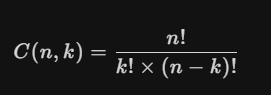

```cpp
#include <bits/stdc++.h>
#define x first
#define y second
#define int long long

using namespace std;
typedef pair<int, int> PII;
const int N = 2e5 + 5;
vector<char> arr;
void solve()
{
}

signed main()
{
    int t = 1;
    cin >> t;
    for (int i = 0; i < t; i++)
    {
        solve();
    }
    return 0;
}
```

# 常用函数
## 二分
```java
int a = Arrays.binarySearch(bin, 4);
if (a < 0) a = -a - 2;
```
## 进制转换
**十进制-->其他**
方法接受一个整数参数，并返回其二进制表示的字符串。
```java
int a = 512;
Integer.toBinaryString(a);
```
接受两个参数，第一个是要转换的整数，第二个是基数。在这里，我们使用基数2 来表示二进制。
```java
int a = 512;
String binaryString = Integer.toString(a, 2);
System.out.println(binaryString);
```
其他-->十进制
这个方法接受两个参数：第一个参数是一个字符串，表示二进制数；第二个参数是基数，对于二进制数来说，这个值是2
```java
String s = "1100";
int num = Integer.parseInt(s, 2);
// num = 12
```

# 单调队列

--------------------------
```java
public class Q239 {
    public static void main(String[] args) {
        int[] nums = {1, 3, -1, -3, 5, 3, 6, 7};
        int k = 3;
        int[] ints = maxSlidingWindow(nums, k);
        System.out.println(Arrays.toString(ints));
    }
    private static int[] maxSlidingWindow(int[] nums, int k) {
        int n = nums.length;
        List<Integer> list = new LinkedList<>();
        int[] result = new int[n - k + 1];
        for (int i = 0; i < n; i++) {
            while (!list.isEmpty() && nums[list.get(list.size() - 1)] < nums[i]) {
                list.remove(list.size() - 1);
            }
            list.add(i);
            if (list.get(0) < i - k + 1) {
                list.remove(0);
            }
            if (i >= k - 1) {
                result[i-k+1] = nums[list.get(0)];
            }
            System.out.println(list);
        }
        return result;
    }
}
```
---
# 全排列
```java
import java.util.*;
public class Main {
    public static void main(String[] args) {
        List<Integer> list = new ArrayList<>();
        Collections.addAll(list, 1, 2, 3, 4, 5);
        do {
            System.out.println(list);
        } while (nextPermutation(list));
    }
    public static boolean nextPermutation(List<Integer> nums) {
        int i = nums.size() - 2;
        while (i >= 0 && nums.get(i) >= nums.get(i + 1)) {
            i--;
        }
        if (i < 0) {
            return false;
        }
        int j = nums.size() - 1;
        while (j > i && nums.get(j) <= nums.get(i)) {
            j--;
        }
        Collections.swap(nums, i, j);
        Collections.reverse(nums.subList(i + 1, nums.size()));
        return true;
    }
}
```
手搓dfs
```java
public class Q46 {
    static List<List<Integer>> list;
    static List<Integer> res;
    public static void main(String[] args) {
        int[] nums = {0,1};
        list = new LinkedList<>();
 
        for (int i = 0; i < nums.length; i++) {
            res = new LinkedList<>();
            res.add(nums[i]);
            dfs(nums);
        }
        System.out.println(list);
    }

    public static void dfs(int[] nums) {
        if (res.size() == nums.length) {
            list.add(new LinkedList<>(res));
            return;
        }
        for (int i = 0; i < nums.length; i++) {
            if (!res.contains(nums[i])) {
                res.add(nums[i]);
                dfs(nums);
                res.remove(res.size()-1);
            }
        }
    }
}
```

# dijkstra
```java
public int networkDelayTime(int[][] times, int n,int k) {
    int[][] graph = new int[n][n];//定义图
    int[] dist = new int[n];//距离原点的距离
    boolean[] vis = new boolean[n];//记录已经更新的点

    //初始化图
    for (int i = 0; i < n; i++) {
        Arrays.fill(graph[i], Integer.MAX_VALUE/2);
    }
    for (int[] t : times) {
        int a = t[0] - 1;
        int b = t[1] - 1;
        int len = t[2];
        graph[a][b] = len;
    }

    //初始化数组
    Arrays.fill(vis, false);
    Arrays.fill(dist, Integer.MAX_VALUE/2);
    dist[k - 1] = 0;
    for (int i = 0; i < n; i++) {
        int min = Integer.MAX_VALUE/2;
        int min_index = 0;
        for (int j = 0; j < n; j++) {
            if (!vis[j] && dist[j] < min) {
                min = dist[j];
                min_index = j;
            }
        }
        vis[min_index] = true;
        for (int j = 0; j < n; j++) {
            dist[j] = Math.min(dist[j], dist[min_index] + graph[min_index][j]);
           

        }
    }
    int ans = Arrays.stream(dist).max().getAsInt();
    return ans == Integer.MAX_VALUE/2 ? -1 : ans;
}


```
# 快速幂
```java
public static long fast_power(long a, long b, long c) {
    long res = 1;
    a %= c;
    while (b > 0) {
        if ((b & 1) == 1) {//b % 2 != 0
            res = res * a % c;
        }
        a = a * a % c;
        b >>= 1; //b /= 2;
    }
    return res;
}
```
x / y = x * fast_power(y, mod - 2, mod)



# 大数计算
指定进制大的整数
BigInteger bd = new BigInteger("100",2);

BigDecimal
通过传递字符串来构造
加法
```java
BigDecimal bd1 = new BigDecimal(1.0);
BigDecimal bd2 = new BigDecimal(2.0);
BigDecimal bd3 = bd1.add(bd2);
System.out.println(bd3);
```
subtract、减法
```java
BigDecimal bd4 = bd1.subtract(bd2);
```
multiply、乘法
```java
System.out.println(bd1.multiply(bd2));
```
divide、除法

1. 当可以整除时：
```java
BigDecimal bd1 = new BigDecimal(10);
BigDecimal bd2 = new BigDecimal(2);
System.out.println(bd1.divide(bd2));
```
2. 当不能整除时：
参数1：除数
参数2：保留几位小数
参数3：舍入模式
```java
BigDecimal bd1 = new BigDecimal(10);
BigDecimal bd2 = new BigDecimal(3);
System.out.println(bd1.divide(bd2,2, RoundingMode.HALF_UP));
```
四舍五入：RoundingMode.HALF_UP

把一个十进制的数转换成任意进制
```java
String c = bd1.add(bd2).toString();
BigInteger mm = new BigInteger(c);
String string = mm.toString(4);//4进制
```
# 时间
如果要求四舍五入，可以在数据加上0.5来实现


# 背包
```java
//01背包
int n = 10, m = 4; //背包容量为10,4个物品
int[] w = {2, 3, 4, 8}; //物品的重量
int[] v = {1, 3, 6, 10}; //物品的价值
int[][] dp = new int[m + 1][n + 1];
for (int i = 1; i <= m; i++) {
    for (int j = 1; j <= n; j++) {
        //放不下
        if (j < w[i - 1]) {
            //继承上一层状态
            dp[i][j] = dp[i - 1][j];
        } else {
            dp[i][j] = Math.max(dp[i - 1][j], dp[i - 1][j - w[i - 1]] + v[i - 1]);
        }
        System.out.print(dp[i][j] + " ");
    }
    System.out.println();
}

//完全背包
for (int i = 1; i <= m; i++) {
    for (int j = 1; j <= n; j++) {
        dp[i][j] = dp[i - 1][j];
        if (j >= w[i - 1]) {
            dp[i][j] = Math.max(dp[i][j],dp[i][j-w[i-1]]+v[i-1]);
        }
        System.out.print(dp[i][j] + " ");
    }
    System.out.println();
}
```
# 凸包
```cpp
// 一共有n个点
int n;
// 定义坐标点
struct Point
{
    double x, y;
} p[N], s[N];
// 叉积
double cross(Point a, Point b, Point c)
{
    return (b.x - a.x) * (c.y - a.y) - (b.y - a.y) * (c.x - a.x);
}
// 求两点距离
double dis(Point a, Point b)
{
    return sqrt((a.x - b.x) * (a.x - b.x) + (a.y - b.y) * (a.y - b.y));
}
// 排序 现根据x再根据y
bool cmp(Point a, Point b)
{
    return a.x != b.x ? a.x < b.x : a.y < b.y;
}
// andrew算法求凸包
double Andrew()
{
    sort(p + 1, p + n + 1, cmp); // 先排序
    int top = 0;                 // 初始化栈
    // 下凸包
    for (int i = 1; i <= n; i++)
    {
        while (top > 1 && cross(s[top - 1], s[top], p[i]) <= 0)
        {
            top--;
        }
        s[++top] = p[i];
    }
    // 记录下凸包的栈顶
    int t = top;
    // 上凸包
    for (int i = n - 1; i >= 1; i--)
    {
        while (top > t && cross(s[top - 1], s[top], p[i]) <= 0)
        {
            top--;
        }
        s[++top] = p[i];
    }

    double res = 0; // 计算周长
    for (int i = 1; i < top; i++)
    {
        res += dis(s[i], s[i + 1]);
    }

    // 输出凸包顶点
    cout << endl;
    for (int i = 1; i < top; i++)
    {
        cout << s[i].x << " " << s[i].y << endl;
    }

    return res;
}
void solve()
{
    cin >> n;
    for (int i = 1; i <= n; i++)
    {
        cin >> p[i].x >> p[i].y;
    }
    double num = Andrew();
    cout << num << endl;
}
```
# 堆
小根堆：每次取的值为最小的
大根堆：每次取的值为最大的

定义：

默认是小跟堆，可以重写排序规则

```java
PriorityQueue<Integer> q = new PriorityQueue<>();
```
插入：
```java
add(E e)：将指定元素插入队列，如果队列已满，则抛出 IllegalStateException。
offer(E e)：将指定元素插入队列，如果队列已满，则返回 false。

q.add(1);
```
访问方法：
```java
peek()：返回队列头部的元素，但不移除它。如果队列为空，则返回 null。
element()：返回队列头部的元素，但不移除它。如果队列为空，则抛出 NoSuchElementException。

System.out.println("队列头部元素: " + pq.peek());
```

移除方法：
```java
poll()：移除并返回队列头部的元素。如果队列为空，则返回 null。
remove()：移除并返回队列头部的元素。如果队列为空，则抛出 NoSuchElementException。

System.out.println("移除的元素: " + pq.poll()); 

```

# 排序

## 快排

```java
public class Main {
    public static void main(String[] args) {
        int[] arr = new int[]{8, 3, 5, 1, 9, 6};
        quickSort(arr, 0, arr.length-1);
        System.out.println(Arrays.toString(arr));
    }
    public static void quickSort(int[] nums, int left, int right) {
        if (left >= right) {
            return;
        }
        int l = left;
        int r = right;
        while (l < r) {
            while (l < r && nums[r] >= nums[left]) r--;
            while (l < r && nums[r] <= nums[left]) l++;
            if (l == r) {
                int tmp = nums[r];nums[r] = nums[left];nums[left] = tmp;
            } else {
                int tmp = nums[r];nums[r] = nums[l];nums[l] = tmp;
            }
            quickSort(nums, left, l - 1);quickSort(nums, r + 1, right);
        }
    }
}
```
