# 开发环境
- Entity :实体，通常和数据库中的表对应
- DTO: 数据传输对象，通常用于程序中各层之间传递数据
- VO: 视图对象，为前端展示数据提供的对象
- POJO:普通的Java对象，只有属性和对应的getter和setter方法

DTO是数据转对象 VO是显示对象信息 VO才是返回前端的
vo是进行页面展示，dto是前后端数据交互的，pojo是对应数据库表字段

## 反向代理

nginx反向代理，就是将前端发送的动态请求由nginx转发到后端服务器

反向代理的好处：
1. 提高访问速度
2. 进行负载均衡
3. 保证后端服务安全
**负载均衡**：把大量的请求按照我们指定的方式均衡的分配给集群中的每台服务器
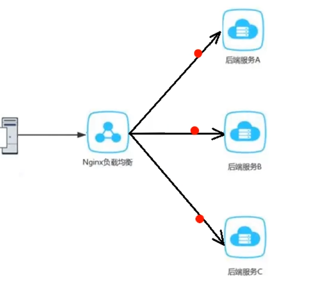


### 配置反向代理
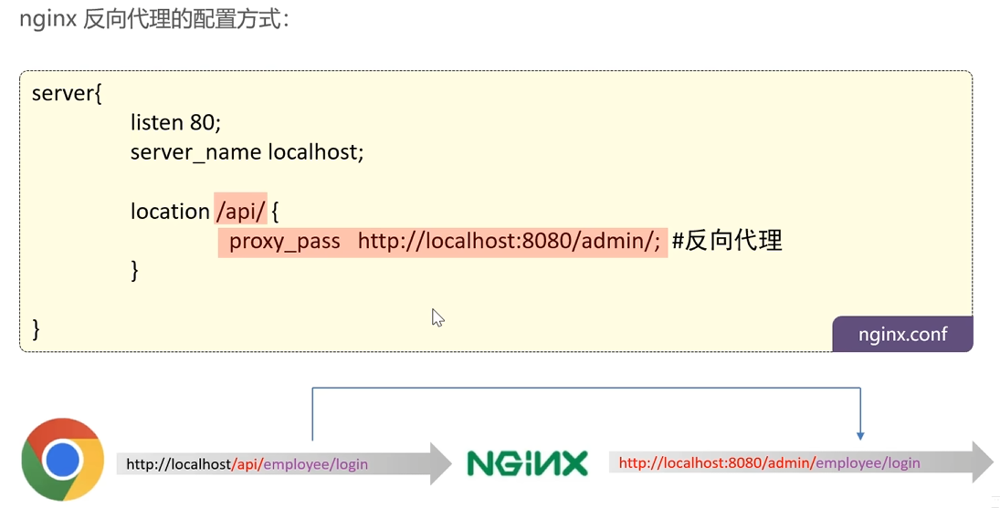
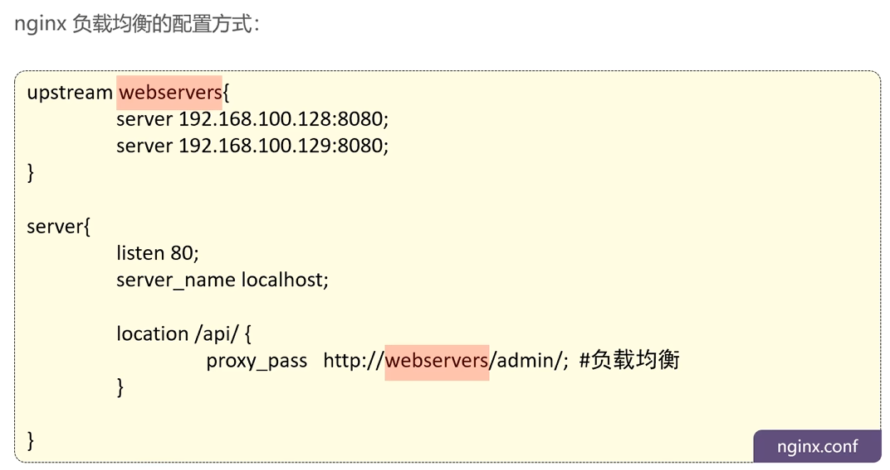


### 负载均衡策略
|    名称    |                          说明                          |
| :--------: | :----------------------------------------------------: |
|    轮询    |                        默认方式                        |
|   weight   | 权重方式，默认为1，权重越高，被分配的客户端请求就越多  |
|  ip_hash   |  依据ip分配方式，这样每个访客可以固定访问一个后端服务  |
| least_conn |  依据最少连接方式，把请求优先分配给连接数少的后端服务  |
|  url_hash  | 依据uri分配方式，这样相同的url会被分配到同一个后端服务 |
|    fair    |    依据响应时间方式，响应时间短的服务将会被优先分配    |

## 数据库安全存储

员工表中的密码是明文存储，安全性太低
MD5加密存储
```java
// TODO 后期需要进行md5加密，然后再进行比对
password = DigestUtils.md5DigestAsHex(password.getBytes());
```
## Swagger
可以按照规范去定义接口及接口相关的信息，做到生成接口文档，以及在线接口调试页面
http://localhost:8080/doc.html
Knife4j是为JavaMVC框架集成生成的Api文档的增强解决方案 
```xml
<dependency>
<groupld>com.github.xiaoymin</groupld>
<artifactld>knife4j-spring-boot-starter</artifactld>
<version>3.0.2</version>
</dependency>
```
### 常用注解
通过注解可以控制生成的接口文档，使接口文档拥有更好的可读性
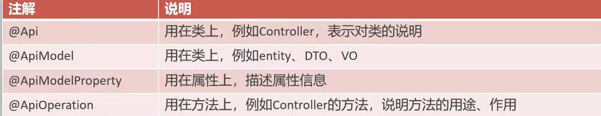


# 员工
## ThreadLocal
**ThreadLocal**并不是一个Thread,而是Thread的局部变量。
ThreadLocal为每个线程提供单独一份存储空间，具有线程隔离的效果，只有在线程内才能获取到对应的值，线程外则不
能访问。

### ThreadLocal常用方法:
public void set(T value)
设置当前线程的线程局部变量的值

public T getO
返回当前线程所对应的线程局部变量的值

public void remove0
移除当前线程的线程局部变量


**可以获取当前登录用户的id**

## 分页查询
使用插件
```java
@Override
public PageResult pageQuery(EmployeePageQueryDTO employeePageQueryDTO) {
    PageHelper.startPage(employeePageQueryDTO.getPage(),employeePageQueryDTO.getPageSize());
    Page<Employee> page =  employeeMapper.pageQuery(employeePageQueryDTO);
    long total = page.getTotal();
    List<Employee> records = page.getResult();
    return new PageResult(total,records);
}


Page<Employee> pageQuery(EmployeePageQueryDTO employeePageQueryDTO);

```
使用XML动态模糊查询

对日期进行格式化
1. 在属性上加注解对日期进行格式化@JsonFormat()
2. 在配置类中扩展SpringMVC的消息转换器，统一对日期类型进行格式化处理
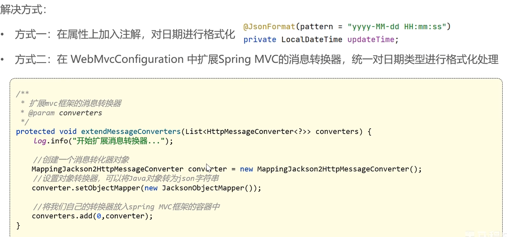


## 属性拷贝
两个类有共同属性，可以用BeanUtils.copyProperties进行属性拷贝
```java
Employee employee = new Employee();
BeanUtils.copyProperties(employeeDTO, employee);
```
把旧的拷贝致新的


# AOP
由于表中有很多公共字段，比如创建人，修改人，导致代码很多重复，代码冗余，不便后期维护
用aop切面编程用来解决
- 需要自定义注解，用于标识需要进行公共字段自动填充的方法
- 自定义切面类，统一拦截加入这个自定义注解粉方法，通过反射为公共字段赋值
- 在Mapper方法上面加入自定义注解

在 Spring AOP 中，切面可以通过 JoinPoint 对象获取到连接点的相关信息
JoinPoint 对象的 **getSignature()** 方法获取到 Signature 对象。如果连接点是一个方法，那么可以将 Signature 对象转为MethodSignature 对象，通过 MethodSignature 对象可以获取到更加详细的**方法签名信息**，比如**方法返回类型**、**参数类型**等。


## spring中用joinpoint来访问目标方法的参数
# 菜品研发

在新增菜品时，可以添加菜品口味，所以是需要操作两张表，既要添加菜品的信息，也要添加口味信息，所以要把这两个操作定义为一个事务Transactional
```xml
<insert id="insert" parameterType="Dish" useGeneratedKeys="true" keyProperty="id">
```
- **parameterType** 指定了传递给该 SQL 语句的参数类型。
- **useGeneratedKeys**="true" 表示启用 MyBatis 的自动生成主键功能。
当数据库表的主键是自动生成的（例如，使用了 AUTO_INCREMENT），MyBatis 会自动获取数据库生成的主键值。

- **keyProperty**：
keyProperty="id" 指定了将自动生成的主键值赋值给 Dish 对象的哪个属性。
需要获取自动生成的主键值,则需要配置**useGeneratedKeys**和**keyProperty**


在分页查询时，需要操作菜品表和分类表，多表查询


删除菜品，可以批量删除，起售中的菜品不能删除，被套餐关联的菜品不能删除，删除菜品后，关联的口味也要被删除

在修改菜品中，需要修改菜品信息和对应的口味信息，因为修改口味时，可能会直接修改，或者全部删除，比较麻烦，所以在后端统计全部删除口味，在重新新增口味


# Redis
服务器启动命令
```
redis-server.exe redis.windows.conf
```
客户端启动命令
```
redis-cli.exe
```
1. redis-cli.exe
2. shutdown
3. exit
4. redis-server.exe redis.windows.conf

指定连接Redis服务
```
redis-cli.exe -h localhost -p 6379 -a 密码
```

## 数据类型
Redis存储的是key-value结构的数据，其中key是字符串类型，value有5种常用的数据类型：
- 字符串 string
- 哈希hash
- 列表list
- 集合 set
- 有序集合 sorted set / zset
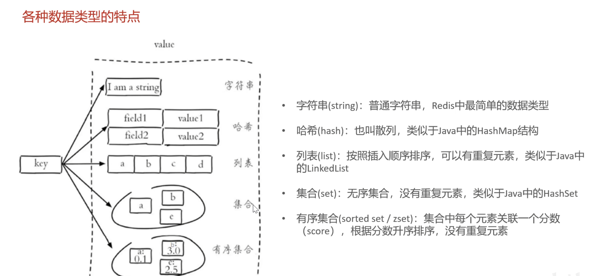
## 常用命令
### 字符串操作命令
- **set key value** 设置指定key的值
- **get key** 获取指定key的值
- **setex key seconds value** 设置指定key的值，并将key的过期时间设为seconds秒
- **setnx key value** 只有在key不存在时设置key的值

### 哈希操作命令
Redis hash是一个string类型的field和value的映射表，hash特别适合用于存储对象

- **HSET key field value** 将哈希表key中的字段 field的值设为value
- **HGET key field** 获取存储在哈希表中指定字段的值
- **HDEL key field** 删除存储在哈希表中的指定字段
- **HKEYS key** 获取哈希表中所有字段
- **HVALS key** 获取哈希表中所有值
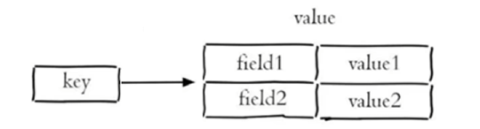

### 列表操作命令
Redis列表是简单的字符串列表，按照插入顺序排序

- **LPUSH key value1 [value2]**  将一个或多个值插入到列表头部
- **LRANGE key start stop** 获取列表指定范围内的元素
- **RPOP key** 移除并获取列表最后一个元素
- **LLEN key** 获取列表长度
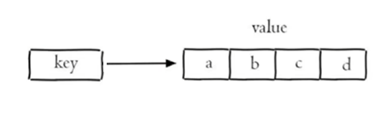


### 集合操作命令
Redis set是string类型的无序集合。集合成员是唯一的，集合中不能出现重复的数据

- **SADD key member1[member2]** 向集合添加一个或多个成员
- **SMEMBERS key**  返回集合中的所有成员
- **SCARD key**  获取集合的成员数
- **SINTER key1 [key2]** 返回给定所有集合的交集
- **SUNION key1 [key2]**   返回所有给定集合的并集
- **SREM key member1 [member2]** 删除集合中一个或多个成员
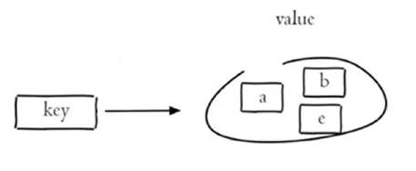

### 有序集合操作命令
Redis有序集合是string类型元素的集合，且不允许有重复成员。每个元素都会关联一个double类型的分数。

- **ZADD key score1 member1 [score2 member2]**
向有序集合添加一个或多个成员
```zadd zset1 10.0 a 10.5 b```
- **ZRANGE key start stop [WITHSCORES]**
通过索引区间返回有序集合中指定区间内的成员
`zrange zset1 0 -1`
- **ZINCRBY key increment member**
有序集合中对指定成员的分数加上增量increment
`zincrby zset1 -5.0 a`
- **ZREM key member [member.....]**
移除有序集合中的一个或多个成员
`zrem zset1 a`

### 通用命令
- **KEYS pattern** 查找所有符合给定模式(pattern)的key
`keys *`
- **EXISTS key** 检查给定 key是否存在
`exists name`
- **TYPE key** 返回key所储存的值的类型
`type name`
- **DEL key** 该命令用于在 key存在,是删除 key
`del 100`
- EXPIRE 给一个key设置有效期
`expire age 20`

- TTL 查看一个key的有效期
`TTL `


## 在java操作Redis
  
Redis的Java客户端很多，常用的几种：
- Jedis
- Lettuce
- Spring Data Redis

Spring Data Redis是Spring的一部分，对Redis底层开发包进行了高度封装。
在Spring项目中，可以使用Spring Data Redis来简化操作。

### Spring Data Redis使用方式
1. 导入坐标
2. 配置Redis数据源
3. 编写配置类，创建RedisTemplate对象
4. 通过对象操作Redis

### String
```java
@Autowired
private RedisTemplate redisTemplate;

@Test
public void testString(){
    redisTemplate.opsForValue().set("city1","beijing");
    String city = (String) redisTemplate.opsForValue().get("city1");
    System.out.println(city);
    redisTemplate.opsForValue().set("code","123456",30, TimeUnit.MINUTES);
    redisTemplate.opsForValue().setIfAbsent("lock","1");
}
```
### Hash
```java
//插入
redisTemplate.opsForHash().put("100","name""xiaoming");
redisTemplate.opsForHash().put("100","age","20");
//获得Value
String name = (String) redisTemplate.opsForHash().ge("100", "name");
//删除
redisTemplate.opsForHash().delete("100","age");
//获取全部key
Set keys = redisTemplate.opsForHash().keys("100");
//获取全部Value
List values = redisTemplate.opsForHash().value("100");
```
# 店铺状态设置
因为需要高频率查询，而且把一个状态单独存在一张表中浪费资源，可以直接存入Redis中
基于Redis的字符串来进行存储
**1 表示营业**
**0 表示打烊**

# HttpClient
HttpClient是ApacheJakarta Common下的子项目，可以用来提供高效的、最新的、功能丰富的支持HTTP协议的客户端编程工具包，并且它支持HTTP协议最新的版本和建议。

需要导入坐标
```xml
<dependency>
<groupId>org.apache.httpcomponents</groupId>
<artifactId>httpclient</artifactId>
<version>4.5.13</version>
</dependency>
```
1. 创建HttpClient对象
2. 创建Http请求对象
3. 调用HttpClient的execute方法发送请求
```java
@Test
    public void testGET() throws IOException {
        //创建httpClient对象
        CloseableHttpClient httpClient = HttpClients.createDefault();
        //创建请求对象
        HttpGet httpGet = new HttpGet("http://localhost:8080/user/shop/status");
        //发送请求，接受响应结果
        CloseableHttpResponse response = httpClient.execute(httpGet);
        //获取服务端返回的状态码
        int statusCode = response.getStatusLine().getStatusCode();
        System.out.println("服务端返回的状态码" + statusCode);

        HttpEntity entity = response.getEntity();
        String body = EntityUtils.toString(entity);
        System.out.println("服务端返回的数据" + body);

        response.close();
        httpClient.close();

    }

    @Test
    public void testPOST() throws IOException, JSONException {
        //创建httpclient对象
        CloseableHttpClient httpClient = HttpClients.createDefault();
        //创建请求对象
        HttpPost httpPost = new HttpPost("http://localhost:8080/admin/employee/login");
        //设置请求体参数
        JSONObject jsonObject = new JSONObject();
        jsonObject.put("username", "admin");
        jsonObject.put("password", "123456");

        StringEntity entity = new StringEntity(jsonObject.toString());
        //设置编码格式
        entity.setContentEncoding("utf-8");
        //数据格式
        entity.setContentType("application/json");
        httpPost.setEntity(entity);

        //发送请求
        CloseableHttpResponse response = httpClient.execute(httpPost);

        //解析返回结果
        int statusCode = response.getStatusLine().getStatusCode();
        System.out.println("响应码为：" + statusCode);

        HttpEntity entity1 = response.getEntity();
        String body = EntityUtils.toString(entity1);
        System.out.println("数据为" + body);

        response.close();
        httpClient.close();
    }
```

# 微信小程序开发
小程序登录
功能描述
登录凭证校验。通过 wx.login 接口获得临时登录凭证 code 后传到开发者服务器调用此接口完成登录流程。

调用方式：
GET https://api.weixin.qq.com/sns/jscode2session 

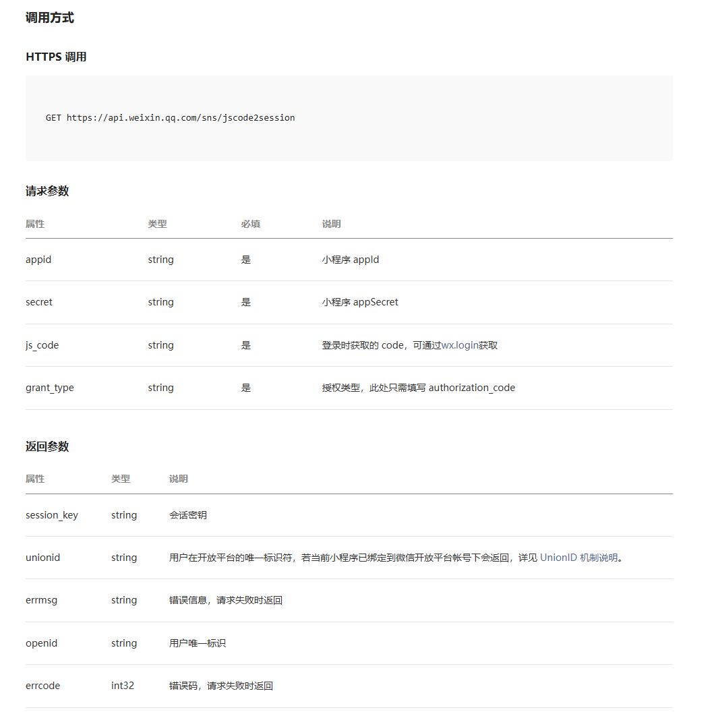


# 缓存
因为菜品数据查询次数较高，可以用Redis进行缓存，减少数据库查询操作

## Spring Cache
SpringCache是一个框架，实现了基于注解的缓存功能，只需要简单地加一个注解，就能实现缓存功能。
SpringCache提供了一层抽象，底层可以切换不同的缓存实现，例如：
- EHCache
- Caffeine
- Redis
```xml
<dependency>
<groupId>org.springframework.boot</groupId>
<artifactId>spring-boot-starter-cache</artifactId>
<version>2.7.3</version>
</dependency>
```

**常用注解：**
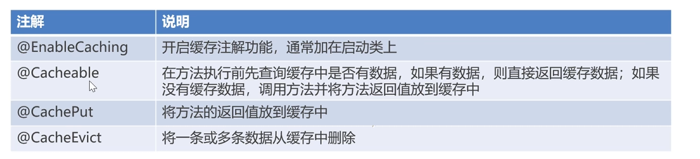

```java
@CachePut(cacheNames = "userCache",key = "#user.id")获取参数
如果使用springCache缓存数据，key的生成：userCache::key

@CachePut(cacheNames = "userCache",key = "#result.id")获取返回值
@CachePut(cacheNames = "userCache",key = "#p0.id")获取第一个参数
```
# 购物车
当添加购物车时，先判断查询菜品是否存在，如果存在，则修改数量，如果不存在，再添加，根据用户id进行添加
查询菜品时，需要写动态sql
如果不存在时，需要判断是菜品还是套餐


# 用户下单
分为两个表，一个订单表，一个订单明细表
需要再订单表中插入一条数据，在订单明细表中插入n条数据
订单明细表中需要存入用户下的订单菜品

在写业务之前，需要先处理各种异常，地址簿为空和订单商品为空的情况
用户下完订单之后，需要清空购物车
# 订单支付
## 微信支付
https://pay.weixin.qq.com/static/product/product index.shtml
微信小程序支付时序图
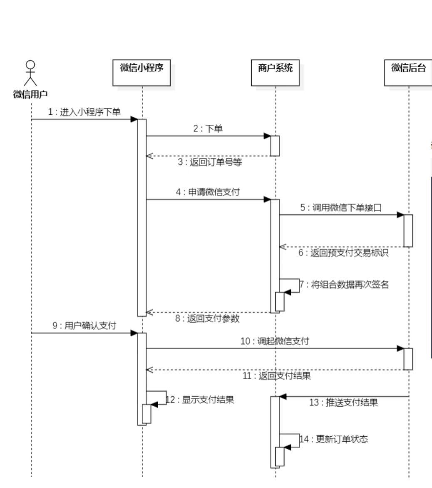

要获取微信支付平台证书，商户私钥文件

## 内网穿透
`D:\Cpolar>cpolar.exe http 8080`


# Spring Task
SpringTask是Spring框架提供的任务调度工具，可以按照约定的时间自动执行某个代码逻辑。
定位：定时任务框架
作用：定时自动执行某段java代码

## cron表达式
cron表达式其实就是一个字符串，通过cron表达式可以定义任务触发的时间
构成规则：分为6或7个域，由空格分隔开，每个域代表一个含义
每个域的含义分别为：秒。分钟、小时、日、月、周、年(可选)
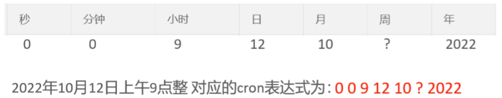

cron表达式在线生成器：
https://cron.qqe2.com/

**Spring Task使用步骤:**
1. 导入maven坐标spring-context(已存在)
2. 启动类添加注解@EnableScheduling开启任务调度
3. 自定义定时任务类

## 订单状态定时处理
用户下单后可能存在的情况：
- 下单后未支付，订单一直处于“待支付”状态
- 用户收货后管理端未点击完成按钮，订单一直处于“派送中”状态

对于上面两种情况需要通过定时任务来修改订单状态，具体逻辑为：
文
- 通过定时任务每分钟检查一次是否存在支付超时订单（下单后超过15分钟仍未支付则判定为支付超时订单），如果存在则修改订单状态为“已取消”
- 通过定时任务每天凌晨1点检查一次是否存在“派送中”的订单，如果存在则修改订单状态为“已完成‘

# WebSocket
WebSocket是基于TCP的一种新的网络协议。它实现了浏览器与服务器全双工通信，浏览器和服务器只需要完成一次握手，两者之间就可以创建持久性的连接，并进行双向数据传输。
**WebSocket和http对比：**

- HTTP是短连接
- WebSocket是长连接
- HTTP通信是单向的，基于请求响应模式
- WebSocket支持双向通信
- HTTP和WebSocket底层都是TCP连接

实现步骤：

- 直接使用websocket.html页面作为WebSocket客户端
- 导入WebSocket的maven坐标
- 导入WebSocket服务端组件WebSocketServer，用于和客户端通信
- 导入配置类WebSocketConfiguration，注册WebSocket的服务端组件
- 导入定时任务类，WebSocketTask,定时向客户端推送数据


## 订单提醒
- 通过websocket实现管理端页面和服务端保持长连接
- 当客户支付后，调用WebSocket的相关API实现服务端向客户端推送消息
- 客户端浏览器解析服务端推送的消息，判断是来单提醒还是客户催单，进行相应的消息提示和语音播报

# Apache ECharts
是一个前端的技术
基于JS的数据可视化图表库，提供直观，生动，可交互，可个性化定制的数据可视化图表
https://echarts.apache.org/handbook/zh/get-started/
使用Echarts,重点在于研究当前图标所需的数据格式，通常是需要后端提供符合格式要求的动态数据，然后响应给前端来展示图表


# Apache POI
是处理office各种文档的开源项目，可以使用POI在java程序对office文件进行读写操作

## 写
```java

public static void write() throws Exception {
    //在内存中创建excel
    XSSFWorkbook excel = new XSSFWorkbook();
    XSSFSheet sheet = excel.createSheet("info");
    //在sheet页中创建行对象
    XSSFRow row = sheet.createRow(0);
    //在这一行创还能每一个单元格
    XSSFCell cell = row.createCell(0);
    //写入单元格内容
    cell.setCellValue("姓名");
    row.createCell(1).setCellValue("年龄");
    //在sheet页中创建行对象
    row = sheet.createRow(1);
    //在这一行创还能每一个单元格
    cell = row.createCell(0);
    //写入单元格内容
    cell.setCellValue("张三");
    row.createCell(1).setCellValue("18");
    //输出到盘符
    FileOutputStream out = new FileOutputStream(new File("F:\\info.xlsx"));
    excel.write(out);
    //关闭资源
    out.close();
    excel.close();
}
```
# 数据统计
```java
InputStream input = this.getClass().getClassLoader().getResourceAsStream("template/运营数据报表模版.xlsx");
``` 
从类路径加载文件

# VUE
创建项目：
方式一：VUE create 项目名称
方式二：VUE ui 用户界面
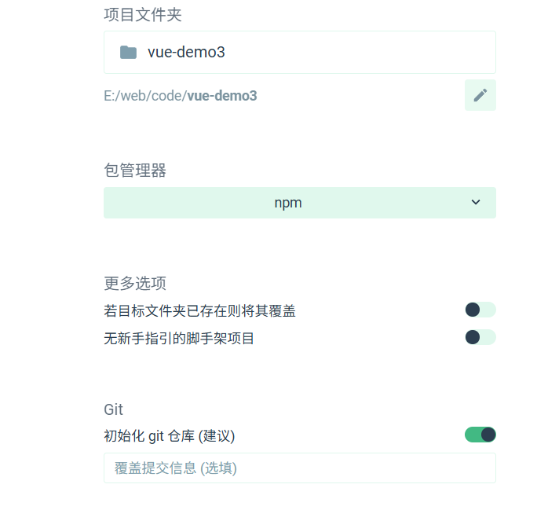
运行代码：npm run serve
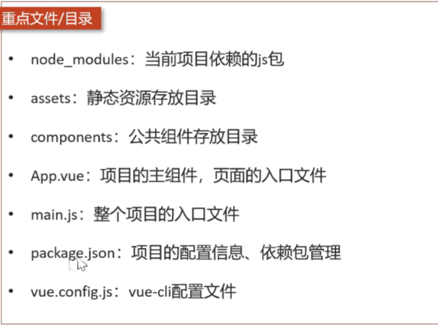
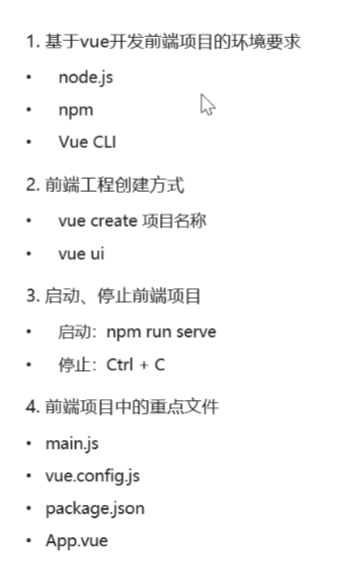

## VUE的基本使用方式
### VUE组件
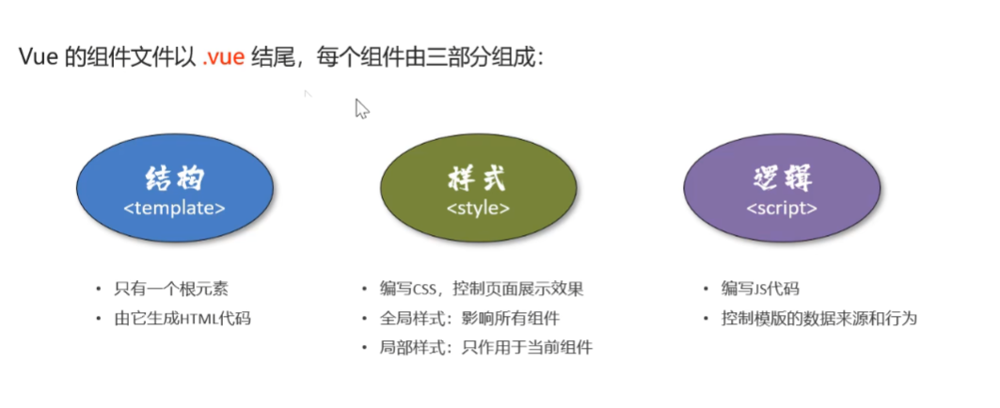
### 文本插值
作用：用来绑定data方法返回的对象属性
用法：{{}}
```html
<template>
  <div class="hello">
    <h1>{{ name }}</h1>
    <h2>{{ age }}</h2>
  </div>
</template>
<script>
export default {
  data(){
    return {
      name: "张三",
      age: 20
    }
  }
}
</script>
```
### 属性绑定
作用：为标签的属性绑定data方法中的返回的属性
用法：v-bind:xxx 简写xxx
```html
<template>
  <div class="hello">
    <h1>{{ name }}</h1>
    <h2>{{ age }}</h2>
    <input type="text" v-bind:value="name"/> 
    <input type="text" :value="age"/> 
  </div>
</template>
<script>
export default {
  data(){
    return {
      name: "张三",
      age: 20
    }
  }
}
</script>
```

### 事件绑定
用法：为元素绑定对应的事件
用法： v-on:xxx 简写: @xxx
```html
<template>
  <div class="hello">
    <input type="button" value="save" v-on:click="handleSave"/>
  </div>
</template>
<script>
export default {
  methods:{
      handleSave(){
      alert('asdg')
    }
  }
}
```
### 双向绑定
作用：表单输入项和data方法中的属性进行绑定，任意一方改变都会同步给另一方
用法：V-model
```html
<template>
  <div class="hello">
    <h1>{{ name }}</h1>
    <input type="button" value="save" v-on:click="handleSave"/>
    <input type="text" v-model="name"/>
  </div>
</template>
<script>
export default {
  data(){
    return {
      name: "张三",
      age: 20
    }
  },
  methods:{
      handleSave(){
      alert('asdg')
    }
  }
  
}
</script>
```
### 条件渲染
作用：根据表达式的值来动态渲染页面元素
用法：v-if、v-else、V-else-if
```html
<div>
  <div v-if="gender == 1">
      男
  </div>
  <div v-else-if="gender == 2">
    女
  </div>
</div>
```
## axios
安装：npm install axios
导入：import axios from 'axios'
### api
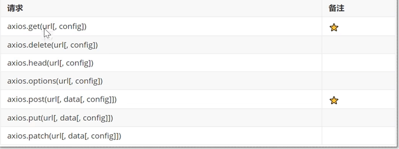
url：请求路径
data:请求体数据，最常见的是JSON格式数据
config：配置对象，可以设置查询参数，请求头信息

为了解决跨域问题，可以在VUE.config.js中配置代理
```js
evServer: {
    port: 7070,
    proxy:{
      '/api':{
        target: 'http://localhost:8080',
        pathRewrite:{
          '^/api': ''
        }
      }
    }
  }
handleSend(){
      axios.post("/api/admin/employee/login",{
        username: "admin",
        password: "123456"
      }).then(res=>{
        console.log(res.data)
      }).catch(error=>{
        console.log(error.response)
      })
    }
```
### 统一请求
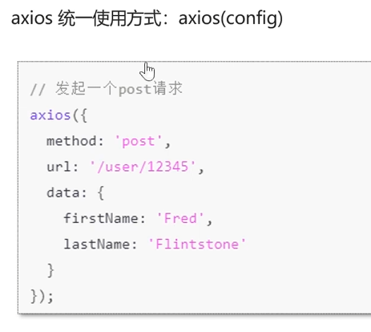
```js
handleSend(){
  axios({
    url:"/api/admin/employee/login",
    method:'post',
    data:{
      username: "admin",
      password: "123456"
    }
  }).then(res=>{
      console.log(res.data.data.token)
  })
}
```

## 路由VUE-Router
vue属于单页面应用，所谓的路由，就是根据浏览器路径不同，用不同的视图组件替换这个页面内容
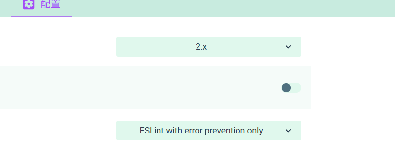
根据浏览器访问路径不同，展示不同的视图组件
通过vue-router实现路由功能，需要安装js库(npminstallvue-router)

**路由组成：**
VueRouter：路由器，根据路由请求在路由视图中动态渲染对应的视图组件
`<router-link>`：路由链接组件，浏览器会解析成
`<router-view>`：路由视图组件，用来展示与路由路径匹配的视图组件
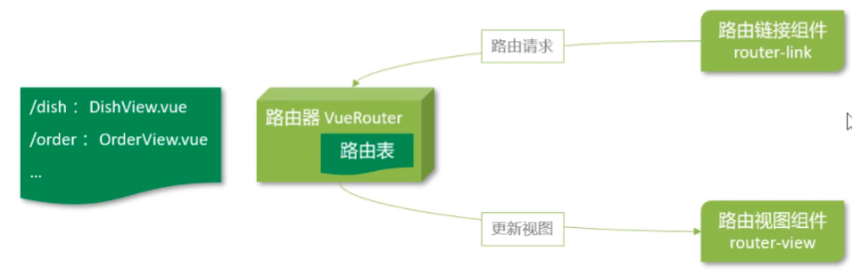
```js
methods:{
    jump(){
      this.$router.push("/about")
    }
  }
  ```
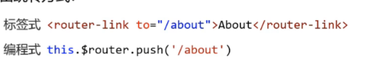

### 嵌套路由

组件内要切换内容，就需要用到嵌套路由

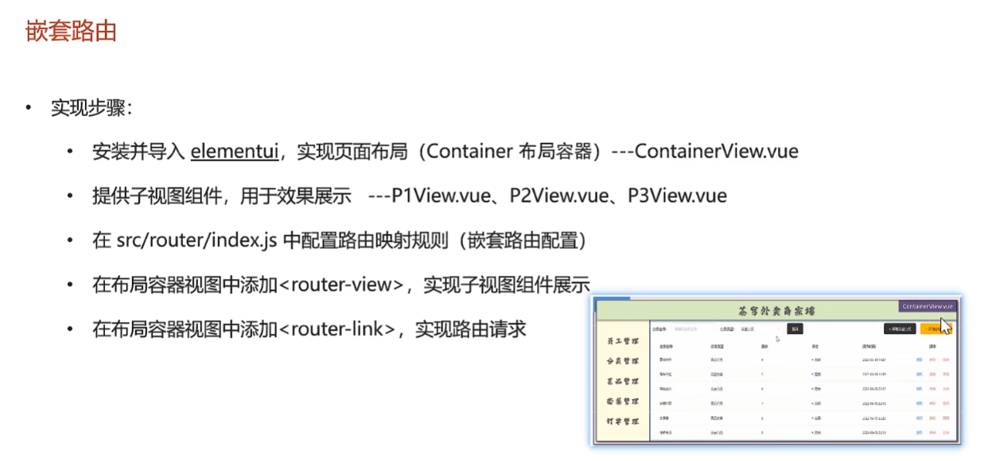

嵌套路由(子路由),对应的组件会展示在当前组件内部

需要在index.js中配置

```js
  {
    path: '/c',
    component: () => import('../views/container/ContainerView.vue'),
    children:[
      {
        path: '/c/p1',
        component: () => import('../views/container/P1View.vue')
      },
      {
        path: '/c/p2',
        component: () => import('../views/container/P2View.vue')
      },
      {
        path: '/c/p3',
        component: () => import('../views/container/P3View.vue')
      }
    ]
  },
  ```

### 重定向
当访问这个路径时，重定向其他路径
```js
path: '/c',
component: () => import('../views/container/ContainerView.vue'),
redirect: '/c/p1',
```

## 状态管理
vuex:
vuex是一个专为Vue.js应用程序开发的状态管理库
vuex可以在多个组件之间共享数据，并且共享的数据是响应式的，即数据的变更能及时渲染到模板
vuex采用集中式存储管理所有组件的状态
安装：
`
npm install vuex@next --save
`
相当于静态变量
在mutations: 中定义函数，修改共享数据
定义一个方法，这样调用
```js
  methods:{
    handleUpdate(){
      this.$store.commit('setName','asdg')
    }
  }
  ```
### 异步请求axios:
```js
//通过actions调用mutation，在actions中进行异步操作
  actions: {
    setNameByAxios(context){
      axios({
       url:'/api/admin/employee/login',
       method:'post',
       data:{
        username: 'admin',
        password:'123456'
       }
      }).then(res=>{
        if(res.data.code == 1){
            context.commit('setName',res.data.data.name)
        }
      })
    }
  },
```

## TypeScript
TypeScript(简称：TS)是微软推出的开源语言
TypeScript 是JavaScript 的超集(JS 有的 TS 都有)
TypeScript =Type +JavaScript (在JS 基础上增加了类型支持)
TypeScript文件广展名为 ts
TypeScript可编译成标准的JavaScript，并且在编译时进行类型检查
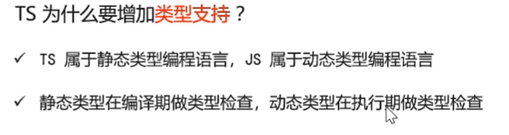

全局安装:
`npm install -g typescript`
# 前端
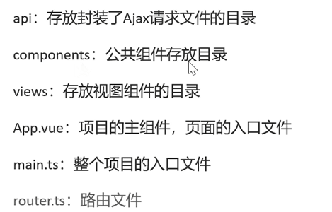

